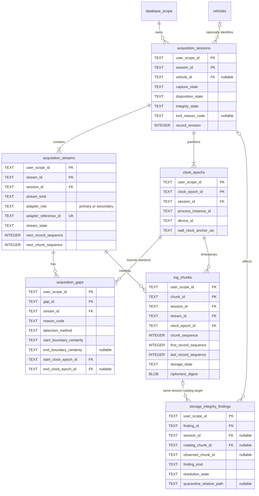
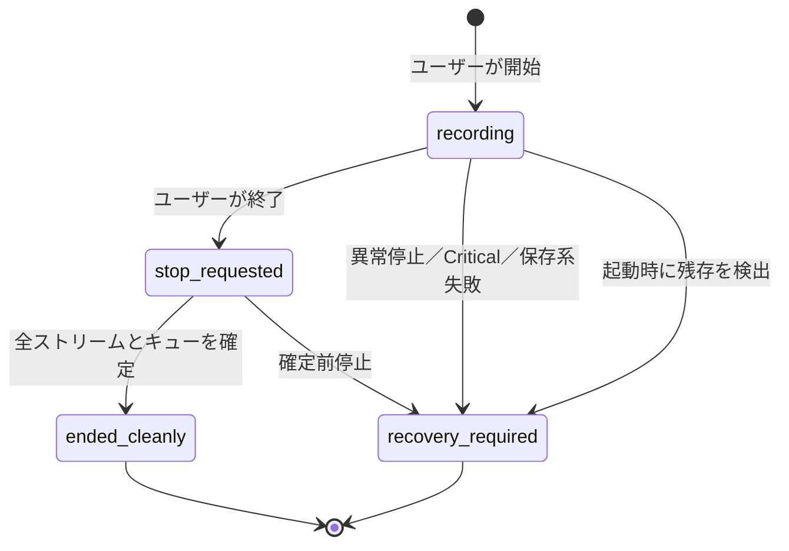
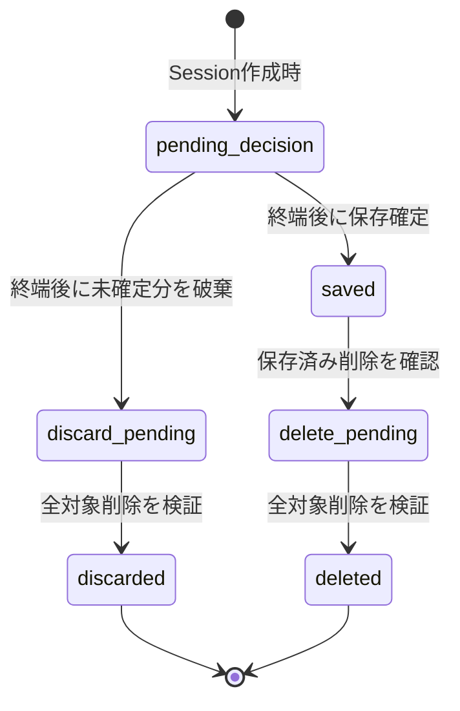
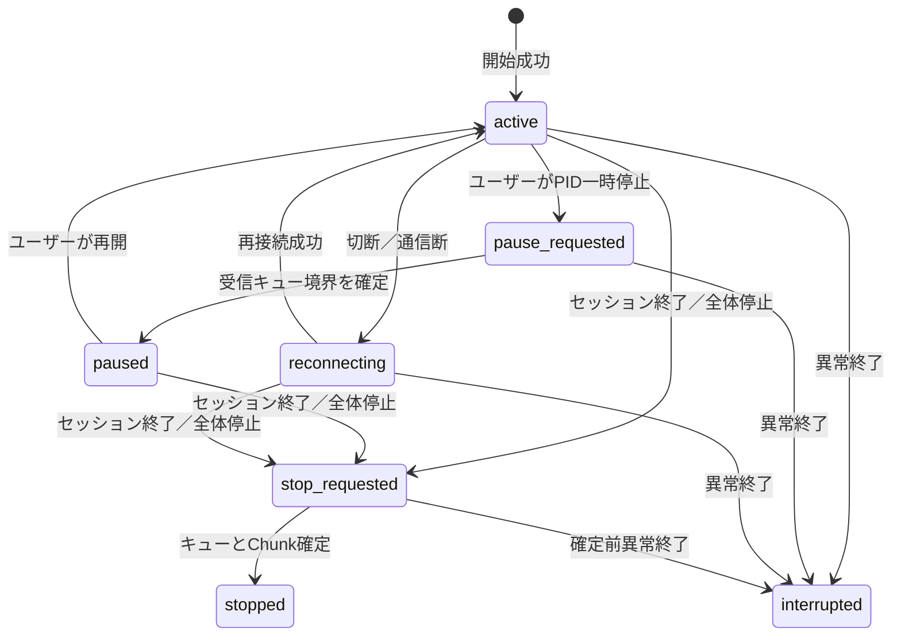

# Acquisition Session Storage Design

## 1. 目的と適用範囲

この文書は、OBD PIDおよびRaw CANの取得セッション、ストリーム、欠損区間、Clock Epoch、圧縮・暗号化チャンク、DBとファイルの不整合を安全に管理するための論理・物理設計を確定するものです。

対象は次です。

- ユーザーの明示操作による取得開始・終了
- OBD PID単独、Raw CAN単独、両ストリーム同時の取得
- 切断、一時停止、アプリ／プロセス停止、処理遅延、保存失敗等による欠損区間
- 異常終了後の非破壊な復旧、確認、保存または破棄
- 追記専用の可逆圧縮・認証付き暗号化チャンク
- 将来のMac・iPhone間同期へ渡せる、端末ローカルパスに依存しない安定IDと目録

本設計に従う保存基盤はMigration `v2_create_acquisition_storage`、GRDB Repository、immutable file Adapterとして実装します。圧縮・AEAD・Keychain、画面、OBD通信、Raw CAN送信、同期プロトコル、端末ペアリングは未決事項を推測せず対象外のままとし、file Adapterは上流で準備済みの不透明Chunk bytesだけを受け取ります。初期対象はClassical CANだけであり、CAN FDは対象外です。

`Documentation/VEHICLE_IDENTITY_DATABASE_DESIGN.md` の車両・識別スキャン領域は参照専用です。本設計は車両識別スキャンのSystem of Recordを複製せず、`vehicle_identification_scans.obd_connection_id` を推測でForeign Key化しません。

## 2. 設計原則

- セッション、ストリーム、Clock Epoch、欠損、チャンク目録、不整合検出結果はユーザー別GRDB／SQLiteをSystem of Recordとする。
- PID／Raw CANの大量ログ本体はDBへ入れず、圧縮後に認証付き暗号化したチャンクファイルをSystem of Recordとする。
- 同じデータをSwiftDataへ保存しない。
- 受信処理を最優先にし、圧縮・暗号化・DB登録は有界キューの後段で行う。後段の遅延を隠さず、溢れた場合は欠損として記録する。
- ログは追記専用とし、既存チャンクへの追記、上書き、Ring Bufferによる古いログの再利用を行わない。
- 未知のCAN ID、PID、応答、Raw bytesを破棄せず、既知値へ推測変換しない。
- 欠損をゼロ値、空Payload、合成応答、補間値で埋めない。
- 壁時計は表示・端末間の概略整列、単調時計は同一Clock Epoch内の順序・相関に使い、両者を同一視しない。
- セッション終了と保存確定を別状態にする。ユーザーが破棄または削除を明示するまで自動削除しない。
- 不整合、鍵喪失、容量不足、復号・認証失敗では利用不可または要確認にし、DB、ファイル、鍵を自動削除・置換しない。
- IDはランダムUUIDを使い、VIN、車台番号、Adapterシリアル、MACアドレス、端末内パスを識別子やファイル名に使わない。
- 将来用途だけのOutbox／Inbox、端末ペアリング、競合、汎用EAVテーブルを先行追加しない。

## 3. System of Recordと責務分担

| 情報 | System of Record | 責務 |
|---|---|---|
| セッション状態、車両所属、保存／破棄状態 | GRDB | 状態遷移、検索、同期適格性、削除再試行の判断 |
| PID／Raw CANストリーム | GRDB | 種別、Adapter役割、状態、Sequence範囲 |
| Clock Epoch | GRDB | 再起動で比較不能になる単調時計の名前空間分離 |
| 欠損区間 | GRDB | 原因、対象ストリーム、開始・終了、検出方法、確度 |
| チャンク目録 | GRDB | ファイルとSession／Stream／Sequence／形式／鍵Versionの対応 |
| PID／Raw CANレコード本体 | 暗号化チャンクファイル | 全Raw bytes、時刻、順序、相関、成功／失敗の不変記録 |
| 不整合の検出・隔離状態 | GRDB | 孤立、欠落、認証失敗等を正常データと区別し再試行可能にする |
| ルート鍵 | Keychain | DB・チャンク外の鍵保管 |

SQLiteはユーザーごとの物理DBとし、既存設計の `database_scope.user_scope_id` を利用します。全テーブルのPrimary KeyとForeign Keyに `user_scope_id` を含め、別ユーザーの行を関連付けません。DBファイルとチャンクルートもユーザースコープごとに分離しますが、ディレクトリ名には不透明なローカル割当IDを使い、メールアドレスや車両識別子を含めません。

## 4. 共通表現

| 項目 | SQLite／ファイル表現 | 規則 |
|---|---|---|
| UUID | `TEXT`／16 byte canonical UUID | DBは小文字ハイフン付き36文字。厳密な構文・variant・versionはData層で検証 |
| UTC壁時計 | `TEXT` | 固定長RFC 3339、UTC、マイクロ秒付き |
| 単調時刻 | `INTEGER` | Clock Epoch開始からの非負nanosecond offset。異なるEpoch間で大小比較しない |
| Sequence | `INTEGER` | 0始まり、Stream内で単調増加するsigned 64-bit範囲の整数 |
| サイズ | `INTEGER` | byte単位の非負整数 |
| Digest | `BLOB` | 暗号文ファイル全体のSHA-256、32 byte |
| 状態／理由 | `TEXT` | 本文で列挙する安定コード。例外文や機密値を入れない |
| Revision | `INTEGER` | 同期候補メタデータの論理Revision。1から開始し変更時に増加 |

同一壁時計または同一単調時刻のレコードは、同一ストリーム内では `record_sequence` で順序を決めます。異なるストリーム間では、同じ `clock_epoch_id` の単調時刻で整列し、完全同値なら `(stream_id, record_sequence)` を決定的な表示上のtie-breakにします。これは並行取得の因果順序を新たに主張するものではありません。

## 5. ER図



`vehicles` と `database_scope` は既存車両識別設計の外部テーブルです。本設計はそれらを再定義しません。

## 6. テーブル設計

全テーブルはSTRICT tableとし、`PRAGMA foreign_keys = ON` を接続ごとに必須化します。UUIDの `length(...) = 36` は補助防衛線であり、厳密な検証はData層で行います。

### 6.1 `acquisition_sessions`

**責務**: ユーザーが明示的に開始した一回の取得の安定ID、車両所属、取得終端、確認、保存／破棄／削除、整合性状態を管理します。

| カラム | 型 | NULL | 説明 |
|---|---|---:|---|
| `user_scope_id` | `TEXT` | No | 所有ユーザースコープUUID |
| `session_id` | `TEXT` | No | 端末をまたいでも変えないランダムUUID |
| `vehicle_id` | `TEXT` | Yes | 検証済みまたはユーザーが明示選択した登録車両UUID。未登録・識別不能はNULL |
| `vehicle_binding_state` | `TEXT` | No | `registered_confirmed`、`unassigned_unidentified`、`unassigned_conflict` |
| `capture_state` | `TEXT` | No | `recording`、`stop_requested`、`ended_cleanly`、`recovery_required` |
| `disposition_state` | `TEXT` | No | `pending_decision`、`saved`、`discard_pending`、`discarded`、`delete_pending`、`deleted` |
| `integrity_state` | `TEXT` | No | `unchecked`、`verified`、`attention_required`、`unavailable` |
| `end_reason_code` | `TEXT` | Yes | `user_stop`、`storage_critical`、`application_termination`、`process_termination`、`device_restart`、`write_pipeline_failure`、`unknown` |
| `started_at_utc` | `TEXT` | No | 明示開始を受理した壁時計 |
| `ended_at_utc` | `TEXT` | Yes | 取得終端を確定した壁時計。進行中はNULL |
| `reviewed_at_utc` | `TEXT` | Yes | 復旧後の欠損確認を完了した日時 |
| `disposition_requested_at_utc` | `TEXT` | Yes | 保存、破棄、削除を要求した日時 |
| `disposition_completed_at_utc` | `TEXT` | Yes | 処理が完全完了した日時 |
| `created_by_device_id` | `TEXT` | No | 作成端末UUID |
| `record_revision` | `INTEGER` | No | 状態変更ごとに増加する同期用Revision |
| `updated_at_utc` | `TEXT` | No | 最終状態変更日時 |
| `updated_by_device_id` | `TEXT` | No | 最終状態変更端末UUID |

制約:

- Primary Key: `(user_scope_id, session_id)`
- Unique: `(user_scope_id, vehicle_id, session_id)`。nullableな車両複合FK参照用
- Foreign Key: `(user_scope_id, vehicle_id) -> vehicles(user_scope_id, vehicle_id) ON DELETE RESTRICT ON UPDATE RESTRICT`
- Check: `vehicle_binding_state = 'registered_confirmed'` と `vehicle_id IS NOT NULL` は同値
- Check: `vehicle_binding_state IN ('unassigned_unidentified', 'unassigned_conflict')` なら `vehicle_id IS NULL`
- Check: `capture_state`、`disposition_state`、`integrity_state` は上記集合内
- Check: `capture_state IN ('recording', 'stop_requested')` なら `ended_at_utc IS NULL AND end_reason_code IS NULL`
- Check: `capture_state IN ('ended_cleanly', 'recovery_required')` なら `ended_at_utc IS NOT NULL AND end_reason_code IS NOT NULL`
- Check: `capture_state = 'ended_cleanly'` なら `end_reason_code = 'user_stop'`
- Default／INSERTトリガー: Session作成時は `disposition_state = 'pending_decision'` だけを許可
- Check: `disposition_state IN ('saved', 'discard_pending', 'discarded', 'delete_pending', 'deleted')` なら `capture_state IN ('ended_cleanly', 'recovery_required')`
- Check: `saved` は `integrity_state = 'verified'`。復旧セッションなら `reviewed_at_utc IS NOT NULL`
- Check: `discard_pending`／`discarded` は保存未確定セッションの破棄、`delete_pending`／`deleted` は保存済みセッションの削除からだけ遷移する
- Check: `record_revision >= 1`、`updated_at_utc >= started_at_utc`

状態遷移トリガーは、8章の二つの状態軸とガード表にない遷移を拒否します。`ended_cleanly` と `recovery_required` は終端後に相互変換できません。特に保存確定は `capture_state` を変更せず、異常終了したSessionは保存・同期後も `recovery_required` を維持します。

DELETEトリガーはSession行の削除を常に拒否します。破棄・削除後も状態を説明するSession tombstoneを残し、進行中Sessionの行削除による同時取得制約の迂回を許しません。

Index:

- `acquisition_sessions_recent_idx (user_scope_id, started_at_utc DESC, session_id)`
- `acquisition_sessions_vehicle_idx (user_scope_id, vehicle_id, started_at_utc DESC, session_id) WHERE vehicle_id IS NOT NULL`
- 部分Unique Index `acquisition_sessions_one_in_progress_per_scope_uidx (user_scope_id) WHERE capture_state IN ('recording', 'stop_requested')`
- `acquisition_sessions_recovery_idx (user_scope_id, capture_state, updated_at_utc) WHERE capture_state IN ('recording', 'stop_requested', 'recovery_required')`
- `acquisition_sessions_disposition_idx (user_scope_id, disposition_state, updated_at_utc) WHERE disposition_state IN ('pending_decision', 'discard_pending', 'delete_pending')`
- `acquisition_sessions_sync_eligible_idx (user_scope_id, capture_state, updated_at_utc, session_id) WHERE capture_state IN ('ended_cleanly', 'recovery_required') AND disposition_state = 'saved' AND integrity_state = 'verified'`

開始時に車両を特定できなければ `vehicle_id = NULL` で全データを保持します。有効な車両識別根拠または明示選択との一致を確認できた場合だけ、保存確定前に一度だけ `registered_confirmed` へ遷移できます。不一致なら `unassigned_conflict` とし、自動で既存車両へ付け替えません。非NULLになった `vehicle_id` は通常更新で変更不可です。次回接続で別車両が見つかっても、過去のNULLセッションや別 `session_id` の所属を変更しません。

`acquisition_sessions_one_in_progress_per_scope_uidx` は、同じローカルDB／`user_scope_id` に `recording` または `stop_requested` のSessionを最大1件だけ許可します。INSERTだけでなく既存行の状態UPDATEにも作用するため、別Sessionを進行中へ変更して制約を迂回できません。Session行のDELETEは常に拒否し、行削除による枠の解放も許可しません。

`ended_cleanly` と `recovery_required` は部分Unique Indexの対象外です。終端済みSessionが `pending_decision`、`saved`、破棄処理前のいずれでも、新しいSessionを開始できます。過去Sessionの保存／破棄判断を新規取得の前提にしません。

iPhoneとMacは各端末の別ローカルDBで取得するため、この制約は端末ごとの1Session制約です。終了済みSessionを別端末から同期しても、その `capture_state` は `ended_cleanly` または `recovery_required` であり、部分Unique Indexに抵触しません。

### 6.2 `acquisition_streams`

**責務**: セッション内のPIDとRaw CANを別ストリームとして管理し、Adapter役割、状態、Sequence採番を保持します。

| カラム | 型 | NULL | 説明 |
|---|---|---:|---|
| `user_scope_id` | `TEXT` | No | 所有スコープ |
| `stream_id` | `TEXT` | No | ストリームUUID |
| `session_id` | `TEXT` | No | 親セッションUUID |
| `stream_kind` | `TEXT` | No | `obd_pid` または `raw_can` |
| `adapter_role` | `TEXT` | No | PIDは `primary`、Raw CANは常に別接続の `secondary` |
| `adapter_reference_id` | `TEXT` | No | 非機密な不透明Adapter参照。シリアル／MACを含めない |
| `connection_instance_id` | `TEXT` | No | この取得接続の相関UUID。識別スキャンの `obd_connection_id` とは別名前空間 |
| `stream_state` | `TEXT` | No | `active`、`pause_requested`、`paused`、`reconnecting`、`stop_requested`、`stopped`、`interrupted` |
| `started_at_utc` | `TEXT` | No | ストリーム開始壁時計 |
| `ended_at_utc` | `TEXT` | Yes | 終端壁時計 |
| `next_record_sequence` | `INTEGER` | No | 次に割り当てるレコードSequence |
| `next_chunk_sequence` | `INTEGER` | No | 次に割り当てるチャンクSequence |
| `record_revision` | `INTEGER` | No | 状態・採番更新Revision |
| `updated_at_utc` | `TEXT` | No | 最終更新日時 |

制約:

- Primary Key: `(user_scope_id, stream_id)`
- Unique: `(user_scope_id, session_id, stream_kind)`。1セッションにつき各種別最大1ストリーム
- Unique: `(user_scope_id, session_id, stream_id)`。子テーブルFK用
- Unique: `(user_scope_id, session_id, adapter_reference_id)`。Stream状態にかかわらず同一Session内のAdapter重複割当を拒否
- Unique: `(user_scope_id, connection_instance_id)`
- Foreign Key: `(user_scope_id, session_id) -> acquisition_sessions(...) ON DELETE RESTRICT ON UPDATE RESTRICT`
- Check: `stream_kind`、`adapter_role`、`stream_state` は上記集合内
- Check: PIDは `adapter_role = 'primary'`
- Check: Raw CANは `adapter_role = 'secondary'`
- Check: `next_record_sequence >= 0`、`next_chunk_sequence >= 0`、`record_revision >= 1`
- Check: 終端状態 `stopped`／`interrupted` と `ended_at_utc IS NOT NULL` は同値

状態条件のないUnique制約により、同じ `adapter_reference_id` を同一Sessionの複数Streamへ割り当てません。PIDが `paused`、`stopped`、`interrupted` のいずれでもPrimary Adapterの予約はPID Stream行に残り、Raw CANへ転用できません。Stream状態の変更や終了後の再設定でもUnique制約を迂回できません。

UPDATEトリガーは `user_scope_id`、`session_id`、`stream_id`、`stream_kind`、`adapter_role`、`adapter_reference_id`、`connection_instance_id`、`started_at_utc` の変更を拒否します。Stream行のDELETEも常に拒否します。Adapter交換が必要なら同じStreamの参照を書き換えず、現Sessionを要確認で終端して新しいSessionを開始します。これにより、状態変更、参照書換え、行削除のいずれでもPrimary Adapter予約を解放したように見せられません。

PIDを継続する場合も一時停止する場合も、Raw CANは別のSecondary Adapterを使用します。「PIDを一時停止してRaw CANだけ取得」は、Primary AdapterでのPID問い合わせを停止し、別のSecondary AdapterからRaw CANだけを記録する意味です。Raw CAN Streamだけを作る単独取得でも、その接続先の役割は `secondary` とします。

Raw CANは受信専用です。送信キュー、送信Sequence、送信状態は設けません。

### 6.3 `clock_epochs`

**責務**: 同じ単調時計基準を共有する取得範囲を識別し、アプリ再起動後の比較不能な単調時刻を分離します。

| カラム | 型 | NULL | 説明 |
|---|---|---:|---|
| `user_scope_id` | `TEXT` | No | 所有スコープ |
| `clock_epoch_id` | `TEXT` | No | Epoch UUID |
| `session_id` | `TEXT` | No | 親セッションUUID |
| `process_instance_id` | `TEXT` | No | プロセス起動ごとのUUID |
| `device_id` | `TEXT` | No | 取得端末UUID |
| `monotonic_clock_kind` | `TEXT` | No | 初期版は `continuous_host_time` |
| `wall_clock_anchor_utc` | `TEXT` | No | Epoch開始時の壁時計標本 |
| `anchor_uncertainty_ns` | `INTEGER` | No | 壁時計と単調時計の対応誤差上限見積り |
| `started_at_utc` | `TEXT` | No | Epoch開始日時 |
| `ended_at_utc` | `TEXT` | Yes | 正常に閉じた場合の終了日時。クラッシュ時はNULL可 |
| `revision` | `INTEGER` | No | 不変行は1、終了時刻確定時だけ2 |

制約:

- Primary Key: `(user_scope_id, clock_epoch_id)`
- Unique: `(user_scope_id, session_id, clock_epoch_id)`
- Unique: `(user_scope_id, process_instance_id, session_id)`
- Foreign Key: `(user_scope_id, session_id) -> acquisition_sessions(...) ON DELETE RESTRICT`
- Check: `monotonic_clock_kind = 'continuous_host_time'`
- Check: `anchor_uncertainty_ns >= 0`、`revision IN (1, 2)`

各レコードは `clock_epoch_id` とEpoch開始からの `monotonic_offset_ns` を持ちます。プロセス再起動後は必ず新Epochを作り、旧Epochのoffsetと直接比較しません。再起動をまたぐ欠損は開始Epochと終了Epochを別々に記録します。

### 6.4 `acquisition_gaps`

**責務**: 取得できなかった、または保存保証を失った区間をストリーム単位で明示します。

| カラム | 型 | NULL | 説明 |
|---|---|---:|---|
| `user_scope_id` | `TEXT` | No | 所有スコープ |
| `gap_id` | `TEXT` | No | 欠損UUID |
| `session_id` | `TEXT` | No | 親セッションUUID |
| `stream_id` | `TEXT` | No | 対象ストリームUUID |
| `reason_code` | `TEXT` | No | 安定した原因コード |
| `detection_method` | `TEXT` | No | `transport_event`、`lifecycle_event`、`sequence_audit`、`buffer_accounting`、`storage_monitor`、`write_verification`、`startup_recovery`、`user_action`、`unknown` |
| `start_boundary_certainty` | `TEXT` | No | 開始境界が `confirmed` または `estimated` |
| `start_clock_epoch_id` | `TEXT` | No | 開始側Epoch |
| `start_monotonic_ns` | `INTEGER` | Yes | 開始offset。壁時計しかない場合NULL |
| `start_utc` | `TEXT` | No | 開始壁時計 |
| `end_clock_epoch_id` | `TEXT` | Yes | 開放中はNULL。再起動後は開始と異なってよい |
| `end_monotonic_ns` | `INTEGER` | Yes | 終了側offset。開放中または壁時計しかない場合NULL |
| `end_utc` | `TEXT` | Yes | 開放中はNULL |
| `end_boundary_certainty` | `TEXT` | Yes | 開放中はNULL、終了時に `confirmed` または `estimated` |
| `first_missing_sequence` | `INTEGER` | Yes | Sequence監査で判明した最初の欠損 |
| `missing_record_count` | `INTEGER` | Yes | 正確に算出できる場合だけ設定 |
| `revision` | `INTEGER` | No | 作成1、終了確定2 |
| `created_at_utc` | `TEXT` | No | 検出記録日時 |

初期 `reason_code` は次に限定します。

- `adapter_disconnected`
- `transport_interrupted`
- `ios_background_or_application_termination`
- `macos_sleep_or_process_termination`
- `reconnection_in_progress`
- `buffer_overflow_or_processing_drop`
- `storage_capacity_critical`
- `write_encryption_or_integrity_failure`
- `user_paused`
- `unknown`

制約:

- Primary Key: `(user_scope_id, gap_id)`
- Unique: `(user_scope_id, stream_id, gap_id)`
- Foreign Key: `(user_scope_id, session_id, stream_id) -> acquisition_streams(user_scope_id, session_id, stream_id) ON DELETE RESTRICT`
- Foreign Key: `(user_scope_id, session_id, start_clock_epoch_id) -> clock_epochs(user_scope_id, session_id, clock_epoch_id) ON DELETE RESTRICT`
- Foreign Key: 終了Epochも同じ複合FK。NULLの場合は開放中
- Check: コードと非NULLの確度は上記集合内
- Check: 単調offset、Sequence、件数は非NULLなら0以上
- Check: `end_utc IS NULL`、`end_clock_epoch_id IS NULL`、`end_monotonic_ns IS NULL` は開放中として整合する。ただし終了壁時計が確定し単調時刻だけ不明な場合は、終了Epochを設定し `end_monotonic_ns = NULL` を許す
- Check: `revision = 1` は開放中かつ `end_boundary_certainty IS NULL`、`revision = 2` は終了済みかつ `end_boundary_certainty IS NOT NULL`

Index:

- `acquisition_gaps_stream_time_idx (user_scope_id, stream_id, start_utc, gap_id)`
- `acquisition_gaps_open_idx (user_scope_id, session_id, stream_id) WHERE end_utc IS NULL`
- `acquisition_gaps_reason_idx (user_scope_id, reason_code, start_utc)`

同じ原因が両ストリームへ影響した場合も、対象と境界が異なり得るため各ストリームに1行ずつ作ります。セッション全体停止の原因は同一診断IDをアプリの非機密診断経路で関連付けられますが、DBに例外文を保存しません。

### 6.5 `log_chunks`

**責務**: 確定済み暗号化チャンクと、そのSession／Stream／Epoch／Sequence／形式／鍵／ファイルの対応を保持します。

| カラム | 型 | NULL | 説明 |
|---|---|---:|---|
| `user_scope_id` | `TEXT` | No | 所有スコープ |
| `chunk_id` | `TEXT` | No | チャンクUUID |
| `session_id` | `TEXT` | No | 親セッションUUID |
| `stream_id` | `TEXT` | No | 親ストリームUUID |
| `chunk_sequence` | `INTEGER` | No | ストリーム内の連続チャンクSequence |
| `clock_epoch_id` | `TEXT` | No | 全レコードが属するEpoch。Epoch境界で必ずチャンクを閉じる |
| `first_record_sequence` | `INTEGER` | No | 最初のレコードSequence |
| `last_record_sequence` | `INTEGER` | No | 最後のレコードSequence |
| `first_monotonic_ns` | `INTEGER` | No | 最初のoffset |
| `last_monotonic_ns` | `INTEGER` | No | 最後のoffset |
| `record_count` | `INTEGER` | No | レコード件数 |
| `plaintext_size` | `INTEGER` | No | 圧縮前byte数 |
| `compressed_size` | `INTEGER` | No | 圧縮後byte数 |
| `ciphertext_size` | `INTEGER` | No | ヘッダーを含む確定ファイルbyte数 |
| `record_format_version` | `INTEGER` | No | レコード形式Version |
| `compression_format_version` | `INTEGER` | No | 圧縮形式Version |
| `encryption_format_version` | `INTEGER` | No | 暗号・AAD・nonce配置形式Version |
| `key_version` | `INTEGER` | No | 導出元ルート鍵Version |
| `ciphertext_digest` | `BLOB` | No | 確定ファイル全体のSHA-256 |
| `catalog_digest` | `BLOB` | No | file bytesとは別に、確定目録値の長さ付きcanonical binary encodingをSHA-256した値 |
| `relative_path` | `TEXT` | No | ユーザーチャンクルートからの正規相対パス |
| `storage_state` | `TEXT` | No | `available`、`quarantined`、`missing`、`delete_pending`、`deleted` |
| `revision` | `INTEGER` | No | 目録状態Revision |
| `created_at_utc` | `TEXT` | No | DB目録登録日時 |
| `updated_at_utc` | `TEXT` | No | 状態更新日時 |

制約:

- Primary Key: `(user_scope_id, chunk_id)`
- Unique: `(user_scope_id, session_id, chunk_id)`。Integrity Findingの同一Session複合FK参照用
- Unique: `(user_scope_id, stream_id, chunk_sequence)`
- Unique: `(user_scope_id, stream_id, first_record_sequence)`
- Unique: `(user_scope_id, relative_path)`
- Foreign Key: `(user_scope_id, session_id, stream_id) -> acquisition_streams(...) ON DELETE RESTRICT`
- Foreign Key: `(user_scope_id, session_id, clock_epoch_id) -> clock_epochs(...) ON DELETE RESTRICT`
- Check: `storage_state IN ('available', 'quarantined', 'missing', 'delete_pending', 'deleted')`
- Check: `chunk_sequence >= 0`、時刻・Sequence・サイズ・Versionは非負または正の各要件に従い、`revision >= 1`
- Check: `updated_at_utc >= created_at_utc`
- Check: `first_record_sequence <= last_record_sequence`
- Check: `record_count = last_record_sequence - first_record_sequence + 1`。Dropはチャンク内に穴を作らず、次の保存レコードへ連番を割り当て、Drop件数は欠損行に記録する
- Check: `first_monotonic_ns <= last_monotonic_ns`
- Check: `length(ciphertext_digest) = 32`
- Check: `length(catalog_digest) = 32`。file Digestと目録Digestは相互に代用しない
- Check: `relative_path` は絶対パス、`..`、空要素、区切りの正規化違反を含まないことをData層でも検証

通常運用のUPDATEは `storage_state`、`revision`、`updated_at_utc` の三列だけに限定します。UPDATEトリガーは、`user_scope_id`、`session_id`、`stream_id`、`chunk_id`、`chunk_sequence`、Record Sequence範囲、`clock_epoch_id`、単調時刻範囲、`record_count`、全サイズ、全形式Version、`key_version`、`ciphertext_digest`、`relative_path`、`created_at_utc` の変更を拒否します。状態変更時は `revision` が正確に1増え、`updated_at_utc` が更新されることも検証します。

`storage_state` の許可遷移は次に限定します。

- `available -> quarantined | missing | delete_pending`
- `quarantined -> available | missing | delete_pending`。`available` へ戻す前に元のChunk ID、Digest、AEAD、全目録値を再検証する
- `missing -> available | quarantined | delete_pending`。復元ファイルを同様に全検証する
- `delete_pending -> deleted`
- `deleted` は終端状態であり、他状態へ遷移できない

同値状態へのUPDATE、`delete_pending` からの取消し、`deleted` から `available` への復活を拒否します。隔離時も `log_chunks.relative_path` は確定時の元パスのまま変更しません。実際の隔離先は `storage_integrity_findings.quarantine_relative_path` をSystem of Recordとし、元目録を隔離ファイルへ向けて書き換えません。

Index:

- `log_chunks_session_idx (user_scope_id, session_id, stream_id, chunk_sequence)`
- `log_chunks_state_idx (user_scope_id, storage_state, updated_at_utc)`
- `log_chunks_sync_idx (user_scope_id, session_id, stream_id, chunk_sequence, chunk_id) WHERE storage_state = 'available'`

目録はチャンク内部ヘッダーと同じ識別・形式値を保持します。両者の不一致は正常値を選んで読み進めず、隔離対象です。

### 6.6 `storage_integrity_findings`

**責務**: DBとファイルの不整合、認証・Digest・Sequence・切り詰め異常を永続的に記録し、隔離と再試行を管理します。

| カラム | 型 | NULL | 説明 |
|---|---|---:|---|
| `user_scope_id` | `TEXT` | No | 所有スコープ |
| `finding_id` | `TEXT` | No | 検出UUID |
| `session_id` | `TEXT` | Yes | DBに親Sessionが存在し、帰属確認できた場合のFK |
| `catalog_chunk_id` | `TEXT` | Yes | DB目録行が存在する場合のChunk FK |
| `observed_session_id` | `TEXT` | Yes | ファイルヘッダーで観測したSession UUID。親行がなくても保持可能な非FK |
| `observed_chunk_id` | `TEXT` | Yes | ファイルヘッダーで観測したChunk UUID。目録行がなくても保持可能な非FK |
| `finding_kind` | `TEXT` | No | `orphan_file`、`missing_file`、`chunk_sequence_gap`、`record_sequence_gap`、`authentication_failed`、`digest_mismatch`、`truncated_file`、`header_catalog_mismatch`、`unexpected_temporary_file` |
| `resolution_state` | `TEXT` | No | `detected`、`quarantined`、`retryable`、`resolved`、`acknowledged_unrecoverable` |
| `observed_relative_path` | `TEXT` | Yes | 発見時の安全な相対パス |
| `quarantine_relative_path` | `TEXT` | Yes | 隔離後の安全な相対パス |
| `diagnostic_id` | `TEXT` | No | 機密情報を含まないランダム診断UUID |
| `detected_at_utc` | `TEXT` | No | 検出日時 |
| `resolved_at_utc` | `TEXT` | Yes | 解決日時 |
| `revision` | `INTEGER` | No | 状態変更Revision |

制約:

- Primary Key: `(user_scope_id, finding_id)`
- Foreign Key: `(user_scope_id, session_id) -> acquisition_sessions(user_scope_id, session_id) ON DELETE RESTRICT ON UPDATE RESTRICT`。`session_id` が非NULLの場合に検証
- Foreign Key: `(user_scope_id, session_id, catalog_chunk_id) -> log_chunks(user_scope_id, session_id, chunk_id) ON DELETE RESTRICT ON UPDATE RESTRICT`
- Check: `catalog_chunk_id IS NOT NULL` なら `session_id IS NOT NULL`
- Check: 観測UUIDは非NULLなら36文字。ヘッダー値の厳密な構文はData層で検証
- Check: コードは上記集合内、`revision >= 1`
- Check: `resolved_at_utc` は `resolved`／`acknowledged_unrecoverable` の場合だけ非NULL

Index:

- `storage_findings_open_idx (user_scope_id, resolution_state, detected_at_utc) WHERE resolution_state NOT IN ('resolved', 'acknowledged_unrecoverable')`
- `storage_findings_session_idx (user_scope_id, session_id, detected_at_utc) WHERE session_id IS NOT NULL`

このテーブルは汎用監査ログではなく、チャンク保存の保全異常だけを扱います。例外スタック、VIN、Payload、Adapter秘密情報は保存しません。

`catalog_chunk_id` が非NULLならCheckにより `session_id` も必ず非NULLになるため、三列の複合Foreign KeyにSQLiteのNULL評価を使って迂回できません。したがって、FindingのSessionと異なるSessionに属するChunkは関連付けられません。DB目録が存在しない孤立ファイルは `catalog_chunk_id = NULL` とし、ヘッダーで観測したIDだけを非FKの `observed_session_id`／`observed_chunk_id` に保持します。

## 7. チャンク内レコード形式

### 7.1 共通エンベロープ

Record format Version 1は長さ付きbinary record列とし、任意JSONやEAVにしません。各レコードは少なくとも次を持ちます。

- `record_kind`
- `record_sequence`
- `clock_epoch_id`
- `monotonic_offset_ns`
- `observed_at_utc`
- `timestamp_source`: `host_observed`、`adapter_supplied`、`buffered_estimate`
- `timestamp_uncertainty_ns`。不明は明示的なsentinelではなくoptional field absenceで表す
- 種別固有Payload長とRaw bytes

Adapter内部Bufferingが疑われる場合は `timestamp_source = buffered_estimate` とし、利用可能なら不確かさを保存します。近似時刻を正確な受信時刻として昇格しません。

### 7.2 Raw CANレコード

受信専用レコードとして次を欠落させません。

- `can_identifier_format`: `standard_11_bit` または `extended_29_bit`
- 数値CAN ID。11bitは0...0x7FF、29bitは0...0x1FFFFFFF
- `dlc`: 0...8
- Payload長と0...8 byteのPayload。Payload長はDLCと一致
- 共通エンベロープの受信時刻と `record_sequence`

Remote frame、error frame、Adapterが付加するbus metadataの初期対応は未決事項です。未知CAN IDでもRaw bytesを保持し、意味を推測しません。CAN FDのDLC拡張と最大64 byte PayloadはVersion 1へ混在させません。

### 7.3 OBD PIDレコード

要求と結果を後から再構築できる型付きvariantを定義します。

- Request record: `correlation_id`、要求Sequence、service byte、PID byteまたは規格上の識別子、送信した完全なrequest bytes
- Response record: 同じ `correlation_id`、応答元ECUアドレス形式とRaw address bytes、完全なresponse bytes、成功／失敗コード、応答内ordinal
- Completion record: 同じ `correlation_id`、`succeeded`／`partial`／`failed`／`timed_out`、期待応答数が既知ならその数、受信応答数

PIDや応答が未知でもbyte値とRaw bytesを保存します。相関不能な受信は捨てず、nullableな `correlation_id` と `unsolicited_or_uncorrelated` 分類で保存します。製品固有例外文は入れず、失敗はVersion管理された安定コードとRaw evidenceで表します。

## 8. 状態遷移

### 8.1 `capture_state`



`ended_cleanly` と `recovery_required` が取得軸の終端状態です。`recovery_required` は取得再開を意味しません。再起動後は旧Sessionを自動再開せず、新しい取得は新しい `session_id` で開始します。ユーザー確認、保存、破棄、同期を行っても、`recovery_required` を `ended_cleanly` へ書き換えません。

ローカルDB全体では、部分Unique Indexにより `recording`／`stop_requested` は合わせて最大1行です。その行が `ended_cleanly` または `recovery_required` へ終端した時点で、新しいSessionを `recording` として開始できます。終端済みSessionの `disposition_state` はこの開始可否に影響しません。終端状態から進行中状態への逆遷移とSession行DELETEは拒否するため、状態変更や削除で制約を迂回できません。

バス無通信やイグニッションOFFだけでは状態を終端しません。これらがAdapter切断やTransport断として観測された場合は欠損を開き、再接続を試みます。ユーザー停止または安全上の全体停止条件だけが終端操作へ進めます。

### 8.2 `disposition_state`



Session作成時から `disposition_state = pending_decision` ですが、これは取得中に保存・破棄できるという意味ではありません。`discarded` は未確定Sessionを破棄した終端、`deleted` は保存済みSessionを削除した終端であり、相互変換しません。

### 8.3 状態軸を組み合わせる遷移ガード

| 操作 | 必須の `capture_state` | 遷移前の `disposition_state` | 遷移後 | 追加ガード |
|---|---|---|---|---|
| 取得中 | `recording`／`stop_requested` | `pending_decision` | 変更なし | 保存、破棄、削除を拒否 |
| 正常終了後の保存 | `ended_cleanly` | `pending_decision` | `saved` | 保存対象の整合性検証完了、`integrity_state = verified`、開放Gapなし |
| 復旧終了後の保存 | `recovery_required` | `pending_decision` | `saved` | `reviewed_at_utc IS NOT NULL`、欠損・finding確認済み、保存対象の整合性検証完了、`integrity_state = verified`、開放Gapなし |
| 未確定分の破棄開始 | `ended_cleanly`／`recovery_required` | `pending_decision` | `discard_pending` | ユーザーが対象を明示確認 |
| 未確定分の破棄完了 | 終端状態を維持 | `discard_pending` | `discarded` | 全対象Chunk削除と残存なしを検証 |
| 保存済み削除開始 | 終端状態を維持 | `saved` | `delete_pending` | ユーザーが対象を明示確認 |
| 保存済み削除完了 | 終端状態を維持 | `delete_pending` | `deleted` | 全対象Chunk削除と残存なしを検証 |

`capture_state` と `disposition_state` は別々に更新・検証します。保存確定はDispositionだけを変更し、Captureを正常終了へ昇格させません。`saved` 以外から `delete_pending` へ進めず、`discarded`／`deleted` からの遷移は拒否します。

### 8.4 ストリーム状態



Raw CAN開始時の選択は次のいずれかです。

1. PIDを `active` のまま継続し、異なるSecondary AdapterでRaw CANを `active` にする。
2. Primary AdapterでのPIDを `pause_requested` から `paused` へ確定して `user_paused` Gapを開き、別のSecondary AdapterでRaw CANを開始する。

PIDが `paused` でもPrimary Adapterの予約は維持し、Raw CANへ再割当しません。Raw CANだけを記録している間も、Primary Adapterは停止中のPID Stream、Secondary AdapterはRaw CAN Streamに固定されます。Raw CAN終了後はSecondary Adapterの受信を停止し、その後にPrimary AdapterでPIDを再開できます。

### 8.5 開始・終了トランザクション

明示開始を受理したときは、Adapterから最初のデータを読む前に次の順序で処理し、手順2〜7を一つの `BEGIN IMMEDIATE` transactionで行います。

1. ユーザースコープ、Key Version、容量が開始可能であることをtransaction外で確認する。
2. `BEGIN IMMEDIATE` で並行する開始・停止状態更新を直列化する。
3. 同じ `user_scope_id` に `capture_state IN ('recording', 'stop_requested')` のSessionが存在しないことをQueryで確認する。`ended_cleanly`／`recovery_required` のSessionはDispositionにかかわらず妨げない。
4. 新しい `acquisition_sessions` を `recording`／`pending_decision`／`unchecked` でINSERTする。競合Query後に不正な状態が生じても、部分Unique Indexを最終防衛線とする。
5. ユーザーが選択したPID、Raw CANまたは両方の `acquisition_streams` をINSERTし、1Sessionにつき各種別最大1件、Primary／Secondaryの役割、Adapter重複禁止を検証する。したがって接続はPID用PrimaryとRaw CAN用Secondaryの最大2件である。
6. プロセスの `clock_epochs` をINSERTする。
7. 親子件数、Foreign Key、Session単一性、Stream制約を検証してcommitする。
8. commit成功後にだけAdapter受信を開始する。

既存の `recording`／`stop_requested` Session、部分Unique Index、Stream制約、Clock Epoch INSERTのいずれかと競合した場合は、開始transaction全体をrollbackします。新しいSession、Stream、Clock Epochの一部だけを残さず、Adapter受信も開始しません。

これにより、最初の受信直後に異常終了しても未確定Sessionを起動時に発見できます。

明示終了では、最初に期待Revision付きtransactionでSessionを `stop_requested`、対象Streamを `stop_requested` にしてから新規受信を止めます。各受信キューとChunkを10章の順序で確定した後、全Streamを `stopped`、Sessionを `ended_cleanly`、`end_reason_code = user_stop` にする最後のtransactionをcommitします。最後のtransaction前に停止・失敗した場合は、次回起動またはその場の回復処理で `recovery_required`／`interrupted` とし、正常終了へ推測昇格させません。

## 9. 欠損区間の生成・終了規則

### 9.1 共通規則

1. 保存保証が途切れた最初の観測点で、対象ストリームごとに開放中Gapを作る。
2. 同じストリームで同じ連続原因の開放中Gapを重複作成しない。原因が変わった場合は旧Gapを閉じ、新しいGapを開く。
3. 正常レコードの受信・保存経路が回復した最初の観測点でGapを閉じる。
4. 開始・終了イベントを直接観測した場合だけ `confirmed` とする。最終正常Sequenceと次回正常Sequenceの間から推定した場合は `estimated` とする。
5. Adapter／OSが正確な時刻を提供しない場合、壁時計と単調時計の推定境界を保存し、精度を偽らない。
6. セッション終端時に開放Gapがあれば、終端イベントまでを終了境界として閉じる。クラッシュで終了境界を観測できない場合は復旧時壁時計で閉じ、`estimated` とする。
7. 開放Gap、Sequence不整合、保存未検証範囲があるセッションは `integrity_state = attention_required` とし、保存前にユーザー確認を必須にする。

### 9.2 原因別規則

| 原因 | 開始 | 終了 | 確度の原則 |
|---|---|---|---|
| Adapter切断 | Adapter disconnectイベントまたは最終正常受信後の検出 | 再接続後の最初の正常受信 | 直接イベントならconfirmed、timeout推定ならestimated |
| Bluetooth／USB通信断 | Transport error | Transport回復かAdapter再接続後の正常受信 | イベント境界に従う |
| iOS停止／アプリ終了 | lifecycle停止通知、または次回起動時の未終端検出 | 終端通知または復旧時刻 | 強制終了はestimated |
| macOSスリープ／プロセス終了 | sleep／termination通知、または未終端検出 | wake後の再開点または復旧時刻 | 通知なしはestimated |
| 再接続試行中 | `reconnecting` 遷移 | active復帰またはセッション終端 | 状態遷移を直接記録 |
| Buffer overflow／処理Drop | 有界キューのdrop counter増加点 | dropが止まり連続受理した点 | 件数がcounterで分かればconfirmed |
| Disk Critical | Critical判定点 | セッション全体の停止確定点 | storage monitorの標本精度 |
| 書込／暗号化／検証失敗 | 対象Sequenceの永続化保証喪失点 | 全体停止確定点 | pipelineが特定できればconfirmed |
| ユーザー一時停止 | pause確定境界 | resume確定境界または終端 | confirmed |
| 不明 | 最終正常と次回正常の間 | 次回正常または終端 | estimated |

DropしたレコードにSequenceを先に割り当てていた場合は、その範囲を `first_missing_sequence` と `missing_record_count` に保存します。Sequenceを割り当てる前のAdapter内部Dropは件数不明を許し、0件とは記録しません。

## 10. チャンク確定手順

### 10.1 受信と後段処理の境界

- Adapter受信処理はRaw recordをSequence付きで有界メモリキューへ渡すまでを責務とする。
- 圧縮・暗号化ワーカーは別の直列化境界でキューを消費する。圧縮遅延のためAdapter readを待たせない。
- 高水位でWarningを出し、キュー満杯では新たな受信を無期限blockせず、観測可能なdrop counterとGapを記録する。
- 暗号化・書込・読戻し検証が継続不能なら一方だけを続けず、セッション全体を安全停止する。
- チャンクはサイズ、時間、Epoch変更、停止要求のいずれかで閉じる。具体的閾値は未決事項とする。

### 10.2 ファイル確定順序

1. `chunk_id`、`chunk_sequence`、レコードSequence範囲をDB transactionで予約する。予約は `acquisition_streams.next_*_sequence` の更新だけで、`log_chunks` 行はまだ作らない。
2. 平文Record streamをメモリまたは保護された一時領域で構築し、件数・Sequence連続性・Epoch一致を検証する。
3. 可逆圧縮する。Version 1の具体的algorithmは実装前に固定し、`compression_format_version` と互換表を作る。
4. 圧縮結果をチャンク鍵で認証付き暗号化する。固定ヘッダーと暗号文を、最終ディレクトリと同一Volumeの専用一時ディレクトリへ新規作成する。
5. ファイルをflushし、`fsync` 相当で内容を永続化し、closeする。
6. 一時ファイルを読み戻し、ファイル長、SHA-256 Digest、ヘッダー、AEAD認証、復号、伸長、Record count、Sequence、Epoch、平文サイズを検証する。
7. 最終相対パスへ同一Volume内で原子的renameし、親ディレクトリの永続化を要求する。
8. rename後の最終ファイルを再openし、少なくとも長さとDigestを再検証する。
9. `BEGIN IMMEDIATE` で、Session／Stream状態、予約Sequence、既存目録との連続性を再確認し、`log_chunks` をINSERTしてcommitする。
10. commit後にチャンクを `available` として公開する。平文bufferと一時鍵素材を解放する。

Durable ACKは手順5〜9の全て、すなわちfile同期、staging全読戻し、atomic rename、親directory同期、最終file読戻し、目録commitと再読戻しが成功した後にだけ返します。rename後に目録commitが失敗した場合はACKせず、fileを孤立fileとして保持して起動時照合へ渡します。

ファイルを先に確定しDB目録を後から登録するため、クラッシュで生じ得るのは回収可能な孤立ファイルです。DB行を先に作って未完成ファイルを正常チャンクに見せる順序は採用しません。

### 10.3 各段階の残存状態と再試行

| 失敗点 | 残存状態 | 復旧 |
|---|---|---|
| 予約前 | DB／ファイル変更なし | 同じ入力を再試行 |
| 予約後・一時作成前 | `next_*` に未使用範囲が残る | その範囲をGapとして記録し、新Sequenceを再利用しない |
| 一時書込／暗号化中 | 不完全な専用一時ファイル | 起動時に正常領域へ公開せず隔離しfinding作成 |
| 読戻し検証失敗 | 一時ファイルと予約済み範囲 | 隔離、Gap、全体停止。上書き再試行しない |
| rename前クラッシュ | 一時ファイル | `unexpected_temporary_file` として隔離・解析 |
| rename後・DB commit前 | 完全かもしれない孤立ファイル | 認証・全検証成功かつSequence競合なしの場合だけ目録再登録。それ以外は隔離 |
| DB commit後 | 正常な目録とファイル | 通常利用 |

## 11. 暗号化、圧縮、Digest、鍵管理

### 11.1 暗号化とAAD

CryptoKitのAES.GCMを初期認証付き暗号とします。チャンクごとに新しいnonceを生成し、再利用しません。Additional Authenticated Dataはcanonical binary encodingで少なくとも次を含めます。

- format magic
- Session ID、Stream ID、Chunk ID
- chunk sequence、record sequence範囲、Clock Epoch
- Record／Compression／Encryption format Version
- Key Version
- 平文サイズ、圧縮後サイズ、record count

ヘッダーはルーティングと検証に必要な非機密メタデータだけを平文で持ち、AADで改変を検出します。PID、CAN Payload、VIN、車台番号、Adapterシリアル、MACアドレスは含めません。

SHA-256 Digestは暗号文ファイルの転送・読戻し時のbit-level同一性検査に使います。Digestは真正性の根拠ではなく、真正性はAES.GCM認証により検証します。Digest一致だけで復号可能・正常とは判定しません。

### 11.2 鍵階層

1. ユーザースコープ別・Version別ルート鍵をKeychainに保存する。DBやファイルへ平文保存しない。
2. HKDFで用途分離したSession keyを `user_scope_id`、`session_id`、`key_version`、固定contextから導出する。
3. Session keyから `stream_id`、`chunk_id`、Encryption format VersionをcontextにしたChunk keyを導出する。
4. 導出形式、salt、infoのcanonical encodingをEncryption format Versionに含める。
5. 一つのChunk key／nonce組を複数チャンクへ使用しない。

ルート鍵を取得できない、Key Versionが不明、認証に失敗した場合は該当ユーザースコープまたはセッションを `unavailable` とし、ファイル、目録、DB、鍵を削除しません。

### 11.3 ローテーションとバックアップ

- ローテーションでは新Versionのルート鍵を先にKeychainへ追加し、その後に作る新チャンクだけを新Versionへ切り替える。
- 既存の追記専用チャンクを同じChunk ID・同じパスで再暗号化しない。
- 旧Key Versionを参照するチャンク、未失効バックアップ、復旧対象端末が一つでもある間は旧鍵を削除しない。
- バックアップはDB、チャンク集合、必要な全Key Versionの可用性を組として検証する。DBまたはファイルだけの復元を正常完了としない。
- 将来のMac同期は暗号文チャンクと目録を転送できる境界を利用する。端末間のルート鍵共有、鍵wrap、端末認証は同期設計で決め、本設計では推測しない。

## 12. ファイル配置・命名規則

概念上の配置は次です。`<scope-local-id>` はユーザー情報から復元できないローカル割当値です。

```text
AcquisitionStore/
└── <scope-local-id>/
    ├── chunks/
    │   └── <session-uuid>/
    │       └── <stream-uuid>/
    │           └── <chunk-sequence>-<chunk-uuid>.p24zc
    ├── staging/
    │   └── <random-uuid>.partial
    └── quarantine/
        └── <finding-uuid>-<random-uuid>.isolated
```

- ファイル名はUUIDと固定幅の非機密Sequenceだけから作る。
- 平文ログ、VIN、車台番号、表示名、Adapterシリアル、MAC、車名を含めない。
- DBにはユーザールートからの正規相対パスだけを保存し、絶対パスを同期境界へ出さない。
- symlinkをたどらず、root外へ解決されるパスを拒否する。
- stagingとfinalは同一Volumeに置き、原子的renameを成立させる。
- quarantineは正常読取Queryから除外し、自動削除しない。

## 13. 再起動後の復旧手順

1. 期待 `user_scope_id`、DB schema Version、`database_scope`、必要なKey Versionを検証する。失敗時は利用不可とし、空DBへfallbackしない。
2. `quick_check`、`foreign_key_check` を実行する。元DBを変更する修復は行わない。
3. `recording` または `stop_requested` のSessionを `recovery_required` へ終端し、全非終端Streamを `interrupted` にする。終了壁時計は復旧時刻、理由はOS情報から確定できなければ `unknown` とする。
4. 最後の確定Chunk／Sequenceから復旧時刻まで、対象ストリームに推定Gapを作る。既存の開放Gapは重複作成せず復旧境界で閉じる。
5. stagingを走査し、各ファイルを正常領域へ移さず `unexpected_temporary_file` として隔離・finding登録する。
6. chunksを列挙し、相対パス、ヘッダー、Digest、認証、伸長、Record形式、件数、Sequenceを検証してDB目録と双方向照合する。
7. 孤立ファイルは、全検証成功、Session／Stream存在、予約Sequenceとの整合、同一Chunk ID／Sequence競合なしの場合だけ新しいDB transactionで目録登録する。少しでも曖昧なら隔離する。
8. ファイルのない目録は `missing`、異常ファイルの目録は `quarantined` にし、findingを作る。隔離先はfindingの `quarantine_relative_path` に記録し、`log_chunks.relative_path` は変更しない。正常データとして読み飛ばさない。
9. StreamごとのChunk／Record Sequenceを監査し、欠損をGapとfindingにする。Sequenceを詰め直さない。
10. 異常がなければ `integrity_state = verified`、あれば `attention_required`、鍵・DBが使えなければ `unavailable` とする。
11. Session ID、車両または未割当状態、期間、Stream、Gap、容量、異常をユーザーが確認し、保存または破棄を選べる状態にする。自動保存・自動破棄しない。

## 14. DBとファイルの不整合回復

| 異常 | 正常読取 | 隔離／状態 | 回復方針 |
|---|---|---|---|
| DB行のない孤立ファイル | 不可 | orphan finding | 完全検証と一意性確認後だけ目録再登録。曖昧なら隔離 |
| ファイルのないDB目録 | 不可 | Chunk `missing` | Volume／保護状態を再確認し再試行。バックアップから同一Digestを復元可能なら検証後に戻す |
| Chunk Sequence欠損 | 欠損前後は個別利用可だが連続データ扱い不可 | findingとGap | 欠番を詰めず、バックアップ／孤立ファイルを探索 |
| Record Sequence欠損 | 同上 | findingとGap | 欠損を明示し、合成しない |
| AEAD認証失敗 | 不可 | `quarantined` | 鍵Version、ヘッダー、バックアップを検証。失敗ファイルを削除しない |
| Digest不一致 | 不可 | `quarantined` | 転送元／バックアップとDigest照合。Digestだけを更新しない |
| 切り詰め | 不可 | `quarantined` | 完全な同一Chunkの復元だけを許す。部分レコードを正常化しない |
| ヘッダー／目録不一致 | 不可 | `quarantined` | 片方を推測採用せず、作成履歴と認証結果を確認 |

解決はfindingのRevisionを進めて履歴を残します。`acknowledged_unrecoverable` は「欠損として確認済み」であり、データが正常になった意味ではありません。

## 15. 容量監視

### Warning

- チャンクルートとDB Volumeの利用可能容量を監視し、閾値到達をユーザーへ通知する。
- 既存チャンク、DB、鍵、一時ファイルを自動削除しない。
- 取得は継続可能だが、書込キュー高水位と残容量を監視し続ける。
- Warning閾値、ヒステリシス、予測時間は実装前の未決事項とする。

### Critical

1. 新しい取得要求を停止する。
2. PIDとRaw CANの両ストリームを同じ全体停止操作へ移す。一方だけを黙って継続しない。
3. 既に受理したキューを、追加データ喪失を増やさない範囲で確定する。
4. 両ストリームへ `storage_capacity_critical` Gapを作り、Sessionを `recovery_required`、`integrity_state = attention_required` で終端する。
5. 確定できなかったSequenceを欠損として残す。
6. 既存チャンク、DB、暗号鍵を削除しない。容量回復後に整合性走査とユーザー確認を行う。

## 16. 保存／破棄／削除トランザクション

### 16.1 保存確定

1. Sessionが終端済みで、全Streamが終端、全書込キューが空、開放Gapがないことを確認する。
2. 全 `available` Chunkの存在、長さ、Digest、AEAD、ヘッダー目録一致を検証する。非 `available` Chunkや回復不能なfindingがあれば隠さず、閉じたGapと解決状態に対応付ける。
3. `recovery_required` だった場合は、ユーザーが全Gapとfindingを確認済みで `reviewed_at_utc` が非NULL、回復不能な欠損も補間せず閉じたGapとして明示済みであることを確認する。
4. 保存対象の検証が完了し、開放Gapと未確認findingがないことを確認する。`verified` は「欠損が存在しない」ではなく、「保存対象と明示された欠損の検証が完了した」ことを表す。
5. `BEGIN IMMEDIATE` で期待Revisionを条件に `disposition_state = saved`、`integrity_state = verified`、更新情報を設定する。`capture_state` は更新しない。
6. commit後に保存済みとして公開する。ファイル移動や再暗号化は行わない。

保存確定と同期適格判定は同一ではありません。保存済みでも非 `available` ChunkがあるSessionは保持できますが、17章のQueryには一致せず同期しません。

### 16.2 未確定セッションの破棄

確認画面はSession ID、登録車両または未割当、期間、Stream、Gap、対象容量を提示する前提です。明示確認後に次を行います。

1. `pending_decision` から `discard_pending` へDB transactionで遷移し、対象Chunkを `delete_pending` にする。
2. transaction commit後、目録に列挙されたファイルだけを一件ずつ削除する。Sessionディレクトリの再帰削除やglobを削除対象の正本にしない。
3. 各削除後に不存在を確認し、対応Chunkを `deleted` にする。失敗は `delete_pending` のまま残す。
4. 孤立・隔離ファイルもfindingとSessionへの帰属が確定したものだけを明示対象に含める。曖昧なファイルは削除しない。
5. 全対象が `deleted` で、予期しない残存ファイルがない場合だけSessionを `discarded` にする。

### 16.3 保存済みセッションの削除

`saved` から `delete_pending` へ遷移し、以後は同じ物理削除手順を使います。最終状態は `deleted` であり、未確定セッションの `discarded` と区別します。同期実装時には削除伝播規則を別途設計するまで、同期済みSessionの削除可否を推測しません。

削除失敗、一部削除、ファイル保護による不可視を正常完了としません。DBのSession／Stream／Gap／Chunk tombstoneメタデータとfindingは再試行・説明に必要な最小範囲で残します。車両、`vehicle_identification_scans`、ECU識別履歴はセッションログの破棄・削除へ連動させません。

APFS、SSDのwear leveling、snapshot、バックアップ、同期先の存在により、アプリからのファイル削除は物理媒体上の完全消去を保証しません。この制約を確認時に明示します。

## 17. 将来同期へ渡す安定境界

同期プロトコルは今回設計しません。初期同期実装へ渡す境界だけを次で固定します。

- `user_scope_id`、`session_id`、`stream_id`、`clock_epoch_id`、`gap_id`、`chunk_id` は端末ローカルrowidやパスと独立したUUID。
- Session／Stream／Gap／Chunkの親子関係とRevisionはGRDB目録で再構成可能。
- Chunkは不変の暗号文、`chunk_id`、Sequence、Digest、形式Version、Key Versionで同一性を確認可能。
- 絶対パス、ファイル保護URL、Keychain item ID、Adapterの秘密識別子を同期表現へ含めない。
- 初期同期候補は `ended_cleanly`、または確認済みの `recovery_required` で、保存確定・整合性検証済みのSessionとする。異常終端の `capture_state` は変更しない。
- `recovery_required` は `reviewed_at_utc IS NOT NULL`、全Gap／finding確認済み、開放Gapなし、回復不能な欠損が補間されず閉じたGapとして明示済みであることを必須とする。
- 全Chunkが `available` でなければ同期しない。`quarantined`、`missing`、`delete_pending`、`deleted` を一つでも含むSessionは除外する。
- 未確定、破棄中、削除中、未確認findingを含むSessionを除外する。
- 同期先で車両を推測対応させない。`vehicle_id` は同一ユーザースコープ内の安定IDとして渡し、未割当はNULLのまま保持する。
- Clock Epochをまたぐ単調時刻を一本の絶対時刻へ推測変換しない。
- Outbox／Inbox、端末登録、鍵配送、競合、server revision、削除伝播は別設計とする。

同期適格Indexは候補の絞り込みだけを担当し、Gap、Chunk、findingの全条件は次のQueryで検証します。

```sql
SELECT s.*
FROM acquisition_sessions AS s
WHERE s.user_scope_id = :userScopeID
  AND s.capture_state IN ('ended_cleanly', 'recovery_required')
  AND s.disposition_state = 'saved'
  AND s.integrity_state = 'verified'
  AND (
    s.capture_state = 'ended_cleanly'
    OR s.reviewed_at_utc IS NOT NULL
  )
  AND NOT EXISTS (
    SELECT 1
    FROM acquisition_gaps AS g
    WHERE g.user_scope_id = s.user_scope_id
      AND g.session_id = s.session_id
      AND g.end_utc IS NULL
  )
  AND NOT EXISTS (
    SELECT 1
    FROM log_chunks AS c
    WHERE c.user_scope_id = s.user_scope_id
      AND c.session_id = s.session_id
      AND c.storage_state <> 'available'
  )
  AND NOT EXISTS (
    SELECT 1
    FROM storage_integrity_findings AS f
    WHERE f.user_scope_id = s.user_scope_id
      AND f.session_id = s.session_id
      AND f.resolution_state NOT IN ('resolved', 'acknowledged_unrecoverable')
  );
```

`acknowledged_unrecoverable` は正常化を意味しません。対応する欠損が閉じたGapとして明示され、非 `available` Chunkが残らない場合だけQuery全体を満たします。

## 18. Migration、ロールバック、既存データ互換

### 18.1 初回Migration方針

- 車両識別schema実装後に、追記式の新しいMigrationとして6テーブル、制約、Index、状態遷移トリガーを作る。
- `database_scope` と `vehicles` を再作成しない。
- `vehicle_identification_scans.obd_connection_id` へForeign Keyやbackfillを追加しない。
- 現時点で取得セッションのGRDB行・チャンク実データは存在しない前提なので、SwiftDataや旧ログからの推測移行を行わない。実装開始時にこの前提を再確認する。
- Migration transaction内でschema、FK、Check、Index、triggerを作り、`foreign_key_check` とschema検証後にcommitする。
- `Documentation/DATABASE_OPERATIONS.md` は実装変更と同じ単位でSystem of Record台帳を更新する。今回は設計文書だけのため変更しない。

### 18.2 初回Migration実装時の制約テスト

初回Migrationの実装変更では、許可経路に加えて少なくとも次の拒否テストを追加します。

- `recording` Sessionが存在する状態で、別の `recording` SessionをINSERTできない。
- `stop_requested` Sessionが存在する状態で、新しい `recording` SessionをINSERTできない。
- `recording` Sessionが存在する状態で、別SessionをUPDATEして `recording` または `stop_requested` にできない。
- 競合する開始transactionでSession INSERT後にStreamまたはClock Epochの作成が失敗しても、Session、Stream、Clock Epochの一部だけが残らない。
- 進行中Session行をDELETEしたり、終端状態から進行中状態へ逆遷移したりして部分Unique Indexを迂回できない。
- PIDとRaw CANへ同じ `(user_scope_id, session_id, adapter_reference_id)` をINSERTできない。
- PIDが `paused` でも、その `adapter_reference_id` を同じSessionのRaw CANへ設定できない。
- Streamを `paused`、`stopped`、`interrupted` 等へ変更しても、AdapterのUnique制約を迂回できない。
- Streamの `adapter_reference_id`、`adapter_role`、`stream_kind` をUPDATEしたり、Stream行をDELETEしたりしてAdapter予約を迂回できない。
- PIDに `secondary`、Raw CANに `primary` またはその他の役割を設定できない。
- Findingの `(user_scope_id, session_id, catalog_chunk_id)` に、別SessionのChunk IDを設定できない。
- `catalog_chunk_id` が非NULLかつ `session_id` がNULLのFindingをINSERT／UPDATEできない。
- `log_chunks` の通常UPDATEで、`storage_state`、`revision`、`updated_at_utc` 以外の確定列を一つでも変更できない。禁止列は6.5章の全列を個別またはparameterized testで網羅する。
- `log_chunks.storage_state` を6.5章の許可グラフ外へ変更できない。特に `deleted -> available`、`delete_pending -> available`、同値状態へのUPDATEを拒否する。
- Chunk状態変更時に `revision` を正確に1増やさない、または `updated_at_utc` を同時更新しないUPDATEを拒否する。
- `capture_state` と `disposition_state` を8.3章のガード外で変更できない。取得中の保存／破棄、`recovery_required -> ended_cleanly`、`pending_decision -> delete_pending`、`discarded`／`deleted` からの遷移を拒否する。

許可テストでは、確認済み `recovery_required` がCaptureを変更せず `saved` になり、17章の全条件を満たす場合に同期適格Queryへ一致することも検証します。

Session単一性については、少なくとも次の許可テストも追加します。

- 既存Sessionが `ended_cleanly` なら、新しい `recording` Sessionを開始できる。
- 既存Sessionが `recovery_required` なら、`disposition_state = pending_decision` のままでも新しい `recording` Sessionを開始できる。
- 終端済みSessionが `saved`、`discard_pending` 等でも、進行中Sessionが他になければ新しい取得を開始できる。
- 別端末から同期する `ended_cleanly`／`recovery_required` SessionのINSERTまたは適用が、`acquisition_sessions_one_in_progress_per_scope_uidx` に抵触しない。

### 18.3 将来Migration

- リリース済みMigrationを編集・削除・並べ替えない。
- Record／Compression／Encryption formatの追加は新Versionとして読取互換表、golden fixture、旧Version検証を伴わせる。
- Check集合を拡張する場合はtable rebuildをtransactionで行い、既存未知Raw bytesを変換・削除しない。
- 既存Chunkを変換する場合は、新しいChunk ID、ファイル、`log_chunks` 行を作るcopy-on-writeとし、元行の不変列を更新しない。全件読戻し、参照切替、元Chunkを許可された状態遷移で削除候補にする条件、rollback可能性を別設計で確定する。同じパスへの上書きは禁止する。

### 18.4 ロールバック／復旧

- Migration失敗時はschema transaction全体をrollbackし、チャンクへ触れない。
- リリース後のdown-migrationは行わない。旧バイナリが新schema／formatを開く場合は利用不可にし、データを削除しない。
- 機能rollback時は取得を停止し、既存DB・Chunk・鍵を保持したまま前方修正を提供する。
- バックアップ復旧はDB、Chunk、全参照Key Versionの組をコピー先で検証してから切り替える。元データを先に置換しない。

## 19. 非破壊エラー動作

次の場合、該当ユーザースコープまたはSessionを利用不可／要確認にします。

- DB open、Migration、scope、FK、integrity検査失敗
- 必要なKey VersionをKeychainから取得不能
- AEAD認証、Digest、伸長、Record parse、目録照合失敗
- ファイル不可視、Volume未mount、書込失敗、容量Critical
- 未知schema／format Version

共通動作:

1. DB、Chunk、鍵を削除しない。
2. 空DB、SwiftData、別ユーザー領域、空ログへfallbackしない。
3. 異常Chunkを正常データとして読み飛ばさず、隔離とGapを明示する。
4. 不明値をゼロ、空Payload、補間値へ置換しない。
5. 非機密な安定エラー分類とランダム診断IDだけを記録し、Raw bytesや識別子を診断ログへ出さない。
6. 鍵、Volume、容量、バックアップが回復した後に同じデータを再試行できる状態を残す。
7. 一方のストリームだけ安全と断定できない保存系障害では、セッション全体を停止する。

## 20. 要件トレーサビリティ

| 要件 | 設計上の対応 |
|---|---|
| GRDBメタデータ、ファイルログ、SwiftData二重化禁止 | 2章、3章 |
| 明示開始・終了、自動終了禁止 | 8.1章、8.5章 |
| 端末ごとの進行中Sessionは最大1件 | 6.1章の部分Unique Index、8.1章、8.5章、18.2章 |
| 終端済み未保存Sessionは新規取得を妨げない | 6.1章、8.1章、8.5章 |
| 1SessionはPrimary／Secondary最大2接続 | 6.2章のStream種別Unique・役割Check・Adapter Unique、8.5章 |
| PID／Raw単独・同時取得 | 6.2章、8.4章 |
| PIDはPrimary、Rawは常に別Secondary | 6.2章の型別Check、8.4章 |
| 同一SessionのAdapter重複と状態迂回禁止 | 6.2章の状態条件なしUnique、18.2章の拒否テスト |
| PID一時停止中もPrimary予約維持 | 6.2章、8.4章 |
| PID継続または一時停止してRaw開始 | 8.4章。どちらも別Secondary Adapter |
| Raw CAN受信専用、Classical CAN | 1章、6.2章、7.2章 |
| 11／29bit、DLC、8 byte、時刻、順序保持 | 7.1章、7.2章 |
| PID要求・応答・ECU・成否・相関・順序保持 | 7.3章 |
| 未知ID／PID／応答／Raw保持 | 2章、7章 |
| UTCと単調時計、Buffering近似 | 4章、6.3章、7.1章 |
| 再起動でClock基準を分離 | `clock_epochs`、13章 |
| 同時刻の安定Sequence | 4章、6.2章、6.5章 |
| 指定された欠損原因 | 6.4章の安定 `reason_code` |
| 欠損境界、対象、検出、確定／推定 | `acquisition_gaps`、9章 |
| 欠損を合成値で埋めない | 2章、19章 |
| 圧縮後に認証付き暗号化、受信優先 | 10章、11章 |
| 必須Chunk metadata | 6.5章、11.1章 |
| 確定Chunk列の不変性と状態遷移 | 6.5章のUPDATEトリガー、18.2章 |
| 隔離先はFindingのパスを正本とする | 6.5章、6.6章 |
| 安全なファイル名 | 12章 |
| temp、flush、読戻し、rename、DB登録順 | 10.2章 |
| 孤立、欠落、Sequence、認証、Digest、切詰め | 6.6章、13章、14章 |
| 異常Chunk非削除・非黙認 | 14章、19章 |
| Ring Buffer禁止 | 2章 |
| Warningで通知し非削除 | 15章 |
| Criticalで全ストリーム停止 | 15章 |
| CaptureとDispositionを独立管理 | 6.1章、8.1〜8.3章 |
| 取得中の保存／破棄禁止 | 8.3章のガード |
| 異常終端を保存後も維持 | 8.1章、16.1章 |
| ユーザー明示まで非削除 | 16章 |
| 破棄確認情報、完全消去非保証 | 16章 |
| 部分削除を未完了として再試行 | 6.5章、16章 |
| 車両・ECU識別履歴を連動削除しない | 16.3章 |
| 保存済み削除と未確定破棄の区別 | `discard_*` と `delete_*` |
| Keychainルート鍵、階層、Version、rotation | 11.2章、11.3章 |
| 鍵取得不能時の非破壊利用不可 | 11.2章、19章 |
| 再起動後に要確認、保存／破棄 | 8.1〜8.3章、13章 |
| 確認・保存済みRecovery Sessionも同期可能 | 6.1章の候補Index、17章の完全Query |
| 回復不能欠損は閉じたGapで同期 | 16.1章、17章。補間せず、非available Chunkは除外 |
| FindingとChunkの同一Session所属 | 6.5章の複合Unique、6.6章の複合FK、18.2章 |
| 車両所属非混在、内部vehicle_id | 6.1章、17章 |
| 未登録・識別不能を保持し推測関連付け禁止 | 6.1章 |
| 識別スキャンとのSoR分離、obd_connection_id非FK | 1章、6.2章、18.1章 |
| Version付きだが任意JSON／巨大EAVを避ける | 7章 |
| 同期Outbox等を作らない | 2章、17章 |
| Migration拒否テスト／rollback／互換 | 18章 |

## 21. 採用しなかった代替案

### ログ本体をSQLite BLOBへ保存する

大量追記でDBのwrite amplification、backup、破損影響範囲が大きくなり、ファイル単位の転送・検証境界も失うため不採用です。SQLiteは目録、暗号化Chunkは本体に分離します。

### SwiftDataにもSessionをミラーする

状態・削除・Migration・競合時の正本が二重になるため不採用です。

### 一つの共通PID／CANストリームまたはJSONイベント列

Adapter役割、停止、欠損、形式制約、Raw保持の責務が曖昧になり、巨大な汎用イベント格納になるため不採用です。ストリームを分け、Record Version内の型付きvariantを使います。

### PID停止中にPrimary AdapterをRaw CANへ再割当する

Stream状態によりAdapterの責務が変わり、PID再開時の競合や同一物理Adapterの二重予約を招くため不採用です。PIDが一時停止・終了しても同一Session内のPrimary予約を維持し、Raw CANは単独取得を含め常に別のSecondary Adapterを使います。

### 一台の端末で複数の取得Sessionを同時進行させる

SessionごとのAdapter制約だけではPrimary／Secondaryの組を複数作成でき、端末全体の最大2接続を迂回するため不採用です。ローカルDBごとに進行中Sessionを1件へ限定します。終端済みSessionの保存／破棄判断や別端末からの終端Session同期は、この制約へ含めません。

### VIN／車台番号／Adapterアドレスをキーやファイル名にする

機密性、訂正、未登録車両、同期、Adapter交換に弱いため不採用です。内部UUIDと不透明参照を使用します。

### バス無通信やイグニッションOFFで自動終了する

一時的な無通信をユーザーの取得終了と誤認し、セッションが分割されるため不採用です。切断はGapと再接続状態で表します。

### 壁時計だけで相関する

時計補正、同時刻、再起動、Adapter Bufferingに耐えないため不採用です。Clock Epoch、単調offset、Sequenceを併用します。

### 一つの単調時刻軸を再起動後も連結する

基準の同一性を証明できず、順序を誤るため不採用です。再起動ごとにClock Epochを分けます。

### DB目録を先にcommitしてからファイルを書く

未完成・不存在ファイルを正常目録として公開する期間が生じるため不採用です。完全な孤立ファイルを回収可能にする順序を採用します。

### 認証失敗Chunkを読み飛ばす／自動削除する

欠損を隠し、復旧可能性と監査可能性を失うため不採用です。隔離、finding、Gapとして保持します。

### Ring Bufferと古いChunk上書き

ユーザー確認前のデータを暗黙削除し、SequenceとDigestの安定性を壊すため不採用です。

### ローテーション時に全Chunkを同じID・パスで上書き再暗号化する

途中失敗時に旧データへ戻れず、追記専用境界も壊すため不採用です。新Chunkから新Key Versionを使い、旧鍵を保持します。

### 今回Outbox／Inbox、ペアリング、競合テーブルを追加する

同期プロトコル未確定のまま未使用schemaを固定するため不採用です。安定ID、Revision、Digest、Versionまでを境界とします。

## 22. 残っている未決事項

次は推測で実装せず、該当実装または同期設計の開始前に確定します。

1. Chunkを閉じる平文サイズ、時間、レコード件数、メモリキュー上限と、プラットフォーム別の測定根拠。
2. Compression format Version 1のalgorithm、level、辞書有無、圧縮不能／膨張時の扱い。可逆かつVersion固定、暗号化前という原則は確定済み。
3. AES.GCM一括暗号化で許容するChunk上限と、必要なら分割AEADへ進む次Versionの設計。
4. Keychain accessibility、iCloud Keychain利用可否、サインアウト、端末紛失、端末移行、旧Key Versionの保持期間。
5. Mac・iPhone間でルート鍵を安全に共有／wrapする方式、端末認証、revoke、バックアップ鍵escrowの有無。
6. Remote frame、error frame、bus channel、bit rate等のRaw CAN補助metadataをRecord Version 1へ含めるか。CAN FDは対象外のまま。
7. OBD PID correlationのAdapter別境界、複数ECU応答完了判定、安定失敗コードの初期語彙。
8. Adapterの `adapter_reference_id` 発行主体と、同一物理Adapter判定を秘密識別子を露出せず行う方法。
9. Storage Warning／Criticalの絶対値・割合・予測時間、ヒステリシス、各OSでの安全余裕。
10. APFS file protection class、macOS保護方式、backup除外／包含方針、Volume交換時の検出方法。
11. 孤立ファイルを目録へ再登録する際、予約済みSequence情報だけで十分かを実装時のクラッシュ試験で確認し、必要なら専用予約tableを追加する判断。実証前に追加しない。
12. 車両識別スキャンと取得Sessionを明示的に関連表示する要件が生じた場合の別エンティティ。既存 `obd_connection_id` を暗黙FKにはしない。
13. 破棄／削除後に保持するtombstoneメタデータの期間と、将来同期での削除伝播規則。
14. 診断ID・安定エラー分類を公開するDomain／Application境界。
