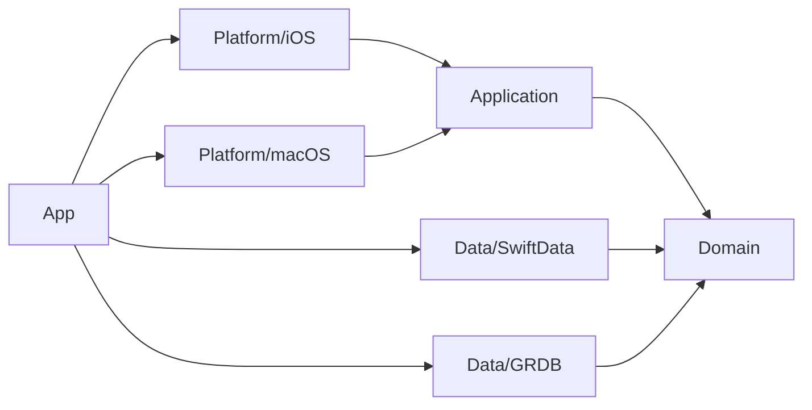

# Architecture

Project 24Zは、機能の増加と永続化方式の追加に耐えられるよう、レイヤーとプラットフォームを分離します。

## フォルダ構成

```text
Project 24Z/
├── App/                         # @main、Composition Root、依存注入
├── Domain/
│   ├── Models/                  # 純粋な業務エンティティ
│   ├── Repositories/            # 保存・外部I/Oのprotocol
│   └── Services/                # 複数モデルにまたがる純粋な業務ルール
├── Application/
│   └── <Feature>/               # ユースケース、画面状態、操作の調停
├── Data/
│   ├── Persistence/
│   │   ├── SwiftData/           # ModelContainer、@Model、Repository実装
│   │   └── GRDB/                # DatabaseQueue/Pool、Record、Migration
│   ├── Networking/              # API Client、DTO、Repository実装
│   └── FileSystem/              # ファイル保存のAdapter
├── Platform/
│   ├── iOS/                     # iOS専用SwiftUI View・画面遷移
│   └── macOS/                   # macOS専用SwiftUI View・ウインドウ構成
├── Shared/
│   ├── DesignSystem/            # 色、タイポグラフィ、非レイアウト資産
│   └── Resources/               # Localization、画像、設定資産
└── Assets.xcassets
```

テストは本体の構造を反映します。

```text
Project 24ZTests/
├── Domain/
├── Application/
└── Data/
Project 24ZUITests/
├── iOS/
└── macOS/
```

## 依存関係



- Domainは最も内側にあり、Apple UI／DBフレームワークを知りません。
- Applicationは操作の順序と画面状態を管理しますが、具体的な保存方法を知りません。
- DataはDomain protocolのAdapterです。SwiftDataとGRDBは互いを直接参照しません。
- Platformは表示と入力に専念します。iOSとmacOSは別々のViewツリーを持ちます。
- Appだけが具象型を生成し、protocolへ接続します。

## 機能追加の単位

機能は、必要な層だけに同じ機能名のまとまりを作ります。たとえばVehicle機能なら、`Domain/Models/Vehicle.swift`、`Application/Vehicles/`、`Platform/iOS/Features/Vehicles/`、`Platform/macOS/Features/Vehicles/` を使用します。空の層や将来用ファイルは作りません。

複数責務が生じた時点で型を分離します。ファイル行数だけでは分割せず、「変更理由が二つ以上あるか」を基準にします。
