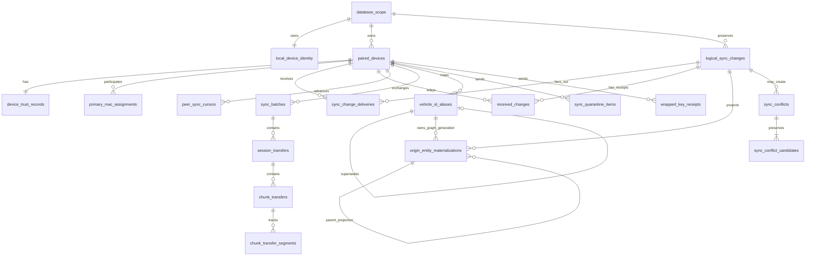
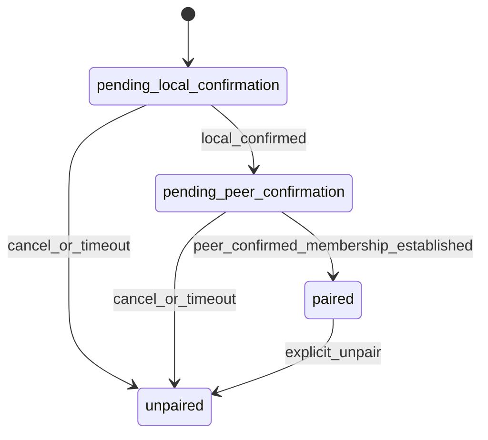
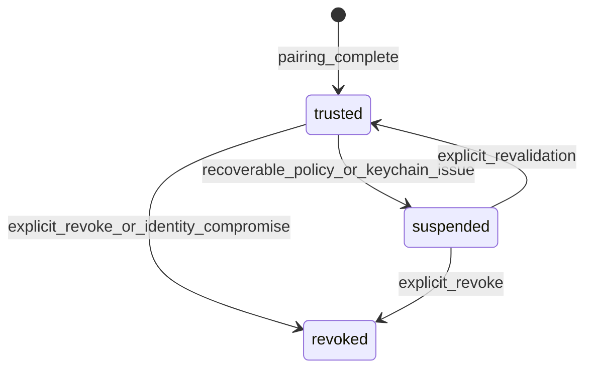
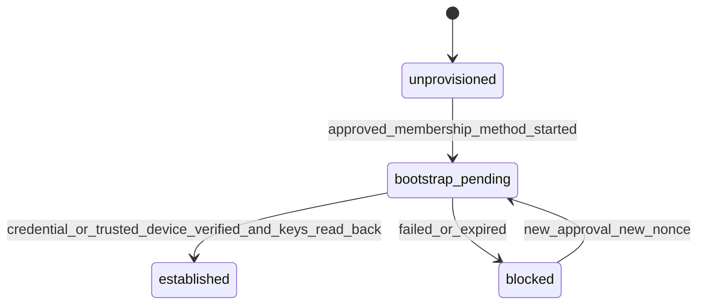

# Device Pairing, Sync, and Conflict Resolution Design

## 1. 目的と適用範囲

この文書は、同じProject 24Zユーザーであることを承認済み方式で証明したiPhoneとMacをローカルネットワーク上でペアリングし、終了・保存・整合性確認済みの取得セッションをiPhoneからPrimary Macへ転送し、車両メタデータと不変の車両・ECU識別履歴を双方向同期するための詳細設計を確定します。同期領域のSystem of Record、Origin Change Sequence／Chain、Peer別配送、Protocol、鍵配送、再開、冪等性、車両ID収束、Origin Envelope Projection、競合、隔離、復旧を対象とします。

今回は設計だけを行います。Swift、SQL Migration、Repository、Network.framework／Bonjour通信、Keychain操作、画面は実装しません。iCloudと外部同期サーバーは使用しません。BLE OBD Adapterとの通信は端末間同期とは別の接続、別のIdentity、別の状態軸です。

初期版の削除伝播は対象外です。MacまたはiPhoneでのローカル削除を相手へ伝播せず、両端末削除は将来のVersion付きProtocol、Tombstone保持期間、確認UIが別途承認された後だけ追加します。

Project 24Zアカウント認証、User Scope確定、Membership Credentialまたは既存Trusted Deviceによる新Device承認と鍵Bootstrapは、ローカルデータ同期とは別の前提境界です。現時点で利用可能な基盤は確認できていません。承認済みの同一ユーザー証明／Bootstrap方式が確定するまで、初回ペアリングおよび同期実装を開始してはならないHard Gateとします。

## 2. 既存設計との責務境界

- `VEHICLE_IDENTITY_DATABASE_DESIGN.md` は `vehicles`、`vehicle_identifiers`、`vehicle_identification_scans`、`ecu_observations`、`ecu_identification_values` の内容、不変性、暗号化、同一ユーザー内Digestを正本とします。本設計はそれらを転送し、Peerごとの車両ID対応と競合を記録します。
- `ACQUISITION_SESSION_STORAGE_DESIGN.md` はSession／Stream／Clock Epoch／Gap／Chunk目録、Chunkファイル、保存適格性、ファイル確定順序を正本とします。本設計は適格Queryを通過したSessionだけを転送し、Mac受信時にも同じ確定順序を守ります。
- 本設計のテーブルは、ペアリング、Trust、Origin Logical Change、Peer Delivery／Receipt、Cursor、転送進捗、Alias／Materialization履歴、競合、隔離だけを正本とします。業務EntityやChunk目録を複製しません。
- 全領域は同じユーザー別物理GRDBファイルを使用し、`database_scope`、複合ユーザースコープキー、scope検証トリガーを共有します。SwiftDataへミラーしません。
- 将来の実装配置は、純粋な規則とprotocolをDomain、操作順序をApplication、GRDB／Network.framework／Bonjour／Keychain AdapterをData、操作と状態表示だけを各Platformへ分離します。Viewは具象Adapterへ直接依存しません。

## 3. 設計原則

1. Bonjour検出は到達可能性の手掛かりでありTrustではありません。検出名にはランダムな短期Instance IDと製品サービス種別だけを使用します。
2. アカウント認証、User Scope確定、Membership証明、初回Device追加承認、確認コード、長期Device Identity、通信セッション鍵、ルート／用途鍵Bootstrapは役割を分離します。
3. 2回目以降はTLS 1.3、保存済みIdentity公開鍵Pin、Trust状態、Protocol Versionをすべて検証してから同期します。
4. ログはiPhoneからMacだけ、車両メタデータと不変識別履歴は双方向です。
5. Origin Device、Origin Change ID、Origin Stream、連続Change Sequence、Chain Digest、Entity Revision、内容Digestで冪等にし、後着上書き、端末時計順、UUID辞書順を採用しません。
6. ACKはMacでの永続保存だけを表し、iPhoneデータの削除許可を表しません。
7. 未知Version、内容衝突、AEAD／Digest異常、Identity異常は推測Decodeせず隔離し、元bytesと非機密メタデータを保持します。
8. DB transaction中にNetwork待機、Keychain認証UI待機、大容量ファイルI/Oを行いません。
9. エラー時に空DB、SwiftData、別スコープ、別PeerへFallbackしません。
10. Logical ChangeはOrigin情報を維持したまま複数Peerへ配送し、PeerごとのACK／retryを分離します。Relayごとに新Origin Changeを作りません。
11. Alias変換前のOrigin EnvelopeとローカルMaterializationを別物として保持し、どちらのDigestも上書きしません。
12. Membership／鍵Bootstrap Hard Gate完了前はPairingを`paired`にせず、車両、Digest、Chunk同期を開始しません。

## 4. 技術的成立条件とApple OS上の制約

- Bonjourは `_project24z-sync._tcp` のような製品専用サービス種別を使います。サービス名とTXTには、ランダムで起動ごとに変わるInstance ID、Pairing Protocol major、最小限のCapability hintだけを載せます。メール、ユーザー名、VIN、車台番号、表示名、固定Device IDは載せません。
- iOSのLocal Network権限とBonjour service宣言が必要です。権限拒否時は検出不能として案内し、自動で設定変更しません。
- iOSアプリが停止・終了していればMacから強制起動できません。Macは「iPhoneアプリを開く」案内を表示し、iPhoneが通信可能になれば再browse・再接続します。
- Network.frameworkのTCP＋TLS 1.3を使用します。初回は一時TLS接続上で端末公開鍵と証明書を交換し、確認コードで接続Transcriptを照合します。再接続は相互TLSと公開鍵Pinを必須にします。TLS 1.2以下、平文Fallback、証明書検証の無条件許可は禁止します。
- Device Identity Version 1はIdentity Signing、Identity Key Agreement、TLS Identityの3鍵を分離します。CryptoKitの`P256.Signing`と`P256.KeyAgreement`、Secure Enclaveの対応型は相互転用しません。設計根拠はApple公式の[P256.Signing](https://developer.apple.com/documentation/cryptokit/p256/signing)、[P256.KeyAgreement.PrivateKey](https://developer.apple.com/documentation/cryptokit/p256/keyagreement/privatekey)、[SecureEnclave.P256.KeyAgreement.PrivateKey](https://developer.apple.com/documentation/cryptokit/secureenclave/p256/keyagreement/privatekey)、[Network TLS](https://developer.apple.com/documentation/network/tls)です。
- 端末ごとの自己発行X.509証明書は独立したTLS Identity P-256鍵へ束縛し、証明書名をユーザー表示名に使いません。Security.frameworkによる生成・Key Usage設定・Keychain保存・Network.framework相互TLSへの投入、Secure Enclave可否をiOS／macOS双方で技術検証します。成立しない場合はSigning鍵との未検証な共用や独自暗号チャネルへ切り替えず、Apple標準APIで実現できる別TLS Identity方式を再設計します。
- Signing／Key Agreement鍵はSecure Enclave利用可能時に用途別の非抽出P-256鍵を優先し、利用不可端末では用途別ThisDeviceOnlyアクセス制御付きKeychain鍵を使用します。TLS Identity鍵も別のThisDeviceOnly Keychain itemを基本とし、Secure Enclave利用は上記技術検証後だけ有効化します。バックアップ復元した鍵を別Device Identityとして再利用しません。
- Local Network、Wi-Fi、省電力、アプリLifecycleにより接続は常時保証されません。全処理は切断・再起動を通常事象として永続化します。
- Account Membership Credentialを採用する場合は発行主体、署名鍵Pin、subject User Scope、Device Identity binding、Audience、issued-at／expiry、nonceまたはcredential ID、単回使用／Replay台帳を別の承認済み認証設計で固定します。外部認証サーバーを使ってもログ／車両データはローカル直接同期のままです。外部基盤を採用しない場合は、既存Trusted Deviceによる対面追加承認と鍵Bootstrapが必須です。

## 5. System of Recordと共通表現

同期・ペアリング領域の唯一のSystem of RecordはGRDBです。秘密鍵、ユーザールート鍵、用途別対称鍵、TLS Session keyはKeychainまたはプロセスメモリだけを正本とし、DBにはKey Version、公開鍵Fingerprint、Keychain用の非秘密参照ID、Wrapped Keyだけを保存します。受信中Chunk bytesは専用staging、隔離bytesは専用quarantineを正本とします。

共通表現は既存設計に合わせます。

| 値 | SQLite表現 | 規則 |
|---|---|---|
| UUID／ID | `TEXT` | 小文字ハイフン付きUUID。厳密検証はData層、`length = 36` は補助防衛 |
| 日時 | `TEXT` | UTC、固定長RFC 3339、マイクロ秒付き。順序決定の唯一根拠にしない |
| Digest／Fingerprint | `BLOB` | SHA-256またはHMAC-SHA-256、32 byte |
| Version／Revision／Offset | `INTEGER` | 0以上または各定義の1以上 |
| 状態 | `TEXT` | 列ごとに閉じた集合 |
| Envelope／Wrapped Key | `BLOB` | canonical binary encoding。任意JSONにしない |

全テーブルはSTRICT、Foreign Key有効、`ON DELETE RESTRICT ON UPDATE RESTRICT`を原則とします。全Peer／Entity参照に `user_scope_id` を含めます。SQLiteのCHECKで対になるNULL列を扱うときは、`IS NULL`／`IS NOT NULL`を明示します。

## 6. ペアリング、Trust、Primary Macモデル

### 6.1 Device Identity

Device Identity Version 1は次で構成します。

- ランダムな `device_identity_id`。
- Identity Signing Key Version 1: Pairing Transcript、Device Identity証明、Capability合意、Wrapped Key Envelope全体の署名専用P-256鍵。
- Identity Key Agreement Key Version 1: Recipientへ束縛したWrapped Key Envelope用ECDH専用P-256鍵。
- TLS Identity Key Version 1: X.509証明書へ束縛しNetwork.framework TLS 1.3だけに使用する独立P-256鍵。
- 各鍵の公開鍵、SPKI SHA-256 fingerprint、Key Version、用途別Keychain Reference ID。秘密鍵は用途別Keychain／Secure Enclave itemだけに置きます。
- TLS証明書fingerprint、証明書Key Usage／Extended Key UsageとTLS公開鍵の一致。
- `device_role` (`iphone`／`mac`) とDevice Identity Version。
- 表示用端末名は暗号化して保存できる任意メタデータで、認証識別子には使いません。

Signing鍵をKey Agreementに、Key Agreement鍵を署名検証に使用するAPI境界を設けません。Peerは3公開鍵fingerprint、各Key Version、証明書fingerprintをPinします。どれか一つの秘密鍵喪失、用途不一致、証明書束縛不一致、OS再インストールはIdentity全体の新Versionではなく新しい`device_identity_id`を原則とし、旧Identityをrevokedにして再Bootstrap／再ペアリングします。計画Rotationでは3鍵を独立生成・読戻し後、Device Identity Versionを増やした新Identity bundleを旧Signing鍵と新Signing鍵の双方で承認し、全Peer再Pinが完了するまで旧bundleを検証専用に保持します。

### 6.2 同一ユーザー証明

単なる平文`user_scope_id`比較、SAS一致、ルート鍵を既に共有しているという循環仮定は採用しません。Account認証、User Scope確定、Membership証明、Device追加承認、鍵Bootstrapを次の境界に分けます。

1. 最初のDevice: 承認済みAccount／local onboardingがUser Scopeを確定し、この端末がユーザールート鍵、独立Pairing Membership Key、用途別鍵を生成します。Root KeyとMembership Keyを同じ鍵／同じHKDF Purposeにしません。
2. 2台目以降: 承認済みAccount Membership Credentialを検証するか、既存Trusted DeviceがSASで確認した新Device Identityを明示承認します。SASだけでは同一ユーザーの暗号学的証明になりません。
3. Account方式: Credentialの発行主体署名、Audience、User Scope binding、Device Identity signing／agreement fingerprint、期限、nonce／credential ID、Replay未使用を検証します。
4. Trusted Device方式: 既存Trusted Deviceが独立Pairing Membership KeyによるTranscript proofを示し、新DeviceのSigning／Agreement／TLS fingerprintを承認します。新DeviceはまだMembership Keyを持たないため、自身の所持証明を要求しません。承認結果と鍵Envelope受領後にだけMembership確立となります。
5. Bootstrap: 承認済み受信IdentityのKey Agreement公開鍵へ、Membership Keyと必要な用途別限定鍵を別々の署名付きWrapped Envelopeで配送します。ユーザールート鍵そのものを共有するか用途別限定鍵だけを共有するかは承認済みBootstrap仕様で固定します。どちらでもRoot、Membership、Vehicle encryption、Digest、Chunk鍵のPurposeを分離します。
6. Bootstrap完了: EnvelopeをKeychainへ保存・読戻し、送信者署名、recipient、Trust generation、Versionを検証した後だけ`membership_state = established`にします。それまではPairing完了、Inventory、車両／Digest／Chunk同期を禁止します。

既存認証／Provisioning基盤の存在は確認できていないため、上記Account Credential方式、既存Trusted Device方式、または承認済みの別方式のいずれかが確定することを実装Hard Gateとします。既存Trusted DeviceがなくAccount基盤もない新端末は、既存User Scopeへ参加できません。

### 6.3 初回確認コード

確認コードは、TLS channel binding、双方のephemeral key、双方のIdentity fingerprint、nonce、Pairing Protocol Versionを含むcanonical TranscriptをSHA-256し、標準化したShort Authentication Stringへ変換した6桁以上のコードです。双方で同じコードを表示し、双方の明示確認を必要とします。コードは保存せず、鍵導出、再接続認証、暗号化には使いません。試行回数を制限し、キャンセル／タイムアウト後は新しいnonceとephemeral keyを使用します。

### 6.4 TrustとPrimary Mac

Pairingは「相手Identityを登録した関係」、Trustは「現在通信を許可する判断」、Primary Macは「そのiPhoneのログ送信先」を別軸にします。1台のMacは複数iPhoneをTrustできます。部分Unique Indexにより、1台のiPhoneは同時に1台のActive Primary Macだけを持ちます。

Trust失効は即時に新規接続、Change適用、転送、ACKを禁止します。解除後に同じ公開鍵で接続しても自動復帰せず、初回と同じ確認を伴う再ペアリングを必要とします。Primary Mac変更では旧Macを必ずオンラインにする必要はありませんが、旧割当、未ACK Session、鍵Envelopeの影響を表示し、新Macとの再確認後に新割当を有効化します。旧MacのTrustは自動失効させず、旧Macへの新規ログ転送だけを禁止します。

## 7. ER図



業務テーブルへの関係は、`vehicle_id_aliases.canonical_vehicle_id -> vehicles.vehicle_id`、`session_transfers.session_id -> acquisition_sessions.session_id`、`chunk_transfers.chunk_id -> log_chunks.chunk_id`です。受信前で親が未確定の段階を許す進捗行は業務FKを持たず、適用／確定transactionで検証します。

## 8. テーブル詳細

以下の全行は `created_at`、`created_by_device_id` を作成情報、可変行は `updated_at`、`updated_by_device_id`、`revision` を更新情報として持ちます。端末日時は監査表示用であり競合の勝者決定には使いません。明記しないDELETEは常に拒否します。

### 8.0 `local_device_identity`

**責務**: この物理DBを操作する現在のローカルDevice Identityの公開メタデータを1行だけ保持します。秘密鍵の正本にはしません。

| カラム | 型 | NULL | 説明 |
|---|---|---:|---|
| `scope_row_id` | INTEGER | No | 常に1 |
| `user_scope_id` | TEXT | No | 所有スコープ |
| `device_identity_id` | TEXT | No | ローカルIdentity UUID |
| `device_role` | TEXT | No | `iphone`／`mac` |
| `device_identity_version` | INTEGER | No | Version |
| `signing_key_version` | INTEGER | No | Signing Key Version |
| `signing_public_key` | BLOB | No | canonical P-256 Signing公開鍵 |
| `signing_key_fingerprint` | BLOB | No | Signing SPKI SHA-256 |
| `signing_keychain_reference_id` | TEXT | No | Signing秘密鍵のThisDeviceOnly参照UUID |
| `key_agreement_key_version` | INTEGER | No | Key Agreement Key Version |
| `key_agreement_public_key` | BLOB | No | canonical P-256 Key Agreement公開鍵 |
| `key_agreement_key_fingerprint` | BLOB | No | Agreement SPKI SHA-256 |
| `key_agreement_keychain_reference_id` | TEXT | No | Agreement秘密鍵のThisDeviceOnly参照UUID |
| `tls_identity_key_version` | INTEGER | No | TLS Key Version |
| `tls_identity_public_key` | BLOB | No | 証明書へ束縛したTLS公開鍵 |
| `tls_identity_key_fingerprint` | BLOB | No | TLS SPKI SHA-256 |
| `tls_certificate_fingerprint` | BLOB | No | 証明書Pin |
| `tls_identity_keychain_reference_id` | TEXT | No | TLS秘密鍵／SecIdentityのThisDeviceOnly参照UUID |
| `membership_state` | TEXT | No | `unprovisioned`、`bootstrap_pending`、`established`、`blocked` |
| `membership_version` | INTEGER | Yes | establishedだけ非NULL |
| `membership_credential_digest` | BLOB | Yes | Account Credential利用時だけ32 byte。Trusted Device方式はNULL |
| 共通更新列 | - | No | Membership状態Revision |

- PK: `scope_row_id`。Unique: `user_scope_id`、`device_identity_id`、3 fingerprint、3 Keychain Reference ID。
- FK相当: `scope_row_id = database_scope.scope_row_id`を1対1で強制し、`user_scope_id`一致をTriggerで検証します。
- Check: `scope_row_id = 1`、roleとmembership stateは上記集合、全Version >=1、全fingerprint 32 byte、各UUID形状。3公開鍵／fingerprint／Keychain参照はすべてNULL禁止なので片側欠損を許しません。`membership_state = 'established'`と`membership_version IS NOT NULL`を同値にし、非establishedではVersion／Credential digestをNULLにします。
- 不変列: scope、Identity ID、role、全鍵Version／公開鍵／fingerprint／Keychain参照、証明書fingerprint、作成情報。通常UPDATEはmembership state／Version／Credential digestと共通更新列だけです。DELETEは禁止します。Identity喪失時はこのDBを利用不可にし、明示的な再Identity化Migration／再ペアリング手順で旧行を監査backupへ残して置換します。
- IndexはPK／Uniqueだけです。SoRは公開メタデータがGRDB、秘密鍵がKeychainです。公開鍵は非秘密ですが改ざん検出対象です。

### 8.1 `paired_devices`

**責務**: ペアリング済みPeerの固定Identityと役割を保持します。

| カラム | 型 | NULL | 説明 |
|---|---|---:|---|
| `user_scope_id` | TEXT | No | 所有スコープ |
| `peer_identity_id` | TEXT | No | Peer Device Identity UUID |
| `device_role` | TEXT | No | `iphone`／`mac` |
| `device_identity_version` | INTEGER | No | Identity形式Version |
| `signing_key_version` | INTEGER | No | Peer Signing Key Version |
| `signing_public_key` | BLOB | No | Peer Signing公開鍵 |
| `signing_key_fingerprint` | BLOB | No | Signing SPKI SHA-256 |
| `key_agreement_key_version` | INTEGER | No | Peer Agreement Key Version |
| `key_agreement_public_key` | BLOB | No | Peer Agreement公開鍵 |
| `key_agreement_key_fingerprint` | BLOB | No | Agreement SPKI SHA-256 |
| `tls_identity_key_version` | INTEGER | No | Peer TLS Key Version |
| `tls_identity_public_key` | BLOB | No | Peer TLS公開鍵 |
| `tls_identity_key_fingerprint` | BLOB | No | TLS SPKI SHA-256 |
| `tls_certificate_fingerprint` | BLOB | No | 証明書Pin |
| `peer_pin_keychain_reference_id` | TEXT | No | Peer bundle Pinの非秘密Keychain参照UUID |
| `membership_verification_state` | TEXT | No | `pending`、`verified`、`rejected` |
| `membership_version` | INTEGER | Yes | verifiedだけ非NULL |
| `pairing_state` | TEXT | No | `pending_local_confirmation`、`pending_peer_confirmation`、`paired`、`unpaired` |
| `paired_at` | TEXT | Yes | `paired`以降だけ非NULL |
| `unpaired_at` | TEXT | Yes | `unpaired`だけ非NULL |
| 共通更新列 | - | No | Revision 1開始 |

- PK: `(user_scope_id, peer_identity_id)`。
- Unique: scope内のSigning／Agreement／TLS各fingerprint、TLS証明書fingerprint、Peer Pin参照。
- Check: role、membership verificationは上記集合、全Version >= 1、全fingerprintは32 byte。3公開鍵とfingerprintはNULL禁止です。`verified`と`membership_version IS NOT NULL`を同値にします。
- Check: `pairing_state = 'paired'` なら `paired_at IS NOT NULL AND unpaired_at IS NULL`、`unpaired`なら両方非NULL、それ以外は両方NULL。
- Check／Trigger: `pairing_state = 'paired'`へ進めるのはPeer membership=`verified`かつlocal membership=`established`の場合だけです。SAS確認だけでは満たしません。
- 状態: pending間は必要方向へ進み、両確認後だけ`paired`、任意状態からキャンセル時`unpaired`、`unpaired`終端。pendingは期限切れでDELETEせず`unpaired`にします。
- 不変列: scope、peer ID、role、Identity Version、3鍵のVersion／公開鍵／fingerprint、証明書fingerprint、Pin参照、作成情報。Identity変更は新Peer行です。
- Index: `(user_scope_id, device_role, pairing_state)`。
- SoR: GRDB。秘密鍵は保存しません。公開鍵は非秘密ですが改ざん検出対象です。

### 8.2 `device_trust_records`

**責務**: Pairingと独立した現在のTrustと失効理由を保持します。

| カラム | 型 | NULL | 説明 |
|---|---|---:|---|
| `user_scope_id` | TEXT | No | スコープ |
| `peer_identity_id` | TEXT | No | Peer FK |
| `trust_state` | TEXT | No | `trusted`、`suspended`、`revoked` |
| `trust_generation` | INTEGER | No | 発行／再発行ごとに増加 |
| `trusted_at` | TEXT | No | 初回Trust日時 |
| `suspended_at` | TEXT | Yes | suspendedだけ非NULL |
| `revoked_at` | TEXT | Yes | revokedだけ非NULL |
| `reason_code` | TEXT | Yes | 安定した非機密理由 |
| 共通更新列 | - | No | Revision |

- PK／FK: `(user_scope_id, peer_identity_id)` -> `paired_devices`。
- Check: generation >= 1。`trusted`は両状態日時と理由NULL、`suspended`はsuspendedと理由だけ非NULL、`revoked`はrevokedと理由だけ非NULL。
- 状態: `trusted <-> suspended`、`trusted|suspended -> revoked`。`revoked`終端。再Trustは再ペアリングによる新Identity行だけです。
- 不変列: scope、peer ID、trusted_at、作成情報。通常DELETE禁止。
- Index: `(user_scope_id, trust_state, updated_at)`。
- SoR: GRDB。認証情報は保存しません。

### 8.3 `primary_mac_assignments`

**責務**: iPhoneごとのPrimary Mac割当履歴を保持します。

| カラム | 型 | NULL | 説明 |
|---|---|---:|---|
| `user_scope_id` | TEXT | No | スコープ |
| `assignment_id` | TEXT | No | UUID |
| `iphone_identity_id` | TEXT | No | role=iphoneのPeerまたはローカルIdentity |
| `mac_identity_id` | TEXT | No | role=macのPeerまたはローカルIdentity |
| `assignment_state` | TEXT | No | `pending_confirmation`、`active`、`superseded`、`revoked` |
| `activated_at` | TEXT | Yes | active以降非NULL |
| `ended_at` | TEXT | Yes | superseded／revokedだけ非NULL |
| `previous_assignment_id` | TEXT | Yes | 変更時の直前割当 |
| 共通更新列 | - | No | Revision |

- PK: `(user_scope_id, assignment_id)`。各端末では一方が`local_device_identity`、他方が`paired_devices`に存在し、roleが列名と一致することをINSERT／UPDATE Triggerで強制します。両方がlocal、両方がPeer、存在しないIdentityは拒否します。Peer側は複合FK、local側は単一行Identityとの一致を検証します。
- Unique部分Index: `(user_scope_id, iphone_identity_id) WHERE assignment_state = 'active'`。これがiPhone単一Primary MacをDBで保証します。Mac側には個数制約を設けません。
- Check: iPhoneとMacが異なるID。activeは`activated_at IS NOT NULL AND ended_at IS NULL`、終端は両日時非NULL、pendingは両日時NULL。previousはNULLまたは自身以外。
- 状態: `pending_confirmation -> active|revoked`、`active -> superseded|revoked`、終端から戻しません。新Active化と旧Activeのsuperseded化を同じ`BEGIN IMMEDIATE`で行います。
- 不変列: scope、assignment ID、両端末ID、previous、作成情報。
- Index: `(user_scope_id, mac_identity_id, assignment_state)`。
- SoR: GRDB。秘密情報なし。

### 8.4 `logical_sync_changes`

**責務**: Origin端末が一度だけ生成する論理Change、Origin Envelope、連続Sequence／ChainをPeer配送と独立して保持します。Relayはこの行を再利用し、新しいOrigin Changeを作りません。

| カラム | 型 | NULL | 説明 |
|---|---|---:|---|
| `user_scope_id` | TEXT | No | スコープ |
| `logical_change_id` | TEXT | No | ローカル管理UUID |
| `origin_device_identity_id` | TEXT | No | Changeを最初に生成したDevice Identity |
| `origin_signing_key_version` | INTEGER | No | Origin Signing Key Version |
| `origin_signing_public_key` | BLOB | No | Relay先でも検証するOrigin Signing公開鍵 |
| `origin_signing_key_fingerprint` | BLOB | No | Origin Signing SPKI SHA-256 |
| `origin_change_id` | TEXT | No | Origin生成UUID。Relayで維持 |
| `stream_kind` | TEXT | No | `vehicle_display_name`、`vehicle_lifecycle`、`immutable_identity`、`session_log` |
| `change_sequence` | INTEGER | No | Origin／Stream内の0始まり連続Sequence |
| `previous_change_id` | TEXT | Yes | Sequence 0はNULL、それ以外は直前Origin Change ID |
| `previous_chain_digest` | BLOB | Yes | Sequence 0はNULL、それ以外は直前Chain Digest |
| `chain_digest` | BLOB | No | Origin chain SHA-256 |
| `entity_kind` | TEXT | No | Version 1の閉じた型集合 |
| `entity_id` | TEXT | No | Origin Entity ID |
| `origin_vehicle_id` | TEXT | Yes | Origin Alias名前空間のSource Vehicle ID。未割当Session系だけNULL可 |
| `origin_parent_entity_kind` | TEXT | Yes | Origin Envelope上の直接親Entity kind。root EntityだけNULL |
| `origin_parent_entity_id` | TEXT | Yes | Origin Envelope上の直接親Entity ID。Source Vehicleとは別概念 |
| `origin_secondary_parent_entity_kind` | TEXT | Yes | Gap／Chunk等の追加FK依存kind |
| `origin_secondary_parent_entity_id` | TEXT | Yes | 追加FK依存ID |
| `origin_tertiary_parent_entity_kind` | TEXT | Yes | Gap終了Epoch等の第3依存kind |
| `origin_tertiary_parent_entity_id` | TEXT | Yes | 第3依存ID |
| `entity_schema_version` | INTEGER | No | Origin Entity Version |
| `operation_kind` | TEXT | No | `upsert_immutable`／`upsert_field_revision`。deleteなし |
| `base_revision` | INTEGER | Yes | 可変フィールドだけ非NULL |
| `result_revision` | INTEGER | No | Origin結果Revision |
| `content_digest` | BLOB | No | 暗号化前canonical Origin Envelope digest |
| `origin_envelope_ciphertext` | BLOB | No | 元canonical Envelopeの保存時暗号文 |
| `origin_signature` | BLOB | No | Origin header、Chain、Envelope Digestへの署名 |
| `origin_membership_proof_digest` | BLOB | No | 承認済みCredential／Trusted chainの非機密digest |
| `creation_revision` | INTEGER | No | Version 1では常に1 |
| `origin_created_at` | TEXT | No | 監査用。順序根拠ではない |
| 共通作成列 | - | No | 行は不変 |

- PK: `(user_scope_id, logical_change_id)`。
- Unique: `(user_scope_id, origin_device_identity_id, origin_change_id)`および`(user_scope_id, origin_device_identity_id, stream_kind, change_sequence)`。同じOrigin Changeを別Peerから受信しても一行だけです。
- Origin DeviceはRelay先と直接pairedでない場合があるため`paired_devices`へのFKにしません。代わりにOrigin署名公開鍵と承認済みMembership proof digestを不変保持し、User Scope bindingを暗号学的に検証します。直接送信PeerはReceipt FKで別に検証します。
- Self FK: Sequence>0の`(user_scope_id, origin_device_identity_id, stream_kind, change_sequence - 1)`が存在し、その`origin_change_id`／`chain_digest`と本行のprevious列が一致することをINSERT Triggerで検証します。SQLite FK式では減算できないためTrigger＋直前行Queryを使用します。
- Check: `change_sequence >= 0`、Signing／Entity Version／Revision >=1、fingerprint／Digestは32 byte、公開鍵／署名／暗号文は空でないこと。Sequence 0では`previous_change_id IS NULL AND previous_chain_digest IS NULL`、Sequence>0では両方`IS NOT NULL`を明示します。各parent kind／IDは両方NULLまたは両方非NULLです。tertiaryが非NULLならsecondaryも非NULLを必須とします。Aliasを適用する不変Entityは`origin_vehicle_id IS NOT NULL`、未割当Session系だけNULLを許します。immutableはbase NULL、field変更はbase非NULLかつresult=base+1です。
- `chain_digest = SHA-256(canonical(origin_device_identity_id, origin_signing_key_version, origin_signing_key_fingerprint, stream_kind, change_sequence, origin_change_id, entity_kind, entity_id, origin_vehicle_id-or-null, origin_parent_entity_kind-or-null, origin_parent_entity_id-or-null, origin_secondary_parent_entity_kind-or-null, origin_secondary_parent_entity_id-or-null, origin_tertiary_parent_entity_kind-or-null, origin_tertiary_parent_entity_id-or-null, entity_schema_version, content_digest, previous_chain_digest-or-empty))`とします。GRDB接続ごとにVersion固定canonical encoder＋SHA-256を行う決定的SQLite scalar function `sync_chain_digest_v1`を登録し、INSERT Triggerが`NEW.chain_digest = sync_chain_digest_v1(...)`を検証します。関数未登録またはVersion不一致ならDBを同期利用不可にし、Triggerを迂回しません。Source Vehicleと直接／追加親をすべてOrigin署名、Content Digest、Chainへ束縛し、Relay情報や端末時計を入れません。
- Originはheader、Entity／Envelope Digest、previous／chainをIdentity Signing Keyで署名します。Relay先はOrigin Membership証明chain、Signing fingerprint、署名を検証し、直接PairingしていないOriginでも未検証公開鍵を自己申告として信用しません。
- Wire上のOrigin Change Envelopeは、Entity kindごとのVersion付き必須項目として`origin_vehicle_id`、直接親kind／ID、必要な追加親kind／IDを、Origin Identity bundleと承認済みMembership Credential／Trusted Device endorsement chainとともに含みます。保存時は`origin_envelope_ciphertext`内へ一体で暗号化します。子EntityでもSource Vehicleを後から業務行で推測せず、Relayはこれらを変更しません。`origin_membership_proof_digest`は検索／照合用でありproof本体を置き換えません。
- `content_digest`は上記Origin Vehicle／全親項目を含むVersion付きcanonical Origin Entity Envelope全体から計算し、`origin_signature`はOrigin header、Content Digest、Chain Digestを覆います。したがってSource Vehicleまたは直接親だけをRelay／Materialization時に差し替えると検証に失敗します。
- 不変列: 全列。UPDATE／DELETEを常に拒否します。Sequence採番はOrigin端末だけが`BEGIN IMMEDIATE`で現在末尾+1を予約し、先頭0から穴なくINSERTします。UUID辞書順や日時順を使いません。
- Index: `(user_scope_id, origin_device_identity_id, stream_kind, change_sequence)` Unique、`(user_scope_id, entity_kind, entity_id, result_revision)`。
- SoR: GRDB。Origin Envelopeは用途別鍵で暗号化し、平文車両情報を同期メタデータ列へ置きません。

### 8.5 `sync_change_deliveries`

**責務**: 一つのLogical Changeを複数Peerへ配送するPeer別Outbox、ACK、retryを独立保持します。

| カラム | 型 | NULL | 説明 |
|---|---|---:|---|
| `user_scope_id` | TEXT | No | スコープ |
| `delivery_id` | TEXT | No | UUID |
| `logical_change_id` | TEXT | No | Logical Change FK |
| `target_peer_identity_id` | TEXT | No | 配送先Peer |
| `relay_device_identity_id` | TEXT | No | 現在配送するローカルDevice Identity |
| `relayed_from_peer_identity_id` | TEXT | Yes | 最初に受信したPeer。local originはNULL |
| `relay_hop_count` | INTEGER | No | local originは0、受信Changeは1以上 |
| `delivery_state` | TEXT | No | `pending`、`in_batch`、`acked`、`retryable`、`blocked`、`suppressed` |
| `batch_id` | TEXT | Yes | in_batchだけ非NULL |
| `ack_id` | TEXT | Yes | ackedだけ非NULL |
| `acked_sequence` | INTEGER | Yes | ackedだけ非NULL。Logical Change sequenceと一致 |
| `acked_chain_digest` | BLOB | Yes | ackedだけ非NULL。Logical Chainと一致 |
| `retry_count` | INTEGER | No | 0以上 |
| `next_retry_at` | TEXT | Yes | retryableだけ非NULL |
| `suppression_reason` | TEXT | Yes | suppressedだけ非NULL |
| 共通更新列 | - | No | Delivery Revision |

- PK: `(user_scope_id, delivery_id)`。Unique: `(user_scope_id, logical_change_id, target_peer_identity_id)`。FK: Logical Change、target Peer、非NULLBatch／relayed Peer。
- Check: hop／retry >=0。batch、ACK三列、retry日時、suppression理由のNULL組合せを状態と明示的に同値にします。ACK sequence／digestはLogical Changeと一致することをTriggerで検証します。
- INSERT Trigger: target Peerが同じLogical Changeの`received_changes.source_peer_identity_id`に存在すれば反射として拒否します。全配送先はmembership verified、paired、trustedを必須にします。session_logはOriginがiPhone、targetがそのiPhoneのactive Primary Mac、hop=0だけを許し、Mac local log、受信済みlog、別iPhoneへのfan-outを拒否します。Metadataだけをfan-out対象とし、表示名とlifecycleを別streamで配送します。
- 状態: pending -> in_batch -> acked、切断時in_batch -> retryable、retryable -> pending、policy／Trust異常でblocked、反射・非Primary・log fan-out対象外はsuppressed。acked／suppressed終端です。
- 不変列: scope、Delivery ID、Logical FK、target、relay情報、作成情報。状態／Batch／ACK／retry／共通更新列だけ変更できます。Peer AのACKはPeer B行を更新できません。
- Index: `(user_scope_id, target_peer_identity_id, delivery_state, updated_at)`、`(user_scope_id, logical_change_id, delivery_state)`。
- SoR: GRDB。PayloadはLogical Changeを参照し、Peerごとに複製しません。

Relay情報はOrigin Logical Changeの一部ではないため、送信側はDelivery、受信側はReceiptへ保存します。これによりRelay経路が変わってもOrigin Sequence／Chain／Envelopeは変化せず、経路監査と論理同一性を混同しません。

### 8.6 `received_changes`

**責務**: Logical ChangeをどのPeerから受信したか、検証／適用結果、Relay経路を記録するInbox Receiptです。Logical Changeの全体冪等性は8.4のOrigin Unique制約が保証します。

| カラム | 型 | NULL | 説明 |
|---|---|---:|---|
| `user_scope_id` | TEXT | No | スコープ |
| `receipt_id` | TEXT | No | UUID |
| `source_peer_identity_id` | TEXT | No | 直接送信Peer |
| `batch_id` | TEXT | No | 受信Batch |
| `logical_change_id` | TEXT | No | 検証済みLogical Change FK |
| `origin_device_identity_id` | TEXT | No | Origin Device |
| `origin_change_id` | TEXT | No | Origin Change ID |
| `stream_kind` | TEXT | No | Origin Stream |
| `change_sequence` | INTEGER | No | Origin Sequence |
| `previous_chain_digest` | BLOB | Yes | Origin previous digest |
| `chain_digest` | BLOB | No | Origin chain digest |
| `entity_kind` | TEXT | No | Origin Entity kind |
| `entity_id` | TEXT | No | Origin Entity ID |
| `entity_schema_version` | INTEGER | No | Origin Entity Version |
| `content_digest` | BLOB | No | Origin Envelope digest |
| `relay_hop_count` | INTEGER | No | 受信時hop |
| `apply_state` | TEXT | No | `validated`、`applied`、`duplicate`、`conflicted`、`quarantined` |
| `applied_revision` | INTEGER | Yes | applied／duplicateだけ非NULL |
| `conflict_id` | TEXT | Yes | conflictedだけ非NULL |
| `quarantine_id` | TEXT | Yes | quarantinedだけ非NULL |
| `applied_at` | TEXT | Yes | applied／duplicateだけ非NULL |
| 共通更新列 | - | No | validatedから終端までRevision更新 |

- PK: `(user_scope_id, receipt_id)`。Unique: `(user_scope_id, source_peer_identity_id, origin_device_identity_id, origin_change_id)`、`(user_scope_id, source_peer_identity_id, origin_device_identity_id, stream_kind, change_sequence)`。
- FK: Peer、Batch、Logical Change、非NULLConflict／Quarantine。Origin、Stream、Sequence、previous／chain、Entity、Version、content digestはLogical Changeと完全一致することをTriggerで検証します。
- Check: Sequence／hop >=0、Entity Version >=1、Digest 32 byte、Sequence 0とprevious NULLを同値にします。状態ごとのapplied／conflict／quarantine列を`IS NULL`／`IS NOT NULL`で排他的にします。
- 同じOrigin Changeを別Peerから再受信した場合、新Receiptは`duplicate`になり業務適用しません。同じOrigin Device＋Change IDでEnvelope／Digestが異なる場合はLogical行を上書きせずReceiptをquarantinedにします。
- 状態: INSERT時validated、同一transactionで終端へ進めます。終端後はUPDATE／DELETE禁止です。
- Index: `(user_scope_id, source_peer_identity_id, origin_device_identity_id, stream_kind, change_sequence)`、`(user_scope_id, apply_state, created_at)`。
- SoR: GRDB。平文Payloadは保存せず、元EnvelopeはLogical Changeが正本です。

### 8.7 `peer_sync_cursors`

**責務**: Peer、方向、Origin Device、Origin Change streamごとの穴のないACK／適用位置を保持します。

| カラム | 型 | NULL | 説明 |
|---|---|---:|---|
| `user_scope_id` | TEXT | No | スコープ |
| `peer_identity_id` | TEXT | No | Peer |
| `direction` | TEXT | No | `sent`／`received` |
| `origin_device_identity_id` | TEXT | No | Sequence名前空間 |
| `stream_kind` | TEXT | No | Logical Changeと同じ閉じた集合 |
| `next_expected_sequence` | INTEGER | No | 初期0。次にACK／適用すべきSequence |
| `last_change_id` | TEXT | Yes | next=0ならNULL、それ以外は直前Origin Change ID |
| `last_chain_digest` | BLOB | Yes | next=0ならNULL、それ以外は直前Chain Digest |
| 共通更新列 | - | No | Cursor Revision |

- PK: `(user_scope_id, peer_identity_id, direction, origin_device_identity_id, stream_kind)`。FK: Peer。
- Check: next >=0。next=0ではlast列が両方NULL、next>0では両方非NULLを明示します。
- UPDATE Triggerは新`next_expected_sequence = OLD.next_expected_sequence + 1`だけを許可します。対象Logical ChangeのSequenceがOLD next、previous digestがOLD last digest（先頭はNULL）、Chain再計算が一致し、received方向は対応Receiptがapplied／duplicate、sent方向は対応Deliveryがackedであることを同じtransactionで検証します。
- 欠落、previous／chain不一致、conflicted、quarantined、未ACKを越えません。端末時計とUUID順は参照しません。
- IndexはPKに加え`(user_scope_id, peer_identity_id, direction, stream_kind, next_expected_sequence)`。SoRはGRDB、秘密情報なしです。

### 8.8 `sync_batches`

**責務**: 一回の差分交換単位とCapability snapshotを保持します。

| カラム | 型 | NULL | 説明 |
|---|---|---:|---|
| `user_scope_id` | TEXT | No | スコープ |
| `batch_id` | TEXT | No | UUID |
| `transfer_id` | TEXT | No | 接続をまたいで再開する論理Transfer UUID |
| `peer_identity_id` | TEXT | No | Peer |
| `direction` | TEXT | No | `send`／`receive` |
| `sync_protocol_version` | INTEGER | No | 合意Version |
| `capability_digest` | BLOB | No | 合意Capability Set digest |
| `batch_state` | TEXT | No | `preparing`、`transferring`、`applying`、`waiting_ack`、`completed`、`retryable`、`blocked` |
| `last_error_code` | TEXT | Yes | retryable／blockedだけ非NULL |
| `diagnostic_id` | TEXT | Yes | errorと同時NULL／非NULL |
| `completed_at` | TEXT | Yes | completedだけ非NULL |
| 共通更新列 | - | No | Revision |

- PK: `(user_scope_id, batch_id)`。Unique: `(user_scope_id, peer_identity_id, transfer_id, direction)`。FK: Peer。
- Check: Version >=1、digest 32 byte。error／diagnosticと状態、completed_atとcompletedを明示的に整合させます。
- 状態: `preparing -> transferring -> applying -> waiting_ack -> completed`。非終端から`retryable|blocked`、retryableから直前の永続checkpointへ戻れます。completed終端。
- 不変列: scope、IDs、Peer、direction、Version、Capability、作成情報。
- Index: `(user_scope_id, peer_identity_id, batch_state, updated_at)`。
- SoR: GRDB。機密Payloadなし。

### 8.9 `session_transfers`

**責務**: iPhoneからMacへのSession単位のManifest、適格性snapshot、完了を保持します。

| カラム | 型 | NULL | 説明 |
|---|---|---:|---|
| `user_scope_id` | TEXT | No | スコープ |
| `session_transfer_id` | TEXT | No | UUID |
| `batch_id` | TEXT | No | Batch FK |
| `session_id` | TEXT | No | Session UUID |
| `manifest_digest` | BLOB | No | Session／子目録のcanonical digest |
| `expected_chunk_count` | INTEGER | No | 0以上 |
| `expected_ciphertext_bytes` | INTEGER | No | 0以上 |
| `transfer_state` | TEXT | No | `manifest_pending`、`transferring`、`verifying`、`durable`、`acknowledged`、`retryable`、`blocked` |
| `durable_ack_id` | TEXT | Yes | durable以降非NULL |
| `durable_at` | TEXT | Yes | durable以降非NULL |
| `acknowledged_at` | TEXT | Yes | acknowledgedだけ非NULL |
| 共通更新列 | - | No | Revision |

- PK: `(user_scope_id, session_transfer_id)`。Unique: `(user_scope_id, batch_id, session_id)`。FK: Batch。受信適用後はSession存在をトリガーで検証します。
- Check: Digest 32 byte、件数／bytes >=0。ACK IDとdurable日時は`durable|acknowledged`だけ非NULL、acknowledged日時はacknowledgedだけ非NULL。
- 状態: manifest_pending -> transferring -> verifying -> durable -> acknowledged。非終端からretryable／blocked、retryableから保存済みcheckpointへ戻ります。durableから転送前へ戻しません。
- 不変列: IDs、Digest、期待値、作成情報。DELETE禁止。
- Index: `(user_scope_id, batch_id, transfer_state)`。
- SoR: GRDB。Manifestの機密部分は別の暗号化Envelopeです。

### 8.10 `chunk_transfers`

**責務**: Chunk単位の受信、検証、ファイル確定、DB目録登録を追跡します。

| カラム | 型 | NULL | 説明 |
|---|---|---:|---|
| `user_scope_id` | TEXT | No | スコープ |
| `chunk_transfer_id` | TEXT | No | UUID |
| `session_transfer_id` | TEXT | No | 親Transfer |
| `chunk_id` | TEXT | No | Chunk UUID |
| `stream_id` | TEXT | No | Stream UUID |
| `chunk_sequence` | INTEGER | No | Sequence |
| `ciphertext_size` | INTEGER | No | 総byte |
| `ciphertext_digest` | BLOB | No | SHA-256 |
| `record_format_version` | INTEGER | No | Record Version |
| `compression_format_version` | INTEGER | No | Compression Version |
| `encryption_format_version` | INTEGER | No | 暗号Version |
| `key_version` | INTEGER | No | Chunk導出元Key Version |
| `transfer_state` | TEXT | No | `pending`、`receiving`、`segments_complete`、`verified`、`file_durable`、`cataloged`、`quarantined` |
| `staging_relative_path` | TEXT | Yes | receivingからcataloged前まで非NULL |
| `cataloged_at` | TEXT | Yes | catalogedだけ非NULL |
| `quarantine_id` | TEXT | Yes | quarantinedだけ非NULL |
| 共通更新列 | - | No | Revision |

- PK: `(user_scope_id, chunk_transfer_id)`。Unique: `(user_scope_id, session_transfer_id, chunk_id)`、`(user_scope_id, session_transfer_id, stream_id, chunk_sequence)`。FK: Session Transfer、非NULLQuarantine。
- Check: size >0、Sequence >=0、Record／Compression／Encryption／Key Version >=1、Digest 32 byte。staging path、cataloged日時、quarantine IDのNULL組合せを状態ごとに明記します。
- 状態: pending -> receiving -> segments_complete -> verified -> file_durable -> cataloged、異常時は非終端からquarantined。Digest／AEAD／format不一致はquarantined終端で、同じ行を上書き再利用しません。
- 不変列: IDs、Sequence、size、Digest、Record／Compression／Encryption／Keyの全Version、作成情報。状態とpathだけ更新可能。
- Index: `(user_scope_id, session_transfer_id, transfer_state, chunk_sequence)`。
- SoR: GRDBの進捗＋staging／final file。staging pathは非機密UUIDのみ。

### 8.11 `chunk_transfer_segments`

**責務**: 大きいChunkのOffset単位再開と重複検出を保持します。

| カラム | 型 | NULL | 説明 |
|---|---|---:|---|
| `user_scope_id` | TEXT | No | スコープ |
| `chunk_transfer_id` | TEXT | No | 親Chunk Transfer |
| `segment_index` | INTEGER | No | 0始まり |
| `byte_offset` | INTEGER | No | Chunk先頭からのoffset |
| `byte_length` | INTEGER | No | 長さ |
| `segment_digest` | BLOB | No | Segment SHA-256 |
| `segment_state` | TEXT | No | `expected`、`received`、`verified` |
| `received_at` | TEXT | Yes | received以降非NULL |
| `verified_at` | TEXT | Yes | verifiedだけ非NULL |
| 共通更新列 | - | No | Segment状態Revision |

- PK: `(user_scope_id, chunk_transfer_id, segment_index)`。Unique: `(user_scope_id, chunk_transfer_id, byte_offset)`。FK: Chunk Transfer。
- Check: index／offset >=0、length >0、digest 32 byte。受信／検証日時のNULL組合せを状態と同値にします。
- 隣接Segmentの非重複、先頭offset 0、前Segment終端=次offset、最終終端=Chunk sizeは全Segment完了transactionのQuery／triggerで検証します。SQLite CHECKだけで行間を証明しません。
- 状態: expected -> received -> verified。同じindex／offset／digest再受信は冪等、異なる値は親Chunkを隔離します。scope、親ID、index、offset、length、digest、作成情報は不変で、状態、受信／検証日時、Revision、更新情報だけ変更できます。DELETEは禁止します。
- Index: `(user_scope_id, chunk_transfer_id, segment_state, byte_offset)`。
- SoR: GRDB。bytesはstaging fileであり、この表へ保存しません。

### 8.12 `vehicle_id_aliases`

**責務**: Peer上の異なるVehicle IDを、履歴を消さずローカルCanonical Vehicleへ対応付けます。

| カラム | 型 | NULL | 説明 |
|---|---|---:|---|
| `user_scope_id` | TEXT | No | スコープ |
| `vehicle_alias_id` | TEXT | No | Alias履歴UUID |
| `source_peer_identity_id` | TEXT | No | remote IDの名前空間 |
| `source_vehicle_id` | TEXT | No | PeerのVehicle ID |
| `canonical_vehicle_id` | TEXT | No | ローカル`vehicles`の代表ID |
| `alias_revision` | INTEGER | No | 同一Source Vehicle内の1始まり対応履歴Revision兼Projection graph generation |
| `previous_alias_id` | TEXT | Yes | Revision 1はNULL、以後は準備元の直前Alias |
| `match_basis_kind` | TEXT | No | `same_entity_id`／`single_valid_identifier_digest`／`user_confirmed` |
| `basis_digest` | BLOB | Yes | Digest根拠。same IDではNULL可 |
| `graph_source_frontier` | BLOB | No | Version付きcanonical Origin／Stream末尾Sequence・Change ID・Chain Digest map |
| `graph_manifest_digest` | BLOB | No | graph所属Entity、親子関係、expected Digest、source frontierのcanonical digest |
| `expected_materialization_count` | INTEGER | No | ready判定対象のMaterialization総数 |
| `mapping_state` | TEXT | No | `preparing`／`ready`／`active`／`superseded`／`conflicted` |
| `ready_at` | TEXT | Yes | ready以降だけ非NULL |
| `activated_at` | TEXT | Yes | active／supersededだけ非NULL |
| `superseded_by_alias_id` | TEXT | Yes | supersededだけが次Alias履歴を参照 |
| `superseded_at` | TEXT | Yes | supersededだけ非NULL |
| 共通更新列 | - | No | Revision |

- PK: `(user_scope_id, vehicle_alias_id)`。Materializationのgraph FK用Unique: `(user_scope_id, vehicle_alias_id, alias_revision)`。FK: Peer、`(user_scope_id, canonical_vehicle_id) -> vehicles`、非NULLの`previous_alias_id`／`superseded_by_alias_id`を同scope Aliasへ結ぶ自己FKです。自己FKは公開切替transactionの相互参照をcommit時に検証する`DEFERRABLE INITIALLY DEFERRED`とします。
- Unique: `(user_scope_id, source_peer_identity_id, source_vehicle_id, alias_revision)`。部分Unique Index: `(user_scope_id, source_peer_identity_id, source_vehicle_id) WHERE mapping_state = 'active'`。同じSource Vehicle／Peer名前空間のactive Alias行が、現在公開中のgraph generationを指す唯一の正本です。別の可変pointerや個別Materialization状態から公開graphを推測しません。
- Check: alias_revision >=1、expected count >=0、graph source frontierはVersion付きcanonical binary、graph manifestは32 byte、basisは上記集合です。Digestはsingle matchなら32 byte必須、same IDならNULL、user confirmedはNULLまたは32 byteです。Revision 1は`previous_alias_id IS NULL`、Revision >1は非NULLとし、直前行と同じscope／source Peer／source Vehicleかつ`alias_revision = previous + 1`をTriggerで検証します。readyでは`ready_at`だけ、activeでは`ready_at`／`activated_at`、supersededでは3日時と`superseded_by_alias_id`が非NULLです。preparingでは全日時、conflictedでは`activated_at`／`superseded_at`をNULLとし、ready到達後のConflictだけ`ready_at`を保持できます。自己参照を拒否します。
- Graph readiness Trigger: preparing -> readyの一方向遷移時に、`graph_source_frontier`以下で同一`vehicle_alias_id + alias_revision`へ属する期待件数のMaterializationがすべてappliedであること、Entity集合、Origin／Materialized親子関係、expected Materialized Digest、Identifier結果、Chunk目録Digest、frontier mapをcanonical再計算した値が`graph_manifest_digest`と一致することを検証します。Identifierの`linked_existing_duplicate`は、対象既存行のID、Canonical Vehicle、kind、Digest Key Version、Lookup Digest、canonical digestをapplied遷移transactionで再読戻し検証したMaterializationだけを件数とmanifestへ含めます。未applied、不一致、対象消失、同じ照合条件で複数候補となるlinkはreadinessへ数えません。ready後はsource frontier、graph manifest、baseline所属Materialization集合を変更できません。通常同期で現active graphへfrontier後の新しいEntityを追加する場合はactive graph内でEntity単位にatomic適用でき、baseline manifestを変更しません。preparing graphのfrontierより後のChangeは公開切替まで待機させ、ready／切替時のfrontier不一致では切替をrollbackします。
- 公開切替Trigger: ready -> activeは、同じSource Vehicle名前空間の旧activeが存在する場合、その旧行をactive -> supersededにして`superseded_by_alias_id = NEW.vehicle_alias_id`とし、新ready行をactiveにする一つの短い`BEGIN IMMEDIATE`だけで許可します。旧行と新行は相互に`previous_alias_id`／`superseded_by_alias_id`で一致し、旧activeと新readyのsource frontier、graph manifest、全Materialization applied、親子／Digest／Chunk検証をtransaction内で再確認します。初回公開はactive行が存在しないことを同じtransactionで確認します。SQLite readerはcommit前snapshotで旧activeだけ、commit後snapshotで新activeだけを読み、部分Unique Indexにより両方activeを拒否します。
- 状態: preparing -> ready|conflicted、ready -> active|conflicted、active -> supersededだけを許します。conflicted／supersededは終端です。新Revisionは旧activeを維持したままpreparingで作成し、個別Materializationのapplied化だけでは公開しません。旧Materializationの`superseded_projection`化は公開切替後の監査用後処理であり、公開可否の正本ではありません。
- 不変列: scope、Alias ID、source Peer／Vehicle、canonical Vehicle、alias revision、previous Alias、根拠、graph source frontier、graph manifest、expected count、作成情報。許可UPDATEは状態遷移に必要なstate、ready／active／superseded日時、superseded先、Revision、更新情報だけです。全行DELETE禁止です。
- Index: `(user_scope_id, canonical_vehicle_id, mapping_state)`、`(user_scope_id, source_peer_identity_id, source_vehicle_id, mapping_state, alias_revision)`。
- SoR: GRDB。VIN等の平文は保持しません。active Alias行がgraph公開の正本であり、Alias状態とgraph generationが一致しない場合は通常Query、Cursor、ACKを停止します。

`source_vehicle_id`がローカルと同じならcanonicalは同じIDです。異なるが唯一の有効 `(identifier_kind, digest_key_version, lookup_digest)` に一致する場合、Aliasを作り、重複`vehicle_identifiers`行はINSERTしません。この一致判定は、受信Identifierと既存Identifierの認証付き復号、同じ正規化規則、比較可能なDigest Key Version、`identifier_kind`、`lookup_digest`、Canonical Vehicleの一致をすべて要求します。Remote Scan／ECU履歴とIdentifierのOrigin履歴は8.13のVersion付きProjectionでmaterializeし、既存Identifierへの冪等リンクでもLogical Change、Receipt、Alias、Origin Scan Materialization、Identifier Materializationを保持します。複数Digestが異なる既存車両へ一致、同じkindで異なるDigest、Digest Key Versionを安全に比較できない、無効／未登録だけ、または既存Active Aliasと矛盾する場合は既存Activeを維持したままconflicted履歴とConflict／Quarantineを作ります。

### 8.13 `origin_entity_materializations`

**責務**: Alias変換が必要な不変Origin Envelopeを変更せず、ローカル業務行へのVersion付きProjection結果と全履歴を保持します。一般Inboxへ責務を混在させず、Alias変換Entityだけを扱うProvenance表を採用します。暗号化Origin Envelopeの唯一の正本はFK先`logical_sync_changes.origin_envelope_ciphertext`です。

| カラム | 型 | NULL | 説明 |
|---|---|---:|---|
| `user_scope_id` | TEXT | No | スコープ |
| `materialization_id` | TEXT | No | UUID |
| `logical_change_id` | TEXT | No | Origin Envelope／Change FK |
| `origin_device_identity_id` | TEXT | No | Origin Device |
| `origin_change_id` | TEXT | No | Origin Change ID |
| `entity_kind` | TEXT | No | 投影対象の不変Entity kind |
| `origin_entity_id` | TEXT | No | Origin Entity ID |
| `origin_vehicle_id` | TEXT | No | Alias名前空間上のSource Vehicle ID |
| `origin_parent_entity_kind` | TEXT | No | Origin Envelope上の直接親kind |
| `origin_parent_entity_id` | TEXT | No | Origin Envelope上の直接親ID |
| `origin_entity_version` | INTEGER | No | Origin Entity Version |
| `origin_content_digest` | BLOB | No | Origin canonical Envelope digest |
| `origin_envelope_storage` | TEXT | No | Version 1は`logical_change_ciphertext` |
| `vehicle_alias_id` | TEXT | No | 使用したAlias履歴FK |
| `graph_generation` | INTEGER | No | 所属Projection graph generation。Alias Revisionと一致 |
| `projection_version` | INTEGER | No | Parent ID変換規則Version |
| `canonical_vehicle_id` | TEXT | No | 適用先Vehicle FK |
| `parent_materialization_id` | TEXT | Yes | Vehicle直下ではNULL、それ以外は直接親Projection FK |
| `materialized_parent_entity_id` | TEXT | No | 投影後の直接親ID |
| `origin_secondary_parent_entity_kind` | TEXT | Yes | Gap／Chunk等の追加依存kind |
| `origin_secondary_parent_entity_id` | TEXT | Yes | Origin追加依存ID |
| `secondary_parent_materialization_id` | TEXT | Yes | 追加親Projection FK |
| `materialized_secondary_parent_entity_id` | TEXT | Yes | 投影後の追加依存ID |
| `origin_tertiary_parent_entity_kind` | TEXT | Yes | Gap終了Epoch等の第3依存kind |
| `origin_tertiary_parent_entity_id` | TEXT | Yes | Origin第3依存ID |
| `tertiary_parent_materialization_id` | TEXT | Yes | 第3親Projection FK |
| `materialized_tertiary_parent_entity_id` | TEXT | Yes | 投影後の第3依存ID |
| `materialization_result_kind` | TEXT | No | `inserted_projection`／`linked_existing_duplicate` |
| `materialized_identifier_kind` | TEXT | Yes | Identifierだけ非NULL。照合済み`vin`／`domestic_chassis_number` |
| `materialized_identifier_digest_key_version` | INTEGER | Yes | Identifierだけ非NULL。照合に使用したDigest鍵Version |
| `materialized_identifier_lookup_digest` | BLOB | Yes | Identifierだけ非NULL。照合済み32 byte Keyed Digest |
| `materialized_content_digest` | BLOB | No | projected作成前に決定したexpected canonical digest。applied遷移時に読戻し値と照合し、作成後は更新しない |
| `materialized_entity_id` | TEXT | No | ローカル業務Entity ID |
| `materialization_state` | TEXT | No | `projected`、`applied`、`conflicted`、`quarantined`、`superseded_projection` |
| `relay_eligibility` | TEXT | No | `metadata_relay_allowed`／`origin_only_no_relay` |
| `received_at` | TEXT | No | Receipt受信日時 |
| `applied_at` | TEXT | Yes | applied／superseded_projectionだけ非NULL |
| `superseded_by_materialization_id` | TEXT | Yes | superseded_projectionだけ次Projectionを参照 |
| `superseded_at` | TEXT | Yes | superseded_projectionだけ非NULL |
| 共通更新列 | - | No | 状態Revision |

- PK: `(user_scope_id, materialization_id)`。Unique: `(user_scope_id, logical_change_id, vehicle_alias_id, graph_generation, projection_version)`。
- 親参照用Unique: `(user_scope_id, materialization_id, origin_device_identity_id, origin_vehicle_id, origin_entity_id, materialized_entity_id, canonical_vehicle_id, vehicle_alias_id, graph_generation, projection_version)`。
- FK: Logical Change、canonical Vehicle、`(user_scope_id, vehicle_alias_id, graph_generation) -> vehicle_id_aliases(user_scope_id, vehicle_alias_id, alias_revision)`、非NULLの同scope／同graph Materialization self FKです。直接親の複合FKは、子の`(scope, parent_materialization_id, origin_device, origin_vehicle, origin_parent_entity_id, materialized_parent_entity_id, canonical_vehicle, alias_id, graph_generation, projection_version)`を上記親Uniqueへ結びます。secondary／tertiaryも各ID列で同じ複合FKを持ちます。これにより別scope、別Origin階層、別Source Vehicle、別Alias Revision／graph generationの親を文字列IDだけで参照できません。
- Logical／Alias Trigger: entity kind、Origin Entity／Vehicle／直接・追加親、Entity Version、Origin DigestがLogical Changeと一致し、`vehicle_id_aliases.source_vehicle_id = origin_vehicle_id`、`vehicle_id_aliases.canonical_vehicle_id = canonical_vehicle_id`、`vehicle_id_aliases.alias_revision = graph_generation`であることをprojected作成時に検証します。新Revision graphの作成はAliasがpreparing、通常同期で現在公開中graphへEntityを追加する場合はAliasがactiveであることを要求し、ready／superseded／conflicted graphへの新規Materialization追加を拒否します。Source Vehicleと直接親を比較しません。
- Parent Trigger: projected子の作成は親が`projected|applied`、appliedへの遷移は全親が`applied`であり、同じOrigin Device／Vehicle、同じAlias ID／graph generation／Canonical Vehicle、親の`entity_kind + origin_entity_id + materialized_entity_id`が子のdirect／secondary／tertiary各対応列と完全一致する場合だけ許可します。Vehicle直下だけSource Vehicle -> canonical Vehicleのroot対応を許し、それ以外は対応する親Materializationを必須にします。conflicted、quarantined、superseded_projection親を常に拒否し、未適用親では子をappliedにできません。この意味検査はprojected作成とapplied遷移だけでなく、ready化とactive公開の直前にも全件再実行します。projected -> applied Triggerは対象業務行を同じtransaction内で読戻し、Version付きcanonical encoderで再計算したDigestが保存済み`materialized_content_digest`と一致することも必須にします。
- Projection Ownership Trigger: `inserted_projection`のprojected作成時に、予約`materialized_entity_id`と同じscope／Entity kindの業務行がまだ存在しないこと、別Materializationが同じ業務IDを`inserted_projection`として所有していないことを検証します。`linked_existing_duplicate`だけは検証済み既存Identifier IDを参照できます。これによりpreparing行がローカル生成の既存業務行を所有扱いにして通常Viewから隠すことを拒否します。
- Identifier Result検証: Data層はDB transaction外でOriginと既存Identifierの暗号文を認証付き復号し、同じVersion付き正規化を適用して値を比較し、利用可能なDigest鍵でLookup Digestを再計算します。`linked_existing_duplicate`のprojected作成前に既存行を読戻し、そのVersion付きcanonical digestを`materialized_content_digest`へ保存します。applied遷移の短いtransaction内で対象行を再読し、Identifier Result Triggerは、`linked_existing_duplicate`を`entity_kind = vehicle_identifier`だけに許可した上で、対象が一意な1行であり、`materialized_entity_id`、Canonical Vehicle、kind、Digest Key Version、Lookup Digest、再計算canonical digestが保存済み値と一致することを検証します。この成功済みapplied状態だけがgraph readinessとIdentifier Viewのactive linked公開根拠です。既存行の`source_scan_id`とRemote Scan ProjectionのID一致は要求せず、Origin側Scanは`origin_parent_entity_id`、`parent_materialization_id`、`materialized_parent_entity_id`で保持します。`inserted_projection`のIdentifierは、Canonical Vehicleに同じkindがなく、同scope全体に同じkind／Lookup Digestがなく、Digest Key Versionを安全に比較できる場合だけ、Canonical VehicleとMaterialized Scanを`vehicle_id`／`source_scan_id`として新規INSERTできます。既存の二つのUnique制約を迂回しません。transaction開始前後で既存行が変化、消失、複数候補化、または照合不一致になればduplicateとして適用せずrollbackし、Conflict／Quarantineにします。
- Check: Version >=1、両Digest 32 byte、storage=`logical_change_ciphertext`、result kindは上記集合です。`linked_existing_duplicate`はIdentifierだけ、他Entityは`inserted_projection`だけです。Identifierでは照合3列がすべて非NULL、他EntityではすべてNULLで、kindは閉集合、Digest Key Version >=1、Lookup Digestは32 byteです。parent kind／ID、materialization ID、materialized IDの組はEntity別規則に従い、各追加親4列はすべてNULLまたはすべて非NULLです。tertiary非NULLならsecondary非NULLです。appliedではapplied_atだけ非NULL、superseded_projectionではapplied_at／superseded先／superseded_atがすべて非NULL、他状態では3列すべてNULLと明示します。Origin DigestとMaterialized Digestを同じ列／意味として扱いません。
- 元EnvelopeはLogical Changeから読み、ローカル業務行から推測再生成しません。同じOrigin Change再受信は保存済み暗号化EnvelopeとOrigin Digestを比較し、不一致ならLogical行を上書きせず隔離します。
- `inserted_projection`はData層でINSERT予定業務行をVersion付きcanonical encodingし、業務行INSERT前にexpected digestを決定します。`materialized_entity_id`と各Materialized Parent IDも同時に予約し、projected Materializationへ非NULLのexpected digestを保存します。applied遷移の短い`BEGIN IMMEDIATE`で親のapplied状態とUnique／FKを再確認し、業務行INSERT、同transaction内読戻し、同じencoderによるDigest再計算、expected digest一致、Materialization applied化を一括実行します。不一致、INSERT失敗、Unique／FK違反ではtransaction全体をrollbackし、中途半端な業務行またはapplied Materializationをcommitしません。`materialized_content_digest`は予定値用列と確定値用列へ分裂させず、作成後に書き換えません。
- `linked_existing_duplicate`の`materialized_entity_id`だけは検証済み既存Identifier IDを参照し、projected作成時に事前読戻しした既存行のcanonical digestを保存します。applied遷移時は業務行をINSERTせず、同じ短いtransaction内の再読戻しと全照合が成功した場合だけappliedにします。どちらの結果種別もMaterialized DigestをOrigin Digestと別に保持し、Origin Scan IDと既存行の`source_scan_id`が異なることだけをConflict理由にしません。
- Chunk／ファイルを伴う`inserted_projection`では、暗号文ファイルDigestとDB目録行の`materialized_content_digest`を別の値として扱います。Version付き目録canonical encodingからexpected digestをファイルI/O前に決定してprojected行へ保存し、既存Storage設計のstaging、flush、全読戻し、AEAD／形式検証、原子的rename、最終読戻しをtransaction外で完了します。その後の短いtransactionで目録行をINSERTして読戻し、目録canonical digestがexpected digestと一致した場合だけMaterializationをappliedにします。ファイル確定失敗では旧Projectionを維持して新Projectionをappliedにせず、rename後rollback／クラッシュで残るfileは既存の孤立file復旧規則へ従います。
- 状態: projected -> applied|conflicted|quarantined、applied -> superseded_projection。projected作成前のcanonical encoding、暗号処理、Keychain UI、Network、Chunk file I/OはDB transactionへ混在させません。親をsupersededにするUPDATE Triggerはappliedな子／追加依存参照が残る間拒否します。Alias変更時は旧Alias／graphをactiveのまま、新Aliasをpreparingで作り、予約IDとexpected digestを持つ新graphのprojected行を親から子へ作ります。次に親から子へ、各業務行INSERT／読戻しDigest検証／applied遷移をEntity単位の短いtransactionで行います。同一内容の既存Identifierは上記再読戻し検証により同じ不変業務行へリンクします。全Materialization、親子関係、expected Digest、Chunk目録、source frontierの検証後に新Aliasをreadyへ進め、8.12のatomic公開切替で旧active Alias／graphから新active Alias／graphへ切り替えます。切替commit後、旧Projectionを対応する新Materialization参照付きで子から親へ`superseded_projection`化しますが、この後処理は公開結果を変えません。途中失敗またはprojected作成後のクラッシュでは旧graphをactiveのまま公開し、新graphをpreparing／readyと個別Materialization状態のまま再開または隔離します。旧Origin Envelope、旧親子Projection、過去業務FKを削除／一括UPDATEしません。
- 不変列: scope、IDs、Entity kind、Origin Entity／Vehicle／全親情報／Digest／storage、Alias、graph generation、Projection Version、canonical、全親Materialization／Materialized ID、result kind、Identifier照合3列、Materialized Digest／ID、relay eligibility、受信／作成情報。状態とapplied／superseded情報だけ更新できます。DELETE禁止です。
- Index: `(user_scope_id, origin_device_identity_id, origin_change_id)`、`(user_scope_id, vehicle_alias_id, graph_generation, materialization_state)`、`(user_scope_id, canonical_vehicle_id, materialization_state)`。
- SoR: Projection履歴はGRDB、暗号化元EnvelopeはLogical Changeです。平文VIN、車台番号、表示名、Raw bytesを列へ置きません。

Entity kindごとのContainment／FK検証は次に固定します。

| Entity kind | `origin_parent_entity_kind` | 直接親の検証 | 追加依存 |
|---|---|---|---|
| `vehicle_identification_scan` | `vehicle` | Origin parent = Origin Vehicle、Materialized parent = Canonical Vehicle、parent MaterializationはNULL | なし |
| `vehicle_identifier` | `vehicle_identification_scan` | applied Scan Projectionを監査上の親として複合FK検証。`inserted_projection`は業務行の`vehicle_id`=Canonical、`source_scan_id`=Materialized Scan。`linked_existing_duplicate`は業務行のCanonical Vehicle／kind／正規化値／Digest Version／Lookup Digest一致を検証し、既存`source_scan_id`との一致・変更を要求しない | なし |
| `ecu_observation` | `vehicle_identification_scan` | applied Scan Projectionへの複合FK。業務行`scan_id`がMaterialized Scan IDと一致 | なし |
| `ecu_identification_value` | `ecu_observation` | applied Observation Projectionへの複合FK。業務行`ecu_observation_id`がMaterialized Observation IDと一致 | なし |
| `acquisition_session` | `vehicle` | 割当済みSessionだけOrigin parent = Origin Vehicle、Materialized parent = Canonical Vehicle。未割当SessionはAlias Projection対象外 | なし |
| `acquisition_stream` | `acquisition_session` | applied Session Projectionへの複合FK。業務行`session_id`がMaterialized Session IDと一致 | なし |
| `clock_epoch` | `acquisition_session` | applied Session Projectionへの複合FK。業務行`session_id`がMaterialized Session IDと一致 | なし |
| `acquisition_gap` | `acquisition_stream` | applied Stream Projectionへの複合FK。業務行`stream_id`がMaterialized Stream IDと一致 | secondary=start Clock Epoch必須、tertiary=end Clock Epochは終了済みGapだけ。両Epoch Projectionはappliedで同じMaterialized Session |
| `log_chunk_manifest` | `acquisition_stream` | applied Stream Projectionへの複合FK。業務行`stream_id`がMaterialized Stream IDと一致 | secondary=Clock Epoch必須。Epoch ProjectionはappliedでStreamと同じMaterialized Session |

Entity別Triggerは既存業務テーブルの複合FK列も読み戻します。GapではSession／Stream／開始・終了Epoch、ChunkではSession／Stream／Epochの一致を検証し、別Sessionの親、未適用親、conflicted／quarantined親を拒否します。Origin Envelope内の追加親を後から業務行から推測しません。

通常読取りの公開境界は、Migrationで作るread-only DB View群`active_or_local_vehicle_identification_scans`、`active_or_local_vehicle_identifiers`、`active_or_local_ecu_observations`、`active_or_local_ecu_identification_values`、`active_or_local_acquisition_sessions`、`active_or_local_acquisition_streams`、`active_or_local_clock_epochs`、`active_or_local_acquisition_gaps`、`active_or_local_log_chunks`です。テーブル数は増やしません。車両表示、Session表示、集計、同期候補、Manifest、ACK可否を含む通常Repository Queryは必ず対応Viewを使い、業務tableの直接読取りはMaterializer、Integrity Recovery、Migrationだけへ閉じます。

Identifier以外の8 Viewは、業務tableを基底とする一つの`SELECT`で、次のどちらかに一致する行だけを返します。

1. 同scope／Entity kind／業務IDを`materialized_entity_id`とする`inserted_projection` Materializationが一件もないローカル生成行。Projectionを持たない既存行は従来どおり公開します。
2. 当該業務IDを所有する`inserted_projection` Materializationがappliedで、その`vehicle_alias_id + graph_generation`に対応するAlias行が同scope／Source Vehicle名前空間の唯一のactive行であるProjection行。

`active_or_local_vehicle_identifiers`だけは`vehicle_identifiers AS i`を基底とする一つの`SELECT`にし、上記2経路へ次の第3経路を`OR EXISTS`で追加します。

3. `i.identifier_id`を`materialized_entity_id`として参照する`entity_kind = vehicle_identifier`かつ`materialization_result_kind = linked_existing_duplicate`のMaterializationがappliedであり、その`vehicle_alias_id + graph_generation`が唯一のactive Alias Revisionと一致する既存Identifier行。appliedへの遷移自体がIdentifier Result TriggerによるID、Canonical Vehicle、kind、Digest Key Version、Lookup Digest、canonical digestの再読戻し一致を証明します。`linked_existing_duplicate`は公開参照を追加するだけで業務行の所有権を移しません。

Identifier Viewは`SELECT i.* FROM vehicle_identifiers AS i WHERE local_predicate OR active_inserted_exists OR active_linked_exists`と同等の形に固定します。3経路を別SELECTで連結せず、`UNION ALL`を禁止します。同じIdentifier IDがローカル経路とactive link、旧graphのinserted ownershipと新active link、または複数Source Vehicleのactive linkへ同時に一致しても、基底のIdentifier行を一度だけ返すため表示・集計結果は必ず1行です。Identifier以外の8 Viewは従来のownership 2経路を維持します。

全Viewはpreparing／ready／superseded／conflicted Alias、projected／conflicted／quarantined Materializationを公開根拠にしません。View定義、Repository lint／integration testは8 Viewの共通ownership predicateとIdentifier固有のactive linked例外を別々に検証し、raw tableを通常機能から参照するQueryを拒否します。したがってpreparing graphのcopy-on-write業務行やlinked referenceがEntity単位でappliedになっても新しい公開根拠にはならず、旧active graphだけが表示・集計されます。atomic切替後は同じsnapshot内で、新active graphのinserted ownershipまたはIdentifier active linkだけが公開根拠となり、旧Materializationのsuperseded後処理前後でもIdentifierは消失／重複しません。Alias履歴または`inserted_projection`所有行があるSource Vehicle名前空間でactive Aliasが0件／複数件、Materializationのgraph generation不一致、active Aliasとgraph manifest不一致、active linkと対象Identifierの再読戻し不一致を検出した場合、View結果を推測採用せずRepositoryを安全停止し、Cursor／ACKを進めません。Projectionを持たないローカル行だけの名前空間にはactive Aliasを要求しません。

別Peerへのfan-outはローカル業務行を再encodeせず、Logical Changeの元Envelope、Origin Device／Change／Sequence／Chain、Origin Vehicle、直接／追加親とVersion付きAlias Context（Source Vehicle ID、Projection Version、Alias根拠Digestだけ）を送ります。受信Peerは自端末のAlias履歴で親から子へ再Materializeします。送信元PeerにはDeliveryを作らず、Canonical Vehicle IDやMaterialized Parent IDへ置換したEnvelopeを元Entityと同一Envelopeとして返しません。

### 8.14 `sync_conflicts`

**責務**: 不変ID衝突、車両対応衝突、フィールド単位編集競合を保持します。

| カラム | 型 | NULL | 説明 |
|---|---|---:|---|
| `user_scope_id` | TEXT | No | スコープ |
| `conflict_id` | TEXT | No | UUID |
| `source_peer_identity_id` | TEXT | No | Peer |
| `logical_change_id` | TEXT | No | 原因Logical Change |
| `conflict_kind` | TEXT | No | `immutable_entity_collision`／`vehicle_identity_ambiguous`／`vehicle_alias_collision`／`field_divergence` |
| `entity_kind` | TEXT | No | 対象型 |
| `entity_id` | TEXT | No | 対象ID |
| `field_kind` | TEXT | Yes | `display_name`／`lifecycle_state`。field divergenceだけ非NULL |
| `base_revision` | INTEGER | Yes | field divergenceだけ非NULL |
| `conflict_state` | TEXT | No | `open`、`awaiting_user`、`resolved`、`acknowledged_unresolved` |
| `resolution_revision` | INTEGER | Yes | resolvedだけ非NULL |
| `resolved_at` | TEXT | Yes | resolvedだけ非NULL |
| 共通更新列 | - | No | Revision |

- PK: `(user_scope_id, conflict_id)`。Unique: `(user_scope_id, source_peer_identity_id, logical_change_id, entity_kind, entity_id, field_kind)`。FK: Peer、Logical Change。
- Check: field_kind／base_revisionの組をConflict kindに合わせて明示。resolvedとresolution列を同値にします。
- 状態: open -> awaiting_user -> resolved|acknowledged_unresolved。openから機械的に同一候補と確定できた場合だけresolved可。終端から戻しません。
- 不変列: 原因と対象、候補基点、作成情報。DELETE禁止。
- Index: `(user_scope_id, conflict_state, entity_kind, created_at)`。
- SoR: GRDB。候補値は子表で暗号化します。

### 8.15 `sync_conflict_candidates`

**責務**: 競合解決まで各候補を失わず保持します。

| カラム | 型 | NULL | 説明 |
|---|---|---:|---|
| `user_scope_id` | TEXT | No | スコープ |
| `conflict_id` | TEXT | No | 親Conflict |
| `candidate_id` | TEXT | No | UUID |
| `origin_kind` | TEXT | No | `local`／`peer`／`resolution` |
| `origin_device_id` | TEXT | No | 起源端末 |
| `candidate_revision` | INTEGER | No | 候補Revision |
| `content_digest` | BLOB | No | canonical候補digest |
| `candidate_ciphertext` | BLOB | No | 表示名、状態、Entity Envelope等の暗号化候補 |
| `is_selected` | INTEGER | No | 0／1。真偽列はこの技術的選択フラグだけ |
| 共通作成列 | - | No | 不変 |

- PK: `(user_scope_id, conflict_id, candidate_id)`。Unique: `(user_scope_id, conflict_id, origin_kind, candidate_revision, content_digest)`。FK: Conflict。
- Check: revision >=0、digest 32 byte、`is_selected IN (0,1)`。部分Unique Index `(user_scope_id, conflict_id) WHERE is_selected = 1`。
- Candidate行はUPDATE／DELETE禁止です。解決時はresolution候補を追加し、親をresolvedにする同一transactionで1候補だけselectedにします。
- Index: `(user_scope_id, conflict_id, origin_kind)`。
- SoR: GRDB。候補は用途別鍵で暗号化し、平文表示名を診断へ出しません。

### 8.16 `sync_quarantine_items`

**責務**: 未知Version／Message、改ざん疑い、復号／Digest／FK／形式不整合の受信bytesを正常領域から分離して保持します。

| カラム | 型 | NULL | 説明 |
|---|---|---:|---|
| `user_scope_id` | TEXT | No | スコープ |
| `quarantine_id` | TEXT | No | UUID |
| `source_peer_identity_id` | TEXT | Yes | 認証前で不明ならNULL |
| `batch_id` | TEXT | Yes | 判明時だけ |
| `observed_message_type_code` | INTEGER | No | raw code |
| `observed_protocol_version` | INTEGER | No | raw Version |
| `observed_entity_version` | INTEGER | Yes | Entity以外はNULL |
| `reason_code` | TEXT | No | `unknown_version`、`unknown_message_type`、`identity_mismatch`、`digest_mismatch`、`aead_failed`、`entity_collision`、`foreign_key_invalid`、`format_invalid` |
| `payload_digest` | BLOB | No | 受信bytes SHA-256 |
| `quarantine_relative_path` | TEXT | No | 暗号化bytesの安全な相対パス |
| `quarantine_state` | TEXT | No | `isolated`、`retryable`、`reviewed`、`resolved` |
| `diagnostic_id` | TEXT | No | ランダムUUID |
| `resolved_at` | TEXT | Yes | resolvedだけ非NULL |
| 共通更新列 | - | No | Revision |

- PK: `(user_scope_id, quarantine_id)`。FK: 非NULLPeer／Batch。
- Check: code／Version >=0、digest 32 byte。Entity VersionとMessage種別のNULL関係、resolved日時と状態を明示します。
- 状態: isolated -> retryable|reviewed、retryable -> isolated|resolved、reviewed -> resolved。自動DELETEしません。
- 不変列: 観測値、理由、Digest、path、diagnostic、作成情報。状態だけ更新可能。
- Index: `(user_scope_id, quarantine_state, reason_code, created_at)`。
- SoR: GRDB＋暗号化quarantine file。証明書、鍵、コード、ユーザーID、平文Payloadを診断列へ入れません。

### 8.17 `wrapped_key_receipts`

**責務**: Membership／用途鍵Wrapped Envelopeの暗号化原文、Replay防止、Keychain適用結果を再起動可能に保持します。Logical Change Receiptとは別の鍵配送専用台帳です。

| カラム | 型 | NULL | 説明 |
|---|---|---:|---|
| `user_scope_id` | TEXT | No | スコープ |
| `key_envelope_id` | TEXT | No | Sender生成UUID |
| `sender_identity_id` | TEXT | No | Sender Peer Identity |
| `sender_signing_key_version` | INTEGER | No | 署名Key Version |
| `recipient_identity_id` | TEXT | No | 必ずlocal Identity |
| `recipient_agreement_key_version` | INTEGER | No | Agreement Key Version |
| `trust_generation` | INTEGER | No | 発行時Trust generation |
| `key_purpose` | TEXT | No | Membership、Vehicle、Digest、Session等の閉じた集合 |
| `wrapped_key_version` | INTEGER | No | 配送対象Key Version |
| `bound_session_id` | TEXT | Yes | `session_chunk`用途で必須の対象Session ID |
| `bound_chunk_id` | TEXT | Yes | `session_chunk`用途で必須の対象Chunk ID |
| `nonce_digest` | BLOB | No | nonceのSHA-256。nonce平文は暗号Envelope内 |
| `envelope_digest` | BLOB | No | header＋ciphertext＋tag＋署名digest |
| `envelope_ciphertext` | BLOB | No | Version付きWrapped Key Envelope原文 |
| `receipt_state` | TEXT | No | `received`、`verified`、`applied`、`quarantined` |
| `applied_keychain_reference_id` | TEXT | Yes | appliedだけ非NULLの用途別参照UUID |
| `applied_at` | TEXT | Yes | appliedだけ非NULL |
| `quarantine_id` | TEXT | Yes | quarantinedだけ非NULL |
| 共通更新列 | - | No | Receipt Revision |

- PK: `(user_scope_id, key_envelope_id)`。Unique: `(user_scope_id, sender_identity_id, nonce_digest)`。FK: Sender Peer、非NULLQuarantine。recipientは`local_device_identity`と一致することをTriggerで強制します。
- Check: 全Version／generation >=1、Digest 32 byte。`session_chunk`はSession＋Chunkの両IDを必須とし、それ以外の用途では両方NULLです。appliedのKeychain参照／日時、quarantinedのquarantine IDを状態と明示的に同値にします。Durable ACKはpeer＋key versionだけのKeyを受理しません。
- 状態: received -> verified -> applied、異常時received／verified -> quarantined。applied／quarantined終端です。Trust失効後、旧generation、recipient／Agreement fingerprint不一致はverifiedへ進めません。
- 不変列: scope、Envelope／Identity／Version／Trust／Purpose、両Digest、暗号Envelope、作成情報。状態と適用／隔離列だけ更新し、DELETEしません。
- Index: `(user_scope_id, sender_identity_id, receipt_state, created_at)`、`(user_scope_id, key_purpose, wrapped_key_version)`。
- SoR: 暗号EnvelopeとReplay台帳はGRDB、復号後のMembership／用途鍵は用途別Keychain itemです。秘密鍵や平文対称鍵をDBへ保存しません。

## 9. Protocol EnvelopeとVersion

### 9.1 Framing

TLS stream上は固定長prefixと長さ付きcanonical binary payloadを使います。任意JSON／EAVは使いません。Envelope Version 1は次を順序固定で持ちます。

```text
magic | envelope_version | pairing_protocol_version | sync_protocol_version
message_type | flags | header_length | payload_length
sender_identity_id | recipient_identity_id | connection_nonce
transfer_id? | batch_id? | origin_device_identity_id? | origin_change_id? | ack_id?
stream_kind? | change_sequence? | previous_chain_digest? | chain_digest?
origin_vehicle_id? | origin_parent_entity_kind? | origin_parent_entity_id?
origin_secondary_parent_kind_and_id? | origin_tertiary_parent_kind_and_id?
relay_device_identity_id? | relay_hop_count?
message_sequence | reply_to_sequence? | payload_digest | payload
```

長さ上限、整数endianness、文字canonicalization、必須／任意フィールドbitmapをVersion仕様へ固定します。受信はprefixと上限を検証してから割当て、未知Envelope／Protocol／Message Typeを既知payloadとしてDecodeしません。TLSの順序に加え、Identity、nonce、message sequence、ID、payload digestを検証します。

### 9.2 Versionの役割

| Version／ID | 役割 |
|---|---|
| Pairing Protocol Version | 初回Transcript、確認、Trust発行、失効の手順 |
| Sync Protocol Version | Inventory、Change、Transfer、ACKの手順 |
| Entity Schema Version | Entity kindごとの列、canonical encoding、Revision意味 |
| Record／Chunk Format Version | 既存設計のrecord／compression／encryption format |
| Device Identity Version | Identity鍵、証明書、fingerprint形式 |
| Message Type | 閉じたpayload schemaを選ぶ数値code |
| Capability Set | 対応Entity、Format、Segment、最大値の型付き集合 |
| Change ID | Origin Deviceが一つの論理Entity変更へ発行しRelayでも維持するOrigin Change ID |
| Transfer ID | 再接続をまたぐ同期試行のID |
| Batch ID | 一回の差分適用単位 |
| ACK ID | Durable結果の冪等ID |

初期値はPairing Protocol Version 1、Sync Protocol Version 1、Device Identity Version 1です。Entity Schema Version 1の閉じた`entity_kind`集合は `vehicle_display_name_field`、`vehicle_lifecycle_field`、`vehicle_identifier`、`vehicle_identification_scan`、`ecu_observation`、`ecu_identification_value`、`acquisition_session`、`acquisition_stream`、`clock_epoch`、`acquisition_gap`、`log_chunk_manifest`です。既存Chunkに記録されたRecord／Compression／Encryption Format Versionは値を維持して個別に交渉し、本Protocol Versionへ読み替えません。各Entity kindの新列・意味変更はkind別Entity Schema Versionを増やし、古いVersionのbytesを新形式と推測しません。

Message Type Version 1は `client_hello`、`server_hello`、`pairing_proof`、`pairing_confirmation`、`capabilities`、`inventory_request`、`inventory_response`、`entity_batch`、`session_manifest`、`chunk_segment`、`resume_request`、`durable_ack`、`batch_ack`、`error`、`goodbye` に限定します。各Typeは固有のbinary schemaと最大長を持ちます。

Capability Set Version 1は少なくとも、`mutual_tls_identity_pin`、`membership_bootstrap_v1`、`origin_change_chain_v1`、`metadata_relay_no_reflection_v1`、`alias_projection_v1`、`field_revision_conflict`、`immutable_entity_collision_quarantine`、`segment_resume`、`durable_session_ack`、対応Entity kind／Version、対応Record／Compression／Encryption Format、最大Envelope／Batch／Segment byte数を型付き項目として持ちます。未知の任意文字列を機能有効化に使いません。

### 9.3 Version／Capability Negotiation

1. TLSとIdentity pin検証後、各Versionの対応する`min..max`とCapability Setを交換します。
2. PairingはPairing Version、同期はSync Versionで、双方が実装する最高の共通Versionを選びます。Entity／Chunkはkindごとに共通Versionを選びます。
3. Capabilityは集合の交差であり、要求Capability（相互認証、durable ACK、unknown quarantine、segment resume、field conflict）が欠ければ同期を開始しません。
4. 選択結果全体を両者が署名／TLS channelへ束縛し、`capability_digest`としてBatchに固定します。接続途中で変更しません。
5. 共通Versionなし、未知必須Capability、未知Message Typeは安全停止します。受信bytesは上限内で隔離し、CursorとACKを進めません。

## 10. 個別状態軸と組合せガード

### 10.1 Pairing状態



### 10.2 Trust状態



### 10.3 Discovery／Connection状態

`idle -> browsing -> discovered -> connecting -> authenticating -> ready -> disconnected`。Local Network権限なしは`permission_denied`、未検出／iPhone未起動は`peer_unavailable`、Version不一致は`incompatible`、Identity不一致／失効は`rejected`です。`disconnected|peer_unavailable`からbackoff付きでbrowsingへ戻れます。rejectedは自動再試行しません。

### 10.3a Membership／Bootstrap状態



SAS一致だけ、Account名一致だけ、`user_scope_id`比較だけではestablishedへ進めません。中断後は古いnonce、Credential ID、Wrapped Envelopeを再利用しません。Membership stateはPairing／Trustと別軸ですが、establishedでなければPairingのpaired、Trustのtrusted、Connectionのsync-readyを禁止します。

### 10.4 Sync Batch状態

`preparing -> transferring -> applying -> waiting_ack -> completed`。切断、容量不足、iPhone／Mac再起動は`retryable`、Trust／Version／Identity／Keychain問題は`blocked`です。DB open／Migration失敗ではBatchを変更できないため、元DBを利用不可のまま保持します。

### 10.5 Session Transfer状態

`manifest_pending -> transferring -> verifying -> durable -> acknowledged`。一部Chunk ACKでは`transferring`のままです。ACK消失時はMacのdurable状態を保持し、同じACK IDを再送します。

### 10.6 Chunk Transfer状態

`pending -> receiving -> segments_complete -> verified -> file_durable -> cataloged`。Digest、AEAD、未知Format、別Session関連付けは`quarantined`です。catalogedだけがSession durable判定へ寄与します。

### 10.7 Conflict状態

`open -> awaiting_user -> resolved|acknowledged_unresolved`。同一内容の冪等重複はConflictを作りません。不変ID異内容は自動resolvedにしません。

### 10.8 Quarantine状態

`isolated -> retryable|reviewed -> resolved`。resolvedは削除を意味せず、通常適用済みまたは人が保持判断済みであることを表します。

### 10.9 組合せガード

- 同期開始: local membership=established、Peer membership=verified、pairing=paired、trust=trusted、connection=ready、Version／Capability合意、Keychain利用可、Bootstrapで必要用途鍵を保存・読戻し済み。
- ログ送信: 上記に加え送信元=iPhone、受信先=そのiPhoneのactive Primary Mac、Sessionが既存設計の全適格条件を満たす。
- Entity適用: Trustが適用transaction開始時にもtrusted、Receiptがvalidated、Logical ChangeのOrigin署名／Chainが妥当、親Entityとscopeが妥当、Version既知。
- Cursor前進: Peer／direction／Origin Device／streamの現在`next_expected_sequence`と同じChangeだけを1進め、previous／chain一致、applied／duplicateまたはPeer別ACK済みを必須にします。conflicted／quarantined／欠落／未ACKを越えません。
- Session durable: 全Manifest Entityが適用済み、全期待Chunkがcataloged、件数／bytes／Digest一致、必要Wrapped KeyがKeychainへ保存・再取得検証済み。
- 競合解決: Trust状態に依存せずローカルで候補閲覧可能ですが、相手同期は再度trustedになってからです。

## 11. 初回ペアリングと再接続

### 11.1 初回ペアリング

0. **Hard Gate**: Account Membership Credential、既存Trusted Deviceによるlocal承認＋鍵Bootstrap、または承認済み別方式の仕様が確定していなければ、この手順を実装・開始しません。
1. Macの「iPhoneから取得」でBonjour browseを開始します。未知端末を自動承認しません。
2. iPhoneが一時Instanceをadvertiseし、MacがTLS 1.3接続します。
3. TLS証明書、ephemeral key、Signing／Agreement／TLS各公開鍵、nonce、Versionを交換し、Transcriptを構築します。初回証明書は後続のSAS、Signing署名、承認済みMembership方式の完了前にはTrustしません。
4. 双方がIdentity Signing KeyでTranscriptとCapability合意を署名し、同じ確認コードを表示して双方が端末役割とfingerprint要約を明示確認します。SASだけではMembership verifiedにしません。
5. Account方式ならCredentialのissuer署名、Audience、User Scope、Device Identity binding、期限、nonce／Replayを検証します。Trusted Device方式なら既存DeviceのMembership proofと新Device追加承認を検証します。
6. 新Deviceを`bootstrap_pending`で登録し、受信Identity Key Agreement公開鍵へMembership Keyと承認済み粒度の用途鍵を別々の署名付きWrapped Envelopeで配送します。Root Keyそのものの共有可否は承認済み方式に従います。
7. 新DeviceはEnvelope送信者署名、recipient、Trust generation、Purpose、Key Version、nonceを検証し、各鍵を用途別Keychainへ保存・読戻します。Bootstrap中にDB transaction、Network待機、Keychain UI待機を混在させません。
8. Bootstrap completion ACK後、短い`BEGIN IMMEDIATE`でlocal membership=`established`、Peer membership=`verified`、Pairing=`paired`、Trust=`trusted`、必要ならPrimary pending割当を整合してcommitします。
9. 3鍵のPeer Pin、証明書fingerprint、Membership Version、Trust generationをKeychain／GRDBで読戻し検証します。一方だけ成功、期限切れ、中断ではpairedにせずblocked／unpairedとして保持し、新nonce／Credentialで再試行します。

### 11.2 再接続

1. Bonjour Instanceを見つけても固定Device IDはadvertiseから信頼しません。
2. TLS 1.3相互認証で保存済みSigning／Agreement／TLS公開鍵Pin、証明書、Signing署名、connection nonce、Trust generationを検証します。
3. local membership=established、Peer membership=verified、pairing=paired、trust=trusted、Version／Capabilityを再確認します。必要な用途鍵が欠ければ同期せず再Bootstrap可能性を判定します。
4. `resume_request`で未完了Transfer／Batch／ACK IDを交換し、双方のGRDB checkpointの共通点から再開します。
5. Identity不一致、失効、Version不一致ではEntity Inventoryを送らず接続を終了します。

## 12. Primary Mac変更、解除、失効

### 12.1 Primary Mac変更

1. UIは旧／新Mac、旧Macへ未ACKのSession数・容量、変更後に旧Macへ自動転送しないこと、iPhoneデータは残ることを表示します。
2. 新Macがpaired／trustedでなければ初回ペアリングを完了します。
3. ユーザーがiPhoneと新Macで再確認します。旧Macがonlineなら変更通知を送りますが、到達を必須にしません。
4. iPhone側`BEGIN IMMEDIATE`で旧activeをsuperseded、新pendingをactiveへ変更します。部分Unique Indexを最終防衛にします。
5. 新Mac向けに必要Key VersionのWrapped Key Envelopeを作ります。旧Macの鍵と受信済みデータを自動削除しません。
6. 旧Mac向け未ACK Deliveryはblockedにし、SessionとLogical Changeを削除しません。新Macへ同じOrigin Logical Changeを参照する新Deliveryと新Transfer IDを作り、Origin Change IDは維持し、旧ACK IDを流用しません。

### 12.2 ペアリング解除／Trust失効

明示確認後、まずTrustをrevokedにして新規送受信を遮断し、進行BatchとPeer Deliveryをblockedにします。その後Pairingをunpairedにします。相手へ通知できれば送りますが、ローカル失効は通知成功に依存しません。Identity鍵、Logical Change、Receipt、Delivery、Conflict、Wrapped Key Envelopeを自動削除しません。旧Identityでの再接続は拒否します。

## 13. Inventory、差分、Outbox、Entity Batch

### 13.1 Inventory作成

Inventoryはtransaction内で確定したsnapshot tokenと、`origin_device_identity_id + stream_kind`ごとの先頭Sequence 0、末尾Sequence、末尾Origin Change ID／Chain Digest、Peer Cursorの`next_expected_sequence`、Session Manifest digest一覧を作ります。Sequence範囲とChainは`logical_sync_changes`の定義だけを使用し、日時やUUID順から再構成しません。表示名、VIN、車台番号、Payloadを平文一覧にしません。Session候補は既存17章Queryをそのまま満たすものだけです。Inventory計算中に末尾が変われば次Batchへ送ります。

### 13.2 差分計算とOutbox登録

1. Peer CursorとInventoryを同じOrigin／Stream名前空間で比較し、Peerの`next_expected_sequence`から連続するLogical Changeだけを差分候補にします。previous／chain不一致は通常差分として埋めず隔離／再Inventoryにします。
2. ローカル変更は`BEGIN IMMEDIATE`でOrigin／Stream末尾を読み、末尾+1のSequence、previous ID／digest、Origin Envelope／content digest／chain digestを作って`logical_sync_changes`へ一度だけINSERTします。
3. 双方向対象は表示名、lifecycle、不変識別履歴です。Macは受信Metadataを別trusted iPhoneへfan-outできますが、同じLogical Changeを再利用し、受信元ReceiptのPeerを除外します。表示名とlifecycleは別streamです。
4. iPhone由来session_logはそのiPhoneのActive Primary MacだけへDeliveryを作り、Primary Mac到達で終端します。別iPhoneへfan-outせず、非Primary Macへも送らず、Mac local logからiPhone向けLogical Changeを作りません。
5. 短いtransactionでPeerごとに`sync_change_deliveries`をINSERTします。一つのPeerの失敗／blockedは別Peer Deliveryを変更しません。同一Logical Change＋Peerは既存Deliveryを再利用します。
6. Relay ChangeのOrigin Device／Change ID／Sequence／Chain／Envelopeを維持し、relay device、source peer、hopだけをDelivery／Receiptへ記録します。RelayごとにLogical Changeを生成しません。
7. Network送信はcommit後に行います。

### 13.3 Entity Batch受信・適用

1. TLS Identity、Trust、Membership、Version、長さ、Origin Device／Change ID、Sequence、previous／chain、Digestをtransaction外で検証し、受信暗号bytesを保護stagingへ保存します。
2. 必要KeyをKeychainから取得し、AEADとEntity schemaを検証します。Keychain UI待機中にDB transactionを開きません。
3. Origin Envelopeの`origin_vehicle_id`、直接／追加親kind／IDを署名、Content Digest、Chainと照合します。後からローカル業務行を辿ってSource VehicleやOrigin Parentを補完しません。
4. Batchを依存グラフで、Vehicle／Alias graph確認、Scanまたは割当済みSession、Identifier／ECU Observation／Stream／Clock Epoch、ECU Identification Value／Gap／Chunkの順にtopological sortします。通常追加は現在activeなgraph、Alias Revision変更は旧activeを維持したまま新preparing graphへ束縛します。Gapは開始／終了Epoch、ChunkはEpochの追加依存も先にappliedであることを要求します。
5. 各Entityの短い`BEGIN IMMEDIATE`でOrigin Uniqueと直前Sequence／Chainを検証し、Logical ChangeをINSERTまたは既存同一行へ関連付け、Receiptをvalidatedで予約します。Sequence欠落、Alias不一致、親Materialization欠落、親がprojected／conflicted／quarantined／superseded、別scope／Origin／Alias Revisionなら子を適用せずBatch stagingで待機またはConflict／Quarantineへ移します。
6. 同じOrigin Change ID／Envelopeならduplicate、同じOrigin IDで異なるEnvelopeなら隔離します。業務Entityが同一ID／同一canonical内容ならduplicate、存在しなければINSERT、可変の片側変更は期待base Revisionで適用します。Alias変換EntityはOrigin Envelopeを変更せず、Data層で予約IDを含むINSERT予定行をVersion付きcanonical encodingしてexpected Materialized Digestを計算し、8.13の複合親FKとEntity別Triggerを満たすprojected Materializationへ先に保存します。
7. `vehicle_identifier`はprojected作成前に、認証付き復号した正規化値、Identifier kind、Digest Key Version、Lookup Digest、Canonical Vehicleで既存行を検索します。同一内容がCanonical Vehicleに1件あれば、事前読戻しcanonical digestを保存した`linked_existing_duplicate` Materializationを作り、業務行をINSERT／UPDATEせずRemote Scanを監査上の親として保持します。Canonical Vehicleに同じkindがなく、scope全体にも同じkind／Digestがない場合だけ、INSERT予定行のexpected digestを保存した`inserted_projection`を作ります。同じkindの異Digest、同じDigestの別Vehicle、比較不能なKey Version、復号／Digest不一致はConflict／Quarantineにし、既存Identifierを複製、付替え、UPDATEしません。
8. 同一ID異内容、親関係差異、Digest／暗号文／Revision差異、車両曖昧、両側編集は上書きせずConflict候補を登録します。未知Versionはtransactionへ入れずquarantine登録だけ行います。
9. `inserted_projection`は短いtransaction内で親applied状態と制約を再確認し、業務行INSERT、読戻しDigest再計算、保存済みexpected digestとの一致、Materialization applied遷移、Receipt終端を一括commitします。`linked_existing_duplicate`は同じtransaction内で既存行を再読し、ID、Canonical Vehicle、kind、Digest Key Version、Lookup Digest、canonical digestの一致後だけMaterializationをapplied、Receiptを`duplicate`終端にします。どちらも失敗時はtransaction全体をrollbackします。新規業務IdentifierがなくてもLogical Change、Receipt、Alias、親Scan／Identifier Materializationを保持します。親が未適用、または結果がConflict／QuarantineならReceiptをapplied／duplicateにせず、Cursorも進めません。Network／Keychain UI／ファイルI/O待機をこのtransactionへ含めず、受信元Peerへの反射Deliveryは作りません。
10. active graphへの通常追加は成功した連続ChangeについてCursorを正確に1進め、ACK候補にできます。preparing graphでは個別Receiptがapplied／duplicateでもgraph barrierより先のCursor／ACKを保留します。全件検証でreadyへ進めた後、8.12の短い公開切替transactionで旧active Aliasをsuperseded、新ready Aliasをactiveにし、active pointer、source frontier、Cursor解放条件を同時にcommitします。切替前は旧graphだけ、commit後は新graphだけを8.13のViewが返します。

## 14. Chunk転送、再開、Mac確定、Durable ACK

### 14.1 Session Manifest

ManifestはSession、Stream、Clock Epoch、Gap、Chunk目録を親子順で列挙し、各Entity Version、Revision、ChunkごとのRecord／Compression／Encryption Format Version、Key Version、総件数、総ciphertext bytes、全体digestを持ちます。Sessionが送信直前にも適格であることを再確認します。Macは既存同IDを全Versionを含む内容Digestで比較し、一つでも異なれば既存Chunkとして扱わず、上書きせずConflict／quarantineへ送ります。

### 14.2 Segment送信と再開

1. MacがChunkごとに固定Segment sizeと既受信verified rangeを返します。
2. iPhoneは`chunk_id`、`session_id`、`stream_id`、Sequence、Record／Compression／Encryption Format Version、Key Version、offset、length、Segment digest、Chunk digestを付けて送ります。全SegmentでManifestと同じVersionでなければ拒否します。
3. Macは範囲、順序、重複、上限を検証し、専用staging fileの該当offsetへ書きます。同一Segmentの同一bytesは冪等、異なるdigestは隔離です。
4. Segmentごとにfile writeを完了してから短いtransactionでreceived／verifiedを記録します。進捗commit前に切断したSegmentは再送可能です。
5. 再接続時はMacのverified Segment集合とstaging file長／digestを再照合し、両者が一致する連続／疎な範囲だけをresumeします。DBだけを信用しません。

### 14.3 Mac側Chunk確定順序

全Segment受信後、既存設計10.2章と同じ安全順序を守ります。

1. Segment index、offset、lengthが0からChunk sizeまで穴・重複なく覆うことを検証します。
2. staging fileをflush、`fsync`相当、closeします。
3. 全体を読み戻し、file length、Ciphertext SHA-256、固定header、Session／Stream／Chunk ID、Sequence、Record／Compression／Encryption Format Version、Key VersionをManifest、Transfer行、Chunk headerの三者で検証します。
4. 受信済みWrapped KeyをKeychainから再取得し、ユーザールートを平文配送せず導出したChunk keyでAEAD認証、復号、伸長、record count／Sequence／Epoch／形式を検証します。
5. finalと同じVolumeのstagingからUUIDのみの最終相対パスへ原子的renameし、親directoryを永続化します。
6. final fileを再openし、少なくとも長さとDigestを再検証します。
7. `BEGIN IMMEDIATE`で親Session／Stream／Epoch、既存ID／Sequence、目録連続性と全4 Versionを再確認し、同じVersion値で`log_chunks`を`available`でINSERTします。Alias Projection対象では同transaction内で目録行を読戻し、Version付き目録canonical digestがprojected Materializationの保存済みexpected digestと一致する場合だけMaterializationをapplied、`chunk_transfers`をcatalogedにしてcommitします。一つでも不一致なら業務目録INSERTとapplied遷移をrollbackして隔離します。暗号文ファイルDigestを目録canonical digestの代用にしません。
8. commit後にだけChunk完了として数えます。rename後commit前クラッシュは孤立fileとして既存の起動復旧規則で全検証し、曖昧なら隔離します。

### 14.4 Durable ACK

1. 全Entity適用、全Chunk cataloged、全ChunkのRecord／Compression／Encryption／Key Version一致、Manifest件数／bytes／digest一致、必要Keyの保存・読戻し成功を確認します。Alias Revision変更中は対象graphがreadyだけではACKせず、atomic公開切替後にactive Aliasとactive-or-local Viewから同じSession／Chunk集合を再確認します。
2. `BEGIN IMMEDIATE`でSession Transferをdurableにし、ランダム`ack_id`を一度だけ割当てます。
3. commit後に`durable_ack`を送ります。ACKは`peer_identity_id`、Transfer／Batch／Session ID、Manifest digest、ACK ID、durable結果へ束縛します。
4. iPhoneはACK内容を照合し、当該Peer Delivery／Transferだけをacknowledgedへ進めますが、Session、Chunk、鍵、目録を削除しません。
5. ACK送信前のMac終了ではiPhoneは未完了として再送します。ACK消失／Mac再起動では、Macは既存durable行から同じACK IDと同じ結果を再送します。
6. 一部ChunkだけcatalogedでもSession ACKを返しません。Mac容量不足ではretryableにしてiPhone側を変更しません。

## 15. 冪等性規則

- Change: `(origin_device_identity_id, origin_change_id)`でLogical Changeを一度だけ保持し、Origin／Stream／Sequence UniqueとChainを検証します。別Peerからの再受信はReceiptだけをduplicateにします。
- Batch／Transfer／ACK: IDと内容digestが同じ再送は同じ結果、同じIDで内容が異なれば隔離します。
- 不変Entity: 同一Entity ID、同一Entity Version、同一親ID、同一canonical bytes／digestだけduplicateです。
- Vehicle Identifier: 同じOrigin Envelopeの再送は既存Materialization結果を再利用します。Canonical Vehicle上の同一kind／正規化値／Digest Key Version／Lookup Digestへ`linked_existing_duplicate`済みなら同じ既存Identifier IDと読戻しMaterialized Digestへ収束し、業務行もMaterializationも重複作成しません。active Identifier linkの再送はViewの同じ基底行へEXISTSで収束し、local／inserted／複数link経路を増やしても表示行を増やしません。Origin Scanと既存`source_scan_id`の相違だけでは非同一にしません。
- Materialization: projected作成時に予約IDを含むVersion付きcanonical encodingからexpected Materialized Digestを一度だけ保存します。`inserted_projection`は業務行INSERT後、`linked_existing_duplicate`は既存行再読後に、同じencoderのDigestがexpected値と一致した場合だけappliedへ進みます。再送は保存済みexpected値と状態を再利用し、Digest列を再設定しません。
- Graph publication: `(user_scope_id, source_peer_identity_id, source_vehicle_id)`のactive Alias Revisionを唯一の公開generationとして再送時も再利用します。preparing／ready graphの個別applied行は通常Viewへ出さず、ready再検証とatomic切替の再送は切替済みなら同じactive generationへ収束します。旧Materialization後処理の再送は公開pointerを変更しません。
- Chunk: Session／Stream／Chunk ID、Chunk Sequence、Ciphertext digest、size、Record／Compression／Encryption Format Version、Key Versionがすべて一致した場合だけ同一です。
- Segment: Chunk、index、offset、length、digestが一致した再送だけ受理します。
- Cursor: Peer／direction／Origin Device／Streamごとに、現在の`next_expected_sequence`と一致しprevious／chainが連続する1件だけ進みます。時計／UUID順を使いません。
- durable済みSessionの再Manifestは、全digest一致なら既存ACKを返し、一つでも違えば上書きせず隔離します。

## 16. 車両IDの非破壊収束

1. 同じ`vehicle_id`で同じ内容なら通常の冪等適用です。
2. 異なるIDでも、同じユーザー、同じIdentifier kind、同じDigest Key Version、同じKeyed Digestが唯一の既存車両へ一致するときだけAlias候補です。必要なら共有済み同Version Digest鍵で双方がcanonical digestを再計算します。
3. 既存車両をcanonicalとし、Peer名前空間のsource Vehicle IDへ新しい`vehicle_alias_id`、1始まり`alias_revision`のpreparing graph headerを追加します。全MaterializationとDigest検証後にready、atomic公開切替後にactiveへ進めます。小さいUUID、古い日時、Mac側という理由で勝者を選びません。
4. 既存`vehicles`、identifier、scan、ECU、SessionのID／FKをUPDATEしません。Incoming identifierがCanonical Vehicleの同一kind／正規化値／Digest Key Version／Lookup Digestと一致するときは、業務行をINSERTせず既存Identifier IDへ`linked_existing_duplicate` Materializationを作ります。Logical Change、Receipt、Alias、Origin Scan Materialization、Identifier Materialization、Origin／Materialized両Digestを保持し、既存Identifierの`source_scan_id`、暗号文、ID、FKを変更しません。新しいkindでscope全体のDigest Uniqueにも抵触しない場合だけ、Materialized Scan配下へ`inserted_projection`として新規INSERTします。
5. 複数の有効識別子が異なるcanonical Vehicleへ一致、Canonical Vehicleに同じkindの異なるDigestが存在、同じDigestが別Canonical Vehicleへ既に束縛、同一source IDが別canonicalへ既にactive、同一Entity IDが異内容、またはDigest Key Versionを安全に比較できない場合は自動収束しません。既存active AliasとIdentifierを維持し、conflicted Alias履歴、Identifier Logical Change、両候補を保持して`vehicle_identity_ambiguous`／`vehicle_alias_collision`／`immutable_entity_collision`またはQuarantineにします。
6. 未割当Session、`vehicle_id = NULL`のscan、invalid／unavailable識別子、平文の類似、表示名、時刻、Adapterだけから推測しません。
7. ユーザー解決は「既存canonicalを選ぶ」または「別車両のまま保持」です。同一Identifierを別々のVehicleへ登録する許可ではありません。同一Lookup Digestが別Vehicleの既存Identifierへ束縛済みなら、別車両を選んでもUnique制約を迂回した複製／付替え／UPDATEをせず、Identifier Logical Changeと候補をConflict／未適用で保持します。Aliasを変更する場合は旧Alias／graphをactiveのまま維持し、`previous_alias_id`で旧Aliasを参照する次RevisionをpreparingでINSERTします。予約IDと事前計算したexpected Materialized Digestを持つ新graphを親から子へprojected作成し、Scan、ECU、Session階層等は、業務行INSERT／読戻しDigest一致／applied遷移を同じ短いtransactionに含めてcopy-on-write適用します。同一内容のIdentifierはapplied直前に再読戻し検証して既存行へリンクします。全Entity、親子、Digest、Chunk目録、source frontierを検証してreadyにした後、一つの短いtransactionで旧Alias active -> supersededと新Alias ready -> activeを切り替えます。通常Viewは切替前に旧graphだけ、commit後に新graphだけを返し、Identifierだけは旧active inserted ownershipから新active linked referenceへ同じ基底IDの1行を途切れなく引き継ぎます。その後の旧Materialization `superseded_projection`化は監査後処理で、途中失敗しても公開graphを変えません。履歴削除、canonical列上書き、既存業務FK一括UPDATEを行わず、新Alias／resolution Logical ChangeをMetadata fan-outします。

## 17. 不変Entity衝突とフィールド単位競合

### 17.1 不変Entity

対象はvehicle identifiers／scans／ECU observations／valuesと、同期済みSession／Stream／Epoch／Gap／Chunk目録です。同一性はAlias変換前のOrigin Device／Change ID／Entity ID／Origin Vehicle ID／直接・追加Parent kind／ID／Version／Origin Envelope Digestで判定します。同一Originで同一Envelopeはduplicate、同じOrigin Change IDでこれらの一つでも異なるEnvelopeは隔離します。Source Vehicleを直接親と同一視せず、Materialized Parent／DigestはProjection同一性だけに使い、Origin Parent／Digestと混同しません。Identifierの`linked_existing_duplicate`だけは、Origin Entity IDやOrigin Scanが異なっても、認証付き復号後のkind／正規化値、Digest Key Version、Lookup Digest、Canonical Vehicleが一致する既存不変行を同一内容の適用先として参照できます。この例外はOrigin同一性を統合せず、各Logical Change、Receipt、Origin Parent、Materializationを別履歴で保持します。上記内容が異なる同一業務Entity、同じkindの異Digest、別Vehicleへ束縛済みの同一Digestでは後着を適用せず、現行行も変更せず、両Envelopeを暗号化候補として保持し、`immutable_entity_collision`とConflict／Quarantineを作ります。未知Entity Versionも削除／無視せず隔離します。

### 17.2 表示名とアーカイブ状態

`display_name`と`lifecycle_state`は独立したChange streamです。各Changeは`base_field_revision`、`result_field_revision`、候補値digest、更新端末を持ちます。

- local revision = base: Peerだけが変更したので適用します。
- incoming result revision以下で内容digest同一: duplicateです。
- localがbaseから未変更で、incomingがbase+1: incomingを適用します。
- localとincomingが同じbaseから異なる値へ進んだ: field divergenceです。両候補を保持します。
- 表示名Conflictがあってもlifecycleの非競合Changeは適用でき、その逆も同様です。一方の車両行全体で上書きしません。
- 時計は表示順の参考だけで勝者判定に使いません。

ユーザーはフィールドごとに候補を選ぶか新しい値を入力します。解決transactionは両候補Revisionより大きい新field Revisionと新record Revisionを作り、resolution candidateを選択し、新Change IDで両端末へ同期します。競合行と候補は削除しません。

### 17.3 競合、隔離、Cursorのtransaction順序

競合登録では、受信bytesのAEAD／schema検証をtransaction外で完了し、`BEGIN IMMEDIATE`後に現Entity、Logical Change、Receiptを再読します。同じOrigin Changeが未処理であることを確認し、親Conflict、local／peer Candidate、Receiptの`conflicted`終端を一つのtransactionでINSERTしてcommitします。候補暗号化にKeychain待機が必要ならtransaction開始前に完了します。commit後だけ要確認状態をUIへ公開します。

競合解決では、まずユーザー選択と必要な暗号化をtransaction外で用意します。期待Conflict Revisionと全候補Digestを条件に、resolution Candidate追加、1候補の選択、対象Fieldの新Revision適用、Conflictのresolved化、Origin Stream末尾に続く一つのLogical Change作成、対象PeerごとのDelivery作成を一つのtransactionでcommitします。表示名とlifecycleは別Conflict／別stream／別transactionであり、片方の解決が他方の候補を破棄しません。Alias競合は既存activeを維持したまま解決候補をpreparing graphとして作り、ready検証後の8.12公開切替transactionだけで旧active superseded＋新activeへ進めます。

未知Version／Messageは既知payload Decodeや業務transactionを行いません。受信上限までのbytesを暗号化quarantine fileへflush・読戻しした後、短いtransactionで`sync_quarantine_items`と、Origin Change IDまで安全に読めた場合だけReceiptの`quarantined`終端を登録します。file確定前にquarantine行を正常bytesとして公開しません。

Cursor更新はEntity Batch／Session Durable ACKとは別の短いtransactionです。Peer／direction／Origin Device／streamについて現在Cursorの期待Revisionと`next_expected_sequence`、該当Logical Changeのprevious／chainを再計算し、受信方向は該当Receiptが`applied|duplicate`、送信方向はそのPeerのDeliveryが`acked`であることを確認して正確に1進めます。Conflict、quarantine、欠落、未ACKが一件でもあればrollbackします。Network ACK待機中にCursor transactionを開きません。

## 18. 鍵設計

### 18.1 鍵の分離

| 鍵 | 用途 | 保存／配送 |
|---|---|---|
| ユーザー別ルート鍵 | 全用途鍵の根 | Version別にKeychain。平文配送禁止 |
| Pairing Membership Key | User Scope Membership proof／Trusted Device承認 | Rootと別Purpose／別Keychain item。Rootと同一鍵にしない |
| 車両識別暗号鍵 | 表示名、識別値、Raw response暗号化 | HKDF導出またはVersion付きwrapped配送 |
| Keyed Digest鍵 | 同一車両候補のHMAC | 用途分離HKDF。Version一致時だけ比較 |
| Chunk暗号鍵 | Session／Stream／Chunk AEAD | root -> session -> chunkのHKDF。必要Versionだけ共有 |
| Identity Signing Key | Transcript、Capability、Device Identity、Wrapped Envelope署名 | P-256 Signing。秘密鍵配送禁止 |
| Identity Key Agreement Key | Wrapped Envelope ECDH／recipient binding | P-256 Key Agreement。秘密鍵配送禁止 |
| TLS Identity Key | X.509／TLS 1.3相互認証 | 独立P-256 SecIdentity。秘密鍵配送禁止 |
| 通信セッション鍵 | TLS 1.3 record暗号 | ephemeral ECDHEで接続ごと。永続化禁止 |
| Wrap鍵 | 相手端末へ用途鍵を配送 | ephemeral ECDH＋Identity bindingから導出 |

各Identity鍵は独立したKey Purpose、Key Version、公開鍵、fingerprint、Keychain Referenceを持ちます。Signing／AgreementはSecure Enclave対応型を優先でき、ThisDeviceOnly Keychain fallbackを用途別に持ちます。TLS鍵のSecure Enclave可否、証明書Key Usage／Extended Key Usage、Network.frameworkとの互換性は実装前技術検証事項です。Peerは3鍵と証明書を別々にPinし、Signing署名はSigning公開鍵だけ、ECDHはAgreement公開鍵だけ、TLS handshakeは証明書TLS鍵だけで検証します。

### 18.2 Key AgreementとWrapped Key Envelope

P-256 Key Agreementの送信側ephemeral private keyと受信Device IdentityのAgreement公開鍵からshared secretを作り、HKDF-SHA-256でWrap keyを導出します。Signing／TLS公開鍵をECDHへ渡しません。Contextには `Project24Z/key-wrap/v1`、user scopeの非可逆scope binding、送信Signing fingerprint、受信Agreement fingerprint、受信Identity ID、Trust generation、Pairing／Sync Version、key purpose、key version、Transfer ID、nonceをcanonical encodingします。

Wrapped Key Envelope Version 1は、Envelope ID、purpose、source key version、sender Identity ID／Signing Key Version／fingerprint、recipient Identity ID／Agreement Key Version／fingerprint、sender ephemeral Agreement public key、Trust generation、created_at、single-use nonce、Transfer ID、AES-GCM ciphertext／tag、sender signatureを持ちます。recipient、Trust generation、Purpose、Key Version、Transfer ID、nonceを含むheader全体をAADにし、header＋ciphertext＋tagをSender Identity Signing Keyで署名します。TLS接続外で保存・再送されてもSender Pinで署名検証し、Recipient Agreement秘密鍵でしか復号できません。

受信順は、Trustが現在もtrusted、Identity／Key Version／fingerprint Pin一致、Envelope ID／nonce未使用、Sender署名、recipient一致、ECDH／HKDF、AEADの順です。受理済みEnvelope IDとnonceは用途鍵受領台帳へ不変記録し、二重適用しません。旧Trust generation、旧recipient Identity、署名不一致は復号結果を利用せず隔離します。旧Identity用Envelopeを新Identityへ付け替えません。

通常同期で配送するのは、Macが対象Entity／Chunkを復号検証するために必要なVersion付き用途鍵、またはルート鍵から切り離した限定scope keyです。車両暗号鍵／Digest鍵／Session鍵のVersionをManifestに明記し、Macは必要VersionのKeychain itemがあるか確認し、なければWrapped Envelopeを要求します。Chunk単位鍵を送る代わりにSession限定鍵を送る場合も、別Sessionを導出できないcontextへ制限します。Root Key共有可否は通常同期では決めず、18.4の承認済みBootstrap方式だけが決定します。

### 18.3 Replay、Rotation、Revocation、バックアップ

- Replay: Envelope ID、nonce、recipient、Trust generation、Transfer IDを検証し、受理済みEnvelopeは再適用しません。古いTrust generationは拒否します。
- Rotation: Signing、Agreement、TLS、Membership、用途鍵を別Version／別手順でrotateします。Identity鍵の計画Rotationは新3鍵bundleとDevice Identity Versionを作り、旧／新Signing相互承認とPeer再Pin後に切替えます。用途鍵は新VersionをKeychainへ作成・読戻し後、新規暗号化だけを切替えます。旧データを読める旧鍵を保持し、Peerごとに新しいWrapped Envelopeで配送します。既存Chunkを同じID／pathで再暗号化しません。
- Revocation: Trustを先にrevokedにし、新規Wrap／同期を停止します。通信Sessionを破棄します。相手に既に配送済みの鍵や受信済みデータを遠隔消去できるとは扱いません。
- Primary変更: 新Mac Identityへ別Envelopeを作り、旧Mac用Envelopeを再利用しません。旧Macのデータ／鍵は自動削除しません。
- 旧バックアップ: ThisDeviceOnly Identity鍵は別端末へ復元されません。DBだけ復元されIdentity鍵がない場合は安全な利用不可状態にし、新Identityで再ペアリングします。旧Wrapped Key／Pairing行を新Identityへ付け替えません。
- 鍵喪失: Identity 3鍵のいずれかを失えば旧Identityを自動再利用せずrevoked／利用不可にし、新IdentityでBootstrap／再Pairingします。Membership／用途鍵喪失も対象データ、DB、Chunk、Conflictを削除せず、`key_unavailable`の安定分類と診断IDを表示します。承認済みTrusted DeviceまたはAccount recoveryから新Identityへ再Wrapできる場合だけ復旧します。

### 18.4 Membershipと鍵Bootstrap Hard Gate

- Account Credential方式の成立条件は、発行主体と署名鍵Pin、Audience、User Scope、Device Identity binding、期限、nonce／credential ID、Replay台帳、失効確認が承認済みであることです。外部サービスはMembershipだけを扱い、ログ／車両Payloadを受信しません。
- Local Trusted Device方式の成立条件は、既存DeviceのMembership Key所持、Trust有効性、新Device 3鍵fingerprintの対面SAS確認、明示承認、署名付きBootstrap Envelope、再起動可能な受領台帳が承認済みであることです。
- 最初のDeviceはAccount／local onboarding境界がUser Scope、Root、Membership、用途鍵を生成します。既存Trusted Deviceがない2台目をSASだけで追加しません。
- Rootそのものを全端末へ共有する方式と用途別限定鍵だけを共有する方式はセキュリティ／復旧範囲が異なるため、本設計では選びません。承認方式はKey Version、rotation、端末失効後の影響を含めて固定します。
- MigrationはIdentity公開メタデータと`membership_state = unprovisioned`まで作成できますが、Bootstrap仕様承認前にestablished、paired、trusted、Logical Change、Deliveryを生成しません。これがMigration／実装順序のHard Gateです。

## 19. 再起動復旧と容量不足

### 19.1 起動時復旧

1. user scope、DB schema、`database_scope`、Membership state、KeychainのSigning／Agreement／TLS各Identity、必要Key VersionをDBの公開値／fingerprintと照合します。失敗時は利用不可で停止し、空DBへFallbackしません。
2. `quick_check`／`foreign_key_check`を実施します。Migration失敗では元DBとfilesを変更しません。
3. Logical ChangeをOrigin／Stream／Sequence順に走査し、先頭0、previous／chain連続性を再計算します。欠落／不一致より先のDelivery、Receipt、Cursorを進めず隔離します。
4. in_batch DeliveryはPeerごとに独立してretryableへ戻し、ACK済みPeerや別Peer Deliveryを巻き戻しません。Receiptから受信元Peerを再構築し、反射Deliveryを作りません。
5. Alias履歴または`inserted_projection`所有行があるSource Vehicle名前空間ごとに部分Unique Indexからactive Aliasをちょうど1件取得し、そのAlias Revisionを公開graph generationの正本として確定します。Projectionを持たないローカル行だけの名前空間はこの検査対象外です。preparing中またはready後・切替前のクラッシュでは旧activeだけを公開し、新graphを親から子へ再検証して再開または隔離します。公開切替transactionはatomicなので、commit前なら旧active、commit後なら新activeだけが存在します。commit後の旧Materialization superseded後処理中にクラッシュしても新activeだけを公開します。active Aliasが0件／複数件、active AliasとMaterializationのgraph generation／manifest／source frontierが不一致、旧新Aliasのchainが不整合なら推測で選ばずRepositoryを安全停止し、Cursor／ACKを進めません。
6. 各graph内のMaterializationをOrigin Vehicle／直接・追加親の依存グラフでtopological sortし、Vehicle／Alias、Scan／Session、Identifier／Observation／Stream／Epoch、Value／Gap／Chunkの親から子順に再検証します。各複合親FK、親のapplied状態、同scope／Origin／Alias Revision／graph generation、Logical Changeの暗号化Origin Envelopeと両Digestを照合します。業務行がまだ存在しないprojected行は、保存済みexpected Materialized Digestと予約IDを維持した未適用状態として再開し、旧active graphを変更しません。`inserted_projection`の業務行が存在する場合はMaterialized Parentと読戻しcanonical digestを検証し、業務行INSERTとapplied遷移の間だけがcommitされた状態を不正として隔離します。Identifierの`linked_existing_duplicate`は既存行の`source_scan_id`一致を要求せず、既存Identifierを読戻して対象が一意な1行であること、ID、Canonical Vehicle、kind、正規化値、Digest Key Version、Lookup Digest、expected Materialized Digestを再検証します。active graphのapplied linkだけをIdentifier Viewの公開根拠として再構築し、旧inserted ownership、新active link、ローカル経路が重なっても基底Identifier IDごとに1行となることを確認します。active linkの対象消失、複数候補、Digest不一致ではIdentifierを推測表示せずRepository、Cursor、ACKを安全停止します。同じOrigin Changeの再送は既存MaterializationとReceipt duplicateへ収束させます。親が欠落、conflicted、quarantined、superseded、または読戻し内容が不一致なら子を適用せずCursorを止めます。rename後DB rollback／クラッシュのChunk fileは既存Storage設計の孤立file検証へ回し、目録Digest検証前にMaterializationをappliedにしません。元Envelopeを業務行から再生成せず、新旧graphと既存Identifier行へのリンクを保持します。
7. receiving Segmentをstaging fileと照合し、一致するverified範囲とRecord／Compression／Encryption／Key Versionだけ残します。不一致は隔離します。
8. file_durable／rename後catalog前の孤立fileは既存Storage設計どおり全4 Versionを含めて検証し、親とSequenceが一意なら新transactionでcatalog、曖昧なら隔離します。
9. durable Sessionは全Versionとactive graph公開状態を再確認して同じACK IDを再送可能にします。preparing／ready graphだけに存在するSessionはACKしません。Conflict、Quarantine、Alias履歴、Origin Envelope、未ACK、Candidate、Keyは保持し、端末再起動では新TLS Sessionとnonceを使います。

### 19.2 容量不足

- Mac: Manifest受理前に必要bytes＋安全余裕を確認します。不足なら`storage_capacity_insufficient`でretryableにし、新Segmentを受理しません。途中不足では既にflush済みstagingと進捗を保持し、iPhoneへDurable ACKを返しません。
- iPhone: 既存Session／Chunkを削除して空けません。新しい取得の容量方針はStorage設計に従い、同期は既存bytesを読み出せない場合retryableにします。
- 容量回復後にstaging／DBを再照合して再開します。容量不足を理由に車両、Session、Chunk、鍵、競合候補を変更しません。

## 20. 削除／破棄境界

- Mac側ローカル削除は既存Storage設計の明示確認と`delete_pending -> deleted`だけをMacで行います。iPhoneへDelete Changeを作りません。
- iPhone側削除もMacの受信済みSessionへ影響しません。ACK前後とも自動削除しません。
- 車両、識別履歴、別Sessionを連動削除しません。Alias／Materialization履歴、Logical Change、Receipt、Delivery、Conflictは監査／冪等性のため残します。
- 初期Protocolのoperation kindにdelete／tombstoneを含めません。未知Delete Messageを受けたら隔離します。
- 将来の両端末削除は、対象範囲、双方確認、Tombstone Version／保持期間、offline Peer、取消し、鍵廃棄、ACK意味を別設計し、Protocol majorまたはCapability追加後だけ許可します。

## 21. 非破壊エラー動作

| 異常 | 動作 |
|---|---|
| iPhone未起動／Bonjour未検出 | Macでアプリを開く案内、browse再試行。データ変更なし |
| Local Network権限なし | permission denied表示、設定案内。Fallback通信なし |
| 接続切断／ACK消失 | checkpointから再開、durable ACK再送 |
| Keychain利用不可／鍵喪失 | blocked／利用不可。鍵やデータ削除なし |
| Identity不一致／Trust失効 | 接続拒否、自動再ペアリングなし |
| Protocol／Entity／Format未知 | 既知Decodeせずbytes隔離、Cursor停止 |
| Digest不一致／AEAD失敗 | Chunk／Envelope隔離、正常データとして読飛ばさない |
| 同一Entity ID異内容／FK／Revision不整合 | 現行を上書きせずConflict／quarantine |
| 車両同一性／ユーザー編集競合 | 全候補保持、フィールド別に要確認 |
| DB open／Migration失敗 | 元DBを利用不可で保持。空DB／SwiftDataへFallbackしない |
| active Alias／graph generation／manifest不一致 | 通常Query、Cursor、ACKを安全停止。旧新を推測選択しない |
| active Identifier link対象消失／複数候補／Digest不一致 | Identifierを推測表示せずRepository、Cursor、ACKを安全停止 |
| Mac容量不足／iPhone容量不足／適用失敗 | retryable、送信元と既存受信データを変更しない |

診断には安定した分類、処理段階、ランダムdiagnostic IDだけを記録します。証明書bytes、公開鍵、fingerprint、確認コード、秘密鍵、ユーザーID、VIN、車台番号、表示名、Payload、暗号文の全部または一部を通常ログへ出しません。必要な隔離bytesは通常ログではなくアクセス制御されたquarantine fileへ保存します。

## 22. Migration、ロールバック、既存互換

### 22.1 初回Migration

1. 既存ユーザー別GRDBをbackup可能な状態で開き、schema／scope／FKを検査します。
2. 8章の18テーブル、Index、Sequence／Chain、Delivery反射防止、Alias／graph generation履歴、Materialization複合自己FK／Entity別親子Trigger、Cursor、Wrapped Key Replay Triggerを依存順に一つのschema transactionで追加します。Aliasにはpreparing／ready／active／superseded状態、Version付きgraph source frontier、graph manifest、expected count、前後Revision自己FK、active部分Unique Index、readiness／atomic公開切替Triggerを作ります。Materializationにはgraph generation FK、結果種別、非NULLかつ不変のexpected Materialized Digest、親参照用Unique、deferred self FK、Source Vehicle／Alias Trigger、Projection Ownership Trigger、Identifier Result Trigger、projected -> applied Digest照合Trigger、Scan・ECU・Session階層Triggerを作ります。applied Triggerは親applied状態、対象業務行の読戻しcanonical digest、保存済みexpected digestの一致を検証し、業務行INSERTとapplied遷移を同じtransactionに強制します。Identifier Triggerは既存`vehicle_identifiers`の二つのUnique制約を前提に、`inserted_projection`と`linked_existing_duplicate`を排他的に検証し、制約を削除／緩和しません。
3. 全9 Alias変換対象Entityへ8.13の`active_or_local_*` read-only Viewを作り、通常Repository QueryをViewへ移行します。Identifier以外の8 ViewはProjection所有のないローカル行または唯一のactive graphに属するapplied `inserted_projection`所有行だけを返します。Identifier Viewは同じ基底行SELECTのOR EXISTSとして、唯一のactive graphに属する再読戻し検証済みapplied `linked_existing_duplicate`参照を第3経路に加えます。`UNION ALL`を使わずIdentifier IDごとに最大1行とし、既存ローカル行の件数一致、旧inserted -> 新linked切替前後の1行維持、preparing／ready linkの非公開、raw table直接参照の禁止を検証してからschema transactionをcommitします。Viewはtableではないため18テーブル構成を変更しません。
4. 既存端末のSigning／Agreement／TLS IdentityはDB transaction外で用途別Keychainへ作成・読戻し、成功後に別transactionで公開メタデータを`membership_state = unprovisioned`として登録します。Keychain失敗時に仮IdentityをDBへ作りません。
5. **Hard Gate**: 承認済みAccount Credential、Trusted Device Bootstrap、または別Membership方式が確定するまでMigration以後のMembership established化、Pairing実装、Logical Change／Delivery生成、Inventory、用途鍵配送を開始しません。
6. Gate解除後も既存Vehicle／SessionをPeerごとの別Origin Changeとして複製しません。ローカルOrigin／StreamごとにSequence 0から連続する承認済みbootstrap Logical Changeを一度だけ生成し、Peer別Deliveryを追加します。
7. Migration成功後に`foreign_key_check`、Index／Trigger／View、schema Versionを検証します。

リリース済みMigrationは編集・削除・並べ替えません。Version集合拡張は新Migrationと互換表を追加します。未知quarantine bytesを変換・削除しません。

### 22.2 ロールバック／復旧

Migration失敗はtransaction全体をrollbackします。リリース後のdown migrationは行いません。旧バイナリが新schema／Protocol状態を扱えない場合は読み書きを停止し、DB／Chunk／Keychainを保持します。ファイル操作を伴う将来Migrationはcopy-on-write、読戻し検証、参照切替の別transaction、元データ保持を必須にします。

### 22.3 初回実装時の必須テスト

Pairing／共通制約:

- 同じPeer IdentityまたはSigning／Agreement／TLS／証明書fingerprintを重複登録できず、1台のiPhoneへ複数Active Primary Macを同時設定できない。1台のMacは複数iPhoneを持てる。
- Trust失効PeerからChange／Wrapped Envelopeを適用できず、旧Identityで再接続できない。異なるuser scopeのPeer／Entity／Alias／Transferを関連付けられない。
- NULL対列の片側だけを設定した各行をCHECKで拒否する。

Change Sequence／Cursor:

- 同一Origin／Stream／Sequence、同一Origin Device／Origin Change IDを重複登録できない。
- Sequence 0でprevious列を設定できず、Sequence>0でprevious列を欠落できない。直前Change欠落またはChain Digest不一致をINSERTできない。
- Sequence欠落、直前Chain不一致、Conflict、Quarantine、未ACKを越えてCursorを進められず、現在位置から正確に1だけ進める。
- UUID辞書順や端末時計順だけではLogical Changeを並べたりCursorを進めたりできない。
- 同じOrigin Changeを別Peerから受信しても業務Entityを二重適用しない。

fan-out／Delivery:

- 同じLogical Changeを複数Peerへ独立配送でき、Peer AのACKがPeer BのDelivery／Cursorを完了扱いにしない。
- 受信元PeerへのDeliveryを作成できず、RelayされたChangeのOrigin Device／Change ID／Sequence／Chainを維持する。
- Relay Changeを別経路から再受信しても新Logical Changeを生成せず、無限再配送しない。
- 表示名とlifecycleを別Stream／別Deliveryでfan-outできる。
- Session logを別iPhone、非Primary Macへfan-outできず、Mac local logをiPhoneへ配送できない。
- 一Peerのblocked／retryable化が別Peerのacked／pending Deliveryを変更しない。

Vehicle Alias:

- 同一Source Vehicleへ複数Active Aliasを作成できず、旧active Aliasを維持したまま次Revisionをpreparing／readyまで構築し、atomic切替後に旧superseded＋新activeへ進められる。
- `previous_alias_id`／`superseded_by_alias_id`の自己参照、循環、別scope、別source Vehicle、Revision飛越しを拒否する。
- Canonical Vehicleを過去Alias行のUPDATEで変更できず、同scopeの既存Vehicle以外を参照できない。
- Alias競合中に既存activeを黙って置換できず、ready検証済みgraphの公開切替transactionだけが旧active superseded＋新activeを作る。

Origin Envelope／Materialization:

- Alias Materialization後もLogical Changeの暗号化元Envelopeを復号・検証でき、Origin DigestとMaterialized Digestを別々に照合する。
- 同じOrigin Change IDで異なるEnvelopeを上書きできず隔離する。
- Materialized Entityを送信元へ反射せず、別Peer fan-out後もOrigin Device／Change／Parent／Envelope／Chainを保持する。
- Canonical Vehicle変更後も旧Alias／Materialization／Origin Envelopeを失わず、既存Scan／ECU／Session FKを一括UPDATEしない。
- Source Vehicle IDとScan IDが異なる正常なECU Observationを、同じOrigin Vehicle／Alias Revisionのapplied Scan Materialization配下へMaterializeできる。
- Source Vehicle ID、Scan ID、Observation IDがすべて異なるECU Identification Valueを、applied Observation Materialization配下へMaterializeできる。
- AliasのSource VehicleとMaterializationの`origin_vehicle_id`が異なる場合を拒否する。
- ECU子Entityを別Scan／別Observationへ、Session子Entityを別SessionのStream／Epochへ関連付けられない。
- 親Materializationが未適用、projected、conflicted、quarantined、superseded_projectionの場合は子をappliedにできずCursorも進められない。
- 異なるuser scope、Origin Device、Origin Vehicle、Alias Revisionの親Materializationを複合FK／Triggerで拒否する。
- Gapを別Stream／別SessionのEpochへ、Chunkを別Stream／別SessionのEpochへ関連付けられない。
- Alias Revision変更後も旧親子Projection、Origin Envelope、Origin Vehicle／Parent、旧／新Materialized Parent、両Digestを保持できる。
- 再起動後にVehicle／Alias、Scan／Session、Observation／Stream／Epoch、Value／Gap／Chunkの順序で親子Materializationを再検証できる。
- Session階層で`origin_vehicle_id`とSession／Stream／Epoch／Gap／Chunkの直接親IDを混同せず、未割当SessionをAlias Projectionへ誤投入しない。
- Alias判定に使った同一DigestのIdentifierがCanonical Vehicleに存在しても、新規`vehicle_identifiers`をINSERTせず`linked_existing_duplicate`として既存Identifierへ冪等リンクできる。
- 冪等リンク時に既存IdentifierのID、`source_scan_id`、暗号文、Vehicle FKを変更しない。
- Origin Scan ID／Materialized Scan IDと既存Identifierの`source_scan_id`が異なっても、kind、復号した正規化値、Digest Key Version、Lookup Digest、Canonical Vehicleが同一なら正常に冪等処理できる。
- Canonical Vehicleに同じkindがなく、同scope全体にも同じDigestがなく、Digest Key Versionを安全に比較できる新しいIdentifier kindだけを`inserted_projection`としてMaterialized Scan配下へINSERTできる。
- Canonical Vehicleに同じkindの異なるDigestがある場合は既存行を上書きせずConflictにする。
- 同じDigestが別Canonical Vehicleに存在する場合は、ユーザーが別Vehicleを選んでもIdentifierの複製、付替え、Unique制約の迂回を拒否し、Logical Changeと候補を保持する。
- Alias Revision変更後も既存Identifier業務行を重複作成せず、新旧Identifier Materialization、Origin Envelope、Origin Scan履歴を保持できる。
- `linked_existing_duplicate`の再送と再起動復旧が同じ既存Identifier ID、Materialized Digest、Receipt duplicateへ冪等に収束する。
- Identifier Conflict／Quarantine、比較不能なDigest Key Version、未適用Origin Scan Materializationを越えてCursorを進められない。
- `inserted_projection`のprojected行へ保存したexpected Materialized Digestと、業務行INSERT後の読戻しcanonical digestが一致した場合だけappliedへ進める。
- `inserted_projection`の読戻しDigest不一致、Unique／FK違反、INSERT失敗では、業務行INSERTとapplied遷移のtransaction全体をrollbackし、expected Digestを書き換えない。
- projected作成後、業務行INSERT前にクラッシュしても旧applied graphを維持し、予約IDとexpected Digestを持つprojected行から安全に再検証できる。
- 業務行INSERTだけ、またはMaterialization applied遷移だけを個別commitできず、両者の間のクラッシュで中間状態を残さない。
- `linked_existing_duplicate`の対象Identifierがtransaction開始前後で変化、消失、またはID／Canonical Vehicle／kind／Digest Key Version／Lookup Digest／canonical digest不一致になった場合はduplicate適用しない。
- 親Materializationが未適用、conflicted、quarantined、superseded_projectionの場合は、読戻しDigestが一致しても子をappliedにできない。
- Chunk／Session Projectionは、ファイルDigestと目録canonical digestを混同せず、Storage確定と目録INSERT後のexpected Digest照合が完了する前にappliedへ進めない。
- Alias Revision変更時、新graph全体の業務行とexpected Digest検証が完了する前に旧graphをsuperseded_projectionへ進められない。
- 新graphの一部または全部のMaterializationがappliedでもAliasがpreparingの間は、通常Viewの表示・集計・同期候補が旧active graphだけを返す。
- expected count、graph manifest、親子関係、expected Digest、Chunk目録、source frontierのいずれかが未検証ならpreparing -> readyおよびactive graph切替を拒否する。
- 公開切替の直前、transaction実行中、commit直後へcrash injectionし、再起動後の通常Viewが旧新両方または0件ではなく、commit前は旧だけ、commit後は新だけを返す。
- 旧Materializationを子から親へ`superseded_projection`化する後処理の各UPDATE間へcrash injectionしても、新active graphだけを公開する。
- active Aliasの`alias_revision`とMaterializationの`graph_generation`、graph manifest、source frontierの不一致をFK／Trigger／起動検査で拒否し、公開graphを推測しない。
- 全9通常Repository Queryがpreparing／ready graphのcopy-on-write業務行を返さず、raw業務table直接参照のlint／integration testが失敗する。
- `inserted_projection` Materializationを一件も持たないローカル生成の既存Scan、Identifier、ECU、Session、Stream、Epoch、Gap、Chunkをactive-or-local Viewから従来どおり取得でき、`linked_existing_duplicate`だけでは既存Identifierを隠さない。
- `inserted_projection`が既存ローカル業務行または別Projection所有行と同じ`materialized_entity_id`を予約できず、失敗しても既存ローカル行を通常Viewから隠さない。
- Chunkはfile確定、目録expected Digest照合、全graph readiness、atomic公開切替のすべてが完了するまで新graphとして通常View／Manifest／ACK候補へ出ない。
- 再起動時にactive graphを一意に確定できない場合、Alias日時やMaterialization件数から推測せず、通常Queryを安全停止してCursor／ACKを進めない。
- 旧active graphの`inserted_projection` Identifierを新preparing graphがapplied `linked_existing_duplicate`で参照している間は、Identifier Viewが旧active inserted経路から同じIdentifier IDを1行だけ返し、preparing linkを新しい公開根拠にしない。
- atomic公開切替後は、新active graphの再読戻し検証済みapplied `linked_existing_duplicate`経路から同じIdentifier IDを1行だけ返し、旧inserted ownershipが非activeでも0行にならない。
- 旧Identifier Materializationを`superseded_projection`化する監査後処理の前、各UPDATE間、完了後のすべてでIdentifier Viewが同じIdentifier IDを消失・重複なく1行返す。
- Projection所有のないローカル生成Identifierをactive graphが`linked_existing_duplicate`で参照しても、local predicateとactive linked EXISTSをOR評価して1行だけ返す。
- 別のactive Source Vehicle graphが所有または参照する同じIdentifier IDへ複数active linkが一致しても、基底Identifier行を一度だけSELECTして表示・集計を重複させない。
- preparing／ready／superseded／conflicted graphのlink、projected／conflicted／quarantined Materialization、未appliedまたは再読戻し不一致のlinkをIdentifier Viewの公開根拠にできない。
- active link対象Identifierの消失、複数候補化、ID／Canonical Vehicle／kind／Digest Key Version／Lookup Digest／canonical digest不一致では、Identifierを推測表示せずRepository、Cursor、ACKを安全停止する。
- 公開切替前後と旧Materialization監査後処理中へcrash injectionし、再起動後のIdentifier Viewが対象Identifier IDを常に1行返し、0行または2行にならない。

Device Identity鍵／Bootstrap:

- Signing公開鍵をKey Agreementに、Agreement公開鍵を署名検証に、TLS鍵をいずれかの代用に使用できない。
- 3鍵のVersion／公開鍵／fingerprint／Keychain参照の片側欠損を拒否する。
- Recipient Identity／Agreement fingerprintが異なるWrapped Envelope、Sender Signing署名不一致、旧Trust generation、再使用Envelope ID／nonceを適用できない。
- Identity鍵喪失時に旧Identityを自動再利用しない。
- Membership証明前、Bootstrap未完了ではPairing完了、用途鍵Envelope適用、Inventory／同期を開始できない。
- Account／User Scope不一致をpairedにできず、SAS確認だけでMembership verifiedへ遷移できない。
- Root Key、Membership Key、用途鍵を同じPurposeとして登録できない。
- Bootstrap中断後に古いnonce／期限切れCredential／Envelopeを再利用できない。

Chunk／既存要件:

- Compression Format Version不一致を含む、Record／Compression／Encryption／Key Versionの一つでも異なるChunkを同一として受理できない。
- 全Format Version一致前にChunkをcataloged、Sessionをdurable、Durable ACK発行へ遷移できない。
- ACK前にSession Transferをacknowledgedへ遷移できず、ACK再送は同じACK IDで冪等成功する。
- Segment欠損、Offset穴／重複／範囲外、Digest不一致、AEAD失敗、別Session関連付けを`available`／catalogedにできない。
- 同じEntity ID／同じ内容は冪等、異なる内容は上書きせず候補とbytesを隔離する。表示名Conflictとlifecycle Conflictを独立保持する。
- 未知Protocol／Entity／Message Typeを通常Receiptへ適用できず、ローカル削除が相手のDelete Changeを生成しない。
- アプリ／端末再起動後にLogical Chain、Peer別Delivery、Receipt、Alias／Materialization、verified Segment、catalog済みChunk、durable ACKから安全に再開できる。

## 23. セキュリティとプライバシー

- Local Network上の攻撃者、悪意ある未Pairing端末、古い失効端末、Replay、改ざん、端末紛失を脅威とします。
- TLS 1.3、Signing／Agreement／TLS用途別Pin、Transcript署名、承認済みMembership証明、初回SAS、Origin Sequence／Chain、nonce、AEAD、Digest、Trust generationを重ねます。SAS、Digest、`user_scope_id`のいずれも単独で真正性／Membershipの根拠にしません。
- Bonjourとファイル名は相関しにくい短期／ランダムIDだけを使います。
- 鍵は用途、ユーザー、Version、端末、Session、ChunkへHKDF contextで分離します。nonce再利用を禁止します。
- 平文は必要最小期間だけメモリに置き、DB staging／Logical Origin Envelope／Conflict／quarantineは暗号化します。DeliveryはPayloadを複製しません。
- Pairing解除や失効を遠隔消去保証として表示しません。既に相手へ保存されたデータは相手の明示ローカル削除対象です。

## 24. 要件トレーサビリティ

| 要件 | 設計箇所 |
|---|---|
| Local Network直接通信、iPhone強制起動不可、再検出 | 4、10.3、21章 |
| 初回コード、以後Identity相互認証、同一ユーザー証明 | 6、11章 |
| Mac複数iPhone、iPhone単一Primary | 6.4、8.3、12章 |
| Change Sequence／ChainとCursor連続性 | 8.4、8.6、8.7、13、15、17.3章 |
| Logical ChangeとPeer Delivery、Metadata fan-out | 7、8.4〜8.7、13、15、19章 |
| Origin Change維持、Relay冪等、反射防止 | 8.4〜8.6、9、13、15章 |
| ログ一方向、メタデータ双方向、適格Session限定 | 2、8.5、10.9、13章 |
| Session／Chunk／Segment再開、冪等 | 8.8〜8.11、14、15章 |
| 読戻し、flush、rename、DB目録、Durable ACK順 | 14.3、14.4章 |
| ACK前後のiPhone非削除 | 14.4、20章 |
| Alias UUID／Revision／履歴とActive一意性 | 8.12、16、17.3、22.3章 |
| Origin EnvelopeとVersion付きMaterialization | 8.4、8.13、13.3、16、17章 |
| Source Vehicleと直接親の分離、階層別Materialization | 7、8.4、8.13、13.3、16、17.1、19.1、22、27章 |
| Identifier既存行への冪等リンクとUnique制約維持 | 8.12、8.13、13.3、15、16、17.1、19.1、22、27章 |
| Expected Materialized Digestとatomic applied遷移 | 8.13、13.3、14.3、15、16、19.1、22、27章 |
| Graph generation単位のatomic公開とactive-or-local読取り境界 | 7、8.12、8.13、13.3、14.4、15、16、19.1、21、22、27章 |
| Identifier active linked参照の単一行公開 | 8.13、13.3、15、16、19.1、22、27章 |
| 不変衝突、未知Version隔離 | 8.6、8.13〜8.16、9、17章 |
| 表示名／archiveのフィールド別競合 | 8.4、8.14、8.15、17.2章 |
| Signing／Agreement／TLS鍵分離と署名付きWrap | 4、6.1、8.0、8.1、8.17、18章 |
| Membership証明、鍵Bootstrap、実装Hard Gate | 1、4、6.2、10.3a、11.1、18.4、22.1、27章 |
| Chunk全Format Version維持 | 8.10、9.2、14、15、19、22.3章 |
| 状態軸分離、再起動、容量、非破壊 | 10、19、21章 |
| 削除伝播境界 | 20章 |

## 25. 採用しなかった代替案

- iCloud／外部server同期: ローカル直接通信要件に反します。
- Bonjour名の固定Device ID／ユーザー／車両情報: 追跡と漏えいを招きます。
- 確認コードをPSK／長期鍵にする: 役割分離と十分なentropyを満たしません。
- `user_scope_id`文字列比較だけ: 同じユーザー鍵の所持を証明しません。
- SASだけでMembershipを確定する／未確認の既存認証基盤を仮定する: 新Device Bootstrapの循環を解消できません。
- Peerごとに別Origin Changeを作る一体型Outbox: fan-out ACKを分離できずRelay loopを作ります。Logical ChangeとDeliveryを分離します。
- Changeを時計／UUID順に並べる: 欠落とChain連続性を証明できません。
- Alias行のPKをSource Vehicleにする／canonicalをUPDATEする: 同一Sourceの対応履歴を保持できません。
- Materialized業務行からOrigin Envelopeを再生成する: Origin Parent／Digestを失い、反射／衝突を招きます。
- Signing鍵をKey AgreementまたはTLSへ未検証共用する: CryptoKit用途型と証明書Key Usageを混同します。
- 平文TCP、TLS証明書の無条件許可、独自暗号チャネル: 相互認証または標準Protocolの安全性を欠きます。
- 一つの巨大sync table／任意JSON／EAV: 制約、Version、責務、最大長を明確にできません。
- 端末時計LWW／車両行全体LWW: offline編集とフィールド独立性を失います。
- VINをPK、同一DigestでFK一括書換え、後着統合: 履歴と衝突証拠を破壊します。
- DB目録をfile確定前に作る／Segment ACKをSession ACKにする: 未完成bytesをdurableと誤認します。
- ACK後自動削除／容量不足時の古いログ削除: ACKの意味と非破壊要件に反します。
- 初期版の削除Tombstone: 保持期間とoffline伝播意味が未確定です。

## 26. 残っている未決事項

実装着手前に、次を承認済みVersion仕様または技術検証で確定します。

1. Apple標準APIだけでの独立TLS Identity鍵／自己発行証明書生成、Key Usage／Extended Key Usage、Secure Enclave可否、Network.framework相互TLSへの投入方法。
2. Pairing確認コードの桁数、SAS変換規格、試行上限、timeout。
3. Protocol canonical binary codec、Message code、各最大payload、Segment既定size、flow control値。
4. **実装Hard Gate**: Account Membership Credential発行／検証、既存Trusted Deviceによるlocal承認＋Bootstrap、または承認済み別方式の選択。発行主体、Audience、期限、Replay、最初のDevice責務、recoveryも未確定です。
5. 車両識別設計で未決の国内車台番号正規化規則とDigest鍵rotation期間。
6. Root Keyそのものを2台目以降へ共有するか、Membership KeyとVehicle／Digest／Session限定鍵だけを共有するか、用途鍵粒度と旧Version保持期間。
7. Conflictの`acknowledged_unresolved`をどの画面機能へ公開するか。データ破棄には使用しません。
8. quarantine bytesの容量上限とユーザー明示削除手順。自動削除は採用しません。
9. 将来の両端末削除Protocol、Tombstone保持期間、offline Peerと鍵廃棄の意味。
10. Metadata Relayの最大hop上限と大規模Peer数でのDelivery retention。Origin Uniqueと反射防止はhop値に依存しません。

## 27. 設計完了条件と実装開始Hard Gate

本設計文書のレビュー完了と、初回Pairing／同期機能の実装開始可否は分離します。次をすべて満たすまで初回Pairing、Membership established化、用途鍵Bootstrap、Inventory、Logical Change／Delivery、車両／Chunk同期の実装を開始しません。

1. Account Membership Credential、既存Trusted Deviceによるlocal Device追加＋鍵Bootstrap、または承認済み別方式のいずれかが選択されている。
2. 選択方式が最初のDevice、User Scope生成、Root／Membership／用途鍵の分離、2台目以降の承認、Credential／nonce Replay、recovery、失効、Root共有粒度を定義している。
3. Identity Signing／Key Agreement／TLSのApple標準API技術検証と証明書Key Usageが成立している。
4. Origin Change canonical encoding、Source Vehicle／直接・追加親を含む`sync_chain_digest_v1`、Origin署名、Entity／Projection／Protocol Version、Relay上限が承認されている。
5. 8章18テーブルのMigration、Alias graph generationのpreparing／ready／active／superseded状態、active部分Unique Index、Version付きsource frontier／graph manifest readiness Trigger、atomic公開切替、Identifier以外8 Viewのownership条件、Identifier Viewのlocal／active inserted／再読戻し検証済みactive linkedを単一基底SELECTで1行化する例外、raw table読取り禁止、Materialization結果種別、非NULLかつ不変のexpected Materialized Digest、graph generation／親子複合FK、Projection Ownership Trigger、Identifier Result Trigger、projected -> applied Digest照合Trigger、業務行INSERT／読戻し／applied遷移のatomic transaction、Entity階層別Trigger、Identifier Unique制約を維持する冪等リンク／新規挿入分岐、公開切替後の監査用supersede後処理、22.3章の必須テストが実装計画へ含まれている。

このHard Gate未達はデータ削除や仮認証で迂回せず、機能を安全な利用不可状態として扱います。文書、構造検証、レビューが成功しても、Hard Gate未達を実装可能または実機検証済みとは報告しません。
