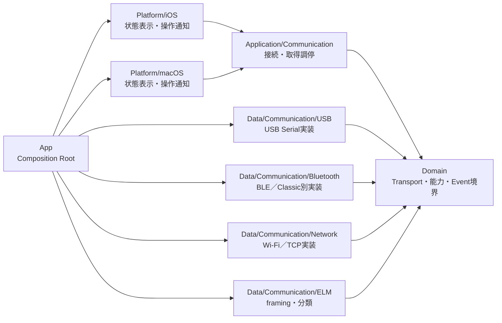
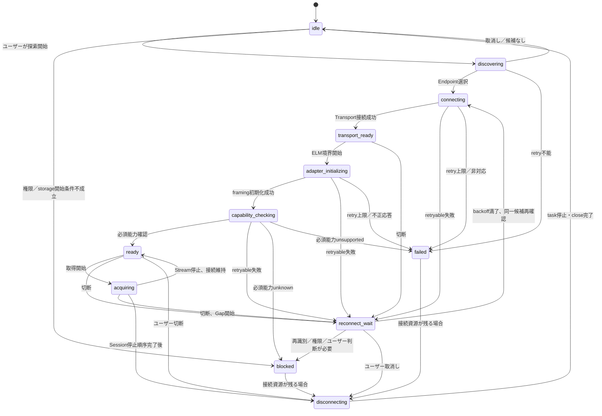
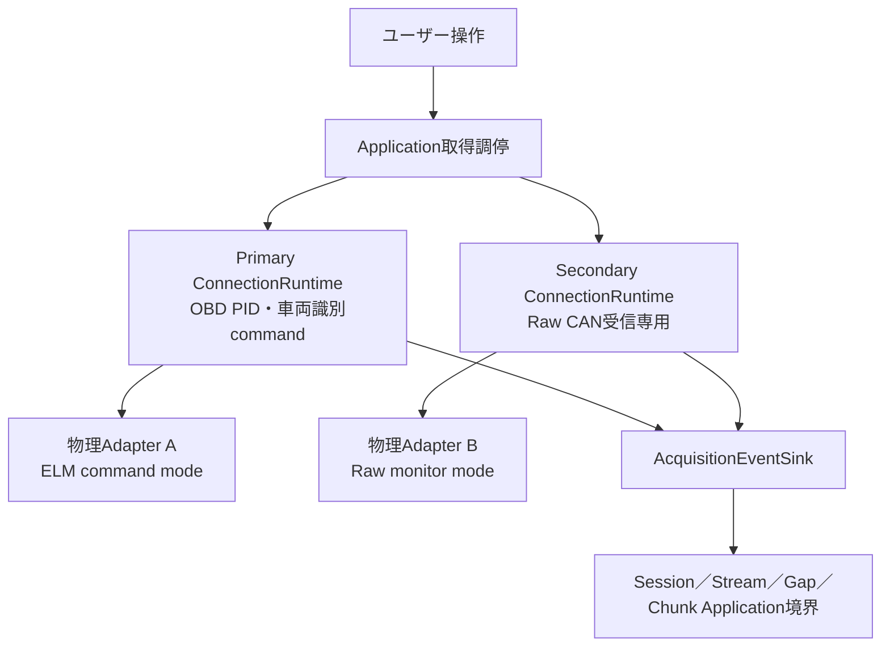
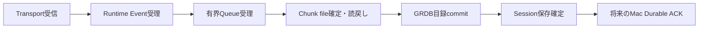

# OBD／CAN Communication Runtime Design

## 1. 目的

この文書は、macOSおよびiPhoneでOBD診断PollingとRaw CAN受信を安全に実行する通信ランタイム境界を確定します。次工程のPID取得、車両識別、車両登録、取得Session保存は、この文書の接続状態、Adapter能力、排他、Generation、受信Event契約に依存します。

本設計は通信を成功したように見せることより、次を優先します。

- 未確認のTransport、Adapter能力、ELM command、車両同一性を推測しない。
- 未知応答、Malformed応答、Raw response、parse不能なRaw CAN frameを破棄しない。
- 接続、Adapter、ユーザー、車両、取得Sessionを別のIdentityと状態軸として扱う。
- stale callback、再接続、処理遅延、容量不足、DB利用不可による誤保存を防ぐ。
- Raw CANは受信専用とし、初期APIからCAN送信、injection、診断writeを除外する。
- 通信受信、メモリ受理、Chunk確定、Durable ACKを別の完了境界として扱う。

この文書は設計だけを確定します。Apple API、entitlement、MFi、Adapter firmware、実command、実車listen-onlyの成立性は、文書根拠と実機証拠を分離して記録します。

## 2. 既存設計との責務境界

| 既存文書 | 正本である事項 | 本設計が受け持つ事項 |
|---|---|---|
| `VEHICLE_IDENTITY_DATABASE_DESIGN.md` | 車両、識別子、識別Scan、ECU観測、Raw識別応答、車両同一性 | 標準OBD識別commandを安全に運ぶ接続とEvent。登録可否、正規化、Digest、車両判定は行わない |
| `ACQUISITION_SESSION_STORAGE_DESIGN.md` | Session、Stream、Primary／Secondary役割、Clock Epoch、Gap、Chunk、保存・復旧状態 | 受信EventをApplicationへ渡すまで。GRDB、Chunk file、Sequence予約、暗号化、保存確定は行わない |
| `DEVICE_PAIRING_SYNC_CONFLICT_DESIGN.md` | iPhone／Mac間Pairing、Membership、同期、Transfer、Durable ACK、競合 | 車両Adapterとの接続だけ。Bluetooth pairingをProject 24Z Membershipとみなさず、端末間同期Transportと混同しない |

依存する既存不変条件は次です。

1. 1端末で進行中の取得Sessionは最大1件です。
2. OBD PIDはPrimary Adapter、Raw CANはSecondary Adapterを使用します。
3. 同一Session内で同じ `adapter_reference_id` を複数Streamへ割り当てません。
4. StreamのAdapter役割と参照は作成後に変更しません。
5. Raw CANは受信専用、初期対象はClassical CANです。
6. Adapter切断、Transport断、再接続中、buffer overflowはGapへ接続します。
7. `vehicle_identification_scans.obd_connection_id` と `acquisition_streams.connection_instance_id` は別名前空間であり、推測でForeign Key化しません。
8. 通信受信完了はChunk確定でもMac側Durable ACKでもありません。

### 2.1 既存設計との矛盾判定

| 論点 | 既存設計 | 本依頼で検討する選択肢 | 採用する解決 |
|---|---|---|---|
| 同じ物理AdapterのPrimary／Secondary兼用 | 同一SessionのAdapter重複を状態によらず禁止 | 安全な条件では兼用可能か | 初期版では条件なし、常に禁止。将来変更はStorage設計、schema、Migration、排他証拠を同時改訂するHard Gate |
| PID停止中のPrimaryをRaw CANへ転用 | PID停止後もPrimary予約を維持し、Rawは別Secondary | Raw開始時にPIDを停止して同じAdapterを使う可能性 | 「PID継続」または「PID一時停止」のどちらでもRawは別Secondary。既存設計を優先 |
| Session内のAdapter役割変更 | Streamの役割・参照は不変 | 役割変更を監査可能にする | 同一Session内変更は禁止。旧Session終端と新Session開始を監査境界にし、各Sessionの不変Stream行で追跡する |
| 再起動後の接続再開 | 旧Sessionは自動再開しない | 接続状態復旧 | 旧接続Generationは復元しない。旧Sessionを `recovery_required` とし、再取得は新Session、新Connection、新Generationで開始する |

既存3文書は変更しません。上表の初期版解決は既存設計と整合し、同一Adapter兼用を将来採用する場合だけ既存設計との明示的な設計変更が必要です。

## 3. 対象範囲

### 3.1 対象

- macOS USB、macOS Bluetooth、iPhone無線のTransport候補の分類と成立性Gate
- Adapter探索、Endpoint選択、接続、取消し、timeout、初期化、能力確認、切断、再接続
- ELM互換Adapterを基本境界とするcommand／response framing
- 標準OBD診断Pollingと車両識別commandを運ぶ直列command channel
- Raw CAN listen／monitorの開始、受信、停止
- Primary AdapterとSecondary Adapterの独立した接続状態と障害分離
- timestamp採取、connection generation、stale callback拒否
- 受信Eventの有界buffer、overflow診断、Gap通知
- Acquisition Session保存境界への非破壊な受渡し
- 権限、Transport非対応、Adapter能力不明、保存不可を含む安定エラー分類

### 3.2 非対象

- OBDLinkの独自高速化、独自複数CAN、独自commandを前提とする最適化
- PID式、単位、車種別PID、Decoder、対応車両の確定
- VIN／国内車台番号の正規化、車両登録、同一車両判断
- DTC消去、ECU coding、ECU書込み、actuator test、firmware更新
- CAN frame送信、injection、replay、診断write command
- CAN FD
- Macの蓋閉じ収集
- バックグラウンド継続を前提とする製品保証
- iOS／macOSのUIレイアウト
- GRDB schema、Migration、Chunk codec、同期Protocolの実装
- Swift、Xcode project、entitlementの変更

## 4. 証拠レベル

Transport、Adapter、command、backgroundの主張には、次の証拠レベルを必ず付けます。

| レベル | 意味 | 許可される表現 |
|---|---|---|
| `documented` | AppleまたはAdapter vendorの一次資料が一般的能力を記載 | 「API／製品資料上は対応」 |
| `project_verified` | Project 24Zの対象OS、署名、sandbox、対象Adapterで技術検証済み | 「Project構成で接続成立」 |
| `hardware_verified` | 対象Mac／iPhoneと実Adapterで再現可能 | 「実Adapter接続済み」 |
| `vehicle_verified` | 対象車両で安全条件を満たして検証済み | 「実車で受信確認済み」 |
| `unverified` | 根拠不足、製品・firmware・OS条件未確認 | 「技術検証待ち」 |
| `unsupported` | 一次資料または検証で対象外と確定 | 「対象外」 |

上位レベルは下位レベルを自動的に満たしません。文書、Fake test、Simulator、build、実Adapter、実車は別の証拠です。特定Adapterの販売ページにRaw CAN対応とあっても、特定command、同時実行、物理listen-only、安全な受信専用を証明しません。

## 5. Platform別Transport Matrix

| Platform | Transport | Apple側の候補境界 | 現在の根拠 | Adapter側の必要条件 | 初期判定 |
|---|---|---|---|---|---|
| macOS | USB Serial | OS提供serial deviceを安全にopenするData Adapter。system driverで不足する場合だけDriverKit／USBSerialDriverKitを別検討 | AppleはDriverKitとUSB serial向けframework、DriverKit entitlement要件を文書化 | 対象AdapterがmacOSでserial endpointとして列挙され、baud、flow control、sandbox、切断復帰が成立 | `unverified`。OBDLink EXのvendor資料はUSBとAndroid／Windowsを記載するがmacOSを記載しないため、macOS対応を断定しない |
| macOS | Bluetooth LE | Core Bluetooth central | Appleはscan、discover、connect、peripheral管理を文書化 | AdapterがBLE service／characteristic、framing、MTU、pairing方式を公開し、対象firmwareで一致 | `documented` はAPI一般能力だけ。Adapterごとは `unverified` |
| macOS | Bluetooth Classic／BR/EDR | 対象profileとApple APIの選定が必要 | Bluetooth種別の存在だけではserial profile利用を証明しない | Adapter profile、OS公開API、sandbox、pairing、同時接続数が成立 | `unverified`。BLEと同じ実装として扱わない |
| iPhone | Bluetooth LE | Core Bluetooth central | AppleはBLE peripheralの探索・接続・characteristic通信を文書化 | Adapter固有service／characteristic、write方式、notification、MTU、firmware互換 | API一般能力は `documented`。対象Adapter接続は `unverified` |
| iPhone | Bluetooth Classic／MFi | External Accessory候補 | AppleはMFi accessoryとの有線／Bluetooth通信とprotocol宣言を文書化 | 対象AdapterがMFi経路とapp protocolを提供し、vendorが第三者appを許可 | 条件未確認は `unverified`。一般的なClassic serialをBLEとして扱わない |
| iPhone | Wi-Fi／TCP | Network framework | AppleはTCP等の接続APIとLocal Network privacyを文書化 | AdapterのIP discovery、port、framing、同時接続、認証、暗号化、再接続仕様 | `unverified`。平文TCPを当然に許可しない |
| iPhone | USB | External Accessoryまたは対象iPadOS DriverKitとは別評価 | iPhoneで任意USB Serialが利用可能とは文書根拠から言えない | MFi、connector、protocol、配布entitlementを含む製品固有成立性 | 初期対象外／`unsupported` としてUI能力へ公開し、将来証拠なしに有効化しない |

### 5.1 根拠資料と限界

- Apple Core Bluetooth: <https://developer.apple.com/documentation/corebluetooth>
- Apple `CBCentralManager`: <https://developer.apple.com/documentation/corebluetooth/cbcentralmanager>
- Apple External Accessory: <https://developer.apple.com/documentation/externalaccessory>
- Apple Network framework: <https://developer.apple.com/documentation/network>
- Apple Local Network privacy: <https://developer.apple.com/documentation/technotes/tn3179-understanding-local-network-privacy>
- Apple DriverKit entitlement: <https://developer.apple.com/documentation/driverkit/requesting-entitlements-for-driverkit-development>
- Apple SerialDriverKit: <https://developer.apple.com/documentation/serialdriverkit>
- OBDLink製品比較: <https://support.obdlink.com/support/solutions/articles/43000713351-which-obdlink-adapter-is-right-for-me->
- OBDLink EX製品情報: <https://www.obdlink.com/products/obdlink-ex/>
- OBDLink CX開発者情報: <https://support.obdlink.com/support/solutions/articles/43000746707-obdlink-cx-adapter-notes>

これらは2026-07-18時点で参照した一次資料です。Apple API一般能力とProject 24Zでの成立性、vendor製品仕様とELM互換commandの正確な挙動を混同しません。OS、SDK、firmware、販売地域、MFi許可の変更時には再確認します。

### 5.2 BackgroundとLifecycle

- iOS background継続はTransport、OS Version、app状態、許可されたbackground modeに依存します。初期設計はforeground中の取得を基準とし、backgroundへ移行した場合は継続を推測しません。
- background移行、suspension、terminationを検出できた場合は対象StreamへGap開始を通知します。通知なしの終了は再起動時に推定Gapとして扱います。
- macOS sleep、process termination、USB detach、Bluetooth切断は別Eventです。蓋閉じ中の継続を初期要件にしません。
- 権限未決定のままbackgroundでLocal Network操作を開始しません。権限要求はPlatformが表示し、Application操作境界が開始を調停します。

## 6. レイヤーと依存方向

依存方向は `Platform -> Application -> Domain <- Data` です。

- DomainはFoundationで表せる値とprotocolだけを持ち、SwiftUI、SwiftData、GRDB、CoreBluetooth、ExternalAccessory、Network、IOKit、DriverKit、UIKit、AppKitをimportしません。
- Applicationは接続と取得の順序、排他、Generation、再接続判断、画面へ公開する状態を管理し、Apple frameworkと保存方式を知りません。
- DataはDomain protocolを実装し、Transport固有callback、bytes、ELM framingをDomain Eventへ変換します。DataからPlatformへ依存しません。
- Appは対象Platformとユーザー選択に応じて具象Adapterを生成します。業務判断を置きません。
- Platformは状態表示、権限案内、Transport／Endpoint／Raw開始時のPID継続または一時停止のユーザー選択をApplicationへ通知するだけです。
- Transport層はGRDB、Chunk file、SwiftData、車両Repositoryを直接操作しません。

## 7. 型と責務の分割案

実装時は必要になった型だけを1型・1ファイルで追加し、`Manager`、`Helper`、`Utils` を使用しません。

| 層 | 型／protocol案 | 単一責務 |
|---|---|---|
| Domain | `CommunicationTransport` | 一つのEndpointへ接続し、受信byte streamと切断Eventを公開する |
| Domain | `AdapterDiscovering` | 一Transport種別のEndpoint候補を探索する |
| Domain | `TransportEndpoint` | Transport上の到達先を表す。物理Adapter Identityではない |
| Domain | `AdapterReference` | 秘密情報を含まない不透明な安定参照を表す |
| Domain | `AdapterCapabilitySnapshot` | capabilityごとの `verified`／`unsupported`／`unknown`／`malformed` と根拠を表す |
| Domain | `ELMCommandChannel` | 一接続上のcommandを直列化し、command sequenceとRaw responseを対応付ける |
| Domain | `OBDAcquisitionChannel` | 許可された診断Requestを送り、型付きOBD受信Eventを返す |
| Domain | `RawCANReceiveChannel` | listen／monitor開始、受信Stream、停止だけを公開する。sendを持たない |
| Domain | `AdapterCapabilityProbing` | 初期化後に能力を検査し、推測せずSnapshotを返す |
| Domain | `ReconnectPolicy` | backoff、上限、取消し、終端判定を純粋計算する |
| Domain | `TimestampSource` | host monotonic／UTC標本と不確かさを供給する |
| Domain | `CommunicationDiagnosticEvent` | 安定分類、段階、診断ID、Generationだけを表す |
| Application | `CommunicationRuntimeModel` | ユーザー操作、接続状態、Primary／Secondaryの調停を行う |
| Application | `ConnectionRuntime` | 一つのAdapter接続Generationとtask群を所有し直列化するactor相当境界 |
| Application | `AcquisitionEventSink` | Session保存Application境界へ受信Event、Gap、Epoch変更を渡す |
| Data | `USBSerialTransport` | macOS USB serialのopen／read／write／closeを実装する |
| Data | `BLETransport` | Core Bluetooth callbackとbyte streamを橋渡しする |
| Data | `ClassicBluetoothTransport` | Classic経路が成立した場合だけ別具象として実装する |
| Data | `TCPAdapterTransport` | Network frameworkのTCP接続を実装する |
| Data | `ELMResponseFramer` | echo、改行、promptを含むbytesから応答単位を切り出す |
| Data | `ELMResponseClassifier` | 既知status、data候補、unknown、malformedを分類しRawを維持する |

`CommunicationTransport` が任意文字列commandを受け付ける設計にはしません。低水準のbyte write能力はELM Data実装の内部に閉じ、Application／Platformへ公開しません。

## 8. IdentityとCapability

### 8.1 分離するIdentity

| Identity | 寿命 | 用途 | 禁止する推測 |
|---|---|---|---|
| `user_scope_id` | 認証ユーザースコープ | DB、鍵、車両、Sessionの所有境界 | Bluetooth pairingやAdapter所持から導出しない |
| `TransportEndpoint` | discoveryから接続終了まで | BLE peripheral、serial path候補、host／port等への到達 | Endpoint表示名を物理Adapterの恒久IDにしない |
| `AdapterReference` | ユーザー領域内で安定 | 同じ物理Adapter候補の監査、不変Stream参照 | 製品名、同名、MAC、直前接続だけで同一としない |
| `connection_instance_id` | 一回の取得接続 | Acquisition Streamとの相関 | 識別Scanの `obd_connection_id` と同一視しない |
| `connection_generation` | process内の接続試行ごと | stale callback拒否 | 再起動後に復元・再利用しない |
| `session_id` | 一回の明示取得 | Stream、Gap、Chunkの親 | 再接続成功だけで別車両データを自動結合しない |
| `vehicle_id` | 登録車両 | 検証済み車両所属 | Adapter、時刻、直前Sessionから推測しない |

### 8.2 Adapter参照の発行

物理Adapter判定は次の順序で行います。

1. Transport Endpointを発見しても、まだ物理Adapter同一性を確定しません。
2. 接続後に取得できる標準的かつ許可済みのAdapter情報を、値の機密性と安定性を評価して収集します。
3. vendor ID、product ID、OS提供persistent identifier、Adapter serial、firmware identityのうち、対象Transportで利用可能かつ再ペアリング後も意味が安定するものだけを候補にします。
4. 秘密の生値を通常ログ、画面、ファイル名、`adapter_reference_id` へ埋めません。必要ならユーザースコープ別のKeyed Digestと暗号化属性をGRDBで保持します。
5. 根拠が不足する場合は新しいまたは未確認のAdapter候補として扱い、同名の既存Adapterへ自動統合しません。

永続するAdapter Identity metadataが必要になった場合、そのSystem of RecordはGRDBです。SwiftDataへミラーしません。schema、暗号化、Key Version、Migration、復旧、既存Session互換を別の実装変更で確定するまで、仮の永続IDを作りません。

### 8.3 Capability状態

各capabilityは個別に次を持ちます。

- `capability_code`: Version管理された安定コード
- `support_state`: `verified`、`unsupported`、`unknown`、`malformed`
- `evidence_kind`: `documented`、`runtime_probe`、`user_configuration`、`none`
- `observed_firmware_version`: 取得できた場合だけ
- `diagnostic_protocol_kind`: 確定できた場合だけ
- `raw_probe_response`: 通常ログではなく保存境界へ渡す非破壊Evidence
- `observed_at` と `connection_generation`

規則:

- 正常な肯定応答だけを `verified` にします。
- 明示的な非対応応答または検証済みTransport制約だけを `unsupported` にします。
- timeout、無応答、未知文言、部分応答は `unsupported` にせず `unknown` または `malformed` にします。
- firmware Version違いの過去結果を現在接続へ無条件流用しません。
- Capability check失敗時にOBD取得またはRaw受信を続けるかは、必要capability単位でApplicationが拒否します。

## 9. 接続状態機械

### 9.1 状態

`blocked` はユーザー操作、権限、車両再識別、Storage回復など外部条件が必要な非終端表示状態です。`failed` はそのGenerationで自動再試行しない終端失敗です。いずれもデータ削除や空Session作成を行いません。

### 9.2 遷移ガード

| 遷移 | 必須条件 | timeout／取消し | 失敗時 |
|---|---|---|---|
| `idle -> discovering` | TransportがPlatform能力として候補 | ユーザー取消しで`idle` | permission deniedは`blocked` |
| `discovering -> connecting` | ユーザーがEndpointを明示選択、または単一の再接続候補をIdentity根拠付きで選択 | 探索timeoutは`idle` | 候補を推測選択しない |
| `connecting -> transport_ready` | Transport handshake完了、現在Generation一致 | connect taskを取消しclose | retryableなら`reconnect_wait` |
| `transport_ready -> adapter_initializing` | byte framing利用可能 | 初期化全体deadline | timeoutはRaw保持し分類 |
| `adapter_initializing -> capability_checking` | prompt／framingが検証済み | command単位取消し | unknownを成功扱いしない |
| `capability_checking -> ready` | 要求モードに必要な能力が `verified` | probe単位deadline | unknownは`blocked`、unsupportedは`failed` |
| `ready -> acquiring` | Session／Stream／Epoch開始transaction commit済み | 開始取消しは受信前に停止 | commit前にAdapter受信を開始しない |
| `acquiring -> reconnect_wait` | 切断を現在Generationで受理 | 全command／receive task取消し | Stream Gapを直ちに開く |
| `reconnect_wait -> connecting` | retry上限内、ユーザー取消しなし、同一Adapter候補 | backoff task取消し可能 | Identity不明なら`blocked` |
| `* -> disconnecting` | 明示停止または安全停止 | stop deadline超過でも資源破棄へ進む | 未確定受信を正常化しない |

### 9.3 Generationとstale callback拒否

- `connection_generation` は接続開始ごとの単調増加するprocess-local tokenです。
- discovery、connect、read、write、timer、capability probe、reconnect taskは生成時のGenerationを捕捉します。
- callback受理時に、Connection ownerが保持する現在Generationと一致しなければ、状態更新、保存Event、再接続予約を行いません。
- 古いcallbackのRaw bytesは新Generationへ混入させません。Transport close後に到着したbytesは診断counterだけを増やし、通常ログへPayloadを出しません。
- 新Generation開始前に旧Generationを無効化し、旧taskをcancelし、command waiterを完了させ、receive streamを閉じます。
- process再起動後は新しいGeneration名前空間です。旧Generationの永続復元は行いません。

### 9.4 Timeoutと再試行上限

具体的秒数と試行回数はTransport／Adapter実測前に固定しません。Policyは次を満たします。

- discovery、connect、ELM initialization、各command、capability probe、graceful stopに別deadlineを持つ。
- exponential backoffに最大delayと最大attemptを持ち、jitterを加える。
- permission denied、unsupported transport、明示的capability unsupported、Identity不一致、ユーザー取消しは自動再試行しない。
- timeout回数はGeneration内で数え、無限再試行しない。
- ユーザー取消し後に新しい外部Eventが到着しても自動再接続しない。

## 10. ELM互換Command境界

### 10.1 直列化

- 一つの物理Adapter接続は一つの `ELMCommandChannel` が所有します。
- inflight commandは最大1件です。次commandはpromptを含む前commandの終端分類後に送ります。
- commandごとにprocess内の `command_sequence` と相関IDを割り当てます。
- responseは到着順ではなく、現在のinflight commandとframing規則により対応付けます。
- timeoutまたは取消し後の遅延responseは次commandの正常responseへ流用しません。channelをdrain／再初期化し、境界を再確立できなければ接続を失敗させます。
- 同一Adapterでcommand処理とRaw CAN monitorを並行できるとは推測しません。初期版では別Adapter制約により競合を除きます。

### 10.2 Framing

Framerはbyte streamを保持し、次を別要素として認識します。

- command echo候補
- CR、LF、CRLF等の改行
- prompt候補
- 空行
- 複数行data候補
- Adapter status行
- prompt前に切断されたpartial response
- UTF-8等へ正規化できないRaw bytes

Framerは表示用stringへ変換できないbytesを捨てません。Raw response envelopeは少なくともcommand correlation、全受信bytes、framing token範囲、開始／終了host timestamp、Generation、完了理由を保持します。

### 10.3 Response分類

| 分類 | 例示語彙 | 取扱い |
|---|---|---|
| `data_candidate` | hex様の単行／複数行 | Decoderへ候補として渡す。構文検証前に正常値としない |
| `searching_progress` | `SEARCHING`相当 | 進行表示。単独で成功でも失敗でもない |
| `no_data` | `NO DATA`相当 | 明示的な応答なし。Rawを保持し、PID値を生成しない |
| `stopped` | `STOPPED`相当 | Adapter処理中断。取消し、bus、別原因を推測しない |
| `bus_initialization` | `BUS INIT`相当 | 初期化進行／失敗の詳細を別tokenとして保持 |
| `explicit_error` | Adapterが明示する既知error | Version付き安定分類へ写像しRaw保持 |
| `unknown_status` | 既知集合外のtext | 正常値へ変換せずunknownとして保持 |
| `malformed` | 奇数hex、範囲外token、壊れたframing | parse不能位置とRawを保持 |
| `timed_out` | deadlineまで終端なし | partial Rawを保持し、遅延response境界を再確立 |
| `cancelled` | user／state cancellation | partial Rawを保持し、次commandへ流用しない |
| `disconnected` | 終端前Transport断 | partial Rawを保持し、Gap／再接続へ接続 |

文字列例は分類カテゴリであり、exact spelling、大小文字、suffix、Adapter固有文言を網羅したcommand仕様ではありません。実Adapterとfirmwareのgolden transcriptを取得するまで、対応集合を根拠なく広げません。

### 10.4 Command許可境界

- 「送信」は次の3境界へ分離します。

  | 境界 | 内容 | Raw CAN receive-onlyでの扱い |
  |---|---|---|
  | Host／AppからAdapter | Adapter初期化、状態確認、monitor開始／停止等の制御command | HG-04／HG-05で実証し、Version付きallowlistに固定した最小commandだけ許可 |
  | AdapterからHost | command response、status、Raw CAN受信bytes／Event | 非破壊で受信し、unknown／malformedを推測変換しない |
  | Adapterから車両CAN bus | CAN frame、診断request、injection、replay、write | Secondary Raw CAN channelでは禁止。Primaryの許可済み標準OBD診断requestとは別境界 |

- Applicationは任意文字列ではなく、Version付きの型付きRequestを渡します。
- Dataは承認済みの型付きRequestからだけ、対象Adapter model／firmware／modeに一致するVersion付きallowlist済みcommand bytesを生成します。Application／Platformはallowlistやbytesを直接指定できません。
- exact command bytesはHG-04／HG-05完了まで未確定です。初期化、Capability probe、Raw monitor開始／停止、状態確認に必要なHost-to-Adapter制御commandは、実transcriptと安全性の両Gate通過後に最小allowlistへ固定します。
- DTC消去、ECU reset、ECU write／coding、CAN frame送信、injection、replayは公開Request型とSecondary用allowlistに含めず、常に禁止します。
- Adapter自身の初期化resetはECU resetと別の型です。対象Adapterの実transcript上で必須であり、HG-04／HG-05を通過した場合に限り、ユーザー操作ではない内部の型付きAdapter初期化Requestとしてallowlistへ追加できます。
- 初期版でAdapter初期化resetをallowlistへ採用しない場合、そのresetを必須とするAdapter／firmware／modeは `unsupported` または安全性確認待ちの `blocked` とし、別commandへFallbackしません。
- 任意AT／ST commandは、同じbytesがallowlistに存在する場合でも任意文字列としては公開しません。型付き用途、Adapter model、firmware、mode、allowlist Versionの組が一致する場合だけData内部で生成します。
- 未知commandを受信側が生成したり、UI入力を文字列連結して送信したりしません。
- safetyが未検証ならRaw monitor開始command自体を生成・送信せず、`raw_receive_safety_unverified` でblockします。
- exact command集合、順序、改行、response、timeout、停止失敗時の挙動は対象Adapter transcriptのHard GateでVersion固定します。

## 11. Primary／Secondary Adapter

### 11.1 役割

- PrimaryはOBD PID Pollingと車両識別commandだけを担当します。
- SecondaryはRaw CAN listen／monitorと受信だけを担当します。
- PrimaryとSecondaryは別の `ConnectionRuntime`、Generation、state、retry counter、diagnostic IDを持ちます。
- Secondary障害はPrimaryの接続状態、既に受理・確定したPID Event、車両識別結果を巻き戻しません。
- 保存pipelineが安全に片方だけ継続できない障害では、Storage設計に従いSession全体を停止します。これは通信障害分離と保存整合性を混同しないためです。

### 11.2 Raw開始時のPID選択

ApplicationはRaw CAN開始前に次の選択を要求します。

1. PrimaryのPIDを継続し、別SecondaryでRaw CANを開始する。
2. PrimaryのPIDを `pause_requested -> paused` として確定し、`user_paused` Gapを開き、別SecondaryでRaw CANを開始する。

どちらも同じ物理Adapterを使用しません。Primaryがpausedでも予約は維持します。Raw停止後はSecondaryを停止してから、ユーザー選択によりPrimaryを再開します。

### 11.3 排他と役割変更

- Endpoint discovery時、既存AdapterReferenceとの同一性が確定した候補は別役割へ選択できません。
- 同一性がunknownなら「別Adapter」と推測せず選択をblockします。
- 同名機器、再ペアリング、Endpoint address変更でもIdentity根拠を再評価します。
- Session内のAdapterReference、役割、Connection Instanceは不変です。
- Adapter交換または役割変更は現Sessionを要確認で終端し、新Sessionで新しい不変割当を作ります。
- 将来同一Adapterのmode切替を採用する場合、同時実行ではなく厳密な排他でも、既存Storage schemaのUnique制約と不変Stream設計に反します。設計・Migration・履歴・Gap意味・実Adapter証拠を一変更単位で改訂するまで実装しません。

## 12. Raw CAN受信専用境界

### 12.1 API拘束

`RawCANReceiveChannel` の公開操作は次だけです。

- `startListening(configuration:)`
- receive-only asynchronous event stream
- `stopListening()`

公開protocolに `send`、`writeFrame`、`inject`、`replay`、任意command文字列を置きません。内部ELM commandの許可集合にも、monitor開始／停止に必要と実証されたcommand以外を入れません。

ここで公開APIから除外する `send` は、Secondary Adapterから車両CAN busへ任意frameを送る能力です。HostからAdapterへmonitor開始／停止、必要な初期化、状態確認を指示する制御commandまで禁止する意味ではありません。これらの制御commandは次の全条件を満たす場合だけData内部から送れます。

1. HG-04とHG-05が対象Adapter model／firmware／modeについて完了している。
2. 型付きRequestとVersion付きallowlist entryが一対一で対応する。
3. command bytes、順序、期待response、timeout、停止失敗時の挙動がgolden transcriptで固定されている。
4. commandがSecondaryから車両busへのCAN frame送信、injection、replay、診断writeを可能にしないことが確認されている。

safetyが `unknown` の間は `startListening` を呼び出してもHost-to-Adapter monitor開始commandを一切送らず、`raw_receive_safety_unverified` でblockします。stop timeoutまたは切断時はallowlist外commandや任意resetへFallbackせず、Generationを無効化してTransport closeと安全停止へ進みます。

### 12.2 Listen-only保証の区別

| 保証レベル | 意味 | 初期表示 |
|---|---|---|
| `hardware_listen_only_verified` | Adapter／transceiverが物理的に送信不能またはlisten-onlyを保証し、対象firmware・busで実証済み | 実車Hard Gate通過時だけ使用 |
| `adapter_mode_verified` | Adapterの受信mode仕様上は送信しないが、物理層保証まではない | 「Adapter mode受信専用」 |
| `software_receive_only` | Project 24ZのSecondary公開APIが車両bus向けsend／inject／replay／診断writeを提供せず、Host-to-Adapter制御commandもallowlistへ限定されている | 「Appは車両busへframeを送る操作を提供しない」 |
| `unknown` | 制御command、firmware、Adapter mode、車両bus動作の安全性が未確認 | monitor開始command自体を送らずRaw CAN開始をblock |

Host-to-Adapter制御commandの存在を、車両busへのframe送信能力と同一視しません。一方、software上send APIがないことやallowlist限定を、車両bus上の物理listen-only保証とも表現しません。`software_receive_only`、`adapter_mode_verified`、`hardware_listen_only_verified` は別々の証拠を要求し、実車での保証は電気的・protocol的計測を伴うHard Gateです。

### 12.3 受信Event

各Raw CAN受信Eventは、取得できる範囲で次を持ちます。

- `can_identifier` と `identifier_format`: 11-bit／29-bit／unknown
- `dlc`
- `payload_length` とRaw payload bytes
- `adapter_timestamp` とその単位／clock identity。提供されない場合はabsence
- `host_monotonic_timestamp`
- `host_utc_timestamp`
- `timestamp_source` と不確かさ
- `bus_channel`、`bit_rate`、remote／error flag等。Adapterが確実に提供する場合だけ
- `connection_generation`
- parse状態: `parsed`、`partial`、`malformed`、`unknown_format`
- 元のRaw line／bytes

初期Storage formatはClassical CANの11／29bit、DLC 0...8、payload 0...8 byteを正規Eventとして受け取ります。範囲外、補助metadata未知、parse不能は捨てず、unknown／malformed evidence Eventとして保存境界へ渡します。CAN FDらしき入力をClassical CANへ切り詰めません。

## 13. Concurrency、Actor、Backpressure

### 13.1 所有境界

- 一Connectionにつき一つの `ConnectionRuntime` actorまたは同等の直列Executorが、state、Generation、Transport、ELM channel、task、retryを所有します。
- Application全体の調停境界がPrimary／SecondaryのAdapter重複、Session開始、全体停止順序を所有します。
- ELM command channelは一つのserial executorでinflight commandを1件にします。
- Raw receive channelは同じ物理Connectionのcommand channelと併存しません。
- Storage consumerはTransport actorの外に置き、DB transaction中にTransport応答を待ちません。

### 13.2 有界Buffer

Transport EventからStorage sinkまでのqueueは有界です。具体的容量は実測Hard Gateですが、動作は先に固定します。

| 状態 | 動作 |
|---|---|
| 通常 | Eventを順序付きでenqueueし、consumerがChunk pipelineへ渡す |
| 高水位 | backpressure warningを非機密診断として通知する |
| 満杯 | 無期限にTransport callbackをblockしない。drop範囲または件数不明を明示し、Gap開始を通知する |
| 回復 | 連続受理を確認してGap終了を通知する。dropを正常化しない |
| consumer失敗 | 新規受信を停止し、全Streamの安全停止へ進む |

drop policyの具体的な「新しいEventを落とす／Transport側flow controlを使う」はTransport別実測で決めます。いずれもdrop counter、最終受理境界、次回受理境界を残し、ゼロ値や合成frameで埋めません。

### 13.3 Task停止順序

Session終了、取消し、再接続、storage criticalでは次の順序を守ります。

1. 現在Generationを新規受理不可にし、状態を停止要求へ進めます。
2. 新しいcommand送信とRaw monitor開始を禁止します。
3. Transport固有の受信停止を要求します。
4. receive task、command waiter、timeout、reconnect taskをcancelします。
5. 既に受理したEvent queueをStorage契約に従ってdrainまたは未確定Gapとして閉じます。
6. Chunk確定結果を待つのはApplication／Storage境界であり、DB transactionを開いたまま待ちません。
7. Stream／Session終端transactionが完了した後にTransportをcloseします。緊急切断ではcloseを先行し、正常終了へ昇格しません。
8. actor内のtask参照とsecret bufferを解放します。

stale GenerationからのEventは手順5のqueueへ入れず、保存を禁止します。

## 14. Session／保存設計への受渡し

### 14.1 受渡し契約

| Runtime Event | Storage側への意味 |
|---|---|
| 接続後の最初の正常受信 | 対象StreamのGap終了候補 |
| Adapter／Transport切断 | `adapter_disconnected` またはTransport別Gap開始 |
| reconnect開始／終了 | `reconnecting` Gapの状態境界 |
| buffer overflow | missing count／範囲付きGap。件数不明を0としない |
| timestamp基準変更 | 新しいClock Epochを要求し、旧Epochと単調時刻比較をしない |
| Adapter再接続 | 新Connection Generation。timestamp／protocol再初期化なら新EpochまたはGap |
| ELM protocol再初期化 | 影響範囲をGapで分離し、前後responseを同一commandへ結合しない |
| OBD Request／Response／Completion | correlation付きPID record候補。Raw request／responseを保持 |
| Raw CAN Event | Classical CAN record候補またはunknown／malformed evidence |
| storage unavailable／critical | 新規受信を停止し、Session全体の非破壊停止へ進む |

### 14.2 完了境界

左の成功は右の成功を意味しません。RuntimeはTransport受信またはEvent受理を「保存済み」と報告しません。Durable ACKは既存同期設計がMac側永続保存を確認した結果であり、Runtimeの責務外です。

### 14.3 車両所属

- Session開始時に未登録または識別中でも、既存Storage設計どおり `vehicle_id = NULL` で保存可能です。
- 車両識別結果が有効で登録済み車両と確定した場合だけ、保存確定前の許可された境界で `registered_confirmed` へ進めます。
- 再接続後に車両が同じか不明なら、旧 `vehicle_id` をRuntimeが継承・変更しません。Applicationへ `vehicle_reidentification_required` を返します。
- 不一致なら現在Sessionを要確認で終端し、別車両の登録／新Sessionへ進みます。過去Sessionを付け替えません。

### 14.4 非破壊停止

DB open不可、Migration未知、Keychain不可、容量不足、Chunk確定失敗では次を行います。

1. 新規受信とcommand送信を停止します。
2. 受理済み範囲と未確定範囲を分離し、Gap／findingへ接続します。
3. 既存DB、Chunk、Raw evidence、Sessionを削除しません。
4. 空DB、SwiftData、別ユーザー領域、新Sessionへ黙ってFallbackしません。
5. 回復後に同じデータを再検証できる状態を残します。

## 15. 再接続と車両境界

### 15.1 再接続手順

1. 現在Generationを無効化し、対象Streamへ切断Gapを開きます。
2. inflight commandを `disconnected` としてRaw partial response付きで終端します。
3. Adapter roleごとのretry counterでexponential backoffを計算します。
4. ユーザー取消し、権限拒否、unsupported、Identity不一致なら再試行しません。
5. discovery結果から同じ物理Adapterである根拠を検証します。同名、同時刻、最も強いRSSIだけで選びません。
6. Transport、ELM初期化、Capabilityを新Generationで再実行します。
7. protocol、timestamp source、Adapter identity evidenceが変わった場合は新Clock Epochまたは新Gapを要求します。
8. OBD車両識別が利用可能なら再識別し、同一性が確定するまでPID／Raw Eventを旧車両へ結合しません。
9. 同じ車両と確定し、既存Session継続がStorage契約上許可される場合だけGapを閉じて同じStreamへ再開します。
10. 別車両または不一致なら旧Sessionを要確認で終端し、新しい登録／Session境界へ進めます。

### 15.2 自動結合を禁止する根拠

次は車両同一性の根拠ではありません。

- Adapter名、AdapterReference、Bluetooth pairing
- 接続時刻、直前Session、同じMac／iPhone
- 同じTransport Endpoint、同じWi-Fi IP、同じUSB path
- 同じECU数、CAN ID、PID値、表示名
- ユーザーが車を変えていないという暗黙仮定

車両同一性はVehicle Identity設計が認める標準OBD識別子と検証規則に従います。Runtimeは判断しません。

## 16. エラー分類と診断

| エラーコード | 段階 | Retry | 状態 | データ動作 |
|---|---|---|---|---|
| `permission_denied` | discovery／connect | 自動なし | `blocked` | 既存データ変更なし |
| `unsupported_transport` | discovery | なし | `failed` | 別Transportへ自動Fallbackしない |
| `adapter_unavailable` | discovery／connect | 上限内 | `reconnect_wait` | Gapを保持 |
| `endpoint_identity_mismatch` | reconnect | なし | `blocked` | 別Adapterへ接続しない |
| `initialization_failed` | adapter initialization | 条件付き | `reconnect_wait`／`failed` | Raw partial response保持 |
| `command_timeout` | command | policy内 | current command失敗 | 遅延responseを次へ流用しない |
| `malformed_response` | framing／classification | 原則なし | `blocked`／command失敗 | Rawとparse位置保持 |
| `unknown_response` | classification | なし | command失敗 | 正常値へ変換しない |
| `capability_unknown` | capability check | user／firmware確認後 | `blocked` | unsupportedと断定しない |
| `capability_unsupported` | capability check | なし | `failed` | 対象modeを開始しない |
| `disconnected` | any connected state | 上限内 | `reconnect_wait` | Gap開始、partial保持 |
| `buffer_capacity_exceeded` | receive | 継続可否を評価 | `acquiring`／安全停止 | dropをGapとして記録 |
| `storage_unavailable` | start／receive | 回復後 | `blocked` | DB／Chunk削除なし |
| `storage_capacity_insufficient` | start／receive | 回復後 | `blocked`／安全停止 | 古いデータ自動削除なし |
| `vehicle_reidentification_required` | reconnect | ユーザー／識別後 | `blocked` | 旧車両へ結合しない |
| `stale_generation_event` | callback | なし | 状態変更なし | 保存せずcounterのみ |
| `raw_receive_safety_unverified` | Raw開始 | なし | `blocked` | monitor commandを送らない |

診断記録に含めるのは、ランダムなdiagnostic ID、安定エラーコード、段階、role、Transport kind、Generation、retry回数、時刻です。通常ログへVIN、車台番号、ユーザーID、Adapter serial／MAC、Endpoint address、Raw response、CAN payload、PID payload、暗号文、鍵、任意commandを出しません。Raw evidenceは通常ログではなく、既存の暗号化保存／隔離境界へ渡します。

## 17. セキュリティと安全

- discovery結果はユーザー選択とIdentity検証を経て接続します。表示名だけで自動選択しません。
- Wi-Fi／TCPを採用する場合、平文接続を初期既定にしません。AdapterがTLSや認証を提供しない場合は、車載Adapterとの短距離専用network、Endpoint pinning相当、機密性、改ざん、同一network攻撃を脅威分析し、承認されるまでHard Gateです。
- Bluetooth pairingはTransport accessの一要素であり、Project 24ZユーザーMembership、車両所有、Adapter真正性の証明ではありません。
- 任意文字列からELM commandを生成せず、型付きの閉じたRequest集合を使います。
- UI入力をcommand、CAN ID、payloadへ直接連結しません。
- Raw CAN公開APIは車両bus向け受信専用です。SecondaryからのCAN frame送信、injection、replay、診断writeを型とnegative testで禁止します。
- Host-to-Adapterのmonitor開始／停止、必要な初期化、状態確認は、HG-04／HG-05通過後のAdapter model／firmware／mode別Version付きallowlistに限定し、Data内部だけが型付きRequestからbytesを生成します。
- DTC消去、ECU reset、ECU write／codingと、HG-04／HG-05通過後に許可し得るAdapter自身の内部初期化resetを別の型にし、相互変換しません。
- Adapterの物理listen-only、Adapter mode仕様上の受信専用、App APIのsend不在、制御command allowlistを別の証拠として表示します。
- Primaryが標準OBD診断requestを車両busへ送ることは、Secondary Raw CAN channelのreceive-only保証を弱めたり証明したりしません。物理Adapterも接続も分離します。
- 同一Adapterのcommand／monitor並行動作を想定しません。
- 権限拒否時に別Transportへ自動Fallbackしません。ユーザーが明示選択します。

## 18. Migrationと再起動復旧

### 18.1 現設計で新規永続schemaを追加しない範囲

Connection state、Generation、inflight command、retry timer、Transport callbackはprocess-localです。これらをそのままDBへ永続化しません。既存Session設計の次の情報から安全に復旧します。

- 進行中だったSession／Streamは `recovery_required`／`interrupted` へ進める。
- 開放Gapを推定境界で閉じる。
- Clock Epochは新processで新規作成する。
- Streamの不変 `adapter_role`、`adapter_reference_id`、`connection_instance_id` は監査情報として保持する。
- 旧Connectionを自動再開せず、新取得は新Session、新Connection、新Generationにする。

### 18.2 新規metadataが必要になる条件

永続Adapter Identity、capability履歴、firmware履歴、役割変更監査をSession境界を越えて検索する要件が承認された場合、GRDBをSystem of Recordとして設計します。

- SwiftDataへ同じ正本を作りません。
- 既存 `adapter_reference_id` の意味、発行主体、暗号化、Keyed Digest、再ペアリング統合規則を先に固定します。
- Migrationは追記式とし、既存Sessionを名前やEndpointからbackfillしません。不明はunknownのまま保持します。
- リリース済みMigrationを書き換えず、transaction失敗時はrollbackします。
- 旧binaryが未知schemaを開く場合は利用不可にし、空DBへFallbackしません。
- DB、Chunk、必要Key Versionを組として復旧し、元データを先に置換しません。

## 19. 必須テスト

### 19.1 Domain／Application／Data Fake test

| ID | テスト | 必須検証 |
|---|---|---|
| RT-01 | Transport別Fake状態遷移 | USB、BLE、Classic、TCPを同一能力とせず、各Eventから許可遷移だけ進む |
| RT-02 | Generation拒否 | reconnect後の旧connect／read／timer callbackがstate、queue、保存へ影響しない |
| RT-03 | command直列化 | inflight最大1、sequenceとresponseが一致し、複数行を一応答として保持 |
| RT-04 | timeout後の遅延response | 次commandのresponseへ誤対応せず、drain失敗時はchannelを再初期化／失敗 |
| RT-05 | cancellation | user stop後に自動reconnectせず、waiterとtaskが終了する |
| RT-06 | unknown／malformed保持 | Raw bytes、partial framing、分類が残り、正常値を生成しない |
| RT-07 | 既知status分類 | echo、prompt、改行、SEARCHING／NO DATA／STOPPED／BUS INIT相当をRaw付きで分類 |
| RT-08 | Primary独立障害 | Primary失敗がSecondaryの確定済みEventを破壊しない |
| RT-09 | Secondary独立障害 | Secondary失敗がPrimaryの確定済みPID／識別結果を破壊しない |
| RT-10 | 同一Adapter排他 | 同じAdapterReferenceとIdentity unknown候補を両役割へ割り当てられない |
| RT-11 | PID継続選択 | 別Secondary開始後もPrimaryがactiveである |
| RT-12 | PID一時停止選択 | Primary予約を維持しGapを開き、別SecondaryだけがRaw受信する |
| RT-13 | Session内役割変更拒否 | Adapter交換／役割変更は現Session終端なしに行えない |
| RT-14 | Raw send API不在 | SecondaryのDomain公開surfaceに車両bus向けsend／inject／replay／診断write／arbitrary commandが存在しない |
| RT-15 | Raw monitor allowlist許可 | safety検証済みの型付き開始／停止Requestから、対象model／firmware／mode／Versionに一致するallowlist commandだけを送れる |
| RT-16 | Raw frame境界 | 11／29bit、DLC、0...8 byteを保持し、範囲外を切詰めない |
| RT-17 | Adapter timestamp | host／adapter／estimateを区別し、欠落時に捏造しない |
| RT-18 | buffer overflow | drop count／unknown countがGapになり、正常扱いされない |
| RT-19 | Storage unavailable | Adapter開始前または取得中に非破壊停止し、空DB／新SessionへFallbackしない |
| RT-20 | capacity insufficient | 古いSession／Chunkを削除せず停止する |
| RT-21 | reconnect backoff | exponential、上限、jitter、retry不能分類、取消しを守る |
| RT-22 | Adapter再検出 | 同名、Endpoint変更、別Identity、unknownを自動統合しない |
| RT-23 | 車両再識別 | 時刻、Adapter、直前Sessionだけで旧vehicleへ結合しない |
| RT-24 | 別車両検出 | 旧Sessionを要確認で終端し、新Session境界を要求する |
| RT-25 | 再起動復旧 | 旧Generationを復元せず、旧Session／Gap／Epochを既存設計どおり復旧する |
| RT-26 | DB transaction非保持 | Transport／Keychain／大容量file待機中にDB transactionを開かない |
| RT-27 | 診断privacy | VIN、Adapter秘密ID、Endpoint、Raw payloadが通常ログへ出ない |
| RT-28 | Capability四状態 | verified、unsupported、unknown、malformedを相互に昇格・混同しない |
| RT-29 | allowlist外command拒否 | allowlist外のAdapter commandと任意AT／ST文字列をApplication／Platform／Dataの公開境界から生成できない |
| RT-30 | Secondary bus送信拒否 | CAN frame送信、inject、replay、任意CAN ID／payload、DTC消去、ECU reset、ECU write／codingを生成できない |
| RT-31 | reset型分離 | Adapter初期化resetとECU resetを同じRequest、変換、allowlist entryとして扱えない |
| RT-32 | safety未検証 | `unknown` またはHG-04／HG-05未完了ではmonitor開始commandを一切送らず `raw_receive_safety_unverified` になる |
| RT-33 | stop timeout安全停止 | stop timeout／partial response／切断時に任意commandやresetへFallbackせず、Generationを無効化して安全停止する |
| RT-34 | Primary／Secondary bus境界 | Primaryの型付き標準OBD診断request送信を許可しても、Secondaryの車両bus向けsend API／commandが追加されない |

### 19.2 Fixture／Transcript test

- Adapter／firmware Versionごとの初期化transcriptを暗号化または秘密情報除去済みfixtureで固定します。
- echo on／off、prompt分割、CR／LF差、複数行、遅延行、partial disconnect、非UTF-8、最大応答を含めます。
- exact command bytesと期待分類をVersion付きgolden testにします。
- 未知fixtureを既知値へ変換しない回帰testを追加します。
- Raw CANの正常transcriptには、対象Adapter model／firmware／mode／allowlist Versionで許可したmonitor開始、停止、必要な初期化、状態確認のHost-to-Adapter制御commandだけが、固定順序で含まれることを検証します。
- monitor開始／停止commandごとに期待response、timeout、partial response、停止失敗、切断をVersion付きgolden transcriptで検証します。
- CAN frame送信、inject、replay、任意CAN ID／payload、DTC消去、ECU reset、ECU write／coding、任意AT／ST commandを生成するtranscriptが構成できないnegative testを追加します。
- Adapter初期化resetを採用するVersionでは、ECU resetと異なる内部型であること、allowlist済み初期化sequence以外から生成できないことを検証します。採用しないVersionでは、それを必須とするAdapterが `unsupported`／`blocked` になることを検証します。
- Fake／fixtureでHost-to-Adapter制御commandを確認できても、Adapterから車両busへのframe送信がないこと、Adapter mode仕様上の受信専用、hardware listen-onlyのいずれも証明しません。

### 19.3 実機検証との分離

Fake／fixture testは、Apple entitlement、sandbox、USB driver、MFi、BLE service、Wi-Fi、Adapter firmware、実車listen-onlyを証明しません。次の証拠を別々に記録します。

- App／DomainのSecondary公開APIに車両bus向けsendが存在しないことを示すsource／API test
- Host-to-Adapter制御commandがmodel／firmware／mode／Version別allowlistだけに限定されることを示すfixture／negative test
- Adapter仕様と実transcriptが対象modeを受信専用と定義する証拠
- 車両bus上の実測でSecondary AdapterからCAN frameが送信されない証拠
- 対象Mac＋USB Adapter
- 対象Mac＋Bluetooth Adapter
- 対象iPhone＋BLE Adapter
- 対象iPhone＋Classic／MFi Adapter候補
- 対象iPhone＋Wi-Fi Adapter候補
- 実ELM command transcript
- 実車Raw CAN受信と物理listen-only検証
- foreground／background／sleep／termination

## 20. 実装開始Hard Gate

| Gate | 必要な証拠 | 未達時 |
|---|---|---|
| HG-01 macOS USB | 対象Adapterが列挙、open、双方向byte通信、detach、再接続し、sandbox／署名／driver方針が成立 | USB実装を開始しない |
| HG-02 macOS Bluetooth | BLE／Classicを特定し、Apple API、profile、pairing、entitlement、対象Adapterが成立 | 対象方式を有効化しない |
| HG-03 iPhone無線 | BLE／Classic-MFi／Wi-FiのどれかをAdapter単位で確定し、APIと権限が成立 | 「無線対応」と一括表示しない |
| HG-04 Adapter command | model／firmware／mode別の実transcriptで、型付きRequest、exact Host-to-Adapter command bytes、順序、response、framing、timeout、cancel、必要能力、Adapter初期化reset採否をVersion付きallowlistへ固定 | exact command実装を開始せず、任意commandへFallbackしない |
| HG-05 Raw受信専用 | App APIにSecondary車両bus向けsendがない証拠、Adapter制御commandがHG-04のallowlist限定である証拠、Adapter mode仕様上の受信専用証拠、車両bus実測でSecondaryからCAN frame送信がない証拠を別々に取得し、保証レベルを確定 | monitor開始command自体を送らず `raw_receive_safety_unverified` でblock |
| HG-06 Background／Lifecycle | iOS background、macOS sleep、権限、復帰Eventを対象OS／署名で検証 | foreground限定、蓋閉じ対象外を維持 |
| HG-07 Identity | AdapterReference発行と同一性、同名、交換、再ペアリング規則を承認 | 自動再接続をIdentity確認でblock |
| HG-08 Backpressure | Transport別rate、queue上限、Chunk throughput、drop検出を測定 | buffer定数を推測実装しない |
| HG-09 車両再識別 | 再接続時の識別commandとVehicle Identity Application契約を承認 | 旧Sessionへの自動結合を禁止 |
| HG-10 Entitlement／配布 | Developer signing、App Sandbox、Local Network、Bluetooth、DriverKit／MFi該当条件を配布構成で検証 | 開発機だけの成功を製品対応としない |

全Gateは文書レビュー、Fake test、Simulator、buildだけでは完了しません。GateごとにOS Version、device、Adapter model、firmware、接続方式、車両条件、日時、再現手順、結果を記録します。

## 21. 未決事項

1. macOSでOBDLink EXまたは対象USB Adapterを利用する正確なdriver／serial API、App Sandbox、配布entitlement。
2. macOS Bluetoothで採用するBLEまたはClassic profileと対象Adapter。
3. iPhoneの初期採用Adapterと、BLE／Classic-MFi／Wi-Fiの選択。
4. ELM互換Adapterごとの初期化command、Adapter自身の初期化reset要否と採否、echo、改行、prompt、最大応答、timeout。ECU resetは常に禁止し、この未決事項へ含めません。
5. Capability probeの最小command集合とfirmware互換表。
6. Raw CAN monitorのHost-to-Adapter開始／停止／必要初期化／状態確認command、Version付きallowlist、停止失敗手順、Adapter mode保証、車両bus上の無送信実測、物理listen-only検証方法。
7. Adapter内部buffering、timestamp精度、bus／channel metadata、remote／error frameの表現。
8. Transport別のqueue容量、高水位、drop policy、reconnect秒数、retry上限。
9. AdapterReferenceの発行主体、暗号化／Digest、再ペアリング後の統合、Adapter交換UI。
10. 再接続時に車両再識別を開始する条件と、識別不能時にSessionを継続できる製品要件。
11. PID Polling scheduler、PID集合、周期、ECU応答完了、Decoder。これは次工程です。
12. Wi-Fi Adapterが平文TCPだけを提供する場合の採否とTrust境界。
13. iOS background継続を製品要件にするか。初期版はforeground基準です。
14. 永続Adapter capability履歴が必要か。必要ならGRDB schemaとMigrationを別設計します。

## 22. 設計上の確定事項

- Platformごと、Transportごとに具象Data Adapterを分けます。
- Applicationは一接続ごとの直列化境界とGenerationでstale callbackを拒否します。
- ELM commandは直列化し、Raw responseを非破壊保持します。
- PrimaryはOBD、SecondaryはRaw CANで、初期版では必ず別の物理Adapterです。
- Raw CANはSecondaryから車両busへのCAN frame送信、injection、replay、診断writeを公開しないreceive-only APIで拘束します。
- Host-to-Adapter制御commandはHG-04／HG-05通過後のmodel／firmware／mode別Version付きallowlistに限定し、Application／Platformへbytesや任意文字列を公開しません。
- Adapter初期化resetとECU resetを型で分離し、ECU resetは常に禁止します。採用しないAdapter初期化resetを必須とするAdapterは `unsupported`／`blocked` にします。
- App APIのsend不在、制御command allowlist、Adapter mode受信専用、車両bus実測、物理listen-onlyを別の保証として表示します。
- overflow、切断、再接続、timestamp変更はGap／Clock Epochへ接続します。
- Transport受信とChunk確定、Session保存、Durable ACKを混同しません。
- 再接続先の車両同一性をAdapterや時刻から推測しません。
- DB、容量、Version、破損、鍵の異常で既存データを削除しません。
- Apple API、vendor資料、Fake、build、実Adapter、実車の証拠を分離し、Hard Gate未達を実装可能と報告しません。
