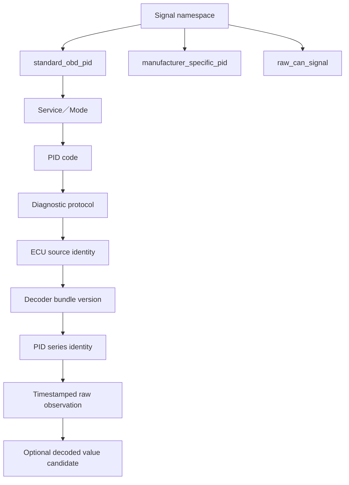
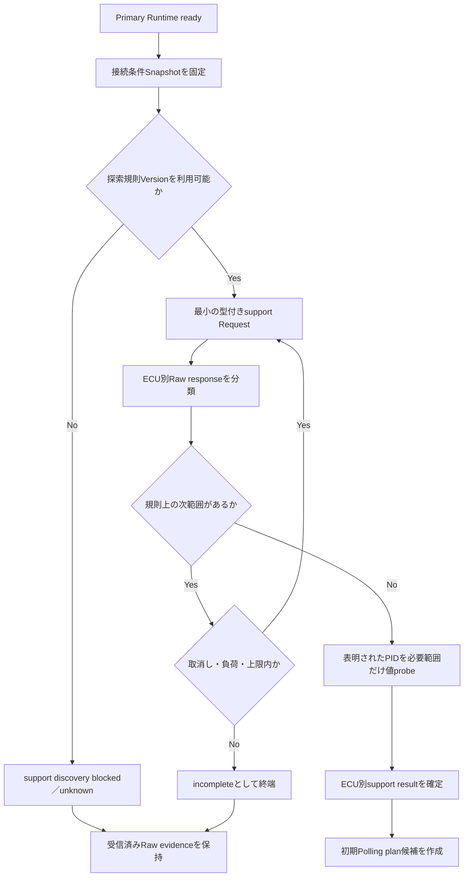
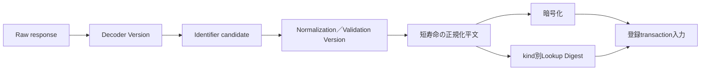
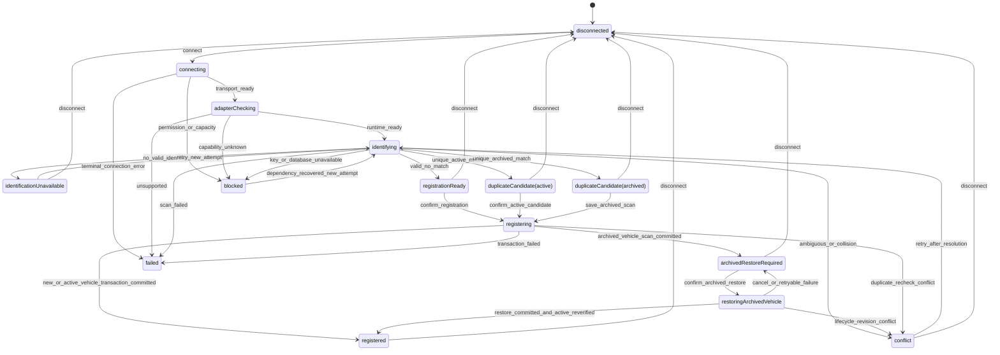
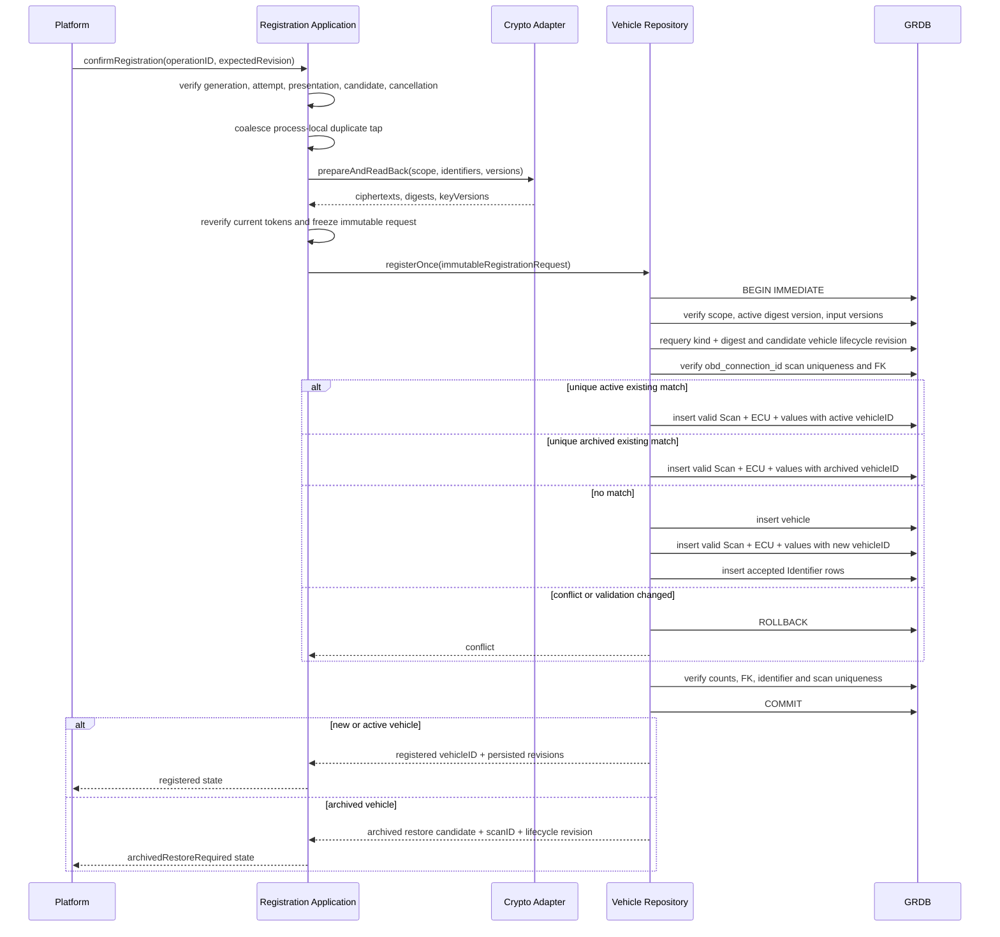
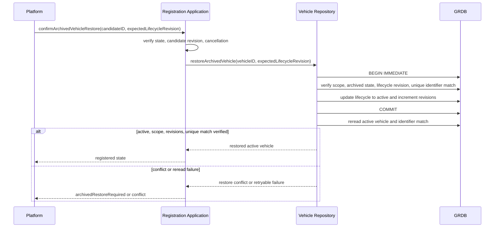
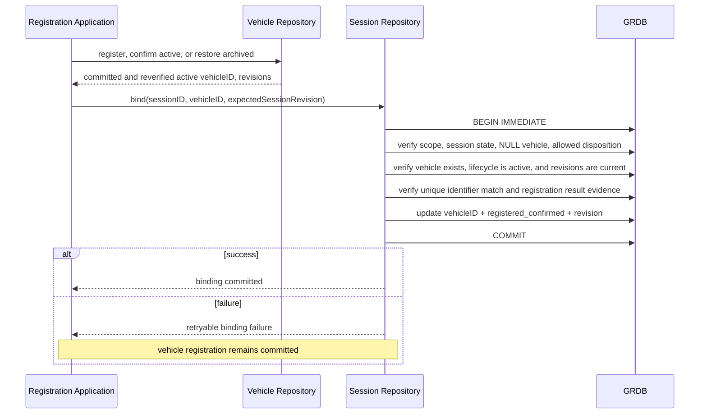

# PID Acquisition, Vehicle Identification, and Registration Flow Design

## 1. 目的と適用範囲

この文書は、Primary Adapterの通信Runtimeが `ready` になった後から、標準PID対応探索、適応Polling、車両識別Scan、既存車両照合、新規登録、Acquisition Sessionへの車両所属確定までのDomain／Applicationフローを定義します。次工程でiOS／macOSの車両登録画面を別々に実装するために必要な、共有Application State、表示専用値、Action境界も確定します。

本設計は次の既存文書を正本として参照し、内容を複製または上書きしません。

| 既存文書 | 正本である事項 | 本設計が追加する事項 |
|---|---|---|
| `VEHICLE_IDENTITY_DATABASE_DESIGN.md` | 車両、識別子、Scan、ECU Observation、識別値、暗号化、Digest、登録transaction | Runtimeから終端Scanを作り、照合・登録へ進むApplication順序 |
| `ACQUISITION_SESSION_STORAGE_DESIGN.md` | Session、PID／Raw CAN Stream、Chunk、Gap、保存、`vehicle_binding_state` | 識別前取得と、登録後にSession所属を一度だけ確定する順序 |
| `DEVICE_PAIRING_SYNC_CONFLICT_DESIGN.md` | 端末間Alias、同期Conflict、Origin履歴 | ローカル登録結果を同期可能な既存業務Entityへ渡す境界 |
| `OBD_CAN_COMMUNICATION_RUNTIME_DESIGN.md` | Transport、Connection、Generation、型付きRequest、Raw response、Primary／Secondary | `ready` 後のPID／識別Application orchestration |

今回は設計文書だけを作成します。Swift、Migration、Repository、UI、Transport、通信Adapter、PID Decoder、command bytes、PID formulaは実装しません。公開規格、Adapter transcript、実Adapter、実車による検証も実施しません。

## 2. 設計原則

1. 車両登録にはPrimary Adapterによる標準OBD接続を必須とします。
2. 有効なVIN、または承認済み規則で有効と判定した国内車台番号を最低1件取得した場合だけ登録できます。
3. VIN／国内車台番号は車両Primary Keyではありません。登録後にのみ内部 `vehicle_id` を公開します。
4. 表示名、Adapter、Endpoint、時刻、直前Session、ECU数、PID値、車種入力から既存車両を推測しません。
5. PID、ECU、識別値、Raw responseの未知、不完全、Malformed、複数候補を非破壊で保持します。
6. PID PollingとRaw CANは別Streamです。PrimaryはPIDと識別、SecondaryはRaw CAN受信専用です。
7. 通信、Decoder、保存、暗号化、重複判定をPlatform Viewから直接操作しません。
8. PIDの式、単位、範囲、対応車両、command bytes、bitmap意味を根拠なく確定しません。
9. Polling優先度は安全重要度ではなく観測上の優先度です。車両制御や安全判断には使いません。
10. 登録失敗、識別不能、取消し、切断でも、受信済みRaw evidence、Scan、未割当Sessionを自動削除しません。
11. connection generation、Scan attempt ID、候補Revisionが一致する結果だけを状態変更へ使用します。
12. 文書、Decoder実装、Fake、fixture、実Adapter、実車を別の証拠として扱います。

## 3. 責務境界

### 3.1 責務表

| 層／境界 | 責務 | 入力 | 出力 | 禁止事項 |
|---|---|---|---|---|
| Communication Runtime | 型付きOBD Requestを直列化し、Raw request／response、応答分類、ECU source候補、Generationを運ぶ | 型付きRequest、現在Generation | correlation付きRaw response envelope | PID formula、登録判断、DB操作、任意command生成 |
| Domain | PID identity、support状態、Decode候補、証拠レベル、識別候補、Validation、登録規則、Scheduler純粋規則を表す | RawからDataが生成した型付き候補 | 不変値、Decision、Error | Apple UI／DB frameworkへの依存、通信順序、表示レイアウト |
| Application | 探索、最小識別、Session開始、Polling、照合、登録、Session所属の順序と状態を調停する | Platform Action、Domain結果、Repository結果、Runtime Event | 共有画面State、Effect要求、操作結果 | command bytes、SQL、暗号処理、Platform layout |
| Data Decoder | Version付きCatalogとRaw responseからsupport／値／識別候補を作る | Raw response、Catalog Version | Decode resultとRaw evidence参照 | 未知値の推測、範囲外の正常化、Raw上書き |
| Data Repository Adapter | GRDB transaction、暗号化済み値の永続化、重複Query、Session bindingを実装する | Domain entity、期待Revision | commit結果、Conflict、安定Error | Platform依存、Network／Keychain待機中のtransaction保持 |
| Data Crypto Adapter | Keychain鍵取得、正規化済み値の暗号化、Lookup Digest生成、読戻し検証 | 平文候補、Version、scope | 暗号文、Digest、Key Version | DB transaction内のKeychain UI待機、通常ログへの平文出力 |
| Platform/iOS | iOS専用View階層、状態表示、操作通知、権限案内 | 共有Application State | Application Action | Repository／Transport／Raw command直接操作 |
| Platform/macOS | macOS専用View階層、ウインドウ／Toolbar、状態表示、操作通知 | 共有Application State | Application Action | iOS View共有、Repository／Transport直接操作 |
| App | 具象依存を組み立てPlatform rootを選ぶ | 起動構成 | protocolへ接続済み機能 | 業務判断、登録規則、画面状態 |

依存方向は `Platform -> Application -> Domain <- Data` です。ApplicationはDomain protocolを介してRuntime、Decoder、Repository、Cryptoの能力を使用し、具象型を知りません。

### 3.2 概念的な能力境界

実装時は必要になった責務だけを1型・1ファイルで追加します。次は型名を固定する実装指示ではなく、分割すべき能力の契約です。

| 能力 | 所有層 | 単一責務 |
|---|---|---|
| PID Catalog提供 | Domain protocol／Data実装 | Catalog Versionに対応する閉じたPID定義集合を返す |
| PID Support探索 | Application orchestration | 探索範囲と順序を決め、ECU別結果を集約する |
| PID Decode | Domain protocol／Data実装 | 一つのRaw responseを一つのVersionでDecodeする |
| Polling計画 | Domain rule＋Application actor | 優先度と観測統計から次Requestを決定する |
| Vehicle Identification Scan構築 | Application actor | 一接続の識別結果をメモリ上で終端まで構築する |
| Identifier Validation | Domain protocol／Data実装 | Version付き正規化・Validationを行う |
| Duplicate照合 | Domain repository protocol／Data実装 | scope内のkind＋Digest一致を返す |
| Vehicle Registration | Application use case | 事前計算、再確認、登録transactionを調停する |
| Session Binding | Application use case | 保存確定前の一度だけのNULLから車両所属への遷移を行う |

## 4. 証拠レベル

### 4.1 証拠の軸

PID定義、Decoder、Adapter、車両対応は一つの直線的な成熟度ではありません。各主張に次の独立軸を持たせます。

| コード | 意味 | 証明できること | 証明できないこと |
|---|---|---|---|
| `public_documented` | 公開追跡可能な資料に対象項目が存在する | 資料上のRequest／意味の候補 | Project Decoderの正しさ、対象車両対応 |
| `official_documented` | 規格主体、Apple、Adapter vendor等の一次資料に記載 | 記載された一般仕様 | 対象firmware／実車での成立 |
| `decoder_implemented` | Version付きDecoderが実装されている | 入力を定義済み規則で処理できる | 規則の正しさ、実応答、車両対応 |
| `fixture_verified` | 承認済みfixture／golden responseを通過 | fixtureに対する再現性 | 実Adapter／実車の挙動 |
| `adapter_verified` | 対象model／firmwareでtranscript確認済み | Adapter条件下の応答／framing | 対象車両対応、式・単位の正しさ |
| `vehicle_verified` | 対象車両／ECU／protocol条件で実応答確認済み | その条件での応答 | 他車両対応、式・単位の正しさ |
| `unknown` | 根拠不足または判定不能 | 未確定であること | 非対応であること |
| `unsupported` | 一次根拠または明示応答で非対応が確定 | 確定条件下の非対応 | 他firmware／他ECU／他車両の非対応 |

`public_documented` と `official_documented` は根拠の種類であり、`decoder_implemented` 以降を自動的に含みません。実車で値らしい応答を得ても、式、byte order、単位、範囲の正しさを証明しません。

### 4.2 証拠Record

PID Catalog、support探索、識別Scan、Scheduler計測には、該当する場合だけ次を関連付けます。

- evidence codeと根拠Version
- 資料識別子またはfixture ID。URLや引用はCatalogの追跡情報で管理し、Rawログへ混在させない
- Adapter Reference、model／firmwareを安全に表せる証拠
- diagnostic protocol、ECU source
- vehicle verificationの場合の匿名化した車両条件参照
- observed at、connection generation、Scan attempt ID

証拠がないフィールドを推測して埋めません。

## 5. PID／ECU Identity

### 5.1 Identity図



標準PID seriesの論理Identityは最低限、次の組です。

```text
namespace
+ service_or_mode
+ pid_code
+ ecu_source
+ diagnostic_protocol_kind
+ decoder_bundle_version
```

Session内の観測系列として使用するときは、さらに `user_scope_id`、`session_id`、`stream_id` を外側の所属に持ちます。表示名、localized label、単位表記、現在値はIdentityに含めません。

### 5.2 分離規則

- 同じService／PIDでもECU sourceが異なれば別seriesです。
- ECU sourceが欠落または曖昧な観測を既知ECU sourceへ統合しません。
- protocol変更前後の観測を同じseriesへ黙って統合しません。
- Decoder Version変更前後は同じRaw observationを再解釈できますが、旧Decode結果を上書きしません。
- `standard_obd_pid`、`manufacturer_specific_pid`、`raw_can_signal` は別名前空間です。
- 未知PID、未知ECU、未知Raw CAN signalを、表示名やbyte長の類似から既知定義へ統合しません。
- support状態はPID定義の存在、値取得成功、Decoder実装、車両確認と別の属性です。

## 6. Version付きPID CatalogとDecoder契約

### 6.1 Catalog定義

一つのCatalog bundle Versionは閉じた標準PID定義集合です。定義は最低限次を持ちます。

| 項目 | 規則 |
|---|---|
| namespace | 初期標準定義は `standard_obd_pid`。他名前空間と混在させない |
| service／mode | Version付きのunsigned code。表示文字列を正本にしない |
| PID code | Version付きのunsigned code |
| request kind | Runtimeの型付きRequest identity。command bytesではない |
| expected payload length | 固定、許容範囲、可変、未知を型で区別 |
| decoder identity | Decoder bundle内の安定ID。未実装を許可 |
| unit identity | 承認済みの場合だけ設定。表示用localized stringとは別 |
| valid range | 根拠がある場合だけ設定。unknownを無限範囲としない |
| missing representation | `missing`、`invalid`、`unsupported`、`not_decoded`を数値と分離 |
| evidence set | 4章の独立した証拠軸 |

具体的なPID番号、formula、単位、byte数、support bitmapの意味は、一次根拠をCatalog Versionへ関連付けるまで本設計では確定しません。

### 6.2 Decode結果

Decode結果はRaw response envelopeへの参照と分離し、次のいずれかです。

| 状態 | 意味 | 数値公開 |
|---|---|---:|
| `decoded` | Version、byte数、式、範囲の全検証に成功 | Yes |
| `missing` | 規格または応答が欠損を明示 | No |
| `invalid_length_short` | 必要byte不足 | No |
| `invalid_length_excess` | 余剰を許容する根拠がない | No |
| `invalid_range` | Decode結果が承認済み範囲外 | No |
| `decoder_unavailable` | CatalogにはあるがDecoder未実装 | No |
| `unknown_decoder_version` | 保存Rawを解釈できるDecoderがない | No |
| `malformed` | 構文またはframing不正 | No |

数値0は `decoded(value: 0)` であり、`missing`、`invalid`、`unsupported` と同値ではありません。Decodeに失敗してもRaw response、request identity、ECU source候補、時刻、Generationを保持します。

### 6.3 再解釈境界

- Raw PID recordは取得時のRequest identity、ECU source、protocol、Catalog／Decoder Version、Raw request／responseを保持します。
- formula修正は新Decoder bundle Versionで行い、旧Versionの結果を変更しません。
- 過去Rawの再Decodeは派生処理として新旧両結果を追跡可能にし、元Chunkを上書きしません。
- 未実装DecoderのPIDもRaw evidenceとして取得・保存できます。ただし通常Polling対象に含めるかは容量、throughput、ユーザー操作、根拠のGateに従います。

## 7. 対応PID探索

### 7.1 探索モード

| モード | 開始条件 | 範囲 | UI要件 |
|---|---|---|---|
| `minimal` | 接続ごと、通常取得前 | 車両識別と初期Pollingに必要な承認済み最小Request | 接続進行として表示 |
| `standard_catalog` | ユーザーが通常取得を開始 | 現Catalogが定義する承認済み標準探索範囲 | 進捗、取消し、未確定状態を表示 |
| `aggressive` | 明示操作、安全案内への確認、必要Gate完了 | 通常より広い承認済み範囲だけ | 停車・安全条件、負荷、時間、取消しを事前表示 |

`aggressive` を既定にしません。任意のPID空間走査、未承認のService、車種固有領域、writeを含むRequestは許可しません。

### 7.2 Version付き探索規則

標準のsupport bitmap等を採用する場合、探索規則Versionは次を固定します。

- 起点Requestの型付きidentity
- bitmap bitとPID候補の対応
- 次範囲へ進む条件と終端条件
- ECU別応答の分離方法
- 複数ECU応答完了判定
- no data、negative response、timeout、partial、malformedの分類
- Request上限、取消し、backoff
- Catalog bundle Versionとの互換表

これらは一次根拠と対象Adapter transcriptが揃うまでHard Gateです。command番号やbitmapの意味を本設計から実装へ転記しません。

### 7.3 対応探索フロー



### 7.4 ECU別support状態

一つのPID候補とECU sourceの組は、次の状態を持ちます。

| 状態 | 意味 | Schedulerでの既定扱い |
|---|---|---|
| `declared_supported` | Version付き標準方式でECUがsupportを表明 | 値probe後に採否 |
| `value_observed` | 型付き値Requestにdata candidate応答 | Decoder可否と独立して候補 |
| `declared_but_value_failed` | support表明後、値取得が失敗 | 失敗理由とRawを保持しbackoff |
| `explicitly_unsupported` | 明示negativeまたは承認済み規則で非対応 | 通常Pollingから除外 |
| `no_data` | 明示NO DATA相当 | unsupportedへ自動昇格しない |
| `negative_response` | 型付きnegative分類 | reason候補を保持し規則に従う |
| `timed_out` | deadline内に終端なし | unknownのままbackoff |
| `malformed` | 構文／長さ／framing不正 | 正常値にせずRaw保持 |
| `unknown` | 応答元、規則Version、意味が確定不能 | 推測採用しない |

一つのECUのsupport表明を別ECUへコピーしません。一回の探索結果を永久に流用せず、少なくともAdapter Reference、firmware、vehicle identifier outcome、ECU source、protocol、Catalog／探索Version、observed time、Generationを条件にしたSnapshotとして扱います。どれかが変わるか、製品が定める有効期限を過ぎた場合は再探索します。有効期限の固定値は実測Hard Gateです。

## 8. 適応Polling Scheduler

### 8.1 優先度群

| 群 | 用途 | 例の扱い | 保証しないこと |
|---|---|---|---|
| `fast` | 高リアルタイム性が必要と承認された観測 | 変化率が高い間は相対的に優先 | 安全制御、固定周期 |
| `normal` | 通常の継続観測 | 基準budget内で巡回 | 常時同周期 |
| `slow` | 変化が少ない観測、再確認 | 長い間隔でも必ず再訪 | 永久停止 |
| `on_demand` | ユーザー操作または画面表示時だけ | 明示要求を計画へ投入 | 背景での常時Polling |
| `probe_backoff` | timeout／no data／不安定な候補 | 上限付き再試行 | 無限高速再試行 |

優先度は観測品質と利用目的のための相対順です。`fast` をsafety criticalと表現しません。

### 8.2 Scheduler入力

- PID／ECU identityとsupport状態
- Catalogが許可する優先度hint。固定周期ではない
- 最近の値変化率。missing／invalidを数値変化へ含めない
- response latency分布
- timeout、negative、malformed率
- inflight 1件というRuntime制約
- Adapter throughput、queue high water、保存pipeline状態
- ECU別の連続負荷と公平性
- connection generation、plan generation、pause／stop状態

### 8.3 適応判断表

| 観測 | 判断 | 下限制約 | 復帰条件 |
|---|---|---|---|
| 変化率上昇、latency安定、timeout低 | 同一群内または承認済み上位群へ相対的に寄せる | 実測済み最小周期、全体budget、ECU公平性 | 変化率低下または負荷上昇 |
| 変化率低下が継続 | 周期を長くする | `slow`再確認deadlineを超えない | 変化検出、on-demand |
| latency上昇 | そのECU／PIDの間隔を広げる | starvation防止枠を残す | latency回復が複数観測で確認 |
| timeout率上昇 | exponential backoff、同時に全体rateを抑制 | 最大retry、最大backoff、Generation | 正常response後に段階復帰 |
| malformed／unknown増加 | 対象を通常値経路から外し、診断・Raw保持 | 同じbytesの高速再試行禁止 | 新Generation、Version変更、明示再試行 |
| queue高水位 | 全群を負荷軽減しfastの占有も制限 | slowの最小公平枠 | queue回復と保存consumer正常 |
| 保存consumer失敗 | 新規Polling停止、安全停止 | 受信済みEventを非破壊処理 | Storage回復後の新しい計画 |
| ECU一つがbudgetを占有 | per-ECU token／公平枠で抑制 | 重要度ではなく公平性で制御 | 次windowで再評価 |
| slowがdeadline接近 | 次の安全なslotへ昇格 | inflight中Requestは中断しない | 1回観測後に元群へ |

### 8.4 starvation防止

- 各active PID／ECU候補に `next_eligible_at` と `latest_revisit_at` を持たせます。
- 選択は優先度だけでなく、deadline超過量、ECU公平性、直近失敗を評価します。
- `slow` も承認済み最大周期内に再確認します。
- `fast` が全slotを占有できる上限を設けます。
- timeout候補はbackoff中にslotを消費せず、期限後も1回ずつ再試行します。

具体的な周期、window、token、batch数、queue閾値は実Adapter／ECU／車両測定前に固定しません。

### 8.5 複数PID batch

複数PIDを一Requestへまとめる最適化は、対象Adapter model／firmware、診断protocol、ECU、PID組合せで実証された場合だけ有効にします。

1. Schedulerは同一ECU、互換byte境界、同一優先度windowの候補からbatch候補を作ります。
2. DataはVersion付きの実証済みbatch capabilityへ一致する場合だけ型付きbatch Requestへ変換します。
3. 応答のPID境界、ECU source、欠落位置を曖昧なく復元できなければbatch全体を正常値にしません。
4. batch失敗時はRawを保持し、そのbatch capabilityを現在Snapshotでdegradeします。
5. 各PIDをsingle Requestへ戻し、個別結果を得ます。singleも失敗した場合は通常backoffへ進みます。
6. 未知長、未知PID、異なるECU sourceをbatchへ混在させません。

batch失敗をPID非対応の証拠にしません。

### 8.6 plan寿命と保存Sequence

- Polling planは `plan_generation`、connection generation、support Snapshot IDを持ちます。
- support再探索、pause、stop、切断、再接続、Adapter／protocol変更で旧planを破棄します。
- stale planのtimerやresponseは次Request、値更新、登録判断へ使用しません。
- plan順序は将来のRequest予定であり、保存 `record_sequence` ではありません。
- 保存SequenceはStorage境界がEvent受理順に割り当てます。Schedulerは欠番補完やSequence予約を行いません。

## 9. 車両識別Scan

### 9.1 Scan builder寿命

一つの `obd_connection_id` ごとに新しいconnection-level Scan builderを作ります。このbuilderが接続全体の最終終端Snapshotを一件だけ作り、再接続では再利用しません。接続内の識別再試行は、同じconnection-level builderの配下に新しい `scan_attempt_id` を持つattempt診断Evidenceを作ります。attempt診断Evidenceは初期schemaの `vehicle_identification_scans` 業務行ではありません。builderは最低限次を持ちます。

- 現在および過去の `scan_attempt_id` 付きattempt診断Evidence
- `obd_connection_id`
- connection generation
- user scope
- Adapter Reference、transport、protocol
- Decoder／Normalization bundle Version
- 開始時刻と終端時刻
- ECU Observation builder群
- VIN候補群
- 国内車台番号候補群
- 未知InfoType、Malformed、partial、Raw response群
- 要求済み／未実行Requestと終端理由

DBには進行中Scan行または中間attempt行を作りません。builderはApplication actor内または専用の直列化境界で所有し、接続終端時に全attemptの結果を評価して一つの不変な最終終端Snapshotにします。最終Snapshotは中間attemptを「過去の永続Scan」として表現しません。

中間attemptのRaw evidenceについて、初期永続境界で保持できるものと保持できないものを分けます。

- 最終終端SnapshotのECU Observation／識別値Occurrenceを根拠付けるRaw responseは、既存の `ecu_identification_values.raw_response_ciphertext` へ含めます。
- 未割当SessionのPID Raw request／responseとしてStorage契約に適合するものは、PID Streamの暗号化Chunkへ保持できます。
- 最終Snapshotの値へ対応付かず、PID Stream recordにも該当しない中間attempt固有のRaw responseを全件業務履歴として保持する場所は、初期schemaにはありません。黙って全件永続化済み、または過去Scanとして保持済みとは報告しません。
- 接続内の全attemptと全Raw responseを永続履歴化する要件を採用する場合だけ、既存Scanと別のattempt履歴Entity、暗号化、容量、FK、Migration、復旧を設計します。

再接続は新しいconnection generation、`obd_connection_id`、connection-level Scan builder、最初の `scan_attempt_id` を作ります。旧接続のbuilderやattemptを新接続へ引き継ぎません。

### 9.2 識別中の最小Request集合

識別中に許可するのは次だけです。

1. Runtime `ready` を維持するためにHG-04で承認済みの内部状態確認。
2. 車両識別に必要で、一次根拠とAdapter transcriptを持つ型付き標準OBD Request。
3. 複数ECU応答の終端判定に必要な承認済み最小Request。
4. Session保存を開始済みの場合の、承認済み最小のPID support／値Request。

aggressive PID探索、車種固有Request、Raw CAN開始、任意commandは識別最小集合に含めません。通常Pollingは識別Requestのdeadlineと公平性を妨げないよう一時的に制限します。

### 9.3 ECU Observationと候補

- 応答元ごとにECU Observationを作ります。
- 同じkindの異なる値を一つへ連結、優先、上書きしません。
- 一つのRaw responseに複数Occurrenceがある場合は順序を保持します。
- responder addressが不明でもObservationを破棄せず、未知formatとして保持します。
- VINらしい長さ、文字列、prefixだけでVINへ昇格しません。
- Raw valueから別のidentifier kindを推測しません。

### 9.4 Scan終端判定

Application上の終端結果は次です。

| 結果 | 条件 | 既存DBへの写像 |
|---|---|---|
| `valid` | 要求系列が終端し、少なくとも一つの登録可能Identifierが競合なく確定 | `scan_status = completed`、`identity_validation_state = valid`。登録transaction内で非NULL vehicleへ所属 |
| `invalid` | 系列は完了したが受信候補がValidation不合格 | `completed`＋`invalid`、`vehicle_id = NULL` |
| `unavailable` | 系列は完了したが識別値がない／明示非対応 | `completed`＋`unavailable`、`vehicle_id = NULL` |
| `incomplete` | 一部応答を得たがtimeout、取消し、切断等で系列未完了 | `scan_status = incomplete`。既存Validation語彙は得られた候補に応じ `invalid` または `unavailable` |
| `failed` | 識別結果として成立しない終端失敗 | `scan_status = failed`。既存Validation語彙は `invalid` または `unavailable` |

`incomplete` と `failed` は既存DBでは `scan_status` の軸です。新しい `identity_validation_state = incomplete|failed` を追加しません。timeoutまたは一部ECU成功を `completed`／`valid` へ昇格しません。

### 9.5 transactional INSERT

一つの `obd_connection_id` につき永続化する業務Scanは、接続全体の最終終端Snapshot一件だけです。中間attempt診断Evidenceを `vehicle_identification_scans` へINSERTしません。最終SnapshotのValidation結果により、保存transactionを次の二つへ分けます。

| 最終Snapshot | 保存境界 |
|---|---|
| completedかつ `invalid`／`unavailable`、または `incomplete`／`failed` | `vehicle_id = NULL`、または識別前から既に確定している同一車両所属で、既存の識別スキャン追加transactionとしてScan、全ECU Observation、全識別値Occurrence、対応する全Raw response暗号文を一括INSERTできる |
| completedかつ `valid` | 登録前に単独保存しない。新規Vehicle作成、active既存Vehicleへの一意一致、またはarchived既存Vehicleへの一意一致と同じ登録transactionで、非NULL `vehicle_id` を持つScanと子行を一括INSERTする |

archived一致でも、既存Vehicle Identity設計どおり、そのarchived Vehicleへvalid Scanを追加する登録transactionで保存します。このtransactionはVehicleをactiveへ復元せず、復元候補だけを返します。valid Scan保存に失敗した場合、`vehicle_id = NULL` のvalid ScanへFallbackしません。

いずれのtransactionも件数、FK、`obd_connection_id` Unique、Raw response存在を検証してcommitします。一部INSERT失敗では全rollbackし、半端な業務行を残しません。登録不能なinvalid／unavailable／incomplete／failed Scanは上表の許可条件で保持します。DB保存に失敗したメモリ上Evidenceを通常ログへ出さず、暗号化された回復可能な一時領域を将来設ける場合は別設計とします。

## 10. VIN／国内車台番号

### 10.1 処理境界



Raw response、復号した候補、正規化平文、暗号文、Lookup Digestは別の値です。平文は必要最小寿命のメモリだけに置きます。

### 10.2 VIN

- VIN正規化・ValidationはVersion付きbundleで行います。
- 文字集合、長さ、check digit、地域差は一次根拠に基づく承認済み規則だけを実装します。
- 空白、区切り、全半角、OCR類似文字を自動推測補正しません。
- 受信bytesから明示的に許可されたcanonicalizationと、Validationを分離して結果へ記録します。
- check digit非適用地域を推測せず、適用判断規則が未確定ならregistration Hard Gateにします。

### 10.3 国内車台番号

国内車台番号は、取得command、対象メーカー／形式、正規化、文字集合、区切り、Validation、Version管理が承認されるまで `registration_blocked` です。候補とRaw responseは保持できますが、valid IdentifierまたはLookup Digestを作成しません。

### 10.4 Identifier Conflict

次は自動選択しません。

- 同じkindに複数のvalid候補がある
- ECUごとに同じkindの値が異なる
- VINと国内車台番号がそれぞれ異なる既存車両へ一致する
- 同じkindで既存車両のDigestと異なる候補がある
- Digest Key Versionが比較不能またはactive Versionと不一致
- 同じkind＋Digestが複数車両へ存在する整合性異常

Conflictでは全候補、ECU、Raw evidenceを保持し、自動登録もSession所属も行いません。

## 11. 登録可否と既存車両照合

### 11.1 判定規則

| 条件 | 判定 | 許可される次操作 |
|---|---|---|
| valid VINが1件、Conflictなし | `registration_ready` | duplicate再確認後、既存提示または新規登録 |
| validな承認済み国内車台番号が1件、Conflictなし | `registration_ready` | 同上 |
| VINと国内車台番号がともにvalidで同じ既存車両へ一意一致 | `duplicate_candidate` | 既存車両の確認 |
| valid Identifierが既存active車両へ一意一致 | `duplicate_candidate(active)` | transaction内で一意一致を再確認し、valid Scan追加後にregisteredへ進む候補を提示 |
| valid Identifierが既存archived車両へ一意一致 | `duplicate_candidate(archived)` | archived Vehicleへvalid Scan追加後、`archivedRestoreRequired`へ進む候補を提示。自動復元しない |
| valid Identifierはあるが一致なし | `registration_ready` | 新規登録確認 |
| invalid／unavailableだけ | `registration_blocked` | 再識別、Session継続／終了 |
| incomplete／failed | `registration_blocked` | 条件回復後の新attempt、Session継続／終了 |
| 複数車両一致、候補不一致、Digest異常 | `conflict` | Conflict確認。自動解決なし |

表示名、Adapter、日時、車種、ECU属性だけでは `registration_ready` にしません。ユーザーが既存車両候補を選択しても、Identifierがその車両へ一意一致しなければSessionを所属させません。

### 11.2 再試行と履歴

- 同じ接続内の再試行は新しい `scan_attempt_id` とattempt診断Evidenceを作り、connection-level Scan builderは接続全体の最終終端Snapshotを一件だけ作ります。
- 中間attemptを過去の永続Scanと表現せず、`vehicle_identification_scans` へ個別INSERTしません。
- 最終終端Snapshotとしてcommit済みのinvalid、unavailable、incomplete、failed Scanは不変であり、更新しません。その後の再接続は新しいgeneration、`obd_connection_id`、Scan builderで別の業務Scanを作ります。
- 最終Snapshotへ含められるRaw responseとPID Stream Chunkは非破壊保持します。中間attempt固有Evidenceを初期schemaで全件永続化できない場合に、保持済みまたは上書き済みと曖昧に報告しません。
- 接続内全attemptを永続履歴化する場合だけ、別EntityとMigrationを設計します。
- 登録不能でも、永続境界へcommit済みのScan、Raw evidence、Session、Chunkを削除しません。

## 12. Application状態機械

### 12.1 共有状態



`blocked` と `failed` は安定Errorを関連付けます。`blocked` はKeychain、容量、権限、Hard Gate、再識別など回復条件待ち、`failed` は現在attemptで自動継続しない終端です。`archivedRestoreRequired` はarchived Vehicleへのvalid Scan追加がcommit済みでも、復元は未完了である状態です。この状態は `registered` ではなく、Session所属を許可しません。

### 12.2 遷移ガード

| Event | 必須token | 不一致時 | 取消し／timeout |
|---|---|---|---|
| Runtime callback | connection generation | 状態・保存を変更せずstale診断 | currentならbuilderをincomplete／failedへ終端 |
| Scan response | generation＋scan attempt ID | builderへ追加しない | partial Rawを保持 |
| Duplicate query | scan attempt ID＋candidate revision | 候補を公開しない | retryable Error |
| 登録tap | state=`registrationReady`、expected revision、operation ID | 拒否 | tap取消しはcommit前だけ有効 |
| active既存候補確認 | state=`duplicateCandidate(active)`、candidate vehicle ID、candidate／lifecycle revision | writeせず再Query。一致消失またはarchived化ならConflict | 取消し時は未割当Sessionを維持 |
| archived既存候補確認 | state=`duplicateCandidate(archived)`、candidate vehicle ID、candidate／lifecycle revision | valid Scanをwriteせず再Query。一致消失またはactive化なら候補を再評価 | 取消し時は未割当Sessionを維持 |
| archived復元確認 | state=`archivedRestoreRequired`、vehicle ID、expected lifecycle revision | 復元transactionをdispatchしない | 取消し時は未割当Sessionを維持 |
| Session binding | active再確認済みregistration result、session ID、expected Session revision | vehicleを削除せずbinding retryへ | commit済み登録／Scanを維持 |

### 12.3 取消し、dismiss、再接続

- 取消しは現在attemptを終端させ、新しいRequest送信を停止します。受信済みEvidenceは保持します。
- UI dismissはRuntime停止、Scan保存、登録commit、Session binding成功のいずれも意味しません。
- registering中にDB commit済みなら、遅いUI取消しで登録をrollbackまたは削除しません。
- archived復元の取消し、revision競合、失敗では、追加済みvalid Scanとarchived Vehicleを削除せず、Sessionを未割当のまま維持します。
- 再接続は新Generation、新しい `obd_connection_id`、connection-level Scan builder、識別attemptを要求します。旧callbackは登録とSession所属へ使いません。
- 同一車両と再確認できない間、旧vehicleへのPolling保存を再開しません。

## 13. 登録transaction

### 13.1 transaction前の準備

transaction外で次を完了し、読戻し検証します。

1. user scopeと現在の認証境界
2. 終端Scan Snapshotと全Raw response
3. Identifier Validation bundle Version
4. 暗号鍵、active Digest Key Version
5. Identifier暗号文、Lookup Digest、AAD入力
6. 新規なら任意表示名暗号文。表示名未入力時はNULLのまま
7. process内operation ID、presentation revision、candidate revision、candidate Vehicle ID／lifecycle revision、current connection generation、current Scan attempt ID

Network、Transport、Keychain UI、暗号化、大容量file I/OをDB transaction中に行いません。

Application actorはcurrent connection generation、Scan attempt ID、presentation revision、candidate revision、cancellation、process内operation IDを検証し、二重tapをcoalesceします。暗号化準備後、write dispatch直前にこれらを再確認し、現在の値から作った不変Registration Requestを一度だけRepositoryへ渡します。stale Generationまたはcancel済みattemptではRepository writeをdispatchしません。

### 13.2 transaction sequence



### 13.3 transaction規則

- `BEGIN IMMEDIATE` 後に、user scope、active Digest Key Version、Identifier kind＋Digestの一意性、candidate Vehicle ID／lifecycle revision、`obd_connection_id` のScan Unique、既存Vehicle／Identifier／FK、件数、暗号入力Versionを再確認します。
- connection generation、Scan attempt ID、presentation revision、process内operation ID、UI cancellationはApplication actorの責務です。process-local GenerationをDB列、SQL Trigger、Queryで検証したと報告しません。Repository／DBはこれらを永続条件として検証しません。
- 新規登録では `vehicles`、valid Scan、全ECU Observation、全識別値、accepted Identifierを既存設計の一transactionで作成します。
- 一意なactive既存車両一致では新しいVehicle／Identifierを作らず、activeとIdentifier一致をtransaction内で再確認してvalid Scanを追加します。commit成功後にだけ `registered` へ進みます。
- archived一致ではarchived状態とIdentifier一致をtransaction内で再確認し、valid Scanをそのarchived Vehicleへ追加して復元候補を返します。Vehicleは自動復元せず、`registered` またはSession所属可能状態へ進めません。
- valid Scanは常に非NULL `vehicle_id` を持ち、新規／active一致／archived一致の上記transaction以外で単独保存しません。保存失敗時にNULL vehicleのvalid ScanへFallbackしません。
- `obd_connection_id` に既存Scanがある場合は新しいScanをINSERTしません。同じfinal Snapshotから発行した `scan_id`、所属Vehicle、valid状態、Version、子行件数が整合する場合だけcommit結果不明の既存結果候補として返し、異なるScan／所属／内容ならConflictにします。暗号文nonce差や時刻から同一と推測しません。
- 一つでも必須INSERT、件数、FK、Unique、Validation再確認に失敗すれば全rollbackします。
- 既存Identifierを別Vehicleへ付け替えたり、暗号文、Digest、source Scanを更新したりしません。
- new／activeのcommit成功後、またはarchived復元commit後の再検証成功時だけ、内部 `vehicle_id` を `registered` Application Stateへ公開します。archived復元候補ではAction用opaque candidateとしてだけ保持します。

### 13.4 archived Vehicle復元transaction

archived Vehicleへのvalid Scan追加transactionがcommitされた後、Applicationは `archivedRestoreRequired` を公開します。ユーザーが `confirmArchivedVehicleRestore` を実行した場合だけ、次を行います。



復元はvalid Scan追加と別transactionです。復元commit後にVehicleを再読し、scope、`lifecycle_state = active`、期待する更新後revision、一意なIdentifier一致を確認してから `registered` へ進めます。ユーザーが復元しない場合、Sessionは未割当のまま継続または終了できます。復元取消し、revision競合、DB失敗、再読込失敗でも、追加済みScan、archived Vehicle、未割当Sessionを削除しません。

### 13.5 冪等性

同一登録操作にはランダムな `registration_operation_id` をApplicationが発行します。永続的な冪等台帳を追加するかはMigration設計が必要なため、本設計では実装を確定しません。初期実装は少なくとも次を満たします。

- Application actorが同じoperationの二重tapを1件にcoalesceする。
- transaction内のIdentifier Unique、`obd_connection_id` Scan Unique、既存Vehicle／Scan再Queryにより二重Vehicle／Scan作成を防ぐ。
- write開始後にUI取消しが到着しても、commit済みVehicle／Scanをrollbackまたは削除しません。
- commit結果不明時は同じIdentifierと `obd_connection_id` で既存Vehicle＋同一connection Scanを再Queryし、唯一一致する永続結果へ収束します。archivedなら復元前の `archivedRestoreRequired` へ収束します。
- 永続operation ID台帳を採用しない初期版では、DBがrequest-level idempotencyを保証すると表現しません。process内operation IDはApplication actorの二重tapcoalesceにだけ使います。
- process再起動をまたぐ同一operation IDの厳密なrequest-level冪等性はPID-HG-12と専用Migrationが必要であり、初期版で成功扱いしません。
- operation IDを永続化する場合は専用責務、保持期間、scope、request digest、結果vehicle ID、Migration、復旧を設計し、汎用列へ埋めません。

## 14. Acquisition Sessionへの所属

### 14.1 境界

- 識別前のSessionは `vehicle_id = NULL`、`vehicle_binding_state = unassigned_unidentified` です。
- 識別Conflictになった場合は `vehicle_id = NULL`、`unassigned_conflict` へ進められます。
- valid Identifierに基づく新規登録、active既存車両へのvalid Scan追加、またはarchived Vehicleの明示復元が成功し、対象Vehicleをcurrent activeとして再確認した後だけ、保存確定前に一度、`registered_confirmed` へ遷移します。
- archived Vehicleへvalid Scanを追加しただけの `archivedRestoreRequired` ではSession所属を許可しません。
- 非NULLになった `vehicle_id` を別vehicleへ変更しません。
- `saved`、`discard_pending`、`discarded`、`delete_pending`、`deleted` のSessionは後付け対象にしません。

### 14.2 Session所属sequence



### 14.3 失敗と再試行

- 車両登録transactionとSession所属transactionは別です。
- 登録成功後に所属が失敗してもVehicle、Identifier、Scanを削除しません。
- Session所属transactionは対象Vehicleが現在もactiveであること、scope、Vehicle／lifecycle revision、一意Identifier一致を再確認します。binding直前に再archiveされたVehicleを拒否します。
- archived Vehicleへ `registered_confirmed` Sessionを関連付けません。
- Applicationは `registered` と `sessionBindingPending` を同時に表現し、同じvehicle ID、session ID、expected revisionで再試行します。
- Session revisionが変わった場合は再読込し、既に同じvehicleへ `registered_confirmed` なら冪等成功、NULLで許可状態なら再試行、別vehicleまたは保存確定後ならConflictです。
- 別車両判定時に過去Sessionを付け替えません。現在Sessionを要確認で終端し、新Sessionを開始します。

## 15. PID取得開始との関係

### 15.1 採用フロー

車両登録が完了するまで全取得を止めると、識別不能車両の非破壊Session要件と整合しません。初期フローは次を採用します。

1. ユーザーの明示取得開始を受理し、Storage開始条件を検証します。
2. `vehicle_id = NULL` のSession、Primary PID Stream、Clock Epochを既存Storage transactionで先に作ります。
3. commit後にPrimary Runtimeを取得状態へ進めます。
4. 車両識別中は9.2の最小Request集合だけを実行し、Raw request／responseを未割当Sessionへ保存します。
5. valid識別後、通常support探索とPolling planへ広げます。登録確認待ちでも受信PIDは未割当Sessionへ継続保存できます。
6. 新規登録、active既存車両へのScan追加、またはarchived Vehicleの明示復元後にactiveを再確認できた場合だけ、14章の別transactionでSessionを所属させます。
7. archived VehicleへScanを追加しただけで復元しない場合、Sessionは未割当のまま継続または終了します。
8. 登録せず終了した場合、SessionはNULL所属のまま終端、確認、保存または明示破棄へ進みます。

識別Scanの `obd_connection_id` とPID Streamの `connection_instance_id` は別名前空間のままです。表示上の相関要件が生じても文字列一致でFK化しません。

### 15.2 登録前Polling

- 識別完了前は識別のdeadlineを優先し、最小の承認済みPIDだけをPollingします。
- valid識別後、登録確認待ちでも標準support探索を開始できますが、車両所属はNULLです。
- 登録拒否、失敗、dismissを理由に既に受信したPID Raw、Decode候補、Chunkを削除しません。
- 車両別表示や学習へ使用するには `registered_confirmed` を必須とし、未割当値を登録車両へ推測集計しません。

### 15.3 Raw CAN

Raw CAN開始は本フローから自動化しません。別のSecondary Adapter、Runtime HG-04／HG-05、Storage Stream制約、ユーザー操作がすべて必要です。車両識別成功やPID support探索成功はRaw CAN開始能力の証拠ではありません。

## 16. Errorと復旧

| Error | Retry | 保持対象 | Application／UI状態 |
|---|---|---|---|
| `adapter_unavailable` | backoff上限内、取消可 | Session、Gap、partial Raw | `connecting`または`blocked` |
| `identification_unsupported` | firmware／規則変更後 | completed unavailable Scan、Raw | `identificationUnavailable` |
| `no_valid_identifier` | 新attempt可 | invalid／unavailable Scan、全候補 | `identificationUnavailable` |
| `malformed_identifier` | 新応答またはDecoder Version後 | Malformed位置、Raw、候補 | `identificationUnavailable` |
| `multiple_identifier_candidates` | Conflict確認後 | 全候補、ECU、Digest比較結果 | `conflict` |
| `duplicate_vehicle_candidate` | 候補確認と再Query | Scan、candidate revision | `duplicateCandidate` |
| `archived_restore_required` | ユーザー明示復元後 | archived Vehicleへ追加済みのvalid Scan、未割当Session | `archivedRestoreRequired` |
| `archived_restore_cancelled` | 再度の明示操作時 | archived Vehicle、追加済みScan、未割当Session | `archivedRestoreRequired`。Session継続／終了可 |
| `archived_restore_revision_conflict` | 再読込とユーザー確認後 | archived Vehicle、追加済みScan、全候補 | `conflict`または`archivedRestoreRequired` |
| `archived_restore_failed` | DB回復、再読込後 | archived Vehicle、追加済みScan、未割当Session | `archivedRestoreRequired`または`blocked` |
| `identifier_collision` | 自動retryなし | 全一致、候補、Raw、診断ID | `conflict` |
| `digest_key_unavailable` | Keychain回復後 | DB、暗号文、Raw、Session | `blocked` |
| `database_unavailable` | DB回復後 | DB／Chunkを削除せずRuntime停止 | `blocked` |
| `capacity_insufficient` | 容量回復後 | 既存Session／Chunk、Gap | `blocked` |
| `stale_generation` | retryなし | stale結果を業務保存しない。診断counterのみ | 現状態を維持 |
| `reconnect_reidentification_required` | 新Generationで再識別 | 旧Session、Gap、旧vehicle所属 | `blocked`または`identifying` |
| `scheduler_capacity_insufficient` | rate低下後 | plan Snapshot、Raw、Gap候補 | 取得継続または安全停止 |
| `registration_transaction_failed` | 原因回復後、duplicate再Query | 終端Scan、Session、準備済み暗号入力は短寿命 | `failed`または`conflict` |
| `session_binding_failed` | expected revision再読込後 | 登録済みVehicle、NULL Session | `registered`＋binding pending |
| `session_binding_vehicle_archived` | active再確認後の明示復元なし | Vehicle、追加済みScan、NULL Session | `archivedRestoreRequired`または`conflict` |

どのErrorでも空DB、新規Vehicle、別ユーザー領域、表示名一致へ黙ってFallbackしません。

## 17. iOS／macOSへ公開するApplication契約

### 17.1 共有可能なState

共有するのはレイアウトを持たない表示専用値です。

| State | 主な値 | Platformへ出さない値 |
|---|---|---|
| `disconnected` | 利用可能Transport概要 | Endpoint秘密ID |
| `connecting` | 段階、取消可否、非機密Adapter表示 | connection bytes、認証情報 |
| `adapterChecking` | capability進捗、blocked理由 | probe command、Raw response |
| `identifying` | Scan進捗、応答ECU件数、取消可否 | VIN平文、Raw command、暗号文 |
| `identificationUnavailable` | 安定理由、再試行可否、Session状態 | malformed Raw bytes |
| `duplicateCandidate(active)` | masked identifier、車両表示名、active、candidate／lifecycle revision | Lookup Digest、暗号文 |
| `duplicateCandidate(archived)` | masked identifier、車両表示名、archived、candidate／lifecycle revision、復元前説明 | Lookup Digest、暗号文 |
| `archivedRestoreRequired` | 追加済みScanの安全な状態、復元候補、未割当Session継続／終了可否 | Identifier平文、Lookup Digest、Repository |
| `restoringArchivedVehicle` | 復元進捗、取消可能境界 | SQL、transaction handle |
| `conflict` | 候補数、kind、ECU別不一致の安全な説明、診断ID | 全平文候補、Repository |
| `registrationReady` | masked identifier、任意表示名入力可否、Session概要 | Digest、Normalization内部値 |
| `registering` | operation進捗、取消可能境界 | SQL、transaction handle |
| `registered` | vehicle IDを内部Action参照用opaque valueとして保持、表示名、binding状態 | GRDB Record、Keychain参照 |
| `blocked`／`failed` | 安定Error、retry Action可否、保持済みデータ説明 | 例外文、Transport具象型 |

Platformへ内部 `vehicle_id` を文字列表示用として渡しません。Application Actionのopaque selection valueとして扱います。

### 17.2 共有Action

| Action | 引数 | ガード |
|---|---|---|
| `startConnection` | Transport選択 | disconnected、権限案内済み |
| `cancelConnection` | current presentation revision | current generationだけ |
| `selectAdapter` | opaque candidate ID | discovery Snapshot内の候補 |
| `retryIdentification` | current Scan result revision | 新attemptを作る |
| `selectExistingVehicleCandidate` | opaque vehicle candidate ID、revision | unique Digest matchの候補だけ |
| `confirmRegistration` | optional display name、expected revision | registrationReadyだけ |
| `confirmArchivedVehicleRestore` | candidate ID、expected lifecycle revision | archived valid Scan追加済みの`archivedRestoreRequired`だけ。復元transactionは登録と別 |
| `reviewConflict` | conflict presentation ID | 読取専用。自動解決しない |
| `retrySessionBinding` | session presentation ID、revision | active再確認済みvehicle、Session未割当 |
| `continueSessionUnassigned` | session presentation ID | 登録不能／ユーザー保留 |
| `endSession` | session presentation ID | 既存Storage停止順序に従う |

ActionはRaw command、PID番号文字列、Transport、Repository、DB handle、暗号文を受け取りません。

### 17.3 Platform分離

- iOSとmacOSは別Viewツリー、別navigation、別toolbar／window構成を持ちます。
- 共有Viewや巨大な `#if os(...)` Viewを作りません。
- 両Platformは同じApplication State／Actionを描画・通知できますが、情報配置、確認導線、アクセシビリティは別々に設計・検証します。
- UI dismiss、sheet完了、navigation遷移をApplication処理成功へ変換しません。

## 18. Concurrency

### 18.1 所有境界

| 所有者 | 直列化する状態 |
|---|---|
| MainActor Application presentation | 画面へ公開するState、Action受付、presentation revision、candidate revision、cancellation、process内operation ID、二重tapcoalesce |
| Connection Runtime actor | connection state、generation、command、timeout、Transport callback |
| Scan actor／直列境界 | Scan attempt ID、ECU Observation、候補、終端 |
| Scheduler actor | plan generation、next eligible、latency／timeout統計 |
| Decoder worker | 一つのRaw responseとDecoder Versionの純粋処理 |
| Repository writer | 短いGRDB write transactionとexpected revision |
| Crypto／Keychain adapter | 鍵取得、暗号化、Digest、読戻し。DB transaction外 |

### 18.2 競合拒否

- 遅延responseはgeneration＋command correlation＋Scan attempt IDが一致した場合だけbuilderへ入れます。
- 重複tapはpresentation revisionとoperation IDでcoalesceまたは拒否します。
- Application actorはcurrent generation、Scan attempt ID、presentation／candidate revision、cancellationをwrite dispatch前に検証し、staleならRepositoryを呼びません。
- Repository／DBは永続データから検証できるscope、Digest Key Version、Identifier／Scan Unique、candidate Vehicle／lifecycle revision、FK、件数、入力Versionだけを再確認します。
- cancel後のDecoder、Crypto、Repository準備結果はVehicle作成やSession更新へ使いません。
- Application actorがcurrent tokenを確認してwriteをdispatchした後は、遅いUI取消しだけでcommit済みVehicle／Scanをrollbackまたは削除しません。結果不明ならIdentifier／Scan Uniqueと既存行を再Queryします。
- Network、Transport、Keychain、大容量file待機中にDB transactionを開きません。
- connection-level Scan builderは同一接続のattempt診断Evidenceを直列化しますが、Repositoryへ渡すのは一つの最終終端Snapshotだけです。中間attemptごとの業務Scan writeをdispatchしません。
- 接続内全attemptの永続化はConcurrency上の追加queueだけでは解決せず、PID-HG-13の別Entity／Migrationを必要とします。

## 19. 必須テスト

### 19.1 Domain／Application

- [ ] PID identityがService／Mode、PID、ECU source、protocol、Decoder Versionの差を保持する。
- [ ] 標準PID、車種固有PID、Raw CAN signalを別namespaceとして扱う。
- [ ] support bitmap探索がVersion付き規則に従い、ECU別結果を混同しない。
- [ ] unknown、NO DATA、negative、Malformed、timeout、partial Rawを非破壊保持する。
- [ ] support表明後の値失敗をunsupportedへ上書きしない。
- [ ] Catalog Version不一致、Decoder未実装、byte不足、余剰、範囲外、missing、数値0を区別する。
- [ ] Decoder Version変更後も旧Raw／旧結果を保持する。
- [ ] Schedulerがfast／normal／slow／on-demand／backoffを区別する。
- [ ] slow starvationを防ぎ、fast占有を制限する。
- [ ] timeoutで無限高速再試行せず、上限付きbackoffする。
- [ ] latency、timeout、queue負荷でrateを下げ、回復後は段階復帰する。
- [ ] batch capability未検証ではsingle Requestだけを使う。
- [ ] batch失敗時にRawを保持し、single PIDへfallbackする。
- [ ] pause、stop、Generation変更、再接続で旧planを破棄する。
- [ ] Polling plan順序を保存Sequenceとして使用しない。
- [ ] 接続ごとに新しいScan builderとattempt IDを作る。
- [ ] 同一接続の再試行は新しいattempt IDを作るが、業務Scanは最終終端Snapshot一件だけにする。
- [ ] 再接続で新しいgeneration、`obd_connection_id`、Scan builder、attempt IDを作り、旧builderを再利用しない。
- [ ] 中間attemptを過去の永続Scanとして表示または報告しない。
- [ ] 中間Raw evidenceについて、最終Scan／PID Chunkへ保持可能な範囲と、別attempt履歴Entityが必要な範囲を区別する。
- [ ] 複数ECUの異なるIdentifierを黙って統合しない。
- [ ] VIN valid／invalid／unavailable、複数候補、地域規則未確定を区別する。
- [ ] 国内車台番号は承認済み規則未達で登録をblockする。
- [ ] incomplete／failedをcompleted／validへ昇格しない。
- [ ] stale generation、stale attempt、stale candidate revisionを拒否する。

### 19.2 Data／transaction

- [ ] Scan終端前には業務DB行を作らない。
- [ ] Scan＋ECU＋値のINSERT途中crash／失敗で全rollbackする。
- [ ] invalid／unavailable／incomplete／failed ScanをNULL vehicle、または識別前から既に確定した同一車両所属で保持する。
- [ ] valid Scanを登録前に単独INSERTできず、NULL vehicleのvalid Scanを拒否する。
- [ ] valid Scanを新規Vehicle作成または一意な既存Vehicle一致と同じtransactionで非NULL vehicleへINSERTする。
- [ ] valid Scan保存失敗時にNULL vehicleのvalid ScanへFallbackしない。
- [ ] 一つの `obd_connection_id` へ中間attemptを含む複数業務ScanをINSERTできない。
- [ ] valid VIN、valid domestic identifier、invalidだけの登録可否を個別検証する。
- [ ] kind＋Digestの一意なexisting matchで新規Vehicleを作らない。
- [ ] active候補はtransaction内で一意一致とactiveを再確認し、valid Scan追加後にregisteredへ進める。
- [ ] archived候補はarchived Vehicleへvalid Scanを追加するが、追加だけではregistered／Session bindingへ進めない。
- [ ] archived候補は明示復元commit後にactive、scope、revision、一意Identifier一致を再確認した場合だけregisteredへ進める。
- [ ] archived復元取消し、lifecycle revision競合、復元失敗時はSession未割当と既存Vehicle／追加済みScanを維持する。
- [ ] Session binding直前に再archiveされたVehicleを拒否する。
- [ ] 複数Vehicle一致、同kind異Digest、別Vehicle同DigestをConflictにする。
- [ ] Identifierを別Vehicleへ付け替えられない。
- [ ] 登録transactionの任意段階失敗でVehicle、Scan、Identifierの一部を残さない。
- [ ] stale GenerationではRepository writeをdispatchしない。
- [ ] write dispatch後の遅いcancelでcommit済みVehicle／Scanを削除しない。
- [ ] commit結果不明後の再QueryがIdentifier Uniqueと同一 `obd_connection_id` Scan Uniqueにより既存Vehicle＋同一connection Scanへ収束する。
- [ ] 永続operation台帳なしでも二重tapとIdentifier／Scan Uniqueにより二重Vehicle／Scanを作らない。
- [ ] process再起動をまたぐ同一operation ID保証を未実装のまま成功扱いしない。
- [ ] Digest Key Version変更をtransaction開始後の再確認で検出する。
- [ ] Keychain／Crypto／Transport待機中にDB transactionを保持しない。
- [ ] 登録成功後のSession binding失敗でVehicleを削除しない。
- [ ] Session bindingを同じvehicleへ冪等再試行できる。
- [ ] NULL Sessionを保存確定前に一度だけregistered_confirmedへ変更できる。
- [ ] 別Vehicle、保存後、破棄／削除状態へのbindingを拒否する。
- [ ] 登録不可でもScan、Session、PID Raw、Chunkを保持する。
- [ ] 別車両再接続で旧Sessionへ誤結合しない。

### 19.3 Platform契約と証拠分離

- [ ] iOS／macOS Application契約が具象Transport、GRDB、Keychain、Raw commandに依存しない。
- [ ] iOS／macOS Viewが別ファイル／別View階層で同じState／Actionを利用できる。
- [ ] active duplicate、archived duplicate、archived restore required、restore revision conflict、restore cancelled、binding pendingをPlatform別Preview／fixtureで表現できる。
- [ ] UI dismissや重複tapを保存成功として扱わない。
- [ ] PlatformへVIN平文、暗号文、Lookup Digest、Raw responseを公開しない。
- [ ] Fake成功をfixture、Adapter、vehicle verifiedとして表示しない。
- [ ] fixture応答を実Adapter transcriptとして表示しない。
- [ ] 実Adapter応答を式／単位／対象車両対応の証明として表示しない。
- [ ] build成功を実Adapter、実車、UI確認として表示しない。

## 20. Hard Gate

### 20.1 Gate一覧

| Gate | 必要な確定／証拠 | 未達時 |
|---|---|---|
| PID-HG-01 標準PID一次根拠 | Request、support探索、payload、formula、unit、missing、rangeのVersion付き根拠 | Catalog／Decoderの該当定義を有効化しない |
| PID-HG-02 識別command一次根拠 | VIN／国内車台番号の型付きRequest、ECU応答、終端規則 | 車両登録を開始しない |
| PID-HG-03 Adapter transcript | model／firmware／protocol別のexact command、framing、複数ECU、timeout | Data command生成を実装しない |
| PID-HG-04 VIN規則 | 正規化、文字集合、長さ、check digit、地域差、Version | VINをvalidへ昇格しない |
| PID-HG-05 国内車台番号規則 | 取得、正規化、Validation、メーカー差、Version | 候補Raw保持のみ、登録根拠にしない |
| PID-HG-06 Crypto／Digest | Root／用途鍵、HKDF context、AAD、Digest Key Version、rotation、読戻し | 登録transactionを開始しない |
| PID-HG-07 AdapterReference | 発行主体、同一性、暗号化／Digest、交換／再pairing | 自動再接続と履歴再利用をblock |
| PID-HG-08 Scheduler定数 | 最小／最大周期、window、retry、fairness、queue、ECU負荷の実測 | 固定値を製品既定にしない |
| PID-HG-09 batch能力 | Adapter／firmware／ECU／protocol／PID組のtranscript | single Requestだけを使う |
| PID-HG-10 再接続識別 | 再識別開始条件、同一判定、識別不能時のSession方針 | 旧Sessionへ自動結合しない |
| PID-HG-11 実車応答 | 対象車両、ECU、protocol、安全条件、再現手順 | vehicle verifiedを表示しない |
| PID-HG-12 登録冪等性 | 永続operation IDの要否、schema、保持、復旧、Migration | process内coalesce＋Unique再Queryまでに限定 |
| PID-HG-13 Scan attempt永続単位 | 同一接続の複数attempt履歴と1接続1Scan Uniqueの解決 | 1接続でDBへ保存する終端Scanを一つに限定 |

### 20.2 UI実装開始前に必要な確定事項

画面の骨格とApplication Fakeを実装する前に、次を確定します。

- 17章のState／Action名、mask済み表示値、Error語彙
- 登録に使用可能なIdentifier kindと、未達Gate時のblocked説明
- 既存active／archived候補の確認導線とConflictの操作範囲
- 登録前Session継続、登録せず終了、Session binding pendingの状態
- 取消し可能境界と、commit後に取消せない説明
- iOS／macOS別の画面要件とアクセシビリティ受入条件

### 20.3 実車検証まで保留できる事項

次はUI状態とFake境界を先に作れても、製品有効化と完了報告は保留します。

- 対象Adapter／firmwareでのexact commandとthroughput
- Schedulerの具体的周期、batch数、queue値
- 対象車両／ECUごとのPID supportと識別応答
- physical vehicleでの値変化とDecoder結果
- background、sleep、再接続時の実動作

UI Fakeが表示できても、実Adapterまたは実車対応済みとは報告しません。

## 21. 次工程の画面実装依頼へ渡す最小成果物

次工程は、Domain／Dataの未実装部分をFakeで置き換えても、次を明示して依頼します。

1. iOSとmacOSの対象画面、別Viewツリー、Navigation／Window境界。
2. 17.1の全Stateのうち初期画面で必要なsubset。
3. 17.2のAction、二重tap、取消し、dismissの期待動作。
4. duplicate active、duplicate archived、`archivedRestoreRequired`、復元取消し、復元revision競合、復元失敗、no identifier、Conflict、binding pendingを含むPreview／fixture状態。
5. mask済みIdentifierだけを表示し、平文、Digest、Raw、Repositoryを出さないprivacy条件。
6. Dynamic Type、VoiceOver、Keyboard、Focus、縮小／拡大時のPlatform別受入条件。
7. buildと画面確認を分離し、iOS SimulatorとmacOSを別々に確認する完了条件。

## 22. 既存設計との整合上の制約と推奨解決

既存4設計を変更せず照合し、次の境界を既存schemaへ合わせて確定します。

| 論点 | 既存契約 | 本フローで必要な表現 | 推奨解決 |
|---|---|---|---|
| Scan結果の `incomplete`／`failed` | `scan_status` にあり、`identity_validation_state` は `valid`／`invalid`／`unavailable` | UIはvalid／invalid／unavailable／incomplete／failedを単一結果のように表示したい | Domain／Applicationでは直交する二軸を合成した表示Stateを作り、DB Check集合は変更しない |
| valid Scanの所属 | `identity_validation_state = valid` は非NULL `vehicle_id` が必須 | 登録前に識別結果を得る | valid Scanは単独保存せず、新規／active一致／archived一致の登録transactionで非NULL vehicleへ保存する。NULL valid ScanへFallbackしない |
| 接続内の識別再試行履歴 | `obd_connection_id` は1接続1ScanのUnique。DB Scanは接続全体の終端結果 | 各再試行の診断EvidenceとRawを失ったと誤認させない | 初期実装は各再試行をApplicationの `scan_attempt_id` 付き診断Evidenceとして扱い、DBへは接続全体の最終終端Snapshotを一つ保存する。最終Scan／PID Chunkへ保持できるRawと別attempt履歴Entityが必要なRawを区別し、Uniqueを黙って外さない |
| archived一致 | Scanはarchived Vehicleへ追加できるが復元は明示的な別transaction | Scan追加後の画面状態とSession所属 | `archivedRestoreRequired` を経由し、復元commit後にactiveを再確認するまでregistered／bindingへ進めない |
| process-local token | Generation、attempt、operation IDは既存DBに永続列がない | stale write拒否と二重tap防止 | Application actorがdispatch前に検証し、DBは永続条件だけを検証する。DBによるGeneration／request-level operation idempotency保証とは表現しない |

Registration operation IDの永続台帳は既存schemaにありません。二重tap防止とIdentifier／`obd_connection_id` Scan Uniqueによる収束は可能ですが、プロセス再起動をまたぐ厳密なrequest-level冪等性を必要とする場合は、PID-HG-12として別schema設計が必要です。接続内全attemptの永続履歴はPID-HG-13の別Entity／Migrationが必要です。

## 23. 設計上の確定事項

- Runtimeは型付きRequestとRaw responseを運び、PID式、車両登録、保存を行いません。
- PID identityはService／Mode、PID、ECU source、protocol、Decoder Versionを分離します。
- support探索はVersion付き標準規則とECU別状態を使い、一回の結果を永久利用しません。
- Schedulerは観測優先度、変化率、latency、timeout、throughput、公平性で適応し、具体定数は実測Gateです。
- batchは実証済み条件だけで使用し、失敗時はsingle PIDへ戻します。
- 車両識別Scanは接続ごとのbuilderで終端まで構築し、一つの `obd_connection_id` につき最終終端Snapshot一件だけをDBへ一括INSERTします。
- valid VINまたは承認済み国内車台番号が最低1件なければ登録しません。
- duplicate、複数候補、Digest衝突を自動解決しません。
- valid Scanは非NULL vehicleを持つ登録transactionでだけ保存し、archived一致はScan追加後に明示復元とactive再確認を経るまでregistered／Session所属へ進めません。
- 登録transactionとSession所属transactionを分離し、所属失敗で登録済みVehicleを削除しません。
- 識別前データはNULL所属Sessionへ保存し、登録しない終了でも保持できます。
- iOS／macOSは共有Application State／Actionだけを使い、Viewツリーを共有しません。
- stale callbackまたはdispatch前cancelではRepository writeを開始せず、dispatch後の遅いcancelでcommit済みVehicle／Scanを削除しません。二重tapはprocess内coalesceと永続Uniqueへ収束させます。
- 文書、Fake、fixture、build、実Adapter、実車の証拠を分離します。
