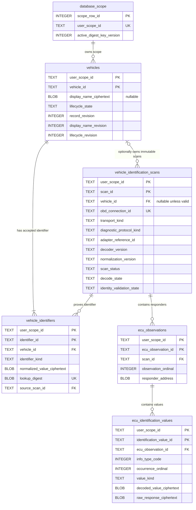

# Vehicle Identity Database Design

## 1. 目的と適用範囲

この文書は、登録車両、OBDから取得した車両識別子、接続単位の識別スキャン、応答ECU、ECU識別値をGRDBで管理するための論理・物理設計を確定するものです。実装、Migrationコード、Repository、OBD通信、取得セッション、Raw CAN／PIDログ、チャンクファイル、端末間同期の実装は含みません。

この領域のSystem of RecordはGRDBだけとし、SwiftDataへ同じデータを保存しません。`Documentation/DATABASE_OPERATIONS.md` の台帳更新は設計承認後の実装変更で行います。

規格上のサービス番号はデータの `info_type_code` として保持できますが、主要な型名、ファイル名、責務名には使用しません。

## 2. 設計原則

- 車両は内部UUIDで識別し、VINまたは日本国内車の車台番号をPrimary Keyにしない。
- 車両登録の根拠は標準OBD通信で取得し、正規化・検証に成功したVINまたは車台番号だけとする。
- QRコード、カメラ、手入力から `vehicle_identifiers` を作成する経路は設けない。
- 同一ユーザー内では識別子種別とKeyed Digestで同一車両を判定する。ユーザーが異なれば、DB、鍵、Digestを分離する。
- ユーザーが変更できるのは暗号化した表示名とアーカイブ状態だけとする。OBD由来データは追記専用にする。
- 車両と識別データは物理削除しない。車両は `active` または `archived` で管理する。
- OBD接続ごとの識別結果を、終端状態までメモリ上で構築してから不変のスキャンとして一括保存する。
- 現在情報は最新の正常完了スキャンから導出する。車両行へECU構成やCalibration IDを転記しない。
- 既知・未知を問わず、受信した標準InfoType、復号可能なDecoded Value、暗号化したRaw Responseを失わない。
- 機密値はCryptoKitの認証付き暗号で暗号化し、鍵はKeychainだけに保存する。
- DBを開けない、鍵を取得できない、認証タグ検証に失敗した、整合性違反を検出した、のいずれでもDBを自動削除しない。

## 3. ユーザースコープの強制

SQLiteには一般的なRow Level Securityがないため、Repository呼び出し側が毎回 `WHERE user_scope_id = ?` を忘れないことだけを境界にしません。次の三層で強制します。

1. **ユーザーごとの物理DB**: 認証済みの不透明なユーザースコープUUIDから専用DBファイルを選び、異なるユーザーの行を同じDBファイルへ保存しない。RepositoryはグローバルなDatabasePoolではなく、認証境界で生成されたスコープ専用DatabasePoolだけを受け取る。したがって、検索SQLがスコープ条件を欠いても別ユーザーの行は物理的に存在しない。
2. **`database_scope` の単一行**: 各DBは自身の `user_scope_id` を1行だけ保持する。対象5テーブルへのINSERTと `vehicles` のUPDATEは、トリガーで `NEW.user_scope_id` がこの値と一致することを検証する。
3. **複合キー**: 全エンティティのPrimary Keyを `(user_scope_id, <uuid>)` とし、全Foreign Keyに `user_scope_id` を含める。別スコープの親子関係はSQLiteが拒否する。

DBファイル名へメールアドレス、VINなどを含めません。DBの割り当て台帳と認証方式はこの設計の対象外ですが、DBを開く前に期待する `user_scope_id` と `database_scope.user_scope_id` が一致しなければ利用不可として扱います。

### 3.1 補助テーブルを追加する理由

`database_scope` は業務エンティティではなく、1ファイル1ユーザーをSQLite内部でも検証し、Digest鍵Versionを一意に決めるための保全メタデータです。呼び出し側だけにスコープを依存させないために必要な最小の追加テーブルです。

## 4. 共通表現

| 項目 | SQLite表現 | 規則 |
|---|---|---|
| UUID | `TEXT` | 小文字ハイフン付きUUID。DBの `length(value) = 36` は形状の一部だけを検査し、厳密なUUID検証ではない。生成、構文、variant、versionの検証はData層で行う |
| 時刻 | `TEXT` | UTCの固定長RFC 3339、マイクロ秒付き（例: `2026-07-18T01:02:03.123456Z`） |
| 暗号文 | `BLOB` | AES.GCMのcombined sealed box（nonce、ciphertext、tag） |
| Keyed Digest | `BLOB` | ユーザー別・用途別鍵によるHMAC-SHA-256、常に32 byte |
| Revision | `INTEGER` | エンティティ行は1から開始する単調増加値。未設定可能なフィールドRevisionだけは未設定を0で表す |
| 真偽値 | 使用しない | 状態を意味のある `TEXT` 列で表現する |

SQLiteの型はSTRICT tableで検証します。日時の生成、UUIDの厳密な構文、文字列の正規化はData層で検証し、DBの長さCheckは不正値の一部を拒否する補助防衛線として併用します。`length(...) = 36` だけをUUID妥当性の証明には使いません。

## 5. ER図



## 6. テーブル定義

### 6.1 `database_scope`

**責務**: 物理DBが属する唯一のユーザースコープと、現在のDigest鍵Versionを保持します。暗号鍵自体は保持しません。

| カラム | SQLite型 | NULL | 説明 |
|---|---|---:|---|
| `scope_row_id` | `INTEGER` | No | 常に1の単一行キー |
| `user_scope_id` | `TEXT` | No | ユーザースコープUUID |
| `active_digest_key_version` | `INTEGER` | No | 新規Digest作成に使用するKeychain鍵Version |
| `created_at` | `TEXT` | No | DBスコープ作成日時 |

制約:

- Primary Key: `scope_row_id`
- Unique: `user_scope_id`
- Check: `scope_row_id = 1`
- Check: `length(user_scope_id) = 36`。形状の補助検査であり、厳密なUUID検証はData層で行う
- Check: `active_digest_key_version >= 1`
- Foreign Key: なし
- 削除: `BEFORE DELETE` トリガーで常に拒否する

IndexはPrimary KeyとUnique制約による自動Indexだけです。`active_digest_key_version` の変更は鍵ローテーション専用トランザクションだけに許可します。

### 6.2 `vehicles`

**責務**: ユーザーが登録した物理車両の安定した内部ID、任意の暗号化表示名、アーカイブ状態、フィールド単位の同期Revisionを保持します。VIN、車台番号、ECU構成、最新ECU値は保持しません。

| カラム | SQLite型 | NULL | 説明 |
|---|---|---:|---|
| `user_scope_id` | `TEXT` | No | 所有ユーザースコープUUID |
| `vehicle_id` | `TEXT` | No | 車両UUID |
| `display_name_ciphertext` | `BLOB` | Yes | 設定済み表示名のAES.GCM combined sealed box。未設定または解除済みならNULL |
| `display_name_key_version` | `INTEGER` | Yes | 表示名を暗号化した鍵Version。暗号文と同時にNULLまたは非NULL |
| `lifecycle_state` | `TEXT` | No | `active` または `archived` |
| `record_revision` | `INTEGER` | No | 行全体の同期Revision。表示名または状態変更ごとに増加 |
| `display_name_revision` | `INTEGER` | No | 表示名フィールドのRevision。未設定の初期状態は0、設定・変更・解除ごとに増加 |
| `display_name_updated_at` | `TEXT` | Yes | 表示名の最終更新日時。初期Revision 0ならNULL |
| `display_name_updated_by_device_id` | `TEXT` | Yes | 表示名を最後に設定・変更・解除した端末UUID。初期Revision 0ならNULL |
| `lifecycle_revision` | `INTEGER` | No | アーカイブ状態フィールドのRevision |
| `lifecycle_updated_at` | `TEXT` | No | アーカイブ状態の最終更新日時 |
| `lifecycle_updated_by_device_id` | `TEXT` | No | 状態を更新した端末UUID |
| `archived_at` | `TEXT` | Yes | アーカイブ日時。activeならNULL |
| `created_at` | `TEXT` | No | 作成日時 |
| `created_by_device_id` | `TEXT` | No | 作成端末UUID |
| `updated_at` | `TEXT` | No | 行の最終更新日時 |
| `updated_by_device_id` | `TEXT` | No | 行を最後に更新した端末UUID |

制約:

- Primary Key: `(user_scope_id, vehicle_id)`
- Unique: 追加なし。UUIDはユーザースコープ内で一意
- Check: 非NULLのUUID列は `length(...) = 36`。これは厳密なUUID検証ではない
- Check:

  ```sql
  (display_name_ciphertext IS NULL AND display_name_key_version IS NULL)
  OR
  (
    display_name_ciphertext IS NOT NULL
    AND display_name_key_version IS NOT NULL
    AND length(display_name_ciphertext) >= 29
    AND display_name_key_version >= 1
  )
  ```
- Check: `lifecycle_state IN ('active', 'archived')`
- Check: `(lifecycle_state = 'active' AND archived_at IS NULL) OR (lifecycle_state = 'archived' AND archived_at IS NOT NULL)`
- Check: `record_revision >= 1`, `display_name_revision >= 0`, `lifecycle_revision >= 1`
- Check: `(display_name_revision = 0 AND display_name_ciphertext IS NULL AND display_name_key_version IS NULL AND display_name_updated_at IS NULL AND display_name_updated_by_device_id IS NULL) OR (display_name_revision > 0 AND display_name_updated_at IS NOT NULL AND display_name_updated_by_device_id IS NOT NULL)`
- Check: `updated_at >= created_at`, `display_name_updated_at IS NULL OR display_name_updated_at >= created_at`, `lifecycle_updated_at >= created_at`
- Foreign Key: なし。スコープ一致は `database_scope` 検証トリガーで強制
- 削除: `BEFORE DELETE` トリガーで常に拒否する

Index:

- `vehicles_active_order_idx (user_scope_id, lifecycle_state, updated_at DESC, vehicle_id)`

UPDATEトリガーは `user_scope_id`、`vehicle_id`、作成情報の変更を拒否します。また、表示名の設定・変更・解除時は表示名Revisionと行Revisionがそれぞれ1増加し、表示名更新端末・日時と行更新端末・日時が同時に変わること、状態変更時も同様であることを検証します。表示名を解除するUPDATEでは暗号文と鍵VersionをともにNULLにしますが、変更履歴の同期に必要なRevisionと更新メタデータは保持します。同期競合適用時のRevision飛び越しを許可する必要が生じた場合は、通常更新とは分離した同期専用経路とMigrationで明示します。

表示名が未設定または解除済みの場合、保存用の初期表示名を自動生成しません。画面上の代替表示はApplicationが、復号済み識別子の必要最小限をマスクした表示値などから都度導出します。この代替表示を `vehicles` へ保存せず、Platformへ平文識別子を公開しません。

### 6.3 `vehicle_identifiers`

**責務**: 標準OBD通信で取得し、正規化・検証に成功したVINまたは日本国内車の車台番号を車両へ関連付けます。値は暗号文、重複検索用表現はユーザー別Keyed Digestとして保持します。

| カラム | SQLite型 | NULL | 説明 |
|---|---|---:|---|
| `user_scope_id` | `TEXT` | No | 所有ユーザースコープUUID |
| `identifier_id` | `TEXT` | No | 識別子行UUID |
| `vehicle_id` | `TEXT` | No | 検証済み識別子を所有する登録済み車両UUID |
| `identifier_kind` | `TEXT` | No | `vin` または `domestic_chassis_number` |
| `normalized_value_ciphertext` | `BLOB` | No | 検証済み正規化値のAES.GCM combined sealed box |
| `encryption_key_version` | `INTEGER` | No | 値を暗号化した鍵Version |
| `lookup_digest` | `BLOB` | No | `identifier_kind \|\| 0x00 \|\| normalizedValue` のHMAC-SHA-256 |
| `digest_key_version` | `INTEGER` | No | Digest鍵Version。`database_scope` のactive versionと一致 |
| `source_scan_id` | `TEXT` | No | 登録根拠となった正常完了スキャンUUID |
| `revision` | `INTEGER` | No | 不変行のRevision。常に1 |
| `created_at` | `TEXT` | No | 作成日時 |
| `created_by_device_id` | `TEXT` | No | 作成端末UUID |
| `updated_at` | `TEXT` | No | 作成日時と同値 |
| `updated_by_device_id` | `TEXT` | No | 作成端末UUIDと同値 |

制約:

- Primary Key: `(user_scope_id, identifier_id)`
- Unique: `(user_scope_id, identifier_kind, lookup_digest)`。同一ユーザー内の同一識別子重複を拒否
- Unique: `(user_scope_id, vehicle_id, identifier_kind)`。1車両につき各種別1件
- Foreign Key: `(user_scope_id, vehicle_id) -> vehicles(user_scope_id, vehicle_id) ON DELETE RESTRICT ON UPDATE RESTRICT`
- Foreign Key: `(user_scope_id, vehicle_id, source_scan_id) -> vehicle_identification_scans(user_scope_id, vehicle_id, scan_id) ON DELETE RESTRICT ON UPDATE RESTRICT`
- Check: UUID列は `length(...) = 36`。これは厳密なUUID検証ではない
- Check: `identifier_kind IN ('vin', 'domestic_chassis_number')`
- Check: `length(normalized_value_ciphertext) >= 29`
- Check: `length(lookup_digest) = 32`
- Check: `encryption_key_version >= 1`, `digest_key_version >= 1`
- Check: `revision = 1`, `updated_at = created_at`, `updated_by_device_id = created_by_device_id`
- INSERTトリガー: `source_scan_id` の行が `scan_status = 'completed'` かつ `identity_validation_state = 'valid'` であり、`digest_key_version` が `database_scope.active_digest_key_version` と一致することを検証
- 削除・通常更新: `BEFORE DELETE` と `BEFORE UPDATE` トリガーで常に拒否する。7.4の専用Digest鍵ローテーションだけは排他的Migration／保守処理内で一時的にUPDATE拒否トリガーを置換する

Indexは二つのUnique制約とPrimary Keyによる自動Indexで足ります。車両別表示用に `vehicle_identifiers_vehicle_idx (user_scope_id, vehicle_id, identifier_kind)` を追加できますが、二つ目のUnique Indexが同じ先頭列を持つため重複作成しません。

`vehicle_id` と `source_scan_id` はともにNULL禁止なので、SQLiteの複合Foreign Key検証をNULLで迂回できません。失敗・不完全スキャンで得た値は `ecu_identification_values` にだけ保持し、このテーブルへ昇格させません。

VINは17文字で、ASCII大文字化後に許可文字、長さ、チェックディジット適用地域の規則を検証します。国内車台番号はハイフン等を含む原表現を直接検索キーにせず、承認済みの正規化規則で得た値を暗号化・Digest化します。正規化規則の確定は未決事項です。空値、部分値、無効値からこの行を作成しません。

### 6.4 `vehicle_identification_scans`

**責務**: 1回の標準OBD接続で得た車両識別スキャンの終端結果を不変レコードとして保持します。最新正常スキャンの判定軸を提供します。

| カラム | SQLite型 | NULL | 説明 |
|---|---|---:|---|
| `user_scope_id` | `TEXT` | No | 所有ユーザースコープUUID |
| `scan_id` | `TEXT` | No | スキャンUUID |
| `vehicle_id` | `TEXT` | Yes | 対象車両UUID。未登録車両のinvalid／unavailableな完了、失敗・不完全スキャンはNULL |
| `obd_connection_id` | `TEXT` | No | OBD接続を表す相関UUID。将来のセッションFKではない |
| `transport_kind` | `TEXT` | No | 識別取得時の非機密な通信経路種別。管理された安定コード |
| `diagnostic_protocol_kind` | `TEXT` | No | 識別取得時に確定した診断プロトコル種別。管理された安定コード |
| `adapter_reference_id` | `TEXT` | No | Adapterを指す不透明で非機密な安定参照。製品名、シリアル、MAC、認証情報は含めない |
| `decoder_version` | `TEXT` | No | このスキャンのDecode規則bundle Version |
| `normalization_version` | `TEXT` | No | VIN／車台番号の正規化・Validation規則bundle Version |
| `scan_status` | `TEXT` | No | `completed`、`incomplete`、`failed` |
| `decode_state` | `TEXT` | No | `decoded`、`partially_decoded`、`undecodable` |
| `identity_validation_state` | `TEXT` | No | `valid`、`invalid`、`unavailable` |
| `termination_reason_code` | `TEXT` | Yes | incompleteの中断理由またはfailedの失敗理由を表す安定した非機密コード。completedならNULL |
| `started_at` | `TEXT` | No | OBD識別取得開始日時 |
| `finished_at` | `TEXT` | No | 終端状態確定日時 |
| `revision` | `INTEGER` | No | 不変行のRevision。常に1 |
| `created_at` | `TEXT` | No | DBへ記録した日時 |
| `created_by_device_id` | `TEXT` | No | 記録端末UUID |
| `updated_at` | `TEXT` | No | 作成日時と同値 |
| `updated_by_device_id` | `TEXT` | No | 作成端末UUIDと同値 |

制約:

- Primary Key: `(user_scope_id, scan_id)`
- Unique: `(user_scope_id, vehicle_id, scan_id)`。`vehicle_identifiers` の同一車両・根拠スキャンFK用
- Unique: `(user_scope_id, obd_connection_id)`。1接続につき1スキャン
- Foreign Key: `(user_scope_id, vehicle_id) -> vehicles(user_scope_id, vehicle_id) ON DELETE RESTRICT ON UPDATE RESTRICT`。`vehicle_id` が非NULLの場合だけSQLiteが検証し、NULLは未登録スキャンを表す
- Check: NULLでないUUID列は `length(...) = 36`。これは厳密なUUID検証ではない
- Check: `length(transport_kind) BETWEEN 1 AND 64`
- Check: `length(diagnostic_protocol_kind) BETWEEN 1 AND 64`
- Check: `length(adapter_reference_id) BETWEEN 1 AND 128`
- Check: `length(decoder_version) BETWEEN 1 AND 64`
- Check: `length(normalization_version) BETWEEN 1 AND 64`
- Check: `scan_status IN ('completed', 'incomplete', 'failed')`
- Check: `decode_state IN ('decoded', 'partially_decoded', 'undecodable')`
- Check: `identity_validation_state IN ('valid', 'invalid', 'unavailable')`
- Check: `identity_validation_state <> 'valid' OR vehicle_id IS NOT NULL`
- Check: `finished_at >= started_at`
- Check: `(scan_status = 'completed' AND termination_reason_code IS NULL) OR (scan_status IN ('incomplete', 'failed') AND termination_reason_code IS NOT NULL AND length(termination_reason_code) BETWEEN 1 AND 64)`
- Check: `revision = 1`, `updated_at = created_at`, `updated_by_device_id = created_by_device_id`
- 削除・更新: `BEFORE DELETE` と `BEFORE UPDATE` トリガーで常に拒否する

Index:

- 部分Index `vehicle_scans_latest_valid_idx (user_scope_id, vehicle_id, finished_at DESC, scan_id DESC) WHERE vehicle_id IS NOT NULL AND scan_status = 'completed' AND identity_validation_state = 'valid'`
- 部分Index `vehicle_scans_history_idx (user_scope_id, vehicle_id, started_at DESC, scan_id DESC) WHERE vehicle_id IS NOT NULL`
- 部分Index `unassigned_scans_history_idx (user_scope_id, started_at DESC, scan_id DESC) WHERE vehicle_id IS NULL`

`completed` は要求した識別問い合わせ系列を最後まで実施したこと、`incomplete` は一部応答を保持したが系列を完遂できなかったこと、`failed` は識別結果として成立しなかったことを表します。`incomplete` にも、タイムアウト、切断、ユーザー中断などを区別する安定した `termination_reason_code` を必須とします。製品固有の例外文、Adapter秘密情報、受信値は理由コードに含めません。Decode状態と車両識別子Validation状態は直交させます。たとえば未知InfoTypeを含んでも、VINが妥当なら `partially_decoded` かつ `valid` にできます。

DBには進行中行を作りません。スキャン構築中のクラッシュで半端なDB行が残ることを避け、終端結果と配下行を一つのトランザクションでINSERTします。有効な識別子を得られず車両登録できない接続でも、invalid／unavailableな完了、失敗・不完全スキャンと受信済みの未知値／Raw Responseは `vehicle_id = NULL` でユーザースコープ内に保持できます。この行は車両一覧や最新正常Queryには現れません。

`transport_kind`、`diagnostic_protocol_kind`、`adapter_reference_id`、`decoder_version`、`normalization_version` は、その識別結果を再解釈・監査するためのスキャン時点の根拠としてこのテーブルを正本とします。将来の通信セッションテーブルは接続の開始・終了・通信状態の正本、Adapter台帳は名称・能力・ペアリング等のAdapterメタデータの正本とします。スキャンは `obd_connection_id` と不透明なAdapter参照だけを保持し、セッション詳細、認証情報、製品固有処理を複製しません。将来それらの表が追加されても、このスキャン時点の5列は履歴再現のため上書きしません。

### 6.5 `ecu_observations`

**責務**: ある識別スキャンで応答したECUを、応答元アドレス単位で保持します。ECU名やCalibration IDはこの行へ固定列として上書きせず、配下の識別値として保持します。

| カラム | SQLite型 | NULL | 説明 |
|---|---|---:|---|
| `user_scope_id` | `TEXT` | No | 所有ユーザースコープUUID |
| `ecu_observation_id` | `TEXT` | No | ECU観測UUID |
| `scan_id` | `TEXT` | No | 親スキャンUUID |
| `observation_ordinal` | `INTEGER` | No | スキャン内の安定した0始まり順序 |
| `responder_address_format` | `TEXT` | No | `can_11_bit`、`can_29_bit`、`iso9141`、`iso14230`、`unknown` |
| `responder_address` | `BLOB` | No | プロトコル上の応答元アドレスbytes。Decoded ValueやRaw Responseではない |
| `revision` | `INTEGER` | No | 不変行のRevision。常に1 |
| `created_at` | `TEXT` | No | 作成日時 |
| `created_by_device_id` | `TEXT` | No | 作成端末UUID |
| `updated_at` | `TEXT` | No | 作成日時と同値 |
| `updated_by_device_id` | `TEXT` | No | 作成端末UUIDと同値 |

制約:

- Primary Key: `(user_scope_id, ecu_observation_id)`
- Unique: `(user_scope_id, scan_id, observation_ordinal)`
- Unique: `(user_scope_id, scan_id, responder_address_format, responder_address)`
- Foreign Key: `(user_scope_id, scan_id) -> vehicle_identification_scans(user_scope_id, scan_id) ON DELETE RESTRICT ON UPDATE RESTRICT`
- Check: UUID列は `length(...) = 36`。これは厳密なUUID検証ではない
- Check: `observation_ordinal >= 0`
- Check: `responder_address_format IN ('can_11_bit', 'can_29_bit', 'iso9141', 'iso14230', 'unknown')`
- Check: `length(responder_address) > 0`
- Check: `revision = 1`, `updated_at = created_at`, `updated_by_device_id = created_by_device_id`
- 削除・更新: `BEFORE DELETE` と `BEFORE UPDATE` トリガーで常に拒否する

Indexは二つのUnique制約とPrimary Keyによる自動Indexで足ります。異なる接続で同じアドレスが返っても別の `ecu_observation_id` になり、ECU構成変化の履歴を失いません。

### 6.6 `ecu_identification_values`

**責務**: 応答ECUから返った識別値を、InfoTypeと出現順ごとに保持します。ECU識別領域に限定した型付きテーブルであり、任意の属性を受け入れる汎用EAVではありません。

| カラム | SQLite型 | NULL | 説明 |
|---|---|---:|---|
| `user_scope_id` | `TEXT` | No | 所有ユーザースコープUUID |
| `identification_value_id` | `TEXT` | No | 識別値UUID |
| `ecu_observation_id` | `TEXT` | No | 親ECU観測UUID |
| `info_type_code` | `INTEGER` | No | 受信した標準InfoTypeのunsigned byte値。未知値もそのまま保持 |
| `occurrence_ordinal` | `INTEGER` | No | 同一ECU・同一InfoType内の0始まり出現順 |
| `value_kind` | `TEXT` | No | 解釈した識別値種別 |
| `decode_state` | `TEXT` | No | `decoded`、`not_decodable`、`unsupported` |
| `validation_state` | `TEXT` | No | `valid`、`invalid`、`not_applicable`、`not_evaluated` |
| `decoded_value_ciphertext` | `BLOB` | Yes | Decoded ValueのAES.GCM combined sealed box。復号不能ならNULL |
| `decoded_value_key_version` | `INTEGER` | Yes | Decoded Valueを暗号化した鍵Version |
| `raw_response_ciphertext` | `BLOB` | No | 当該値を根拠付ける完全なRaw Response bytesのAES.GCM combined sealed box |
| `raw_response_key_version` | `INTEGER` | No | Raw Responseを暗号化した鍵Version |
| `revision` | `INTEGER` | No | 不変行のRevision。常に1 |
| `created_at` | `TEXT` | No | 作成日時 |
| `created_by_device_id` | `TEXT` | No | 作成端末UUID |
| `updated_at` | `TEXT` | No | 作成日時と同値 |
| `updated_by_device_id` | `TEXT` | No | 作成端末UUIDと同値 |

`value_kind` の初期集合は次です。

- `vin`
- `domestic_chassis_number`
- `ecu_name`
- `calibration_id`
- `cvn`
- `engine_serial_number`
- `engine_family`
- `other_known_identification`
- `unknown_standard_info_type`

制約:

- Primary Key: `(user_scope_id, identification_value_id)`
- Unique: `(user_scope_id, ecu_observation_id, info_type_code, occurrence_ordinal)`。同じInfoTypeの複数値を別行で保持
- Foreign Key: `(user_scope_id, ecu_observation_id) -> ecu_observations(user_scope_id, ecu_observation_id) ON DELETE RESTRICT ON UPDATE RESTRICT`
- Check: UUID列は `length(...) = 36`。これは厳密なUUID検証ではない
- Check: `info_type_code BETWEEN 0 AND 255`
- Check: `occurrence_ordinal >= 0`
- Check: `value_kind` は上記初期集合のいずれか
- Check: `decode_state IN ('decoded', 'not_decodable', 'unsupported')`
- Check: `validation_state IN ('valid', 'invalid', 'not_applicable', 'not_evaluated')`
- Check: `decode_state = 'decoded'` なら `decoded_value_ciphertext IS NOT NULL AND decoded_value_key_version IS NOT NULL`
- Check: `decode_state != 'decoded'` なら `decoded_value_ciphertext IS NULL AND decoded_value_key_version IS NULL`
- Check: 暗号文はNULLでない場合 `length(...) >= 29`
- Check: 鍵VersionはNULLでない場合1以上
- Check: `revision = 1`, `updated_at = created_at`, `updated_by_device_id = created_by_device_id`
- 削除・更新: `BEFORE DELETE` と `BEFORE UPDATE` トリガーで常に拒否する

Index:

- `ecu_values_kind_idx (user_scope_id, ecu_observation_id, value_kind, info_type_code, occurrence_ordinal)`

未知InfoTypeは `info_type_code` を保持し、`value_kind = 'unknown_standard_info_type'`、`decode_state = 'unsupported'`、`validation_state = 'not_evaluated'` としてRaw Responseを必ず保存します。後日のDecoder追加では既存行を上書きせず、新しいDecoder Versionを含む派生データ設計をMigrationで追加するか、Raw Responseから表示時に導出します。

## 7. 暗号化とDigest

### 7.1 暗号化対象

次を平文でDBへ保存しません。

- 設定されている場合の `vehicles.display_name_ciphertext`。未設定・解除済みはNULLであり、代替表示を保存しない
- `vehicle_identifiers.normalized_value_ciphertext` に入るVIN／国内車台番号
- `ecu_identification_values.decoded_value_ciphertext` に入るVIN、車台番号、ECU名、Calibration ID、CVN、Engine Serial Number、Engine Family、既知・未知のDecoded Value
- `ecu_identification_values.raw_response_ciphertext` に入る全Raw Response

AES.GCMの認証付き暗号を用い、暗号文ごとに新しいnonceを生成します。Additional Authenticated Dataには、少なくともテーブル名、カラム名、`user_scope_id`、行UUID、対象Key Versionを正規形式で含め、別行・別カラムへの暗号文差し替えを検出します。暗号化前の値、nonce以外の鍵素材、認証失敗時の値をログへ出しません。

状態、UUID、Revision、時刻、InfoTypeコード、ECU応答アドレス、非機密エラーコードは検索・整合性維持に必要なメタデータとして平文です。

### 7.2 Keyed Digest対象

重複検索が必要な検証済みVIN／国内車台番号だけを `vehicle_identifiers.lookup_digest` に保存します。表示名やECU識別値は初期要件で等価検索しないためDigestを保存せず、不要な一致情報の漏えいを増やしません。

Digestはユーザー別かつ用途別の鍵で `HMAC-SHA-256(identifier_kind || 0x00 || normalizedValue)` を計算します。異なるユーザーの同じ識別子は、物理DBと鍵の両方が異なるため関連付けできません。通常のSHA-256、暗号文の比較、平文Indexは使用しません。

### 7.3 鍵とKey Version

- ルート鍵はユーザースコープごとにKeychainへ保存し、DBへ保存しない。
- 暗号化用とDigest用には、ルート鍵から用途・Versionを分離した鍵をHKDFで導出する。実装時にsalt／info形式を固定し、互換性文書を追加する。
- 各暗号文は自身の `*_key_version` を持つため、暗号鍵は行単位で段階的に再暗号化できる。
- Digestは一意制約を維持するため、DB内の全 `vehicle_identifiers.digest_key_version` を `database_scope.active_digest_key_version` と一致させる。INSERTトリガーで不一致を拒否する。
- Digest鍵ローテーションは7.4の専用排他処理だけで行う。通常Repositoryには `vehicle_identifiers` のUPDATE APIを公開しない。
- 古い暗号鍵は、そのVersionを参照する行がなくなり、バックアップ復旧方針も満たすまでKeychainから削除しない。

### 7.4 Digest鍵ローテーション専用手順

通常運用の `vehicle_identifiers` は引き続き不変です。ローテーションは、通常のDatabasePoolとRepositoryを停止した状態で実行する、Version管理された専用Migrationまたは同等の排他的保守処理に限定します。鍵取得と全暗号文の認証付き復号が可能であることを、DB transaction開始前に確認します。

1. 新しいDigest鍵をKeychainへ追加する。旧鍵は残す。
2. 専用接続で排他transactionを開始し、通常Repositoryからの読み書きを遮断する。
3. 永続schemaへ新しいテーブルを追加せず、接続ローカルなTEMP領域を作る。TEMP領域は `(user_scope_id, identifier_id, identifier_kind, new_lookup_digest, new_digest_key_version)` を持ち、識別子行のキーと `(user_scope_id, identifier_kind, new_lookup_digest)` にUnique制約を付ける。平文識別子は格納しない。
4. 全 `vehicle_identifiers` を認証付き復号し、新鍵によるDigestをメモリ上で計算してTEMP領域へINSERTする。全行数一致、識別子ごとの1対1対応、新Digest間の重複なしを検証する。衝突時は自動統合しない。
5. 専用処理内で既存のUPDATE拒否トリガーを一時的に削除し、同じ定義のうち `lookup_digest` と `digest_key_version` だけを変更できる保守用トリガーへ置換する。これは通常Repositoryから到達できるSQL経路にしない。
6. 旧Digestと新Digestが偶然交差して逐次Unique検査に抵触することを避けるため、排他transaction内で二段階の一括UPDATEを行う。まず全行を、識別子UUIDと保守処理nonceから生成し、互いに一意かつ旧Digest・新Digestの双方と交差しないことを検証した32 byteの一時占有値へ移す。続けてTEMP領域とのキー結合で全行の `lookup_digest` と `digest_key_version` を新しい値へ更新する。通常Queryは停止中で、一時占有値をcommitしない。`identifier_id`、`vehicle_id`、暗号文、根拠スキャン、論理Revision、作成更新メタデータは変更しない。Digest再計算は論理的な識別情報変更ではないため `revision = 1` を維持する。
7. 全行が新Versionであり、行数が変わらず、Unique制約が成立することを確認してから `database_scope.active_digest_key_version` を新Versionへ切り替える。
8. 保守用トリガーを削除し、通常のUPDATE全面拒否トリガーを元の定義で再作成する。INSERT時のactive version検証トリガーも再作成または定義一致を確認する。
9. `foreign_key_check`、`quick_check`、全Digest Version一致、Indexとトリガー定義、同一車両Queryを検証してcommitする。

いずれかの計算、復号、重複検査、UPDATE、制約・トリガー再検証に失敗した場合は、トリガー変更、全行UPDATE、active version切替を含むtransaction全体をrollbackします。TEMP領域は接続終了時に破棄します。rollback後も旧鍵で通常運用できることを確認し、新鍵と旧鍵はいずれも直ちに削除しません。旧鍵は旧バックアップの保持期間、復旧試験、全端末の移行完了を別途確認した後にだけ廃棄候補とします。

## 8. 状態と現在情報

### 8.1 最新正常スキャン

現在のECU識別情報は車両行へキャッシュせず、次の条件で1件取得します。

```sql
SELECT *
FROM vehicle_identification_scans
WHERE user_scope_id = :userScopeID
  AND vehicle_id IS NOT NULL
  AND vehicle_id = :vehicleID
  AND scan_status = 'completed'
  AND identity_validation_state = 'valid'
ORDER BY finished_at DESC, scan_id DESC
LIMIT 1;
```

ユーザー専用DBであることに加え、明示的な `user_scope_id` と登録済み車両の非NULL条件をRepositoryの定型Queryに含めます。部分IndexがこのQueryを支えます。`vehicle_id = NULL` の未登録スキャン、`incomplete`、`failed`、`invalid`、`unavailable` は履歴には残りますが、このQueryに一致しないため最新正常スキャンを置き換えません。同時刻はUUIDの辞書順を決定的なtie-breakに使います。

### 8.2 複数ECU・複数値

- 1スキャン対複数 `ecu_observations` で応答ECUを分離する。
- 1 ECU観測対複数 `ecu_identification_values` で値を分離する。
- 同じInfoTypeが複数返った場合は `occurrence_ordinal` を増やし、配列への上書きや文字列結合をしない。
- 同じ車両・同じECUアドレスでも接続ごとに新しい観測行を作る。Calibration IDやECU構成の変化を過去行へ反映しない。
- ECU名、Calibration ID、CVN等は固定の `value_kind` で判別できる一方、未知InfoTypeは数値コードとRaw Responseを保持する。

## 9. Query方針

### 9.1 同一車両判定

1. OBD値を識別子種別ごとの規則で正規化・検証する。
2. `database_scope.active_digest_key_version` のユーザー別Digest鍵をKeychainから取得する。
3. Keyed Digestをメモリ上で計算する。
4. 次のQueryを実行する。

```sql
SELECT v.*
FROM vehicle_identifiers AS i
JOIN vehicles AS v
  ON v.user_scope_id = i.user_scope_id
 AND v.vehicle_id = i.vehicle_id
WHERE i.user_scope_id = :userScopeID
  AND i.identifier_kind = :identifierKind
  AND i.lookup_digest = :lookupDigest
LIMIT 2;
```

0件なら登録候補、1件なら同一車両、2件以上なら一意制約またはDB整合性の破損として非破壊の利用不可状態にします。VIN／車台番号が一致すれば、ECU数、アドレス、Calibration ID、CVN等が変わっていても同一車両です。複数の有効識別子がそれぞれ異なる既存車両へ一致した場合は、自動統合せず整合性エラーとして登録を停止します。

### 9.2 アーカイブ車両の再検出

同一車両Queryで一致した `vehicles.lifecycle_state` を確認します。

- `active`: 新規車両を作らず、既存車両の新しいスキャンとして保存する。
- `archived`: 新規車両を作らず、新しいスキャンを既存車両へ保存し、復元候補を返す。自動復元しない。
- 不明な状態: Check制約違反として利用不可にする。

復元はユーザーの明示操作による別トランザクションです。再検出だけで `lifecycle_state` を変更しません。

## 10. トランザクション

全書き込みはスコープ専用DatabasePoolのwrite transactionで行い、外部通信やKeychain UI待機をトランザクション内で行いません。鍵取得、OBD取得、Decode、Validation、暗号化準備を先に行い、秘密の平文は必要最小限の寿命にします。

### 10.1 登録トランザクション

事前条件は、標準OBD接続が終端し、少なくとも一つの有効なVINまたは国内車台番号を得ていることです。この条件を満たさない接続は車両登録を開始せず、10.2の処理で `vehicle_id = NULL` のinvalid／unavailableな完了、失敗・不完全スキャンとして保存できます。

1. DBスコープ、暗号鍵、active Digest鍵Versionを検証する。
2. 取得した全識別子を正規化・検証し、暗号文とDigestを準備する。
3. `BEGIN IMMEDIATE` で同一車両Queryを再実行し、並行登録を直列化する。
4. active一致なら新規車両を作らず、既存車両にスキャンを追加する。
5. archived一致なら新規車両を作らず、既存車両にスキャンを追加して復元候補を返す。
6. 一致なしなら `vehicles` を作成する。ユーザーが登録操作で表示名を明示した場合だけ暗号化して保存し、`display_name_revision = 1` と更新メタデータを設定する。指定がなければ表示名関連の暗号文・鍵Version・更新メタデータはNULL、`display_name_revision = 0` とし、自動生成しない。
7. 通信根拠、Decoder／正規化Version、終端理由を含む `vehicle_identification_scans`、続いて `ecu_observations`、`ecu_identification_values` を親から順にINSERTする。validなスキャンの `vehicle_id` は必ず新規または一致した登録済み車両UUIDとする。
8. 新規車両の場合だけ、正常完了・validな同一車両スキャンを `source_scan_id` として `vehicle_identifiers` をINSERTする。
9. 必須ECU値、Raw Response、accepted identifierの件数とForeign Keyを検証し、commitする。

Unique競合は「同時に既存車両が登録された可能性」としてrollback後に同一車両Queryを再実行し、既存車両または復元候補へ収束させます。無効識別子しかない、鍵がない、暗号化失敗、スコープ不一致の場合は車両行を残さずrollbackします。既存DBは削除しません。

### 10.2 識別スキャン追加トランザクション

1. OBD接続結果をメモリ上で終端状態にし、暗号化を完了する。通信経路、診断プロトコル、不透明なAdapter参照、Decoder Version、正規化Versionを取得時点の安定コードへ確定する。
2. 対象車両へ関連付ける場合は、車両が同じスコープに存在することを確認する。有効な識別子を取得できなかった未登録接続は `vehicle_id = NULL` とする。`identity_validation_state = 'valid'` なら登録済み車両の非NULL UUIDを必須とする。
3. `incomplete` または `failed` なら安定した `termination_reason_code` を設定し、`completed` ならNULLにして `vehicle_identification_scans` をINSERTする。
4. 応答順に `ecu_observations`、InfoType・出現順に `ecu_identification_values` をINSERTする。
5. 受信した全応答数と保存行数、各Raw Responseの存在を検証する。
6. 正常完了かどうかにかかわらず、整合した終端結果をcommitする。

不完全・失敗スキャンも、登録済み車両への関連付け有無にかかわらず受信済み情報とRaw Responseを保持します。ただし最新正常Queryには含まれません。途中のINSERT失敗はスキャン全体をrollbackし、半端な親子行を残しません。DB保存失敗の診断はDB外のプライバシー保護されたエラー経路で扱い、受信値をログへ出しません。

### 10.3 表示名変更トランザクション

1. 設定・変更なら非空文字、許容長、Unicode正規化等を検証して新しい表示名を暗号化する。解除なら暗号文と鍵VersionをともにNULLとし、代替名を生成・保存しない。
2. 初回設定では期待Revision 0、以後は読込済みRevisionを使い、`WHERE user_scope_id = ? AND vehicle_id = ? AND display_name_revision = ?` の楽観ロック付きUPDATEを実行する。
3. `display_name_ciphertext`、`display_name_key_version`、`display_name_revision + 1`、表示名更新端末・日時、`record_revision + 1`、行更新端末・日時だけを更新する。解除後もRevisionと更新メタデータはNULLへ戻さない。
4. 更新件数が1ならcommit、0なら再読込して競合を返す。OBD由来行は更新しない。

表示名の平文を履歴列や監査ログへ保存しません。初期設計では表示名変更履歴テーブルを設けません。未設定・解除済みの画面表示は、Applicationがマスク済み識別子等から導出する表示専用値であり、DBへ書き戻しません。

### 10.4 アーカイブ／復元トランザクション

1. `WHERE user_scope_id = ? AND vehicle_id = ? AND lifecycle_revision = ?` で楽観ロックする。
2. アーカイブ時は `lifecycle_state = 'archived'` と `archived_at`、復元時は `active` とNULLを設定する。
3. `lifecycle_revision + 1`、状態更新端末・日時、`record_revision + 1`、行更新端末・日時を同時更新する。
4. 更新件数が1ならcommit、0なら競合を返す。

識別子、スキャン、ECU観測、ECU識別値は削除・変更しません。アーカイブ車両の再検出から復元する場合も、ユーザー確認後にこの処理だけを実行します。

## 11. Revision・作成更新日時・同期準備

- 全同期対象行はランダムUUID、Revision、作成端末、作成日時、更新端末、更新日時を持つ。
- 追記専用行は `revision = 1`、更新情報は作成情報と同値で固定する。
- `vehicles.record_revision` は任意の可変フィールド変更で増える同期用の行Revisionとする。
- 表示名とアーカイブ状態はそれぞれ独立したRevision、更新端末、更新日時を持ち、異なるフィールドの同時編集を不要に競合させない。表示名のRevision 0とNULL更新メタデータは「一度も設定されていない」を表し、設定・変更・解除後は値がNULLでも正のRevisionと最終更新メタデータを保持する。
- 時刻は表示順や競合説明に使えるが、単独でRevisionの代わりにしない。端末時計を信頼したlast-write-winsは採用しない。
- 同期プロトコル、端末登録、削除伝播、競合tie-breakは対象外であり、この列だけで同期完成とはしない。

## 12. 非破壊エラー動作

次の場合は、対象ユーザーの車両機能全体または復号が必要な操作を利用不可状態にします。

- Keychainから必要な鍵Versionを取得できない。
- AES.GCMの認証タグ検証に失敗する。
- Digest鍵VersionがDBメタデータと一致しない。
- `PRAGMA foreign_key_check`、`quick_check`、スコープ検証に失敗する。
- Migration、DB open、ディスク書き込みに失敗する。

動作方針:

1. DB、DBファイル、車両、暗号文を削除しない。
2. 空DB、SwiftData、別ユーザーDBへ自動fallbackしない。
3. 失敗した暗号文を空文字や「不明」に書き換えない。
4. 機密値を含まない安定エラー分類とランダムな診断IDを表示・記録する。
5. 鍵再取得、Keychain状態回復、容量回復、バックアップ復元後に同じDBを再試行できるようにする。
6. 一部だけ復号できる場合でも、車両同一性を誤判定する操作は停止する。Raw Responseは保持したままにする。

## 13. Migration

### 13.1 初回Migration案

初回の追記式Migration（例: `v1_create_vehicle_identity_store`）は一つのDB transactionで次を行います。

1. `PRAGMA foreign_keys = ON` を接続設定で有効化し、STRICT table対応SQLite Versionを起動条件として検証する。
2. `database_scope` を作成し、期待するユーザースコープUUIDとactive Digest鍵Versionを1行INSERTする。
3. `vehicles` を作成する。
4. `vehicle_identification_scans` を作成する。
5. `vehicle_identifiers` を作成する。
6. `ecu_observations` を作成する。
7. `ecu_identification_values` を作成する。
8. Unique制約、通常Index、部分Indexを作成する。
9. スコープ一致、追記専用、物理削除禁止、`vehicles` 可変列制限のトリガーを作成する。
10. `foreign_key_check` とスキーマ検証を実行してcommitする。

現時点ではGRDB未導入で実データもないため、SwiftDataからの移行や既存車両データ変換は行いません。初回Migrationの実装時には空DBと再openのMigrationテスト、全制約・トリガーの拒否テストを追加します。表示名暗号文と鍵VersionのCheck制約については、少なくとも次の行が拒否されることを個別に検証します。

- `display_name_ciphertext` が非NULL、`display_name_key_version` がNULL
- `display_name_ciphertext` がNULL、`display_name_key_version` が非NULL
- `display_name_ciphertext` が29 byte未満
- `display_name_key_version` が1未満

### 13.2 将来Migrationの追記方針

- リリース済みMigrationを編集・並べ替え・削除しない。
- 変更理由ごとに新しいVersionを追加し、旧Versionからの実データ互換テストを作る。
- 新しい既知 `value_kind` は、Check制約を安全に拡張するtable rebuild MigrationとRaw Response再Decode方針を同じ変更で記録する。
- 暗号形式、正規化Version、鍵導出形式を変える場合は、新旧を識別する列またはVersionと段階移行を追加する。既存暗号文を解読不能なまま上書きしない。
- 取得セッションや同期テーブルを将来追加しても、既存の `obd_connection_id` を暗黙のFKへ変更しない。互換性、欠損接続の扱い、backfillを明示する。
- System of Record台帳、Migrationコード、Migrationテスト、ロールバック／復旧説明を同じ実装変更単位で更新する。

### 13.3 ロールバック／復旧

- Migrationはtransaction内で実行し、失敗時はスキーマ変更全体をrollbackする。
- アプリ更新前に、OSのファイル保護を使った整合したDBバックアップと、必要な鍵Versionの存在を確認する。DBだけをコピーして鍵を失う復旧手順は採用しない。
- リリース後に旧アプリへdown-migrationしない。旧バイナリが新schemaを開こうとした場合は読み書きを停止し、対応Versionへの更新を案内する。
- 破損時は元DBを保持し、コピーに対して `integrity_check`、`foreign_key_check`、認証付き復号検証を行う。ユーザー承認なしに元DBを置換しない。
- バックアップ復元はDBと対応Keychain鍵Versionの組を検証してから行う。復旧不能でも自動削除や新規空DBへの置換をしない。
- アプリ機能のrollbackが必要な場合は、車両機能を安全に無効化し、既存schemaと暗号文を保存したまま前方修正Migrationを提供する。

## 14. 要件トレーサビリティ

| 要件 | 設計上の対応 |
|---|---|
| GRDBを正本、SwiftData二重管理禁止 | 1章、2章 |
| 複数ユーザー・複数車両 | ユーザー別DB、全複合PK、`vehicles` |
| OBD必須、手入力等は対象外、無効識別子は登録不可 | 2章、6.3、10.1 |
| VINと国内車台番号 | `identifier_kind` と正規化・検証方針 |
| 編集可能なのは任意の表示名だけ | NULLで未設定・解除を表す `vehicles`、Applicationの非保存代替表示、10.3 |
| 物理削除せずアーカイブ | `lifecycle_state`、DELETE拒否トリガー、10.4 |
| アーカイブ再検出は復元候補 | 9.2 |
| 識別子一致ならECU変化後も同一車両 | 9.1 |
| ECU情報を車両へ上書きしない | 6.2、6.5、8.2 |
| 接続ごとの不変スキャン | `obd_connection_id` Unique、追記専用トリガー |
| 未登録車両の失敗・不完全スキャン | nullableな `vehicle_identification_scans.vehicle_id`、未割当履歴Index、10.2 |
| validなスキャンだけ車両関連必須 | `identity_validation_state = 'valid'` のCheckと最新正常Query |
| スキャン時の通信・Decode根拠 | `transport_kind`、診断プロトコル、Adapter参照、Decoder／正規化Version |
| incompleteの安定した中断理由 | `termination_reason_code` のCheck制約 |
| 最新正常スキャンのみ現在情報 | 部分Indexと8.1のQuery |
| 不完全・失敗が正常情報を置換しない | 6.4、8.1 |
| ECU単位・同種複数値 | `ecu_observations`、`occurrence_ordinal` |
| 未知InfoTypeとRawを保持 | `info_type_code`、`unknown_standard_info_type`、暗号化Raw |
| 機密値を平文保存しない | 7.1 |
| 重複検索はユーザー別Keyed Digest | `lookup_digest`、7.2、9.1 |
| 鍵はKeychain、Version識別 | 7.3と各Key Version列 |
| 不変識別子とDigest鍵ローテーションの両立 | 通常UPDATE禁止と7.4の専用排他Migration／保守手順 |
| 鍵喪失時に削除しない | 12章 |
| Query呼び出し注意だけでないユーザー境界 | ユーザー別DB、`database_scope` トリガー、複合FK |
| 将来同期用UUID・Revision・端末・日時 | 全エンティティの共通列、11章 |
| 表示名と状態のフィールドRevision | 未設定を0で表す `display_name_revision`、`lifecycle_revision`、11章 |
| 巨大な汎用EAVを避ける | ECU識別専用テーブルと限定 `value_kind` |
| 安全なMigrationと復旧 | 13章 |

## 15. 採用しなかった代替案

### VIN／車台番号を車両のPrimary Keyにする

暗号化により直接キーにできず、訂正・正規化変更・複数識別子・ユーザー分離・同期に弱いため不採用です。車両UUIDと識別子を分離します。

### VIN、車台番号、表示名、ECU値、Raw Responseを平文または通常Hashで保存する

DB流出時の情報露出、VINの低い探索コスト、ユーザー間照合を防げないため不採用です。認証付き暗号とユーザー別HMACを使います。

### 全ユーザーを一つのDBへ保存し、RepositoryでWHEREを付ける

読み取りQueryの条件漏れをSQLiteのForeign Keyやトリガーだけでは防げないため不採用です。物理DBをユーザー別にし、複合キーも併用します。

### ECUの最新値を `vehicles` へ上書きする

不完全スキャンが正常値を置き換える危険、履歴喪失、複数ECU・複数値の表現不能があるため不採用です。最新正常スキャンをQueryします。

### 進行中スキャンを作成して逐次UPDATEする

クラッシュ時に半端な親子行が残り、「不変の接続結果」が崩れるため不採用です。終端結果を一括INSERTします。長時間取得のクラッシュ耐性が必要になった場合は、正本テーブルとは別の明示的な一時領域を設計します。

### JSON BLOB一つへスキャン全体を保存する

ECU別Query、InfoType別Decode、制約、Index、未知値と既知値の部分的利用が難しいため不採用です。Raw Responseは値単位で暗号化し、関係は正規化します。

### ECU属性を列追加だけで表現する

同種複数値と未知InfoTypeを保持できず、標準拡張のたびに欠落が生じるため不採用です。

### 任意key/valueの巨大なEAVテーブル

値の責務、型、状態、制約が曖昧になり、車両以外の属性まで流入するため不採用です。`ecu_identification_values` はECU識別応答だけを対象にし、InfoType、値種別、Decode／Validation、Rawを固定列にします。

### アーカイブ時のcascade delete／再登録

監査可能性と履歴を失い、同じ物理車両を二重登録するため不採用です。全FKをRESTRICTとし、復元候補を返します。

### SwiftDataとのミラー保存

競合時に正本を決められず、暗号化・Migration・一意制約が二重化するため不採用です。

## 16. 残っている未決事項

実装開始前または該当機能追加前に、次を別途確定する必要があります。

1. 日本国内車のメーカー別車台番号について、許容文字、ハイフン、空白、全角入力を含む正規化・Validation規則とそのVersion管理。
2. VINチェックディジットを必須にする地域判定、および17文字だが規則差がある車両の扱い。
3. 一接続でVINと国内車台番号の両方を得た場合の優先順位、両者が既存の異なる車両へ一致した場合の運用導線。
4. `responder_address_format` とアドレスbytesのプロトコル別canonicalization、ゲートウェイ配下ECUの識別方法。
5. Raw Responseを1値へ対応付ける正確なフレーム境界、最大サイズ、圧縮の要否。圧縮する場合も暗号化前に行い、形式Versionが必要。
6. 任意表示名の暗号化前最大長、Unicode正規化、禁止制御文字、および未設定時にApplicationが示すマスク済み代替表示の具体的なマスク規則。代替表示はDBへ保存しない。
7. Keychain accessibility、端末移行、鍵バックアップ／復旧、ユーザーサインアウト時の鍵とDBの保持方針。
8. 7.4のDigest鍵ローテーションを実行する運用タイミング、旧バックアップ保持期間、全端末移行の確認方法、旧鍵の廃棄可能時点。
9. 将来同期の競合解決規則、端末IDの発行主体、server revision、削除を使わないアーカイブ状態の収束方法。
10. 将来の取得セッション設計で `obd_connection_id` をどのエンティティへ関連付けるか、および参照先消失時もスキャン履歴を保持するためのFK動作。接続ライフサイクルの正本は将来のセッション、スキャン時点の通信・Decoder根拠の正本は本テーブルとする。
11. Decoder追加後に未知InfoTypeを再Decodeする場合の派生値保存、Decoder Version、監査方針。
12. 診断IDと非機密エラー分類の具体的なDomain／Application境界。
13. `transport_kind`、`diagnostic_protocol_kind`、`termination_reason_code` の初期管理語彙と、`adapter_reference_id` の発行主体。秘密情報・製品固有例外を含めない原則は確定済み。

これらは現スキーマの責務を拡張する事項であり、推測でテーブルや汎用列を先行追加しません。
